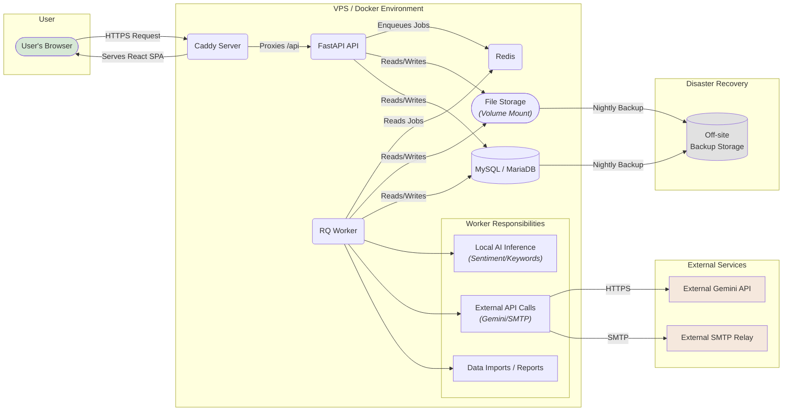

# **Proficiency Fullstack Architecture Document**

## **Introduction**

This document outlines the complete fullstack architecture for **Proficiency**, including backend systems, frontend implementation, and their integration. It serves as the single source of truth for AI-driven development, ensuring consistency across the entire technology stack. This unified approach combines what would traditionally be separate backend and frontend architecture documents, streamlining the development process for this modern fullstack application.

### **Starter Template or Existing Project**

N/A - This is a greenfield project. The architecture will be designed from scratch based on the specified technology stack, without using a pre-packaged starter template. We will define a custom monorepo structure tailored to the project's needs.

### **Change Log**

| Date       | Version | Description                                                                                                          | Author             |
| :--------- | :------ | :------------------------------------------------------------------------------------------------------------------- | :----------------- |
| 2025-10-06 | 1.1     | Completed the entire Data Models section, including all 7 entity groups, after thorough refinement and verification. | Winston, Architect |
| 2025-10-05 | 1.0     | Initial architectural draft based on PRD v6.2 and UI/UX Spec v2.0.                                                   | Winston, Architect |

---

## **High Level Architecture**

### **Technical Summary**

The **Proficiency** platform will be architected as a modern, decoupled web application consisting of a **React/TypeScript single-page application (SPA)** frontend and a **monolithic Python/FastAPI backend**. This backend is supported by an **asynchronous RQ worker** that handles a **hybrid AI workload**: it performs local inference for high-volume sentiment and keyword analysis, and it orchestrates calls to the **external Gemini API** for the AI Assistant feature. All services will be containerized using Docker and deployed to a single VPS, managed by Docker Compose, with Caddy serving as a secure and efficient reverse proxy.

### **Platform and Infrastructure Choice**

-   **Platform:** **Single VPS (Ubuntu)**
-   **Key Services:** The entire system will be managed via **Docker Compose**, orchestrating containers for:
    -   `api`: The core FastAPI application.
    -   `web`: The Caddy server, which serves the static frontend build and acts as a reverse proxy.
    -   `worker`: The RQ background worker for asynchronous tasks.
    -   `redis`: The message broker for the RQ queue.
    -   `db`: The MySQL/MariaDB database.
-   **Deployment Host and Regions:** A single Virtual Private Server will be used. A hosting region in **Singapore** is recommended for optimal proximity and low latency to the target user base in the Philippines.

### **Repository Structure**

-   **Structure:** **Monorepo**
-   **Monorepo Tool:** **npm/pnpm workspaces**. This lightweight approach is sufficient for managing the `web` and `api` packages without introducing unnecessary tooling complexity.
-   **Package Organization:** The monorepo will contain an `apps/` directory for the main `web` (frontend) and `api` (backend) applications. A `packages/` directory will be included to house any shared code, such as common TypeScript types, in the future.

### **High Level Architecture Diagram**



---

## **Tech Stack**

### **Technology Stack Table**

| Category                 | Technology                  | Version  | Purpose                                                              | Rationale                                                                                    |
| :----------------------- | :-------------------------- | :------- | :------------------------------------------------------------------- | :------------------------------------------------------------------------------------------- |
| **Dependency Mgmt**      | npm/pnpm lockfiles & pip    | pinned   | Guarantees reproducible builds for frontend and backend.             | Prevents "works on my machine" issues and ensures stability by locking dependency versions.  |
| **Frontend Language**    | TypeScript                  | 5.6.x    | Adds static typing to JavaScript for the frontend.                   | Enforces type safety, improves code quality, and enables better tooling/autocompletion.      |
| **Frontend Framework**   | React                       | 19.x     | Core UI library for building the single-page application.            | A modern, component-based architecture that aligns with the specified `shadcn/ui` ecosystem. |
| **Routing**              | React Router                | 6.x      | Handles all client-side routing and navigation.                      | The de-facto standard for React, enabling a true single-page application experience.         |
| **Form Management**      | React Hook Form + Zod       | latest   | Manages all form state and performs schema-based validation.         | A performance-focused and robust solution for handling complex forms and user input.         |
| **UI Component Library** | shadcn/ui                   | latest   | A set of reusable components built on Radix UI and Tailwind CSS.     | Provides accessible, high-quality primitives for building a consistent UI quickly.           |
| **Data Visualization**   | Echarts + Echarts-wordcloud | latest   | The sole library for all charts, graphs, and word clouds.            | A single, powerful library ensures visual consistency for all data visualizations.           |
| **State Management**     | TanStack Query              | 5.x      | Manages server state, including data fetching, caching, and polling. | Aligns with the "no global state manager" rule and is ideal for polling-based updates.       |
| **Backend Language**     | Python                      | 3.12.x   | Primary language for the API and background worker.                  | A mature, robust language with a strong ecosystem for web development and data science.      |
| **Backend Framework**    | FastAPI                     | 0.112.x  | High-performance framework for building the REST API.                | Offers automatic OpenAPI documentation and leverages Pydantic for robust data validation.    |
| **Data Validation (BE)** | Pydantic                    | 2.x      | Enforces data schemas for API requests, responses, and settings.     | Core to FastAPI's functionality and ensures data integrity at the API boundary.              |
| **API Style**            | REST                        | N/A      | Defines the communication pattern between frontend and backend.      | A simple, well-understood standard that aligns with the "no overengineering" principle.      |
| **Database**             | MariaDB                     | 11.x     | Primary relational database for all application data.                | A performance-focused, open-source fork of MySQL that is fully compatible.                   |
| **ORM & Migrations**     | SQLAlchemy + Alembic        | latest   | Defines the data access layer and manages schema changes.            | The standard for Python ORMs, providing a stable and powerful way to interact with the DB.   |
| **Job Queue / Broker**   | RQ (Redis Queue) + Redis    | latest   | Manages and brokers asynchronous background jobs.                    | A simple and robust Python-native job queue solution.                                        |
| **File Storage**         | Docker Volume Mount         | N/A      | Local filesystem path for storing user-uploaded files.               | The simplest solution for a single VPS deployment, avoiding external object storage costs.   |
| **Authentication**       | JWT, bcrypt, pyotp          | various  | Secure user sessions, hash passwords, and provide MFA.               | A standard, layered approach to modern application security.                                 |
| **Document Export**      | WeasyPrint / Pandas         | latest   | Engines for generating PDF and CSV/Excel reports.                    | Specialized libraries for high-quality, server-side document creation.                       |
| **AI - Runtime**         | Transformers + PyTorch      | latest   | Foundational frameworks for running local AI models.                 | The industry standard for loading and executing models like XLM-RoBERTa.                     |
| **AI - Sentiment**       | XLM-RoBERTa                 | latest   | Fine-tuned model for sentiment analysis of user feedback.            | A powerful cross-lingual model suitable for the code-switched text expected.                 |
| **AI - Keywords**        | KeyBERT                     | latest   | Extracts keywords and phrases for word clouds and insights.          | An efficient and effective model for identifying key themes in text.                         |
| **AI - Suggestions**     | Gemini API                  | external | External LLM for generating actionable suggestions.                  | Fulfills the PRD requirement for an advanced AI Assistant feature.                           |
| **Frontend Testing**     | Vitest                      | 1.6.x    | A fast unit and integration test framework for Vite projects.        | Native integration with Vite provides a seamless and rapid testing experience.               |
| **Backend Testing**      | Pytest                      | 8.x      | The primary framework for testing the backend API and worker.        | A flexible and powerful testing framework with a rich plugin ecosystem.                      |
| **E2E Testing**          | Selenium                    | 4.x      | Browser automation for end-to-end testing of user flows.             | Specified in the requirements for ensuring full-stack functionality.                         |
| **Build Tool / Bundler** | Vite                        | 5.x      | Serves as the frontend development server and production bundler.    | Offers extremely fast performance and a modern development experience.                       |
| **Reverse Proxy**        | Caddy                       | 2.x      | Serves static frontend assets and reverse-proxies API calls.         | Provides automatic HTTPS, simplifying deployment security.                                   |
| **IaC / Orchestration**  | Docker Compose              | 2.27.x   | Defines and runs the multi-container application services.           | The simplest, most effective way to manage the application stack on a single VPS.            |
| **CI/CD**                | GitHub Actions              | N/A      | Automates linting, testing, and deployment workflows.                | Tightly integrated with GitHub, providing a straightforward path to CI/CD.                   |
| **Monitoring**           | Prometheus + Grafana        | latest   | Collects metrics and provides dashboards for system health.          | A powerful, open-source standard for monitoring containerized applications.                  |
| **Logging**              | Python Logging Module       | native   | Handles structured logging for the API and worker.                   | A built-in, configurable, and robust solution for application logging.                       |
| **CSS Framework**        | Tailwind CSS                | 3.4.x    | A utility-first CSS framework for styling the frontend.              | Enables rapid, consistent UI development and is a core part of `shadcn/ui`.                  |

---

## **Data Models**

This section defines the complete relational data schema for the application. The models are organized into logical groups that represent the core domains of the system.

### **Group 1: Core Identity & Tenancy**

**Group 1: Core Identity & Tenancy**:

### **University**

-   **Purpose**: Represents a single, isolated tenant institution on the Proficiency platform. Each university has its own set of users, departments, and evaluation data.
-   **Key Attributes**:
    -   `id`: Primary key.
    -   `name`: The official name of the university.
    -   `address`: The physical address of the institution.
    -   `status`: The current state of the university's account (e.g., `pending`, `active`, `inactive`).
    -   `created_at` / `updated_at`: Timestamps for record management.
-   **TypeScript Interface**:
    ```typescript
    interface University {
        id: number;
        name: string;
        address: string;
        status: "pending" | "active" | "inactive";
        createdAt: Date;
        updatedAt: Date;
    }
    ```
-   **Relationships**:
    -   Has many `Users`.
    -   Has many `Departments`.
    -   Has many `RegistrationCodes`.

### **UniversityRegistrationRequest**

-   **Purpose**: Tracks the application process for a new university wishing to join the platform, including all submitted details and supporting documents.
-   **Key Attributes**:
    -   `id`: Primary key.
    -   `university_name`: The name of the applying institution.
    -   `contact_person_name`: The full name of the primary contact.
    -   `contact_person_email`: The email address for all communications.
    -   `status`: The current stage of the application (`submitted`, `in_review`, `approved`, `rejected`).
    -   `rejection_reason`: A text field to store the reason for a rejection, if applicable.
-   **TypeScript Interface**:
    ```typescript
    interface UniversityRegistrationRequest {
        id: number;
        universityName: string;
        contactPersonName: string;
        contactPersonEmail: string;
        status: "submitted" | "in_review" | "approved" | "rejected";
        rejectionReason?: string;
        createdAt: Date;
        updatedAt: Date;
    }
    ```
-   **Relationships**:
    -   Has many `Documents`.
    -   Belongs to one `University` after approval.

### **Document**

-   **Purpose**: Represents a file uploaded to the system, primarily used for supporting documents during university registration.
-   **Key Attributes**:
    -   `id`: Primary key.
    -   `request_id`: Foreign key linking to a `UniversityRegistrationRequest`.
    -   `filename`: The original name of the uploaded file.
    -   `storage_path`: The path to the file on the server's file system.
    -   `mime_type`: The MIME type of the file (e.g., 'application/pdf').
    -   `file_size`: The size of the file in bytes.
-   **TypeScript Interface**:
    ```typescript
    interface Document {
        id: number;
        requestId: number;
        filename: string;
        storagePath: string;
        mimeType: string;
        fileSize: number;
    }
    ```
-   **Relationships**:
    -   Belongs to one `UniversityRegistrationRequest`.

### **Role**

-   **Purpose**: A static, seeded table that defines the distinct user roles within the system as specified in the PRD.
-   **Key Attributes**:
    -   `id`: Primary key.
    -   `name`: The unique name of the role (e.g., `Student`, `Faculty`, `Admin`, `Super Admin`).
-   **TypeScript Interface**:

    ```typescript
    type RoleName =
        | "Student"
        | "Faculty"
        | "Department Head"
        | "Admin"
        | "Super Admin";

    interface Role {
        id: number;
        name: RoleName;
    }
    ```

-   **Relationships**:
    -   Has a many-to-many relationship with `User`.

### **User**

-   **Purpose**: Represents an individual user account. This model now includes a direct link to a program for students, while faculty affiliation is handled separately.
-   **Key Attributes**:
    -   `id`: Primary key.
    -   `university_id`: Foreign key for multi-tenancy.
    -   `school_id`: The university-issued ID, unique within a given university.
    -   `first_name` / `last_name`: The user's name.
    -   `email`: The user's unique email address.
    -   `password_hash`: The securely hashed password.
    -   `status`: The user's account status (`active`, `inactive`, `unverified`).
    -   **`program_id`**: **(New)** A nullable foreign key to `Program`, to be used for users with the 'Student' role.
    -   `registration_code_id`: A nullable foreign key to `RegistrationCode`.
    -   `tokenVersion`: An integer, defaulting to 1, that is incremented upon password change or "log out all sessions" action to invalidate old JWTs.
    -   `created_at` / `updated_at`: Timestamps for record management.
-   **TypeScript Interface**:
    ```typescript
    interface User {
        id: number;
        universityId: number;
        schoolId: string;
        firstName: string;
        lastName: string;
        email: string;
        status: "active" | "inactive" | "unverified";
        programId?: number; // Primarily for students
        registrationCodeId?: number;
        tokenVersion: number; // This version number must be included as a claim in the JWT.
        createdAt: Date;
        updatedAt: Date;
    }
    ```
-   **Relationships**:
    -   Belongs to one `University`.
    -   Has a many-to-many relationship with `Role` through a `UserRole` join table.
    -   If a student, belongs to one `Program`.
    -   If the user is a faculty, this can be derived from `FacultyDepartmentAffiliation` table.
    -   If the user is a department head, this can be derived from `Department` specifically, the `Department.head_user_id`.

### **SuperAdmin**

-   **Purpose**: A platform-level administrator account that is not tied to a specific university tenant. This role is for managing the overall platform.
-   **Key Attributes**:
    -   `id`: Primary key.
    -   `email`: The unique email address for login.
    -   `password_hash`: The securely hashed password.
    -   `pin_hash`: A securely hashed 6-digit PIN for multi-factor authentication.
    -   `status`: The account's status (e.g., `active`, `locked`).
    -   `tokenVersion`: An integer, defaulting to 1, that is incremented upon password change or "log out all sessions" action to invalidate old JWTs.
    -   `created_at`: Timestamp for when the super admin was created.
-   **TypeScript Interface**:
    ```typescript
    interface SuperAdmin {
        id: number;
        email: string;
        status: "active" | "locked";
        tokenVersion: number; // This version number must be included as a claim in the JWT.
        createdAt: Date;
    }
    ```
-   **Relationships**:
    -   Manages `UniversityRegistrationRequest` entities.

### **RegistrationCode**

-   **Purpose**: Manages the single-use or limited-use codes for user self-registration, ensuring controlled onboarding.
-   **Key Attributes**:
    -   `id`: Primary key.
    -   `university_id`: Foreign key linking the code to a specific university.
    -   `role_id`: Foreign key defining which role this code is for.
    -   `code_value`: The unique, randomly generated string for the code itself.
    -   `max_uses`: The maximum number of times the code can be used.
    -   `current_uses`: A counter for how many times the code has been used.
    -   `status`: The code's status (`active`, `inactive`).
    -   `expires_at`: An optional expiration timestamp for the code.
-   **TypeScript Interface**:
    ```typescript
    interface RegistrationCode {
        id: number;
        universityId: number;
        roleId: number;
        codeValue: string;
        maxUses: number;
        currentUses: number;
        status: "active" | "inactive";
        expiresAt?: Date;
    }
    ```
-   **Relationships**:

    -   Belongs to one `University`.
    -   Is intended for one `Role`.

---

**Group 2: Academic Structure**:

### **Department**

-   **Purpose**: Represents a major academic division within a university. This model now explicitly designates its leader.
-   **Key Attributes**:
    -   `id`: Primary key.
    -   `university_id`: Foreign key for tenancy.
    -   `parent_department_id`: A nullable, self-referencing foreign key.
    -   `name`: The name of the department.
    -   `short_name`: The abbreviated name.
    -   **`head_user_id`**: A nullable foreign key to a `User`, designating the **Department Head**.
    -   `created_at` / `updated_at`: Timestamps.
-   **TypeScript Interface**:
    ```typescript
    interface Department {
        id: number;
        universityId: number;
        parentDepartmentId?: number;
        name: string;
        shortName: string;
        headUserId?: number; // Designates the Department Head
        createdAt: Date;
        updatedAt: Date;
    }
    ```
-   **Relationships**:
    -   Belongs to one `University`.
    -   Can have one `User` as its head.
    -   Is referenced by (has many)`FacultyDepartmentAffiliation` and (has many)`Program`.
    -   Has many `Subjects`.
    -   Can belong to one parent `Department` (major to sub-department)

### **Program**

-   **Purpose**: Represents a specific academic program, degree, or track (e.g., BSIT, AB English, STEM Strand) offered by a department.
-   **Key Attributes**:
    -   `id`: Primary key.
    -   **`university_id`**: **(New)** Explicit foreign key for robust tenancy.
    -   `department_id`: Foreign key linking the program to its parent department.
    -   `name`: The full name of the program.
    -   **`program_code`**: **(New)** The abbreviated code for the program (e.g., "BSIT").
    -   **`created_at` / `updated_at`**: **(New)** Timestamps for record management.
-   **TypeScript Interface**:
    ```typescript
    interface Program {
        id: number;
        universityId: number;
        departmentId: number;
        name: string;
        programCode: string;
        createdAt: Date;
        updatedAt: Date;
    }
    ```
-   **Relationships**:
    -   Belongs to one `University`.
    -   Belongs to one `Department`.

### **Subject**

-   **Purpose**: Represents a specific course or subject "template" offered within a department.
-   **Key Attributes**:
    -   `id`: Primary key.
    -   **`university_id`**: **(New)** Explicit foreign key for robust tenancy.
    -   `department_id`: Foreign key linking the subject to its home department.
    -   **`edp_code`**: **(New)** The official, unique university code for the subject.
    -   **`subject_code`**: **(Modified)** The common, abbreviated code for the subject (e.g., "IT-301").
    -   `name`: The descriptive name of the subject.
    -   **`created_at` / `updated_at`**: **(New)** Timestamps for record management.
-   **TypeScript Interface**:
    ```typescript
    interface Subject {
        id: number;
        universityId: number;
        departmentId: number;
        edpCode: string;
        subjectCode: string;
        name: string;
        createdAt: Date;
        updatedAt: Date;
    }
    ```
-   **Relationships**:
    -   Belongs to one `University`.
    -   Belongs to one `Department`.
    -   Has many `SubjectOfferings`.

### **SchoolYear**

-   **Purpose**: A simple, shared table to define academic years.
-   **Key Attributes**:
    -   `id`: Primary key.
    -   `year_start`: The starting year of the academic period (e.g., 2025).
    -   `year_end`: The ending year of the academic period (e.g., 2026).
-   **TypeScript Interface**:
    ```typescript
    interface SchoolYear {
        id: number;
        yearStart: number;
        yearEnd: number;
    }
    ```
-   **Relationships**:
    -   Has many `SchoolTerms`.

### **SchoolTerm**

-   **Purpose**: A shared table defining a specific term (e.g., 1st Semester) within a `SchoolYear`.
-   **Key Attributes**:
    -   `id`: Primary key.
    -   `school_year_id`: Foreign key to `SchoolYear`.
    -   `semester`: The name of the term (`1st Semester`, `2nd Semester`, `Summer`).
-   **TypeScript Interface**:
    ```typescript
    interface SchoolTerm {
        id: number;
        schoolYearId: number;
        semester: "1st Semester" | "2nd Semester" | "Summer";
    }
    ```
-   **Relationships**:
    -   Belongs to one `SchoolYear`.
    -   Is referenced by many `EvaluationPeriods` and `SubjectOfferings`.

### **AssessmentPeriod**

-   **Purpose**: A static, shared, seeded table to define evaluation windows (`Midterm`, `Finals`).
-   **Key Attributes**:
    -   `id`: Primary key.
    -   `name`: The name of the assessment period (`Midterm`, `Finals`).
-   **TypeScript Interface**:
    ```typescript
    interface AssessmentPeriod {
        id: number;
        name: "Midterm" | "Finals";
    }
    ```

### **Modality**

-   **Purpose**: A static, shared, seeded table to define the mode of instruction.
-   **Key Attributes**:
    -   `id`: Primary key.
    -   `name`: The name of the modality (`Online`, `Face-to-Face`, `Hybrid`, `Modular`).
-   **TypeScript Interface**:
    ```typescript
    interface Modality {
        id: number;
        name: "Online" | "Face-to-Face" | "Hybrid" | "Modular";
    }
    ```

### **FacultyDepartmentAffiliation**

-   **Purpose**: An explicit join table to manage the term-based relationship between a faculty member and one or more departments, including their designated "home" department. This is the **single source of truth for faculty affiliation**.
-   **Key Attributes**:
    -   `id`: Primary key.
    -   `faculty_id`: Foreign key to the `User`.
    -   `department_id`: Foreign key to the `Department`.
    -   `school_term_id`: Foreign key to the `SchoolTerm`.
    -   `is_home_department`: A boolean flag to indicate the faculty's primary department for that term.
    -   `created_at` / `updated_at`: Timestamps.
-   **TypeScript Interface**:
    ```typescript
    interface FacultyDepartmentAffiliation {
        id: number;
        facultyId: number;
        departmentId: number;
        schoolTermId: number;
        isHomeDepartment: boolean;
        createdAt: Date;
        updatedAt: Date;
    }
    ```
-   **Relationships**:
    -   Links a `User` (Faculty) to a `Department` for a specific `SchoolTerm`.

### **SubjectOffering**

-   **Purpose**: Represents a specific "class"—an _instance_ of a `Subject` being taught by a `Faculty` member during a `SchoolTerm` with a specific `Modality`.
-   **Key Attributes**:
    -   `id`: Primary key.
    -   **`university_id`**: **(New)** Explicit foreign key for robust tenancy.
    -   `subject_id`: Foreign key to the `Subject` being taught.
    -   `faculty_id`: Foreign key to the `User` who is the instructor.
    -   `school_term_id`: Foreign key to the `SchoolTerm`.
    -   **`modality_id`**: **(New)** A nullable foreign key to the `Modality` of instruction.
    -   **`created_at` / `updated_at`**: **(New)** Timestamps for record management.
-   **TypeScript Interface**:
    ```typescript
    interface SubjectOffering {
        id: number;
        universityId: number;
        subjectId: number;
        facultyId: number;
        schoolTermId: number;
        modalityId?: number;
        createdAt: Date;
        updatedAt: Date;
    }
    ```
-   **Relationships**:
    -   Belongs to one `Subject`, one `User` (Faculty), one `SchoolTerm`, and optionally one `Modality`.
    -   Has many `Enrollments`.

### **Enrollment**

-   **Purpose**: A join table that enrolls a `Student` in a specific `SubjectOffering`.
-   **Key Attributes**:
    -   `id`: Primary key.
    -   **`university_id`**: **(New)** Explicit foreign key for robust tenancy.
    -   `student_id`: Foreign key to the `User` (student).
    -   `subject_offering_id`: Foreign key to the `SubjectOffering`.
    -   **`created_at` / `updated_at`**: **(New)** Timestamps for record management.
-   **TypeScript Interface**:
    ```typescript
    interface Enrollment {
        id: number;
        universityId: number;
        studentId: number;
        subjectOfferingId: number;
        createdAt: Date;
        updatedAt: Date;
    }
    ```
-   **Relationships**:
    -   Belongs to one `User` (Student).
    -   Belongs to one `SubjectOffering`.

---

**Group 3: Evaluation Configuration**:

## **LikertScaleTemplate**

-   **Purpose**: A static, seeded table that defines the predefined Likert scales an Admin can choose from when creating a form.
-   **Key Attributes**:
    -   `id`: Primary key.
    -   `name`: The descriptive name of the scale (e.g., "Standard 5-Point Scale (1-5)").
    -   `point_values`: A JSON field defining the labels for each point.
    -   **`min_value`**: **(New)** An integer for the lowest possible score on the scale.
    -   **`max_value`**: **(New)** An integer for the highest possible score on the scale.
-   **TypeScript Interface**:
    ```typescript
    interface LikertScaleTemplate {
        id: number;
        name: string;
        pointValues: Record<string, string>;
        minValue: number;
        maxValue: number;
    }
    ```
-   **Relationships**:
    -   Can be used by many `EvaluationFormTemplates`.

---

## **EvaluationFormTemplate**

-   **Purpose**: The master template for an evaluation form, acting as a container for criteria and questions. It includes a version field to support optimistic locking.
-   **Key Attributes**:
    -   `id`: Primary key.
    -   `university_id`: Foreign key for multi-tenancy.
    -   `name`: The unique name of the form template.
    -   `likert_scale_template_id`: Foreign key to the selected `LikertScaleTemplate`.
    -   `intended_for`: An organizational label (`Students`, `Department Heads`, `Both`).
    -   `status`: The current state of the template (`draft`, `active`, `assigned`, `archived`).
    -   `version`: An integer used for optimistic locking to handle concurrent admin actions.
    -   `created_at` / `updated_at`: Timestamps.
-   **TypeScript Interface**:
    ```typescript
    interface EvaluationFormTemplate {
        id: number;
        universityId: number;
        name: string;
        likertScaleTemplateId: number;
        intendedFor: "Students" | "Department Heads" | "Both";
        status: "draft" | "active" | "assigned" | "archived";
        version: number;
        createdAt: Date;
        updatedAt: Date;
    }
    ```
-   **Relationships**:
    -   Belongs to one `University`.
    -   Belongs to one `LikertScaleTemplate`.
    -   Has many `EvaluationCriterion`.
    -   Has many `EvaluationQuestion` (for form-level questions).
    -   Can be assigned to many `EvaluationPeriod`.

---

## **EvaluationCriterion**

-   **Purpose**: Represents a weighted, thematic section within an `EvaluationFormTemplate`, such as "Teaching Methods".
-   **Key Attributes**:
    -   `id`: Primary key.
    -   `form_template_id`: Foreign key to the parent `EvaluationFormTemplate`.
    -   `name`: The name of the criterion.
    -   `weight`: The numerical weight (supports decimals) of this criterion.
    -   `order`: An integer to control the display order.
    -   `created_at` / `updated_at`: Timestamps.
-   **TypeScript Interface**:
    ```typescript
    interface EvaluationCriterion {
        id: number;
        formTemplateId: number;
        name: string;
        weight: number;
        order: number;
        createdAt: Date;
        updatedAt: Date;
    }
    ```
-   **Relationships**:
    -   Belongs to one `EvaluationFormTemplate`.
    -   Has many `EvaluationQuestion`.

---

## **EvaluationQuestion**

-   **Purpose**: Represents an individual question. It always belongs to a form and may optionally belong to a criterion within that form; either Likert-scale or open-ended question.
-   **Key Attributes**:
    -   `id`: Primary key.
    -   **`form_template_id`**: **(New)** A **non-nullable** foreign key to the parent `EvaluationFormTemplate`.
    -   **`criterion_id`**: **(Modified)** A **nullable** foreign key to the parent `EvaluationCriterion`. If `NULL`, it is a form-level question (open-ended question), otherwise, if `NOT NULL` it belongs to a criterion (a likert-scale question).
    -   `question_text`: The full text of the question.
    -   `question_type`: The type of question (`likert`, `open_ended`).
    -   `is_required`: A boolean indicating if an answer is mandatory.
    -   `min_word_count` / `max_word_count`: Nullable integers for open-ended question validation.
    -   `order`: An integer to control the display order.
    -   `created_at` / `updated_at`: Timestamps.
-   **TypeScript Interface**:
    ```typescript
    interface EvaluationQuestion {
        id: number;
        formTemplateId: number;
        criterionId?: number; // Optional link to a criterion
        questionText: string;
        questionType: "likert" | "open_ended";
        isRequired: boolean;
        minWordCount?: number;
        maxWordCount?: number;
        order: number;
        createdAt: Date;
        updatedAt: Date;
    }
    ```
-   **Relationships**:
    -   Belongs to one `EvaluationFormTemplate`.
    -   Can optionally belong to one `EvaluationCriterion`.

---

## **EvaluationPeriod**

-   **Purpose**: Defines the "live" evaluation window, linking specific form templates to an academic timeframe.
-   **Key Attributes**:
    -   `id`: Primary key.
    -   `university_id`: Foreign key for multi-tenancy.
    -   `school_term_id`: Foreign key to `SchoolTerm`.
    -   `assessment_period_id`: Foreign key to `AssessmentPeriod`.
    -   `student_form_template_id`: Foreign key to the `EvaluationFormTemplate` for students.
    -   `dept_head_form_template_id`: A nullable foreign key for the optional, separate form for Department Heads.
    -   `start_date_time`: The exact timestamp when the evaluation period opens.
    -   `end_date_time`: The exact timestamp when the evaluation period closes.
    -   `status`: The current state of the period (`scheduled`, `active`, `closed`, `cancelling`, `cancelled`).
    -   `created_at` / `updated_at`: Timestamps.
-   **TypeScript Interface**:
    ```typescript
    interface EvaluationPeriod {
        id: number;
        universityId: number;
        schoolTermId: number;
        assessmentPeriodId: number;
        studentFormTemplateId: number;
        deptHeadFormTemplateId?: number;
        startDateTime: Date;
        endDateTime: Date;
        status: "scheduled" | "active" | "closed" | "cancelling" | "cancelled";
        createdAt: Date;
        updatedAt: Date;
    }
    ```
-   **Relationships**:
    -   Belongs to one `University`.
    -   Associated with one `SchoolTerm` and one `AssessmentPeriod`.
    -   Associated with one or two `EvaluationFormTemplates`.

---

**Group 4: Evaluation Submission & Integrity**:

### **EvaluationSubmission**

-   **Purpose**: Represents a single, complete evaluation submitted by one user (the evaluator) for another (the evaluatee) within a specific context (the class). This is the central record that links all answers together.
-   **Key Attributes**:
    -   `id`: Primary key.
    -   `university_id`: Foreign key for multi-tenancy.
    -   `evaluation_period_id`: Foreign key to `EvaluationPeriod`.
    -   `evaluator_id`: Foreign key to the `User` submitting the evaluation.
    -   `evaluatee_id`: Foreign key to the `User` being evaluated.
    -   `subject_offering_id`: Foreign key to the specific `SubjectOffering` (class) this evaluation is for.
    -   `status`: The lifecycle status of the submission (`submitted`, `processing`, `processed`, `archived`, `invalidated_for_resubmission`, `cancelled`).
    -   `submitted_at`: The timestamp when the user submitted the form.
    -   `is_resubmission`: A boolean flag indicating if this is a new submission for a previously flagged evaluation.
    -   `original_submission_id`: A nullable, self-referencing foreign key linking a resubmission back to the original `EvaluationSubmission` that was invalidated.
    -   `created_at` / `updated_at`: Timestamps.
-   **TypeScript Interface**:
    ```typescript
    interface EvaluationSubmission {
        id: number;
        universityId: number;
        evaluationPeriodId: number;
        evaluatorId: number;
        evaluateeId: number;
        subjectOfferingId: number;
        status:
            | "submitted"
            | "processing"
            | "processed"
            | "archived"
            | "invalidated_for_resubmission"
            | "cancelled";
        submittedAt: Date;
        isResubmission: boolean;
        originalSubmissionId?: number;
        createdAt: Date;
        updatedAt: Date;
    }
    ```
-   **Relationships**:
    -   Belongs to one `University`, `EvaluationPeriod`, `SubjectOffering`, and two `Users` (evaluator and evaluatee).
    -   Has many `EvaluationLikertAnswer` and `EvaluationOpenEndedAnswer` records.
    -   Can have one `FlaggedEvaluation` record.

---

### **EvaluationLikertAnswer**

-   **Purpose**: Stores a user's answer to a single Likert-scale question for a specific submission.
-   **Key Attributes**:
    -   `id`: Primary key.
    -   `submission_id`: Foreign key to the parent `EvaluationSubmission`.
    -   `question_id`: Foreign key to the `EvaluationQuestion`.
    -   `answer_value`: The integer value of the answer provided by the user (e.g., 4).
    -   `created_at` / `updated_at`: Timestamps.
-   **TypeScript Interface**:
    ```typescript
    interface EvaluationLikertAnswer {
        id: number;
        submissionId: number;
        questionId: number;
        answerValue: number;
        createdAt: Date;
        updatedAt: Date;
    }
    ```
-   **Relationships**:
    -   Belongs to one `EvaluationSubmission`.
    -   Belongs to one `EvaluationQuestion`.

---

### **EvaluationOpenEndedAnswer**

-   **Purpose**: Stores a user's textual answer to a single open-ended question for a specific submission.
-   **Key Attributes**:
    -   `id`: Primary key.
    -   `submission_id`: Foreign key to the parent `EvaluationSubmission`.
    -   `question_id`: Foreign key to the `EvaluationQuestion`.
    -   `answer_text`: The text content of the answer.
    -   `created_at` / `updated_at`: Timestamps.
-   **TypeScript Interface**:
    ```typescript
    interface EvaluationOpenEndedAnswer {
        id: number;
        submissionId: number;
        questionId: number;
        answerText: string;
        createdAt: Date;
        updatedAt: Date;
    }
    ```
-   **Relationships**:
    -   Belongs to one `EvaluationSubmission`.
    -   Belongs to one `EvaluationQuestion`.

---

### **FlaggedEvaluation**

-   **Purpose**: Records an instance of an `EvaluationSubmission` that was automatically flagged for data integrity issues, and tracks the administrative review process and its outcome.
-   **Key Attributes**:
    -   `id`: Primary key.
    -   `submission_id`: Foreign key to the `EvaluationSubmission` that was flagged.
    -   `flag_reason`: The reason for the flag (`Low-Confidence`, `Recycled Content`, `Sentiment Mismatch`).
    -   `flag_details`: A JSON field to store specific metadata that triggered the flag, such as an array of character indexes for highlighting recycled content.
    -   `status`: The review status of the flag (`pending`, `resolved`).
    -   `resolution`: The final outcome of the review (`approved`, `archived`, `resubmission_requested`).
    -   `resolved_by_admin_id`: A nullable foreign key to the `User` (Admin) who resolved the flag.
    -   `resolved_at`: A nullable timestamp for when the flag was resolved.
    -   `admin_notes`: A text field for the admin's internal notes or the reason provided to the student.
    -   `resubmission_grace_period_ends_at`: A nullable timestamp to track the 48-hour resubmission window.
    -   **`version`**: **(New)** An integer used for optimistic locking to handle concurrent admin reviews.
    -   `created_at` / `updated_at`: Timestamps.
-   **TypeScript Interface**:
    ```typescript
    interface FlaggedEvaluation {
        id: number;
        submissionId: number;
        flagReason:
            | "Low-Confidence"
            | "Recycled Content"
            | "Sentiment Mismatch";
        flagDetails?: {
            highlights?: FlagHighlight[];
        };
        status: "pending" | "resolved";
        resolution?: "approved" | "archived" | "resubmission_requested";
        resolvedByAdminId?: number;
        resolvedAt?: Date;
        adminNotes?: string;
        resubmissionGracePeriodEndsAt?: Date;
        version: number;
        createdAt: Date;
        updatedAt: Date;
    }
    ```
-   **Relationships**:
    -   Belongs to one `EvaluationSubmission`.
    -   Can be resolved by one `User` (Admin).

---

**Group 5: Processed Data & Analysis**:

### **NumericalAggregate**

-   **Purpose**: Stores the final, calculated, and normalized quantitative scores for a single `EvaluationSubmission`. This record is created by the analysis pipeline after processing all Likert-scale answers.
-   **Key Attributes**:
    -   `id`: Primary key.
    -   `submission_id`: A one-to-one foreign key to the `EvaluationSubmission`.
    -   `quant_score_raw`: The initial weighted mean score calculated from Likert answers.
    -   `z_quant`: The normalized Z-score for the quantitative part, representing performance relative to the cohort.
    -   `final_score_60_40`: The final combined score, weighted 60% quantitative and 40% qualitative.
    -   `cohort_n`: The size (count) of the comparison group used for normalization.
    -   `cohort_mean`: The mean score (μ) of the cohort.
    -   `cohort_std_dev`: The standard deviation (σ) of the cohort.
    -   `per_criterion_scores`: A JSON field to store the calculated mean score for each criterion in the submission.
    -   `is_final_snapshot`: A boolean flag that is set to `true` when the evaluation period is locked, preventing further updates.
    -   `created_at` / `updated_at`: Timestamps.
-   **TypeScript Interface**:
    ```typescript
    interface NumericalAggregate {
        id: number;
        submissionId: number;
        quantScoreRaw: number;
        zQuant: number;
        finalScore6040: number;
        cohortN: number;
        cohortMean: number;
        cohortStdDev: number;
        perCriterionScores: Record<string, number>;
        isFinalSnapshot: boolean;
        createdAt: Date;
        updatedAt: Date;
    }
    ```
-   **Relationships**:
    -   Has a one-to-one relationship with `EvaluationSubmission`.

---

### **OpenEndedSentiment**

-   **Purpose**: Stores the detailed sentiment analysis results produced by the XLM-ROBERTa model for a single `EvaluationOpenEndedAnswer`.
-   **Key Attributes**:
    -   `id`: Primary key.
    -   `open_ended_answer_id`: A one-to-one foreign key to the specific `EvaluationOpenEndedAnswer`.
    -   `predicted_sentiment_label`: The final predicted label ('positive', 'neutral', 'negative').
    -   `predicted_sentiment_label_score`: The probability of the predicted label.
    -   `positive_score` / `neutral_score` / `negative_score`: The full sentiment distribution from the model.
    -   `accuracy` / `confidence`: Model performance metrics for this specific prediction.
    -   `created_at` / `updated_at`: Timestamps.
-   **TypeScript Interface**:
    ```typescript
    interface OpenEndedSentiment {
        id: number;
        openEndedAnswerId: number;
        predictedSentimentLabel: "positive" | "neutral" | "negative";
        predictedSentimentLabelScore: number;
        positiveScore: number;
        neutralScore: number;
        negativeScore: number;
        accuracy: number;
        confidence: number;
        createdAt: Date;
        updatedAt: Date;
    }
    ```
-   **Relationships**:
    -   Has a one-to-one relationship with `EvaluationOpenEndedAnswer`.

---

### **OpenEndedKeyword**

-   **Purpose**: Stores an individual keyword or phrase extracted by the KeyBERT model from a single `EvaluationOpenEndedAnswer`.
-   **Key Attributes**:
    -   `id`: Primary key.
    -   `open_ended_answer_id`: Foreign key to the `EvaluationOpenEndedAnswer`.
    -   `keyword`: The extracted keyword or phrase.
    -   `relevance_score`: The relevance score provided by the model for that keyword.
    -   `created_at` / `updated_at`: Timestamps.
-   **TypeScript Interface**:
    ```typescript
    interface OpenEndedKeyword {
        id: number;
        openEndedAnswerId: number;
        keyword: string;
        relevanceScore: number;
        createdAt: Date;
        updatedAt: Date;
    }
    ```
-   **Relationships**:
    -   Belongs to one `EvaluationOpenEndedAnswer`. A single answer can have many keywords.

---

### **SentimentAggregate**

-   **Purpose**: Stores the aggregated and normalized qualitative scores for an entire `EvaluationSubmission`. This is the qualitative counterpart to `NumericalAggregate` and is essential for calculating the final 60/40 weighted score.
-   **Key Attributes**:
    -   `id`: Primary key.
    -   `submission_id`: A one-to-one foreign key to the `EvaluationSubmission`.
    -   `qual_score_raw`: The raw qualitative score for the entire submission. This will be derived by averaging the sentiment scores across all associated `OpenEndedSentiment` records.
    -   `z_qual`: The normalized Z-score for the qualitative part, representing sentiment relative to the cohort.
    -   **`is_final_snapshot`**: **(New)** A boolean flag that is set to true when the evaluation period is locked.
    -   `created_at` / `updated_at`: Timestamps.
-   **TypeScript Interface**:
    ```typescript
    interface SentimentAggregate {
        id: number;
        submissionId: number;
        qualScoreRaw: number;
        zQual: number;
        isFinalSnapshot: boolean;
        createdAt: Date;
        updatedAt: Date;
    }
    ```
-   **Relationships**:
    -   Has a one-to-one relationship with `EvaluationSubmission`.

---

**Group 6: AI & Reporting**:

---

### **AISuggestion**

-   **Purpose**: To store the complete, AI-generated suggestion reports created from the "AI Assistant" page. This allows users to save and review their generated insights over time, as required by Story 6.3.
-   **Key Attributes**:
    -   `id`: Primary key.
    -   `university_id`: Foreign key for multi-tenancy.
    -   `generated_for_user_id`: Foreign key to the `User` who is the _subject_ of the report.
    -   `generated_by_user_id`: Foreign key to the `User` who _ran_ the report.
    -   `context_school_term_id`: Foreign key to `SchoolTerm`, storing the context of the data used for generation.
    -   `context_assessment_period_id`: Foreign key to `AssessmentPeriod`.
    -   `suggestion_title`: A descriptive title for the report (e.g., "Strengths & Weaknesses Analysis").
    -   `suggestion_content`: The full markdown or text content generated by the Gemini API.
    -   `prompt_sent_to_api`: The full prompt sent to the external API, stored for auditing and debugging.
    -   `created_at` / `updated_at`: Timestamps.
-   **TypeScript Interface**:
    ```typescript
    interface AISuggestion {
        id: number;
        universityId: number;
        generatedForUserId: number;
        generatedByUserId: number;
        contextSchoolTermId: number;
        contextAssessmentPeriodId: number;
        suggestionTitle: string;
        suggestionContent: string;
        promptSentToApi: string;
        createdAt: Date;
        updatedAt: Date;
    }
    ```
-   **Relationships**:
    -   Belongs to one `University`.
    -   Belongs to two `Users` (`generated_for` and `generated_by`).

---

### **GeneratedReport**

-   **Purpose**: To track the lifecycle of a formal report created via the "Report Center". It manages the request, status, and download location of asynchronously generated files, as required by Story 5.6.
-   **Key Attributes**:
    -   `id`: Primary key.
    -   `university_id`: Foreign key for multi-tenancy.
    -   `requested_by_user_id`: Foreign key to the `User` who initiated the report.
    -   `report_type`: An identifier for the type of report (e.g., 'Faculty Performance Summary').
    -   `report_parameters`: A JSON field to store the filters and parameters used to generate the report.
    -   `status`: The job status (`queued`, `generating`, `ready`, `failed`).
    -   `file_format`: The requested output format (`PDF`, `CSV`).
    -   `storage_path`: The server path to the final generated file, available for download.
    -   `error_message`: Stores any error details if the generation job failed.
    -   `expires_at`: A timestamp indicating when the generated file can be safely deleted from storage.
    -   `created_at` / `updated_at`: Timestamps.
-   **TypeScript Interface**:
    ```typescript
    interface GeneratedReport {
        id: number;
        universityId: number;
        requestedByUserId: number;
        reportType: string;
        reportParameters: Record<string, any>;
        status: "queued" | "generating" | "ready" | "failed";
        fileFormat: "PDF" | "CSV";
        storagePath?: string;
        errorMessage?: string;
        expiresAt: Date;
        createdAt: Date;
        updatedAt: Date;
    }
    ```
-   **Relationships**:
    -   Belongs to one `University`.
    -   Belongs to one `User` (the requester).

---

**Group 7: System & Operations**:

### **BackgroundTask**

-   **Purpose**: To create a unified, observable record for all asynchronous jobs processed by the RQ worker. This model is the backbone of the "Job Monitor" dashboard.
-   **Key Attributes**:
    -   `id`: Primary key.
    -   `university_id`: Foreign key for multi-tenancy.
    -   **`job_type`**: **(Expanded)** An identifier for the type of job.
    -   `status`: The job's lifecycle status (`queued`, `processing`, `completed`, `failed`, `cancelled`).
    -   `submitted_by_user_id`: Foreign key to the `User` who initiated the job.
    -   `job_parameters`: A JSON field to store the input parameters for the job.
    -   `progress`: An integer from 0-100 to show the progress of long-running tasks.
    -   `result_message`: A text field for a summary of the success or error outcome.
    -   `result_storage_path`: A nullable path to any output file, such as an error report.
    -   `created_at` / `started_at` / `completed_at`: Timestamps to track the job's lifecycle.
-   **TypeScript Interface**:
    ```typescript
    interface BackgroundTask {
        id: number;
        universityId: number;
        jobType:
            | "ACADEMIC_STRUCTURE_IMPORT"
            | "USER_IMPORT"
            | "HISTORICAL_USER_ENROLLMENT_IMPORT"
            | "HISTORICAL_EVALUATION_IMPORT"
            | "PERIOD_CANCELLATION"
            | "REPORT_GENERATION"
            | "RECYCLED_CONTENT_CHECK"
            | "QUANTITATIVE_ANALYSIS"
            | "QUALITATIVE_ANALYSIS"
            | "FINAL_AGGREGATION";
        status: "queued" | "processing" | "completed" | "failed" | "cancelled";
        submittedByUserId: number;
        jobParameters: Record<string, any>;
        progress: number;
        resultMessage?: string;
        resultStoragePath?: string;
        createdAt: Date;
        startedAt?: Date;
        completedAt?: Date;
    }
    ```
-   **Relationships**:
    -   Belongs to one `University`.
    -   Belongs to one `User` (the submitter).

---

### **AuditLog**

-   **Purpose**: To create a permanent, queryable, and immutable record of significant user and system actions for security, compliance, and debugging.
-   **Key Attributes**:
    -   `id`: Primary key.
    -   `university_id`: A nullable foreign key for tenancy.
    -   `actor_user_id`: A nullable foreign key to the `User` who performed the action.
    -   `action`: A string identifying the action performed (e.g., `USER_LOGIN_SUCCESS`, `PERIOD_CANCELLED`).
    -   `target_entity`: The name of the database model being acted upon.
    -   `target_id`: The primary key of the specific record that was affected.
    -   `details`: A JSON field to store relevant contextual data.
    -   `ip_address`: The IP address from which the action was initiated.
    -   `timestamp`: The precise timestamp when the action occurred.
-   **TypeScript Interface**:
    ```typescript
    interface AuditLog {
        id: number;
        universityId?: number;
        actorUserId?: number;
        action: string;
        targetEntity?: string;
        targetId?: number;
        details?: Record<string, any>;
        ipAddress: string;
        timestamp: Date;
    }
    ```
-   **Relationships**:
    -   Optionally belongs to one `University`.
    -   Optionally belongs to one `User` (the actor).

---

### **Notification (New Model)**

-   **Purpose**: To store and manage notifications sent to users, supporting both in-app display and email delivery for events like import completion and flag resolutions.
-   **Key Attributes**:
    -   `id`: Primary key.
    -   **`university_id`**: **(Modified)** A **nullable** foreign key for tenancy, to support platform-level notifications to Super Admins.
    -   **`recipient_id`**: **(New)** The ID of the recipient.
    -   **`recipient_type`**: **(New)** A string indicating the recipient's model (`'User'` or `'SuperAdmin'`).
    -   `actor_id`: A nullable foreign key to the actor who triggered the event. This is also nullable if the actor who triggered the notification is the `System`.
    -   `actor_type`: A nullable string indicating the actor's model (`'User'`, `'SuperAdmin'`, `'System'`).
    -   `action_type`: An identifier for the type of event (e.g., `IMPORT_COMPLETE`, `FLAG_RESOLUTION`).
    -   `content`: The text content of the notification message.
    -   `delivery_methods`: A JSON field indicating delivery channels (e.g., `["IN_APP", "EMAIL"]`).
    -   **`status`**: **(Modified)** The status of the in-app notification (`unread`, `read`, `archived`).
    -   `read_at`: A nullable timestamp for when the in-app notification was marked as read.
    -   `created_at` / `updated_at`: Timestamps.
-   **TypeScript Interface**:
    ```typescript
    interface Notification {
        id: number;
        universityId?: number;
        recipientId: number;
        recipientType: "User" | "SuperAdmin";
        actorId?: number;
        actor_type?: "User" | "SuperAdmin" | "System";
        actionType: string;
        content: string;
        deliveryMethods: ("IN_APP" | "EMAIL")[];
        status: "unread" | "read" | "archived";
        readAt?: Date;
        createdAt: Date;
        updatedAt: Date;
    }
    ```
-   **Relationships**:
    -   Optionally belongs to one `University`.
    -   Belongs to one recipient (`User` or `SuperAdmin`).
    -   Optionally triggered by one actor (`User`, `SuperAdmin`, or `System`).
