# **Proficiency Fullstack Architecture Document**

## **Introduction**

This document outlines the complete fullstack architecture for **Proficiency**, including backend systems, frontend implementation, and their integration. It serves as the single source of truth for AI-driven development, ensuring consistency across the entire technology stack. This unified approach combines what would traditionally be separate backend and frontend architecture documents, streamlining the development process for this modern fullstack application.

### **Starter Template or Existing Project**

N/A - This is a greenfield project. The architecture will be designed from scratch based on the specified technology stack, without using a pre-packaged starter template. We will define a custom monorepo structure tailored to the project's needs.

### **Change Log**

| Date           | Version | Description                                                                                                                                                                                                                                             | Author                 |
| :------------- | :------ | :------------------------------------------------------------------------------------------------------------------------------------------------------------------------------------------------------------------------------------------------------ | :--------------------- |
| **2025-10-09** | **2.1** | **Finalized and consolidated the complete `Security and Performance` section, incorporating both Group 1 (Comprehensive Security Requirements) and Group 2 (Holistic Performance Optimization).**                                                       | **Winston, Architect** |
| **2025-10-08** | **2.0** | **Completed and consolidated the entire `Deployment Architecture` section, defining the strategy, CI/CD pipeline, and environments.**                                                                                                                   | **Winston, Architect** |
| 2025-10-08     | 1.9     | **Finalized and consolidated the complete `Development Workflow` section, incorporating all three groups (Foundational Setup, Core Commands, and Environment Configuration) into a single, definitive guide.**                                          | **Winston, Architect** |
| **2025-10-08** | **1.8** | **Finalized and consolidated the complete `Unified Project Structure` section, incorporating all five structural groups into a single, comprehensive blueprint.**                                                                                       | **Winston, Architect** |
| **2025-10-08** | **1.7** | **Completed the entire `Backend Architecture` section, defining the service structure, data access layer, security model, asynchronous worker patterns, error handling, and testing strategy.**                                                         | **Winston, Architect** |
| 2025-10-08     | 1.6     | Finalized and integrated the complete `Frontend Architecture` section, incorporating all six refined groups: Component Architecture, State Management, Routing & Navigation, API Integration, Global Error Handling, and the Frontend Testing Strategy. | Winston, Architect     |
| 2025-10-08     | 1.5     | Completed the entire `Database Schema` section (Groups 1-7), providing the final, verified, and complete SQL DDL for the entire application.                                                                                                            | Winston, Architect     |
| 2025-10-08     | 1.4     | Completed the entire `Core Workflows` section (Groups 1-6), detailing all major system processes from onboarding to data analysis. The architecture document is now functionally complete and ready for final validation.                               | Winston, Architect     |
| 2025-10-07     | 1.3     | Finalized and integrated the complete Components section, incorporating all six refined component groups from architectural review.                                                                                                                     | Winston, Architect     |
| 2025-10-07     | 1.2     | Completed the entire API Specification section, integrating all 8 refined API groups.                                                                                                                                                                   | Winston, Architect     |
| 2025-10-06     | 1.1     | Completed the entire Data Models section, including all 7 entity groups, after thorough refinement and verification.                                                                                                                                    | Winston, Architect     |
| 2025-10-05     | 1.0     | Initial architectural draft based on PRD v6.2 and UI/UX Spec v2.0.                                                                                                                                                                                      | Winston, Architect     |

---

## **High Level Architecture**

### **Technical Summary**

The **Proficiency** platform will be architected as a modern, decoupled web application consisting of a **React/TypeScript single-page application (SPA)** frontend and a **monolithic Python/FastAPI backend**. This backend is supported by an **asynchronous RQ worker** that handles a **hybrid AI workload**: it performs local inference for high-volume sentiment and keyword analysis, and it orchestrates calls to the **external Gemini API** for the AI Assistant feature. All services will be containerized using Docker and deployed to a single VPS, managed by Docker Compose, with Caddy serving as a secure and efficient reverse proxy.

### **Platform and Infrastructure Choice**

-   **Platform:** **Single VPS (Ubuntu)**
-   **Key Services:** The entire system will be managed via **Docker Compose**, orchestrating containers for:
    -   `api`: The core FastAPI application.
    -   `web`: The Caddy server, which serves the static frontend build and acts as a reverse proxy.
    -   `worker`: The RQ background worker for asynchronous tasks.
    -   `redis`: The message broker for the RQ queue.
    -   `db`: The MySQL/MariaDB database.
-   **Deployment Host and Regions:** A single Virtual Private Server will be used. A hosting region in **Singapore** is recommended for optimal proximity and low latency to the target user base in the Philippines.

### **Repository Structure**

-   **Structure:** **Monorepo**
-   **Monorepo Tool:** **npm/pnpm workspaces**. This lightweight approach is sufficient for managing the `web` and `api` packages without introducing unnecessary tooling complexity.
-   **Package Organization:** The monorepo will contain an `apps/` directory for the main `web` (frontend) and `api` (backend) applications. A `packages/` directory will be included to house any shared code, such as common TypeScript types, in the future.

### **High Level Architecture Diagram**


### **Refined Dashboard Data Flow Diagram**

This diagram illustrates the separation of concerns between fetching aggregated dashboard data and fetching raw, privacy-protected comment data.


### **Architectural Patterns**

-   **Decoupled SPA & Monolithic API:** The system is structured with a distinct separation between the frontend Single-Page Application (SPA) and the backend monolithic API[cite: 3]. This allows for independent development, deployment, and scaling of the client and server components.
-   **Asynchronous Background Processing:** Long-running, resource-intensive tasks such as data imports, report generation, and AI analysis are offloaded from the main API thread to a background worker process[cite: 3]. This is managed via a job queue (Redis + RQ) to ensure the API remains responsive and the user experience is not blocked[cite: 3].
-   **Containerization:** All services (API, web server, worker, database, cache) are encapsulated in Docker containers and orchestrated by Docker Compose[cite: 3]. This provides a consistent, reproducible environment for both local development and production deployment[cite: 3].
-   **Reverse Proxy:** A Caddy server acts as the single entry point for all incoming traffic[cite: 3]. It serves the static frontend assets directly and securely reverse-proxies all API-bound requests (e.g., `/api/*`) to the FastAPI application, handling automatic HTTPS encryption[cite: 3].
-   **Transactional Outbox Pattern (Simplified):** For critical, multi-step operations like university approval, core database changes will be committed atomically. Subsequent actions like sending emails or dispatching jobs will be triggered only after the transaction is successful, ensuring system consistency.
-   **Batch-Oriented Processing**: All high-volume data import jobs must process records in small, transactional batches. This ensures that a failure in one part of the file does not require a full rollback of the entire operation, making the system more resilient and user-friendly for large-scale data onboarding.
-   **Pluggable Strategy Pattern**: For core business logic components like the data integrity engine, specific algorithms (e.g., similarity checks) must be implemented as interchangeable 'strategies'. This allows the core engine to remain stable while the methods it uses can be updated or replaced without a major refactor.

---

## **Tech Stack**

### **Technology Stack Table**

| Category                 | Technology                  | Version    | Purpose                                                              | Rationale                                                                                    |
| :----------------------- | :-------------------------- | :--------- | :------------------------------------------------------------------- | :------------------------------------------------------------------------------------------- |
| **Dependency Mgmt**      | npm/pnpm lockfiles & pip    | pinned     | Guarantees reproducible builds for frontend and backend.             | Prevents "works on my machine" issues and ensures stability by locking dependency versions.  |
| **Frontend Language**    | TypeScript                  | 5.6.x      | Adds static typing to JavaScript for the frontend.                   | Enforces type safety, improves code quality, and enables better tooling/autocompletion.      |
| **Frontend Framework**   | React                       | 19.x       | Core UI library for building the single-page application.            | A modern, component-based architecture that aligns with the specified `shadcn/ui` ecosystem. |
| **Routing**              | React Router                | 6.x        | Handles all client-side routing and navigation.                      | The de-facto standard for React, enabling a true single-page application experience.         |
| **Form Management**      | React Hook Form + Zod       | latest     | Manages all form state and performs schema-based validation.         | A performance-focused and robust solution for handling complex forms and user input.         |
| **UI Component Library** | shadcn/ui                   | latest     | A set of reusable components built on Radix UI and Tailwind CSS.     | Provides accessible, high-quality primitives for building a consistent UI quickly.           |
| **Data Visualization**   | Echarts + Echarts-wordcloud | latest     | The sole library for all charts, graphs, and word clouds.            | A single, powerful library ensures visual consistency for all data visualizations.           |
| **State Management**     | TanStack Query              | 5.x        | Manages server state, including data fetching, caching, and polling. | Aligns with the "no global state manager" rule and is ideal for polling-based updates.       |
| **Backend Language**     | Python                      | 3.12.x     | Primary language for the API and background worker.                  | A mature, robust language with a strong ecosystem for web development and data science.      |
| **Backend Framework**    | FastAPI                     | 0.112.x    | High-performance framework for building the REST API.                | Offers automatic OpenAPI documentation and leverages Pydantic for robust data validation.    |
| **Real-time API**        | `websockets` (Python)       | latest     | Provides WebSocket support in FastAPI for real-time updates.         | A lightweight, high-performance library for the Job Monitor progress feature.                |
| **Data Validation (BE)** | Pydantic                    | 2.x        | Enforces data schemas for API requests, responses, and settings.     | Core to FastAPI's functionality and ensures data integrity at the API boundary.              |
| **API Style**            | REST                        | N/A        | Defines the communication pattern between frontend and backend.      | A simple, well-understood standard that aligns with the "no overengineering" principle.      |
| **Database**             | MariaDB                     | 11.x       | Primary relational database for all application data.                | A performance-focused, open-source fork of MySQL that is fully compatible.                   |
| **ORM & Migrations**     | SQLAlchemy + Alembic        | latest     | Defines the data access layer and manages schema changes.            | The standard for Python ORMs, providing a stable and powerful way to interact with the DB.   |
| **Job Queue / Broker**   | RQ (Redis Queue) + Redis    | latest     | Manages and brokers asynchronous background jobs.                    | A simple and robust Python-native job queue solution.                                        |
| **Caching Layer**        | **Redis**                   | **latest** | **Provides in-memory caching for expensive dashboard queries.**      | **Reduces database load and improves response times for provisional data.**                  |
| **File Storage**         | Docker Volume Mount         | N/A        | Local filesystem path for storing user-uploaded files.               | The simplest solution for a single VPS deployment, avoiding external object storage costs.   |
| **Authentication**       | JWT, bcrypt, pyotp          | various    | Secure user sessions, hash passwords, and provide MFA.               | A standard, layered approach to modern application security.                                 |
| **Document Export**      | WeasyPrint / Pandas         | latest     | Engines for generating PDF and CSV/Excel reports.                    | Specialized libraries for high-quality, server-side document creation.                       |
| **AI - Runtime**         | Transformers + PyTorch      | latest     | Foundational frameworks for running local AI models.                 | The industry standard for loading and executing models like XLM-RoBERTa.                     |
| **AI - Sentiment**       | XLM-RoBERTa                 | latest     | Fine-tuned model for sentiment analysis of user feedback.            | A powerful cross-lingual model suitable for the code-switched text expected.                 |
| **AI - Keywords**        | KeyBERT                     | latest     | Extracts keywords and phrases for word clouds and insights.          | An efficient and effective model for identifying key themes in text.                         |
| **AI - Suggestions**     | Gemini API                  | external   | External LLM for generating actionable suggestions.                  | Fulfills the PRD requirement for an advanced AI Assistant feature.                           |
| **Frontend Testing**     | Vitest                      | 1.6.x      | A fast unit and integration test framework for Vite projects.        | Native integration with Vite provides a seamless and rapid testing experience.               |
| **Backend Testing**      | Pytest                      | 8.x        | The primary framework for testing the backend API and worker.        | A flexible and powerful testing framework with a rich plugin ecosystem.                      |
| **E2E Testing**          | Selenium                    | 4.x        | Browser automation for end-to-end testing of user flows.             | Specified in the requirements for ensuring full-stack functionality.                         |
| **Build Tool / Bundler** | Vite                        | 5.x        | Serves as the frontend development server and production bundler.    | Offers extremely fast performance and a modern development experience.                       |
| **Reverse Proxy**        | Caddy                       | 2.x        | Serves static frontend assets and reverse-proxies API calls.         | Provides automatic HTTPS, simplifying deployment security.                                   |
| **IaC / Orchestration**  | Docker Compose              | 2.27.x     | Defines and runs the multi-container application services.           | The simplest, most effective way to manage the application stack on a single VPS.            |
| **CI/CD**                | GitHub Actions              | N/A        | Automates linting, testing, and deployment workflows.                | Tightly integrated with GitHub, providing a straightforward path to CI/CD.                   |
| **Monitoring**           | Prometheus + Grafana        | latest     | Collects metrics and provides dashboards for system health.          | A powerful, open-source standard for monitoring containerized applications.                  |
| **Logging**              | Python Logging Module       | native     | Handles structured logging for the API and worker.                   | A built-in, configurable, and robust solution for application logging.                       |
| **CSS Framework**        | Tailwind CSS                | 3.4.x      | A utility-first CSS framework for styling the frontend.              | Enables rapid, consistent UI development and is a core part of `shadcn/ui`.                  |

---

## **Data Models**

This section defines the complete relational data schema for the application. The models are organized into logical groups that represent the core domains of the system.

### **Group 1: Core Identity & Tenancy**

**Group 1: Core Identity & Tenancy**:

### **University**

-   **Purpose**: Represents a single, isolated tenant institution on the Proficiency platform. Each university has its own set of users, departments, and evaluation data.
-   **Key Attributes**:
    -   `id`: Primary key.
    -   `name`: The official name of the university.
    -   `address`: The physical address of the institution. However, this is more broken down (in the database but in application it is condensed into one attribute) into:
        -   `postal_code`
        -   `street`
        -   `city`
        -   `country`
    -   `status`: The current state of the university's account (e.g., `pending`, `active`, `inactive`).
    -   `created_at` / `updated_at`: Timestamps for record management.
-   **TypeScript Interface**:
    ```typescript
    interface University {
        id: number;
        name: string;
        address: string; //derived from four attributes-> street, city, country, and postal code
        status: "pending" | "active" | "inactive";
        createdAt: Date;
        updatedAt: Date;
    }
    ```
-   **Relationships**:
    -   Has many `Users`.
    -   Has many `Departments`.
    -   Has many `RegistrationCodes`.

### **UniversityRegistrationRequest**

-   **Purpose**: Tracks the application process for a new university wishing to join the platform, including all submitted details and supporting documents.
-   **Key Attributes**:
    -   `id`: Primary key.
    -   `university_name`: The name of the applying institution.
    -   `contact_person_name`: The full name of the primary contact.
    -   `contact_person_email`: The email address for all communications.
    -   `status`: The current stage of the application (`submitted`, `in_review`, `approved`, `rejected`).
    -   `rejection_reason`: A text field to store the reason for a rejection, if applicable.
    -   **`details`**: **(New)** A flexible `JSON` field to store additional, non-critical registration metadata for future extensibility without requiring schema changes.
    -   `university_id`: Nullable field linking to `University`. This is for when the university registration is approved, only then it would be filled and Not Null.
    -   `created_at` / `updated_at`: Timestamps for record management.
-   **TypeScript Interface**:
    ```typescript
    interface UniversityRegistrationRequest {
        id: number;
        universityName: string;
        contactPersonName: string;
        contactPersonEmail: string;
        status: "submitted" | "in_review" | "approved" | "rejected";
        rejectionReason?: string;
        details?: Record<string, any>; // For future flexibility
        universityId?: number;
        createdAt: Date;
        updatedAt: Date;
    }
    ```
-   **Relationships**:
    -   Has many `Documents`.
    -   Belongs to one `University` after approval.

### **Document**

-   **Purpose**: Represents a file uploaded to the system, primarily used for supporting documents during university registration.
-   **Key Attributes**:
    -   `id`: Primary key.
    -   `request_id`: Foreign key linking to a `UniversityRegistrationRequest`.
    -   `filename`: The original name of the uploaded file.
    -   `storage_path`: The path to the file on the server's file system.
    -   `mime_type`: The MIME type of the file (e.g., 'application/pdf').
    -   `file_size`: The size of the file in bytes.
    -   `created_at`: Timestamps for record management.
-   **TypeScript Interface**:
    ```typescript
    interface Document {
        id: number;
        requestId: number;
        filename: string;
        storagePath: string;
        mimeType: string;
        fileSize: number;
        createdAt: Date;
    }
    ```
-   **Relationships**:
    -   Belongs to one `UniversityRegistrationRequest`.

### **Role**

-   **Purpose**: A static, seeded table that defines the distinct user roles within the system as specified in the PRD.
-   **Key Attributes**:
    -   `id`: Primary key.
    -   `name`: The unique name of the role (e.g., `Student`, `Faculty`, `Admin`, `Super Admin`).
-   **TypeScript Interface**:

    ```typescript
    type RoleName =
        | "Student"
        | "Faculty"
        | "Department Head"
        | "Admin"
        | "Super Admin";

    interface Role {
        id: number;
        name: RoleName;
    }
    ```

-   **Relationships**:
    -   Has a many-to-many relationship with `User` through the `UserRole` junction table/entity.

### **UserRole**

-   **Purpose**: A junction table that properly links/assigns roles to users (`User`) to available roles within the system (`Role`).
-   **Key Attributes**:
    -   `user_id`: Foreign key linking to a `User`; considered primary key (composite with `role_id`).
    -   `role_id`: Foreign key linking to a `Role`; considered primary key (composite with `user_id`).
    -   `created_at` / `updated_at`: Timestamps for record management.
-   **Typescript Interface**:
    ```typescript
    interface User {
        userId: number;
        roleId: number;
        createdAt: Date;
        updatedAt: Date;
    }
    ```
-   **Relationships**:
    -   Belongs to one `User`.
    -   Belongs to one `Role`.

### **User**

-   **Purpose**: Represents an individual user account. This model now includes a direct link to a program for students, while faculty affiliation is handled separately.
-   **Key Attributes**:
    -   `id`: Primary key.
    -   `university_id`: Foreign key for multi-tenancy.
    -   `school_id`: The university-issued ID, unique within a given university.
    -   `first_name` / `last_name`: The user's name.
    -   `email`: The user's unique email address.
    -   `password_hash`: The securely hashed password.
    -   `status`: The user's account status (`active`, `inactive`, `unverified`).
    -   **`program_id`**: **(New)** A nullable foreign key to `Program`, to be used for users with the 'Student' role.
    -   `registration_code_id`: A nullable foreign key to `RegistrationCode`.
    -   `tokenVersion`: An integer, defaulting to 1, that is incremented upon password change or "log out all sessions" action to invalidate old JWTs.
    -   `created_at` / `updated_at`: Timestamps for record management.
-   **TypeScript Interface**:
    ```typescript
    interface User {
        id: number;
        universityId: number;
        schoolId: string;
        firstName: string;
        lastName: string;
        email: string;
        passwordHash: string;
        status: "active" | "inactive" | "unverified";
        programId?: number; // Primarily for students
        registrationCodeId?: number;
        tokenVersion: number; // This version number must be included as a claim in the JWT.
        createdAt: Date;
        updatedAt: Date;
    }
    ```
-   **Relationships**:
    -   Belongs to one `University`.
    -   Has a many-to-many relationship with `Role` through a `UserRole` join table.
    -   If a student, belongs to one `Program`.
    -   If the user is a faculty, this can be derived from `FacultyDepartmentAffiliation` table.
    -   If the user is a department head, this can be derived from `Department` specifically, the `Department.head_user_id`.

### **SuperAdmin**

-   **Purpose**: A platform-level administrator account that is not tied to a specific university tenant. This role is for managing the overall platform.
-   **Key Attributes**:
    -   `id`: Primary key.
    -   `email`: The unique email address for login.
    -   `password_hash`: The securely hashed password.
    -   `pin_hash`: A securely hashed 6-digit PIN for multi-factor authentication.
    -   `status`: The account's status (e.g., `active`, `locked`).
    -   `tokenVersion`: An integer, defaulting to 1, that is incremented upon password change or "log out all sessions" action to invalidate old JWTs.
    -   `created_at` / `updated_at`: Timestamps for when the super admin was created/updated.
-   **TypeScript Interface**:
    ```typescript
    interface SuperAdmin {
        id: number;
        email: string;
        passwordHash: string;
        pinHash: string;
        status: "active" | "locked";
        tokenVersion: number; // This version number must be included as a claim in the JWT.
        createdAt: Date;
        updatedAt: Date;
    }
    ```
-   **Relationships**:
    -   Manages `UniversityRegistrationRequest` entities.

### **RegistrationCode**

-   **Purpose**: Manages the single-use or limited-use codes for user self-registration, ensuring controlled onboarding.
-   **Key Attributes**:
    -   `id`: Primary key.
    -   `university_id`: Foreign key linking the code to a specific university.
    -   `role_id`: Foreign key defining which role this code is for.
    -   `code_value`: The unique, randomly generated string for the code itself.
    -   `max_uses`: The maximum number of times the code can be used.
    -   `current_uses`: A counter for how many times the code has been used.
    -   `status`: The code's status (`active`, `inactive`).
    -   `expires_at`: An optional expiration timestamp for the code.
    -   `created_at`: Timestamps for when the registration code was created.
-   **TypeScript Interface**:
    ```typescript
    interface RegistrationCode {
        id: number;
        universityId: number;
        roleId: number;
        codeValue: string;
        maxUses: number;
        currentUses: number;
        status: "active" | "inactive";
        expiresAt?: Date;
        createdAt: Date;
    }
    ```
-   **Relationships**:

    -   Belongs to one `University`.
    -   Is intended for one `Role`.

---

**Group 2: Academic Structure**:

### **Department**

-   **Purpose**: Represents a major academic division within a university. This model now explicitly designates its leader.
-   **Key Attributes**:
    -   `id`: Primary key.
    -   `university_id`: Foreign key for tenancy.
    -   `parent_department_id`: A nullable, self-referencing foreign key.
    -   `name`: The name of the department.
    -   `short_name`: The abbreviated name.
    -   **`head_user_id`**: A nullable foreign key to a `User`, designating the **Department Head**.
    -   `created_at` / `updated_at`: Timestamps.
-   **TypeScript Interface**:
    ```typescript
    interface Department {
        id: number;
        universityId: number;
        parentDepartmentId?: number;
        name: string;
        shortName: string;
        headUserId?: number; // Designates the Department Head
        createdAt: Date;
        updatedAt: Date;
    }
    ```
-   **Relationships**:
    -   Belongs to one `University`.
    -   Can have one `User` as its head.
    -   Is referenced by (has many)`FacultyDepartmentAffiliation` and (has many)`Program`.
    -   Has many `Subjects`.
    -   Can belong to one parent `Department` (major to sub-department)

### **Program**

-   **Purpose**: Represents a specific academic program, degree, or track (e.g., BSIT, AB English, STEM Strand) offered by a department.
-   **Key Attributes**:
    -   `id`: Primary key.
    -   **`university_id`**: **(New)** Explicit foreign key for robust tenancy.
    -   `department_id`: Foreign key linking the program to its parent department.
    -   `name`: The full name of the program.
    -   **`program_code`**: **(New)** The abbreviated code for the program (e.g., "BSIT").
    -   **`created_at` / `updated_at`**: **(New)** Timestamps for record management.
-   **TypeScript Interface**:
    ```typescript
    interface Program {
        id: number;
        universityId: number;
        departmentId: number;
        name: string;
        programCode: string;
        createdAt: Date;
        updatedAt: Date;
    }
    ```
-   **Relationships**:
    -   Belongs to one `University`.
    -   Belongs to one `Department`.

### **Subject**

-   **Purpose**: Represents a specific course or subject "template" offered within a department.
-   **Key Attributes**:
    -   `id`: Primary key.
    -   **`university_id`**: **(New)** Explicit foreign key for robust tenancy.
    -   `department_id`: Foreign key linking the subject to its home department.
    -   **`edp_code`**: **(New)** The official, unique university code for the subject.
    -   **`subject_code`**: **(Modified)** The common, abbreviated code for the subject (e.g., "IT-301").
    -   `name`: The descriptive name of the subject.
    -   **`created_at` / `updated_at`**: **(New)** Timestamps for record management.
-   **TypeScript Interface**:
    ```typescript
    interface Subject {
        id: number;
        universityId: number;
        departmentId: number;
        edpCode: string;
        subjectCode: string;
        name: string;
        createdAt: Date;
        updatedAt: Date;
    }
    ```
-   **Relationships**:
    -   Belongs to one `University`.
    -   Belongs to one `Department`.
    -   Has many `SubjectOfferings`.

### **SchoolYear**

-   **Purpose**: A simple, shared table to define academic years.
-   **Key Attributes**:
    -   `id`: Primary key.
    -   `year_start`: The starting year of the academic period (e.g., 2025).
    -   `year_end`: The ending year of the academic period (e.g., 2026).
-   **TypeScript Interface**:
    ```typescript
    interface SchoolYear {
        id: number;
        yearStart: number;
        yearEnd: number;
    }
    ```
-   **Relationships**:
    -   Has many `SchoolTerms`.

### **SchoolTerm**

-   **Purpose**: A shared table defining a specific term (e.g., 1st Semester) within a `SchoolYear`.
-   **Key Attributes**:
    -   `id`: Primary key.
    -   `school_year_id`: Foreign key to `SchoolYear`.
    -   `semester`: The name of the term (`1st Semester`, `2nd Semester`, `Summer`).
-   **TypeScript Interface**:
    ```typescript
    interface SchoolTerm {
        id: number;
        schoolYearId: number;
        semester: "1st Semester" | "2nd Semester" | "Summer";
    }
    ```
-   **Relationships**:
    -   Belongs to one `SchoolYear`.
    -   Is referenced by many `EvaluationPeriods` and `SubjectOfferings`.

### **AssessmentPeriod**

-   **Purpose**: A static, shared, seeded table to define evaluation windows (`Midterm`, `Finals`).
-   **Key Attributes**:
    -   `id`: Primary key.
    -   `name`: The name of the assessment period (`Midterm`, `Finals`).
-   **TypeScript Interface**:
    ```typescript
    interface AssessmentPeriod {
        id: number;
        name: "Midterm" | "Finals";
    }
    ```

### **Modality**

-   **Purpose**: A static, shared, seeded table to define the mode of instruction.
-   **Key Attributes**:
    -   `id`: Primary key.
    -   `name`: The name of the modality (`Online`, `Face-to-Face`, `Hybrid`, `Modular`).
-   **TypeScript Interface**:
    ```typescript
    interface Modality {
        id: number;
        name: "Online" | "Face-to-Face" | "Hybrid" | "Modular";
    }
    ```

### **FacultyDepartmentAffiliation**

-   **Purpose**: An explicit join table to manage the term-based relationship between a faculty member and one or more departments, including their designated "home" department. This is the **single source of truth for faculty affiliation**.
-   **Key Attributes**:
    -   `id`: Primary key.
    -   `faculty_id`: Foreign key to the `User`.
    -   `department_id`: Foreign key to the `Department`.
    -   `school_term_id`: Foreign key to the `SchoolTerm`.
    -   `is_home_department`: A boolean flag to indicate the faculty's primary department for that term.
    -   `created_at` / `updated_at`: Timestamps.
-   **TypeScript Interface**:
    ```typescript
    interface FacultyDepartmentAffiliation {
        id: number;
        facultyId: number;
        departmentId: number;
        schoolTermId: number;
        isHomeDepartment: boolean;
        createdAt: Date;
        updatedAt: Date;
    }
    ```
-   **Relationships**:
    -   Links a `User` (Faculty) to a `Department` for a specific `SchoolTerm`.

### **SubjectOffering**

-   **Purpose**: Represents a specific "class"—an _instance_ of a `Subject` being taught by a `Faculty` member during a `SchoolTerm` with a specific `Modality`.
-   **Key Attributes**:
    -   `id`: Primary key.
    -   **`university_id`**: **(New)** Explicit foreign key for robust tenancy.
    -   `subject_id`: Foreign key to the `Subject` being taught.
    -   `faculty_id`: Foreign key to the `User` who is the instructor.
    -   `school_term_id`: Foreign key to the `SchoolTerm`.
    -   **`modality_id`**: **(New)** A nullable foreign key to the `Modality` of instruction.
    -   **`created_at` / `updated_at`**: **(New)** Timestamps for record management.
-   **TypeScript Interface**:
    ```typescript
    interface SubjectOffering {
        id: number;
        universityId: number;
        subjectId: number;
        facultyId: number;
        schoolTermId: number;
        modalityId?: number;
        createdAt: Date;
        updatedAt: Date;
    }
    ```
-   **Relationships**:
    -   Belongs to one `Subject`, one `User` (Faculty), one `SchoolTerm`, and optionally one `Modality`.
    -   Has many `Enrollments`.

### **Enrollment**

-   **Purpose**: A join table that enrolls a `Student` in a specific `SubjectOffering`.
-   **Key Attributes**:
    -   `id`: Primary key.
    -   **`university_id`**: **(New)** Explicit foreign key for robust tenancy.
    -   `student_id`: Foreign key to the `User` (student).
    -   `subject_offering_id`: Foreign key to the `SubjectOffering`.
    -   **`created_at` / `updated_at`**: **(New)** Timestamps for record management.
-   **TypeScript Interface**:
    ```typescript
    interface Enrollment {
        id: number;
        universityId: number;
        studentId: number;
        subjectOfferingId: number;
        createdAt: Date;
        updatedAt: Date;
    }
    ```
-   **Relationships**:
    -   Belongs to one `User` (Student).
    -   Belongs to one `SubjectOffering`.

---

**Group 3: Evaluation Configuration**:

## **LikertScaleTemplate**

-   **Purpose**: A static, seeded table that defines the predefined Likert scales an Admin can choose from when creating a form.
-   **Key Attributes**:
    -   `id`: Primary key.
    -   `name`: The descriptive name of the scale (e.g., "Standard 5-Point Scale (1-5)").
    -   `point_values`: A JSON field defining the labels for each point.
    -   **`min_value`**: **(New)** An integer for the lowest possible score on the scale.
    -   **`max_value`**: **(New)** An integer for the highest possible score on the scale.
-   **TypeScript Interface**:
    ```typescript
    interface LikertScaleTemplate {
        id: number;
        name: string;
        pointValues: Record<string, string>;
        minValue: number;
        maxValue: number;
    }
    ```
-   **Relationships**:
    -   Can be used by many `EvaluationFormTemplates`.

---

## **EvaluationFormTemplate**

-   **Purpose**: The master template for an evaluation form, acting as a container for criteria and questions. It includes a version field to support optimistic locking.
-   **Key Attributes**:
    -   `id`: Primary key.
    -   `university_id`: Foreign key for multi-tenancy.
    -   `name`: The unique name of the form template.
    -   `likert_scale_template_id`: Foreign key to the selected `LikertScaleTemplate`.
    -   `intended_for`: An organizational label (`Students`, `Department Heads`, `Both`).
    -   `status`: The current state of the template (`draft`, `active`, `assigned`, `archived`).
    -   `version`: An integer used for optimistic locking to handle concurrent admin actions.
    -   `created_at` / `updated_at`: Timestamps.
-   **TypeScript Interface**:
    ```typescript
    interface EvaluationFormTemplate {
        id: number;
        universityId: number;
        name: string;
        likertScaleTemplateId: number;
        intendedFor: "Students" | "Department Heads" | "Both";
        status: "draft" | "active" | "assigned" | "archived";
        version: number;
        createdAt: Date;
        updatedAt: Date;
    }
    ```
-   **Relationships**:
    -   Belongs to one `University`.
    -   Belongs to one `LikertScaleTemplate`.
    -   Has many `EvaluationCriterion`.
    -   Has many `EvaluationQuestion` (for form-level questions).
    -   Can be assigned to many `EvaluationPeriod`.

---

## **EvaluationCriterion**

-   **Purpose**: Represents a weighted, thematic section within an `EvaluationFormTemplate`, such as "Teaching Methods".
-   **Key Attributes**:
    -   `id`: Primary key.
    -   `form_template_id`: Foreign key to the parent `EvaluationFormTemplate`.
    -   `name`: The name of the criterion.
    -   `weight`: The numerical weight (supports decimals) of this criterion.
    -   `order`: An integer to control the display order.
    -   `created_at` / `updated_at`: Timestamps.
-   **TypeScript Interface**:
    ```typescript
    interface EvaluationCriterion {
        id: number;
        formTemplateId: number;
        name: string;
        weight: number;
        order: number;
        createdAt: Date;
        updatedAt: Date;
    }
    ```
-   **Relationships**:
    -   Belongs to one `EvaluationFormTemplate`.
    -   Has many `EvaluationQuestion`.

---

## **EvaluationQuestion**

-   **Purpose**: Represents an individual question. It always belongs to a form and may optionally belong to a criterion within that form; either Likert-scale or open-ended question.
-   **Key Attributes**:
    -   `id`: Primary key.
    -   **`form_template_id`**: **(New)** A **non-nullable** foreign key to the parent `EvaluationFormTemplate`.
    -   **`criterion_id`**: **(Modified)** A **nullable** foreign key to the parent `EvaluationCriterion`. If `NULL`, it is a form-level question (open-ended question), otherwise, if `NOT NULL` it belongs to a criterion (a likert-scale question).
    -   `question_text`: The full text of the question.
    -   `question_type`: The type of question (`likert`, `open_ended`).
    -   `is_required`: A boolean indicating if an answer is mandatory.
    -   `min_word_count` / `max_word_count`: Nullable integers for open-ended question validation.
    -   `order`: An integer to control the display order.
    -   `created_at` / `updated_at`: Timestamps.
-   **TypeScript Interface**:
    ```typescript
    interface EvaluationQuestion {
        id: number;
        formTemplateId: number;
        criterionId?: number; // Optional link to a criterion
        questionText: string;
        questionType: "likert" | "open_ended";
        isRequired: boolean;
        minWordCount?: number;
        maxWordCount?: number;
        order: number;
        createdAt: Date;
        updatedAt: Date;
    }
    ```
-   **Relationships**:
    -   Belongs to one `EvaluationFormTemplate`.
    -   Can optionally belong to one `EvaluationCriterion`.

---

## **EvaluationPeriod**

-   **Purpose**: Defines the "live" evaluation window, linking specific form templates to an academic timeframe.
-   **Key Attributes**:
    -   `id`: Primary key.
    -   `university_id`: Foreign key for multi-tenancy.
    -   `school_term_id`: Foreign key to `SchoolTerm`.
    -   `assessment_period_id`: Foreign key to `AssessmentPeriod`.
    -   `student_form_template_id`: Foreign key to the `EvaluationFormTemplate` for students.
    -   `dept_head_form_template_id`: A nullable foreign key for the optional, separate form for Department Heads.
    -   `start_date_time`: The exact timestamp when the evaluation period opens.
    -   `end_date_time`: The exact timestamp when the evaluation period closes.
    -   `status`: The current state of the period (`scheduled`, `active`, `closed`, `cancelling`, `cancelled`).
    -   `created_at` / `updated_at`: Timestamps.
-   **TypeScript Interface**:
    ```typescript
    interface EvaluationPeriod {
        id: number;
        universityId: number;
        schoolTermId: number;
        assessmentPeriodId: number;
        studentFormTemplateId: number;
        deptHeadFormTemplateId?: number;
        startDateTime: Date;
        endDateTime: Date;
        status: "scheduled" | "active" | "closed" | "cancelling" | "cancelled";
        createdAt: Date;
        updatedAt: Date;
    }
    ```
-   **Relationships**:
    -   Belongs to one `University`.
    -   Associated with one `SchoolTerm` and one `AssessmentPeriod`.
    -   Associated with one or two `EvaluationFormTemplates`.

---

**Group 4: Evaluation Submission & Integrity**:

### **EvaluationSubmission**

-   **Purpose**: Represents a single, complete evaluation submitted by one user (the evaluator) for another (the evaluatee) within a specific context (the class). This is the central record that links all answers together.
-   **Key Attributes**:
    -   `id`: Primary key.
    -   `university_id`: Foreign key for multi-tenancy.
    -   `evaluation_period_id`: Foreign key to `EvaluationPeriod`.
    -   `evaluator_id`: Foreign key to the `User` submitting the evaluation.
    -   `evaluatee_id`: Foreign key to the `User` being evaluated.
    -   `subject_offering_id`: Foreign key to the specific `SubjectOffering` (class) this evaluation is for.
    -   `status`: The lifecycle status of the submission (`submitted`, `processing`, `processed`, `archived`, `invalidated_for_resubmission`, `cancelled`).
    -   `integrity_check_status`: Tracks the state of asynchronous integrity checks (`pending`, `completed`, `failed`).
    -   `analysis_status`: Tracks the state of the data analysis pipeline (`pending`, `quant_qual_complete`, `aggregation_complete`, `failed`).
    -   `submitted_at`: The timestamp when the user submitted the form.
    -   `is_resubmission`: A boolean flag indicating if this is a new submission for a previously flagged evaluation.
    -   `original_submission_id`: A nullable, self-referencing foreign key linking a resubmission back to the original `EvaluationSubmission` that was invalidated.
    -   `created_at` / `updated_at`: Timestamps.
-   **TypeScript Interface**:
    ```typescript
    interface EvaluationSubmission {
        id: number;
        universityId: number;
        evaluationPeriodId: number;
        evaluatorId: number;
        evaluateeId: number;
        subjectOfferingId: number;
        status:
            | "submitted"
            | "processing"
            | "processed"
            | "archived"
            | "invalidated_for_resubmission"
            | "cancelled";
        integrityCheckStatus: "pending" | "completed" | "failed";
        analysisStatus:
            | "pending"
            | "quant_qual_complete"
            | "aggregation_complete"
            | "failed";
        submittedAt: Date;
        isResubmission: boolean;
        originalSubmissionId?: number;
        createdAt: Date;
        updatedAt: Date;
    }
    ```
-   **Relationships**:
    -   Belongs to one `University`, `EvaluationPeriod`, `SubjectOffering`, and two `Users` (evaluator and evaluatee).
    -   Has many `EvaluationLikertAnswer` and `EvaluationOpenEndedAnswer` records.
    -   Can have one `FlaggedEvaluation` record.

---

### **EvaluationLikertAnswer**

-   **Purpose**: Stores a user's answer to a single Likert-scale question for a specific submission.
-   **Key Attributes**:
    -   `id`: Primary key.
    -   `submission_id`: Foreign key to the parent `EvaluationSubmission`.
    -   `question_id`: Foreign key to the `EvaluationQuestion`.
    -   `answer_value`: The integer value of the answer provided by the user (e.g., 4).
    -   `created_at` / `updated_at`: Timestamps.
-   **TypeScript Interface**:
    ```typescript
    interface EvaluationLikertAnswer {
        id: number;
        submissionId: number;
        questionId: number;
        answerValue: number;
        createdAt: Date;
        updatedAt: Date;
    }
    ```
-   **Relationships**:
    -   Belongs to one `EvaluationSubmission`.
    -   Belongs to one `EvaluationQuestion`.

---

### **EvaluationOpenEndedAnswer**

-   **Purpose**: Stores a user's textual answer to a single open-ended question for a specific submission.
-   **Key Attributes**:
    -   `id`: Primary key.
    -   `submission_id`: Foreign key to the parent `EvaluationSubmission`.
    -   `question_id`: Foreign key to the `EvaluationQuestion`.
    -   `answer_text`: The text content of the answer.
    -   `created_at` / `updated_at`: Timestamps.
-   **TypeScript Interface**:
    ```typescript
    interface EvaluationOpenEndedAnswer {
        id: number;
        submissionId: number;
        questionId: number;
        answerText: string;
        createdAt: Date;
        updatedAt: Date;
    }
    ```
-   **Relationships**:
    -   Belongs to one `EvaluationSubmission`.
    -   Belongs to one `EvaluationQuestion`.

---

### **FlaggedEvaluation (Refined)**

The model is updated to make the calculation of the resubmission grace period an explicit business rule.

-   **Key Attributes**:

    -   `id`: Primary key.
    -   `submission_id`: Foreign key to the `EvaluationSubmission` that was flagged.
    -   `flag_reason`: The reason for the flag (`Low-Confidence`, `Recycled Content`, `Sentiment Mismatch`).
    -   `flag_details`: A JSON field to store specific metadata that triggered the flag, such as an array of character indexes for highlighting recycled content.
    -   `status`: The review status of the flag (`pending`, `resolved`).
    -   `resolution`: The final outcome of the review (`approved`, `archived`, `resubmission_requested`).
    -   `resolved_by_admin_id`: A nullable foreign key to the `User` (Admin) who resolved the flag.
    -   `resolved_at`: A nullable timestamp for when the flag was resolved.
    -   `admin_notes`: A text field for the admin's internal notes or the reason provided to the student.
    -   **`resubmission_grace_period_ends_at` (Modified)**: A nullable timestamp to track the resubmission window. When `resolution` is set to `resubmission_requested`, this field **must** be set to `resolved_at + 48 hours`.
    -   `version`: An integer used for optimistic locking to handle concurrent admin reviews.
    -   `created_at` / `updated_at`: Timestamps.

-   **TypeScript Interface**:

    ```typescript
    interface FlaggedEvaluation {
        id: number;
        submissionId: number;
        flagReason:
            | "Low-Confidence"
            | "Recycled Content"
            | "Sentiment Mismatch";
        flagDetails?: {
            highlights?: {
                question_id: number;
                start_index: number;
                end_index: number;
            }[];
        };
        status: "pending" | "resolved";
        resolution?: "approved" | "archived" | "resubmission_requested";
        resolvedByAdminId?: number;
        resolvedAt?: Date;
        adminNotes?: string;
        resubmissionGracePeriodEndsAt?: Date;
        version: number;
        createdAt: Date;
        updatedAt: Date;
    }
    ```

-   **Relationships**:
    -   Belongs to one `EvaluationSubmission`.
    -   Can be resolved by one `User` (Admin).

---

**Group 5: Processed Data & Analysis**:

### **NumericalAggregate**

-   **Purpose**: Stores the final, calculated, and normalized quantitative scores for a single `EvaluationSubmission`. This record is created by the analysis pipeline after processing all Likert-scale answers.
-   **Key Attributes**:
    -   `id`: Primary key.
    -   `submission_id`: A one-to-one foreign key to the `EvaluationSubmission`.
    -   `per_question_median_scores`: A JSON field storing the calculated median score for each individual Likert-scale question in the submission; pertaining towards a single faculty through the submission.
    -   `per_criterion_average_scores`: **Modified** A JSON field storing calculated average score for each criterion, derived from the question medians (e.g., `{"criterion_id_1": 4.5, "criterion_id_2": 4.8}`)
    -   `quant_score_raw`: The initial weighted mean score calculated from Likert answers.
    -   `z_quant`: The normalized Z-score for the quantitative part, representing performance relative to the cohort.
    -   `final_score_60_40`: The final combined score, weighted 60% quantitative and 40% qualitative.
    -   `cohort_n`: The size (count) of the comparison group used for normalization.
    -   `cohort_mean`: The mean score (μ) of the cohort.
    -   `cohort_std_dev`: The standard deviation (σ) of the cohort.
    -   `is_final_snapshot`: A boolean flag that is set to `true` when the evaluation period is locked, preventing further updates.
    -   `created_at` / `updated_at`: Timestamps.
-   **TypeScript Interface**:
    ```typescript
    interface NumericalAggregate {
        id: number;
        submissionId: number;
        perQuestionMedianScores: Record<string, number>; // e.g., { "123": 4.0, "124": 5.0 }
        perCriterionAverageScores: Record<string, number>; // e.g., { "10": 4.5, "11": 4.8 }
        quantScoreRaw: number;
        zQuant: number;
        finalScore6040: number;
        cohortN: number;
        cohortMean: number;
        cohortStdDev: number;
        isFinalSnapshot: boolean;
        createdAt: Date;
        updatedAt: Date;
    }
    ```
-   **Relationships**:
    -   Has a one-to-one relationship with `EvaluationSubmission`.

---

### **OpenEndedSentiment**

-   **Purpose**: Stores the detailed sentiment analysis results produced by the XLM-ROBERTa model for a single `EvaluationOpenEndedAnswer`.
-   **Key Attributes**:
    -   `id`: Primary key.
    -   `open_ended_answer_id`: A one-to-one foreign key to the specific `EvaluationOpenEndedAnswer`.
    -   `predicted_sentiment_label`: The final predicted label ('positive', 'neutral', 'negative').
    -   `predicted_sentiment_label_score`: The probability of the predicted label.
    -   `positive_score` / `neutral_score` / `negative_score`: The full sentiment distribution from the model.
    -   `accuracy` / `confidence`: Model performance metrics for this specific prediction.
    -   `created_at` / `updated_at`: Timestamps.
-   **TypeScript Interface**:
    ```typescript
    interface OpenEndedSentiment {
        id: number;
        openEndedAnswerId: number;
        predictedSentimentLabel: "positive" | "neutral" | "negative";
        predictedSentimentLabelScore: number;
        positiveScore: number;
        neutralScore: number;
        negativeScore: number;
        accuracy: number;
        confidence: number;
        createdAt: Date;
        updatedAt: Date;
    }
    ```
-   **Relationships**:
    -   Has a one-to-one relationship with `EvaluationOpenEndedAnswer`.

---

### **OpenEndedKeyword**

-   **Purpose**: Stores an individual keyword or phrase extracted by the KeyBERT model from a single `EvaluationOpenEndedAnswer`.
-   **Key Attributes**:
    -   `id`: Primary key.
    -   `open_ended_answer_id`: Foreign key to the `EvaluationOpenEndedAnswer`.
    -   `keyword`: The extracted keyword or phrase.
    -   `relevance_score`: The relevance score provided by the model for that keyword.
    -   `created_at` / `updated_at`: Timestamps.
-   **TypeScript Interface**:
    ```typescript
    interface OpenEndedKeyword {
        id: number;
        openEndedAnswerId: number;
        keyword: string;
        relevanceScore: number;
        createdAt: Date;
        updatedAt: Date;
    }
    ```
-   **Relationships**:
    -   Belongs to one `EvaluationOpenEndedAnswer`. A single answer can have many keywords.

---

### **SentimentAggregate**

-   **Purpose**: Stores the aggregated and normalized qualitative scores for an entire `EvaluationSubmission`. This is the qualitative counterpart to `NumericalAggregate` and is essential for calculating the final 60/40 weighted score.
-   **Key Attributes**:
    -   `id`: Primary key.
    -   `submission_id`: A one-to-one foreign key to the `EvaluationSubmission`.
    -   `average_positive_score`: The average "positive" sentiment score across all open-ended answers in the submission.
    -   `average_neutral_score`: The average "neutral" sentiment score.
    -   `average_negative_score`: The average "negative" sentiment score.
    -   `qual_score_raw`: The raw qualitative score for the entire submission. This will be derived by averaging the sentiment scores across all associated `OpenEndedSentiment` records.
    -   `z_qual`: The normalized Z-score for the qualitative part, representing sentiment relative to the cohort.
    -   **`is_final_snapshot`**: **(New)** A boolean flag that is set to true when the evaluation period is locked.
    -   `created_at` / `updated_at`: Timestamps.
-   **TypeScript Interface**:
    ```typescript
    interface SentimentAggregate {
        id: number;
        submissionId: number;
        averagePositiveScore: number;
        averageNeutralScore: number;
        averageNegativeScore: number;
        qualScoreRaw: number;
        zQual: number;
        isFinalSnapshot: boolean;
        createdAt: Date;
        updatedAt: Date;
    }
    ```
-   **Relationships**:
    -   Has a one-to-one relationship with `EvaluationSubmission`.

---

**Group 6: AI & Reporting**:

### **AISuggestion**

-   **Purpose**: To store the complete, AI-generated suggestion reports created from the "AI Assistant" page. This allows users to save and review their generated insights over time, as required by Story 6.3.
-   **Key Attributes**:
    -   `id`: Primary key.
    -   `university_id`: Foreign key for multi-tenancy.
    -   `generated_for_user_id`: Foreign key to the `User` who is the _subject_ of the report.
    -   `generated_by_user_id`: Foreign key to the `User` who _ran_ the report.
    -   `context_school_term_id`: Foreign key to `SchoolTerm`, storing the context of the data used for generation.
    -   `context_assessment_period_id`: Foreign key to `AssessmentPeriod`.
    -   `suggestion_title`: A descriptive title for the report (e.g., "Strengths & Weaknesses Analysis").
    -   `suggestion_content`: The full markdown or text content generated by the Gemini API.
    -   `prompt_sent_to_api`: The full prompt sent to the external API, stored for auditing and debugging.
    -   `created_at` / `updated_at`: Timestamps.
-   **TypeScript Interface**:
    ```typescript
    interface AISuggestion {
        id: number;
        universityId: number;
        generatedForUserId: number;
        generatedByUserId: number;
        contextSchoolTermId: number;
        contextAssessmentPeriodId: number;
        suggestionTitle: string;
        suggestionContent: string;
        promptSentToApi: string;
        createdAt: Date;
        updatedAt: Date;
    }
    ```
-   **Relationships**:
    -   Belongs to one `University`.
    -   Belongs to two `Users` (`generated_for` and `generated_by`).

---

### **GeneratedReport**

-   **Purpose**: To track the lifecycle of a formal report created via the "Report Center". It manages the request, status, and download location of asynchronously generated files, as required by Story 5.6.
-   **Key Attributes**:
    -   `id`: Primary key.
    -   `university_id`: Foreign key for multi-tenancy.
    -   `requested_by_user_id`: Foreign key to the `User` who initiated the report.
    -   `report_type`: An identifier for the type of report (e.g., 'Faculty Performance Summary').
    -   `report_parameters`: A JSON field to store the filters and parameters used to generate the report.
    -   `status`: The job status (`queued`, `generating`, `ready`, `failed`).
    -   `file_format`: The requested output format (`PDF`, `CSV`).
    -   `storage_path`: The server path to the final generated file, available for download.
    -   `error_message`: Stores any error details if the generation job failed.
    -   `expires_at`: A timestamp indicating when the generated file can be safely deleted from storage.
    -   `created_at` / `updated_at`: Timestamps.
-   **TypeScript Interface**:
    ```typescript
    interface GeneratedReport {
        id: number;
        universityId: number;
        requestedByUserId: number;
        reportType: string;
        reportParameters: Record<string, any>;
        status: "queued" | "generating" | "ready" | "failed";
        fileFormat: "PDF" | "CSV";
        storagePath?: string;
        errorMessage?: string;
        expiresAt: Date;
        createdAt: Date;
        updatedAt: Date;
    }
    ```
-   **Relationships**:
    -   Belongs to one `University`.
    -   Belongs to one `User` (the requester).

---

**Group 7: System & Operations**:

### **BackgroundTask**

-   **Purpose**: To create a unified, observable record for all asynchronous jobs processed by the RQ worker. This model is the backbone of the "Job Monitor" dashboard.
-   **Key Attributes**:
    -   `id`: Primary key.
    -   `university_id`: Foreign key for multi-tenancy.
    -   `job_type`: An identifier for the type of job.
    -   `status`: The job's lifecycle status (`queued`, `processing`, `cancellation_requested`, `completed_success`, `completed_partial_failure`, `failed`, `cancelled`).
    -   `submitted_by_user_id`: Foreign key to the `User` who initiated the job.
    -   `job_parameters`: A JSON field to store the input parameters for the job.
    -   `progress`: An integer from 0-100 to show the progress of long-running tasks.
    -   `result_message`: A text field for a summary of the success or error outcome.
    -   `result_storage_path`: A nullable path to any output file, such as an error report.
    -   **`log_output`**: **(New)** A `TEXT` field to store the detailed technical exception traceback or the last N lines of log output if the job fails, providing critical diagnostic information for support and debugging.
    -   `created_at` / `started_at` / `completed_at`: Timestamps to track the job's lifecycle.
    -   `rows_total`: A nullable integer for the total number of data rows in an imported file.
    -   `rows_processed`: A nullable integer for the number of rows successfully imported.
    -   `rows_failed`: A nullable integer for the number of rows that failed during import.
-   **TypeScript Interface**:
    ```typescript
    interface BackgroundTask {
        id: number;
        universityId: number;
        jobType:
            | "ACADEMIC_STRUCTURE_IMPORT"
            | "USER_IMPORT"
            | "HISTORICAL_USER_ENROLLMENT_IMPORT"
            | "HISTORICAL_EVALUATION_IMPORT"
            | "PERIOD_CANCELLATION"
            | "REPORT_GENERATION"
            | "RECYCLED_CONTENT_CHECK"
            | "QUANTITATIVE_ANALYSIS"
            | "QUALITATIVE_ANALYSIS"
            | "FINAL_AGGREGATION";
        status:
            | "queued"
            | "processing"
            | "cancellation_requested"
            | "completed_success"
            | "completed_partial_failure"
            | "failed"
            | "cancelled";
        submittedByUserId: number;
        jobParameters: Record<string, any>;
        progress: number;
        resultMessage?: string;
        resultStoragePath?: string;
        logOutput?: string; // New field for diagnostics
        createdAt: Date;
        startedAt?: Date;
        completedAt?: Date;
        rowsTotal?: number;
        rowsProcessed?: number;
        rowsFailed?: number;
    }
    ```
-   **Relationships**:
    -   Belongs to one `University`.
    -   Belongs to one `User` (the submitter).

---

### **AuditLog**

-   **Purpose**: To create a permanent, queryable, and immutable record of significant user and system actions for security, compliance, and debugging.
-   **Key Attributes**:
    -   `id`: Primary key.
    -   `university_id`: A nullable foreign key for tenancy.
    -   `actor_user_id`: A nullable foreign key to the `User` who performed the action.
    -   `action`: A string identifying the action performed (e.g., `USER_LOGIN_SUCCESS`, `PERIOD_CANCELLED`).
    -   `target_entity`: The name of the database model being acted upon.
    -   `target_id`: The primary key of the specific record that was affected.
    -   `details`: A JSON field to store relevant contextual data.
    -   `ip_address`: The IP address from which the action was initiated.
    -   `timestamp`: The precise timestamp when the action occurred.
-   **TypeScript Interface**:
    ```typescript
    interface AuditLog {
        id: number;
        universityId?: number;
        actorUserId?: number;
        action: string;
        targetEntity?: string;
        targetId?: number;
        details?: Record<string, any>;
        ipAddress: string;
        timestamp: Date;
    }
    ```
-   **Relationships**:
    -   Optionally belongs to one `University`.
    -   Optionally belongs to one `User` (the actor).

---

### **Notification (New Model)**

-   **Purpose**: To store and manage notifications sent to users, supporting both in-app display and email delivery for events like import completion and flag resolutions.
-   **Key Attributes**:
    -   `id`: Primary key.
    -   **`university_id`**: **(Modified)** A **nullable** foreign key for tenancy, to support platform-level notifications to Super Admins.
    -   **`recipient_id`**: **(New)** The ID of the recipient.
    -   **`recipient_type`**: **(New)** A string indicating the recipient's model (`'User'` or `'SuperAdmin'`).
    -   `actor_id`: A nullable foreign key to the actor who triggered the event. This is also nullable if the actor who triggered the notification is the `System`.
    -   `actor_type`: A nullable string indicating the actor's model (`'User'`, `'SuperAdmin'`, `'System'`).
    -   `action_type`: An identifier for the type of event (e.g., `IMPORT_COMPLETE`, `FLAG_RESOLUTION`).
    -   `content`: The text content of the notification message.
    -   `delivery_methods`: A JSON field indicating delivery channels (e.g., `["IN_APP", "EMAIL"]`).
    -   **`status`**: **(Modified)** The status of the in-app notification (`unread`, `read`, `archived`).
    -   `read_at`: A nullable timestamp for when the in-app notification was marked as read.
    -   `created_at` / `updated_at`: Timestamps.
-   **TypeScript Interface**:
    ```typescript
    interface Notification {
        id: number;
        universityId?: number;
        recipientId: number;
        recipientType: "User" | "SuperAdmin";
        actorId?: number;
        actor_type?: "User" | "SuperAdmin" | "System";
        actionType: string;
        content: string;
        deliveryMethods: ("IN_APP" | "EMAIL")[];
        status: "unread" | "read" | "archived";
        readAt?: Date;
        createdAt: Date;
        updatedAt: Date;
    }
    ```
-   **Relationships**:
    -   Optionally belongs to one `University`.
    -   Belongs to one recipient (`User` or `SuperAdmin`).
    -   Optionally triggered by one actor (`User`, `SuperAdmin`, or `System`).

---

### **UniversitySetting (New Model)**

-   **Purpose**: To store tenant-specific, configurable key-value settings for a university. This model provides a flexible way to manage business rules, such as the evaluation score weighting, without requiring code changes. As default, this will be seeded with 60/40 weight for calculating the overall evaluation score (derived from overall qualitative and quantitative scores). This provides a flexible way to manage business rules, such as evaluation score weighting **and data integrity thresholds**, without requiring code changes.
-   **Key Attributes**:
    -   `id`: Primary key.
    -   `university_id`: Foreign key linking the setting to a specific `University`.
    -   `setting_name`: The unique key for the setting (e.g., `'score_weight_quantitative'`).
    -   `setting_value`: The value of the setting, stored as a string or JSON to be parsed by the application (e.g., `'0.60'`).
    -   `created_at` / `updated_at`: Timestamps for record management.
-   **TypeScript Interface**:
    ```typescript
    interface UniversitySetting {
        id: number;
        universityId: number;
        settingName: string; // e.g., 'score_weight_quantitative'
        settingValue: string; // e.g., '0.60'
        createdAt: Date;
        updatedAt: Date;
    }
    ```
-   **Example Settings**:
    -   `score_weight_quantitative`: `0.60`
    -   `score_weight_qualitative`: `0.40`
    -   `recycled_content_similarity_threshold`: `0.95`
-   **Relationships**:
    -   Belongs to one `University`.

---

## **API Specification**

This section provides the complete and definitive OpenAPI 3.0 specification for the Proficiency platform. It is the single source of truth for all API development, detailing every endpoint, data contract, and architectural principle that governs the communication between the frontend and backend.

### **Architectural Principles**

The following principles have been applied consistently across the entire API:

-   **Versioning**: All endpoints are versioned under `/api/v1/` for stability and future compatibility.
-   **Authentication**: Secure, stateless authentication is handled via JWT access and refresh tokens.
-   **Authorization**: Strict role-based access control is enforced on all protected endpoints.
-   **Concurrency**: Optimistic locking, enforced via a `version` field in relevant database models and validated in the API service layer, is used on all critical, shared resources to prevent data corruption from concurrent administrative actions. The API must return a `409 Conflict` status code when a stale version is detected.
-   **Asynchronous Operations**: Long-running tasks (imports, reports, AI generation) are handled asynchronously via a job queue to ensure a responsive user experience.
-   **Real-time Updates**: A WebSocket channel provides real-time progress and notification updates to the client, minimizing inefficient polling.
-   **Idempotency**: Where possible, endpoints that trigger state changes (especially those initiating background jobs) should be designed to be idempotent to prevent duplicate actions on client retries.

### **OpenAPI 3.0 Specification (Complete)**

```yaml
openapi: 3.0.3
info:
    title: "Proficiency API"
    version: "1.0.0"
    description: "The official API for the Proficiency multi-tenant SaaS platform."
tags:
    - name: "Core"
    - name: "Public"
    - name: "Super Admin"
    - name: "Admin"
    - name: "Evaluations"
    - name: "Dashboards"
    - name: "Reports"
    - name: "AI Assistant"
    - name: "Shared Services"
servers:
    - url: "/api/v1"
      description: "API Server v1"
components:
    schemas:
        Error:
            type: object
            properties:
                error:
                    type: object
                    properties:
                        code:
                            type: string
                            description: "A unique, machine-readable error code."
                            example: "VALIDATION_ERROR"
                        message:
                            type: string
                            description: "A general, human-readable description of the error."
                            example: "The provided data was invalid."
                        details:
                            type: object
                            description: "(Optional) Field-specific validation errors."
                        requestId:
                            type: string
                            description: "A unique ID to correlate this request with server-side logs."
                            example: "abc123xyz789"
    securitySchemes:
        bearerAuth:
            type: http
            scheme: bearer
            bearerFormat: JWT
security:
    - bearerAuth: []

paths:
    # -----------------------------------------------------------------
    # Group 1: Core & Foundational APIs
    # -----------------------------------------------------------------
    /health:
        get:
            summary: "API Health Check"
            description: "A public endpoint to verify that the API service is running and healthy."
            tags: ["Core"]
            security: []
            responses:
                "200":
                    description: "Service is healthy"
                    content:
                        application/json:
                            schema:
                                type: object
                                properties:
                                    status:
                                        type: string
                                        example: "ok"
    /university-requests:
        post:
            summary: "Submit a new university registration request"
            description: "A public endpoint for prospective universities to submit their registration application and supporting documents."
            tags: ["Public"]
            security: []
            requestBody:
                required: true
                content:
                    multipart/form-data:
                        schema:
                            type: object
                            properties:
                                details:
                                    type: object
                                    properties:
                                        universityName:
                                            type: string
                                        contactPersonName:
                                            type: string
                                        contactPersonEmail:
                                            type: string
                                            format: email
                                documents:
                                    type: array
                                    items:
                                        type: string
                                        format: binary
                                    description: "Allowed types: PDF, JPG, PNG. Max size: 5MB per file."
            responses:
                "202":
                    description: "Request accepted and is pending review."
                "400":
                    description: "Bad Request - Validation error or file constraint violation."
                    content:
                        application/json:
                            schema:
                                $ref: "#/components/schemas/Error"
    /register:
        post:
            summary: "Register a new user with a valid registration code"
            description: "Allows a new user to self-register for a specific university and role using a pre-issued code."
            tags: ["Public"]
            security: []
            requestBody:
                required: true
                content:
                    application/json:
                        schema:
                            type: object
                            required:
                                - firstName
                                - lastName
                                - email
                                - password
                                - schoolId
                                - roleName
                                - registrationCode
                            properties:
                                firstName:
                                    type: string
                                lastName:
                                    type: string
                                email:
                                    type: string
                                    format: email
                                password:
                                    type: string
                                    format: password
                                    description: "Minimum 12 characters, with at least one uppercase, one lowercase, one number, and one special character."
                                    pattern: "^(?=.*[a-z])(?=.*[A-Z])(?=.*\\d)(?=.*[@$!%*?&])[A-Za-z\\d@$!%*?&]{12,}$"
                                schoolId:
                                    type: string
                                roleName:
                                    type: string
                                    enum:
                                        [
                                            "Student",
                                            "Faculty",
                                            "Department Head",
                                            "Admin",
                                        ]
                                registrationCode:
                                    type: string
            responses:
                "201":
                    description: "User created successfully. Returns user object and JWTs."
                "400":
                    description: "Validation error (e.g., password policy not met)."
                    content:
                        application/json:
                            schema:
                                $ref: "#/components/schemas/Error"
                "409":
                    description: "Conflict (e.g., email or schoolId already exists)."
                    content:
                        application/json:
                            schema:
                                $ref: "#/components/schemas/Error"
                "410":
                    description: "Gone (e.g., registration code is invalid, expired, or has reached its max uses)."
                    content:
                        application/json:
                            schema:
                                $ref: "#/components/schemas/Error"

    # -----------------------------------------------------------------
    # Group 2: Super Admin & University Management
    # -----------------------------------------------------------------
    /super-admin/login/password:
        post:
            summary: "Super Admin Login - Step 1: Password"
            description: "Authenticates a Super Admin's email and password. On success, returns a short-lived, single-use token required for the second MFA step (PIN)."
            tags: ["Super Admin"]
            security: []
            requestBody:
                required: true
                content:
                    application/json:
                        schema:
                            type: object
                            properties:
                                email:
                                    type: string
                                    format: email
                                password:
                                    type: string
            responses:
                "200":
                    description: "Password validation successful. Proceed to PIN step."
                    content:
                        application/json:
                            schema:
                                type: object
                                properties:
                                    mfaToken:
                                        type: string
                                        description: "A temporary token to be used in the PIN verification step."
                "401":
                    description: "Invalid credentials."
                    content:
                        application/json:
                            schema:
                                $ref: "#/components/schemas/Error"
    /super-admin/login/pin:
        post:
            summary: "Super Admin Login - Step 2: PIN (MFA)"
            description: "Verifies the temporary MFA token and the Super Admin's 6-digit PIN. On success, returns the final JWT access and refresh tokens."
            tags: ["Super Admin"]
            security: []
            requestBody:
                required: true
                content:
                    application/json:
                        schema:
                            type: object
                            properties:
                                mfaToken:
                                    type: string
                                pin:
                                    type: string
                                    pattern: "^[0-9]{6}$"
            responses:
                "200":
                    description: "Authentication successful. Returns JWTs."
                "401":
                    description: "Invalid MFA token or PIN."
                    content:
                        application/json:
                            schema:
                                $ref: "#/components/schemas/Error"
    /super-admin/university-requests:
        get:
            summary: "List University Registration Requests"
            description: "Retrieves a list of university registration requests, used to populate the Kanban board. Can be filtered by status."
            tags: ["Super Admin"]
            parameters:
                - name: status
                  in: query
                  schema:
                      type: string
                      enum: [submitted, in_review, approved, rejected]
            responses:
                "200":
                    description: "A list of registration requests."
                "403":
                    description: "Forbidden. User is not a Super Admin."
    /super-admin/university-requests/{requestId}/validation-summary:
        get:
            summary: "Get Validation Summary for Uploaded Files"
            description: "Runs a non-destructive check on any files uploaded with a request and returns a simple validation summary."
            tags: ["Super Admin"]
            parameters:
                - name: requestId
                  in: path
                  required: true
                  schema:
                      type: integer
            responses:
                "200":
                    description: "Returns a validation summary for uploaded files."
                "404":
                    description: "Request not found."
    /super-admin/university-requests/{requestId}/status:
        put:
            summary: "Update a Request's Status (e.g., for Locking)"
            description: "Updates the status of a request, typically used to move it from 'submitted' to 'in_review'."
            tags: ["Super Admin"]
            parameters:
                - name: requestId
                  in: path
                  required: true
                  schema:
                      type: integer
            requestBody:
                required: true
                content:
                    application/json:
                        schema:
                            type: object
                            properties:
                                status:
                                    type: string
                                    enum: [in_review]
                                version:
                                    type: integer
            responses:
                "200":
                    description: "Status updated successfully. Returns the full updated request object."
                "409":
                    description: "Conflict. The request has been modified by another user. Please refresh."
    /super-admin/university-requests/{requestId}/approve:
        post:
            summary: "Approve a University Registration Request"
            description: "Approves a request, triggering the creation of the university, the initial Admin account, and enqueuing a verification email."
            tags: ["Super Admin"]
            parameters:
                - name: requestId
                  in: path
                  required: true
                  schema:
                      type: integer
            requestBody:
                required: true
                content:
                    application/json:
                        schema:
                            type: object
                            properties:
                                version:
                                    type: integer
                                confirm_data_ingestion:
                                    type: boolean
                                    description: "Must be true, confirming the Super Admin has seen the validation summary."
            responses:
                "200":
                    description: "University approval process initiated successfully."
                "409":
                    description: "Conflict. This request has been modified or already resolved."
    /super-admin/university-requests/{requestId}/reject:
        post:
            summary: "Reject a University Registration Request"
            description: "Rejects a request and enqueues a notification email to the applicant with the provided reason."
            tags: ["Super Admin"]
            parameters:
                - name: requestId
                  in: path
                  required: true
                  schema:
                      type: integer
            requestBody:
                required: true
                content:
                    application/json:
                        schema:
                            type: object
                            properties:
                                reason:
                                    type: string
                                version:
                                    type: integer
            responses:
                "200":
                    description: "Request rejection process initiated successfully."
                "409":
                    description: "Conflict. This request has been modified or already resolved."
    /super-admin/universities:
        get:
            summary: "List All Universities"
            description: "Retrieves a list of all university tenants on the platform."
            tags: ["Super Admin"]
            parameters:
                - name: status
                  in: query
                  schema:
                      type: string
                      enum: [pending, active, inactive]
            responses:
                "200":
                    description: "A list of universities."
    /super-admin/universities/{universityId}/status:
        put:
            summary: "Update a University's Status"
            description: "Updates the lifecycle status of an existing university."
            tags: ["Super Admin"]
            parameters:
                - name: universityId
                  in: path
                  required: true
                  schema:
                      type: integer
            requestBody:
                required: true
                content:
                    application/json:
                        schema:
                            type: object
                            properties:
                                status:
                                    type: string
                                    enum: [active, inactive]
            responses:
                "200":
                    description: "University status updated successfully."

    # -----------------------------------------------------------------
    # Group 3: Administrative Control Panel
    # -----------------------------------------------------------------
    /admin/form-templates:
        get:
            summary: "List Evaluation Form Templates"
            description: "Retrieves all form templates for the admin's university."
            tags: ["Admin"]
            responses:
                "200":
                    description: "A list of form templates."
        post:
            summary: "Create a New Form Template"
            description: "Creates a new evaluation form template in a 'draft' state."
            tags: ["Admin"]
            requestBody:
                required: true
                content:
                    application/json:
                        schema:
                            type: object
                            properties:
                                name:
                                    type: string
                                intendedFor:
                                    type: string
                                    enum:
                                        ["Students", "Department Heads", "Both"]
                                likertScaleTemplateId:
                                    type: integer
            responses:
                "201":
                    description: "Template created successfully."
    /admin/form-templates/{templateId}:
        put:
            summary: "Update a Form Template's Metadata"
            description: "Updates the metadata of a 'draft' or 'active' form template."
            tags: ["Admin"]
            parameters:
                - name: templateId
                  in: path
                  required: true
                  schema:
                      type: integer
            requestBody:
                required: true
                content:
                    application/json:
                        schema:
                            type: object
                            properties:
                                name:
                                    type: string
                                intendedFor:
                                    type: string
                                    enum:
                                        ["Students", "Department Heads", "Both"]
                                likertScaleTemplateId:
                                    type: integer
                                version:
                                    type: integer
            responses:
                "200":
                    description: "Template updated successfully."
                "409":
                    description: "Conflict. The template has been modified by another user."
    /admin/form-templates/{templateId}/structure:
        put:
            summary: "Batch Update a Form's Structure"
            description: "Updates the entire nested structure of a form template (criteria and questions) in a single transaction."
            tags: ["Admin"]
            parameters:
                - name: templateId
                  in: path
                  required: true
                  schema:
                      type: integer
            requestBody:
                required: true
                content:
                    application/json:
                        schema:
                            type: object
                            properties:
                                version:
                                    type: integer
                                structure:
                                    type: array
                                    # The full schema for nested criteria and questions would be defined here.
            responses:
                "200":
                    description: "Form structure updated successfully."
                "400":
                    description: "Validation error (e.g., weights don't sum to 100)."
                "409":
                    description: "Conflict. The form has been modified by another user."
    /admin/form-templates/{templateId}/status:
        put:
            summary: "Update a Template's Status"
            description: "Changes the status of a form template (e.g., from 'draft' to 'active')."
            tags: ["Admin"]
            parameters:
                - name: templateId
                  in: path
                  required: true
                  schema:
                      type: integer
            requestBody:
                required: true
                content:
                    application/json:
                        schema:
                            type: object
                            properties:
                                status:
                                    type: string
                                    enum: [active, archived]
                                version:
                                    type: integer
            responses:
                "200":
                    description: "Status updated successfully."
                "400":
                    description: "Bad Request. Template is invalid and cannot be activated."
                "409":
                    description: "Conflict. Cannot archive a template that is assigned to an active period."
    /admin/evaluation-periods:
        get:
            summary: "List Evaluation Periods"
            description: "Retrieves all scheduled, active, and past evaluation periods."
            tags: ["Admin"]
            responses:
                "200":
                    description: "A list of evaluation periods."
        post:
            summary: "Schedule a New Evaluation Period"
            description: "Creates and schedules a new evaluation period by assigning form templates."
            tags: ["Admin"]
            requestBody:
                # A complex body with term, dates, form template IDs, etc.
            responses:
                "201":
                    description: "Period scheduled successfully."
    /admin/evaluation-periods/{periodId}/duplicate:
        post:
            summary: "Duplicate an Evaluation Period"
            description: "Creates a new draft period assignment pre-filled with the configuration of an existing one."
            tags: ["Admin"]
            parameters:
                - name: periodId
                  in: path
                  required: true
                  schema:
                      type: integer
            responses:
                "201":
                    description: "Returns the data for a new, unsaved period assignment form."
    /admin/evaluation-periods/{periodId}/cancel:
        post:
            summary: "Initiate an Emergency Period Cancellation"
            description: "Enqueues a job to 'soft cancel' an active evaluation period."
            tags: ["Admin"]
            parameters:
                - name: periodId
                  in: path
                  required: true
                  schema:
                      type: integer
            requestBody:
                required: true
                content:
                    application/json:
                        schema:
                            type: object
                            properties:
                                reason:
                                    type: string
                                internalNotes:
                                    type: string
            responses:
                "202":
                    description: "Cancellation job accepted."
        delete:
            summary: "Undo a Period Cancellation"
            description: "Attempts to dequeue the cancellation job if it's still within the 'undo' window."
            tags: ["Admin"]
            parameters:
                - name: periodId
                  in: path
                  required: true
                  schema:
                      type: integer
            responses:
                "204":
                    description: "Cancellation successfully aborted."
                "410":
                    description: "Gone. The 'undo' window has expired."
    /admin/evaluation-periods/{periodId}/restore:
        post:
            summary: "Restore a 'Soft Cancelled' Period"
            description: "Restores a period that was cancelled, but is still within the grace period."
            tags: ["Admin"] # This could be restricted to Super Admin if needed.
            parameters:
                - name: periodId
                  in: path
                  required: true
                  schema:
                      type: integer
            responses:
                "200":
                    description: "Period restored successfully."
                "410":
                    description: "Gone. The restoration grace period has expired."
    /admin/evaluation-periods/{periodId}/re-aggregate:
        post:
            summary: "[Admin] Re-run Final Aggregation for a Period"
            description: "Enqueues the Final Aggregation Job for all processed submissions within a given historical evaluation period. This is a powerful administrative tool for recalculating scores after a logic change or data correction."
            tags: ["Admin"]
            parameters:
                - name: periodId
                  in: path
                  required: true
                  schema:
                      type: integer
            responses:
                "202":
                    description: "Re-aggregation job has been successfully accepted and queued for all relevant submissions."
    /admin/registration-codes:
        get:
            summary: "List Registration Codes"
            description: "Retrieves all registration codes for the admin's university."
            tags: ["Admin"]
            responses:
                "200":
                    description: "A list of registration codes."
        post:
            summary: "Create a Registration Code"
            description: "Creates a new registration code for a specific role with a usage limit."
            tags: ["Admin"]
            requestBody:
                required: true
                content:
                    application/json:
                        schema:
                            type: object
                            properties:
                                roleId:
                                    type: integer
                                maxUses:
                                    type: integer
                                    description: "A sensible maximum (e.g., 10,000) is enforced by the server."
                                expiresAt:
                                    type: string
                                    format: date-time
            responses:
                "201":
                    description: "Code created successfully."

    # -----------------------------------------------------------------
    # Group 4: Data Onboarding & Job Monitoring
    # -----------------------------------------------------------------
    /admin/academic-structure/departments:
        post:
            summary: "Create a Department"
            description: "Manually creates a new academic department."
            tags: ["Admin"]
            responses:
                "201":
                    description: "Department created successfully."
        # GET, PUT, DELETE endpoints for departments would follow a similar, standard RESTful pattern.
    /admin/academic-structure/programs:
        post:
            summary: "Create a Program"
            description: "Manually creates a new academic program within a department."
            tags: ["Admin"]
            responses:
                "201":
                    description: "Program created successfully."
        # GET, PUT, DELETE endpoints for programs would follow.
    /admin/academic-structure/subjects:
        post:
            summary: "Create a Subject"
            description: "Manually creates a new subject within a department."
            tags: ["Admin"]
            responses:
                "201":
                    description: "Subject created successfully."
        # GET, PUT, DELETE endpoints for subjects would follow.
    /admin/bulk-import/validate:
        post:
            summary: "Validate a Bulk Import File"
            description: "Uploads a CSV file for structural and content validation, including referential integrity checks against the database."
            tags: ["Admin"]
            requestBody:
                required: true
                content:
                    multipart/form-data:
                        schema:
                            type: object
                            properties:
                                importType:
                                    type: string
                                    enum:
                                        [
                                            "ACADEMIC_STRUCTURE",
                                            "USER_ENROLLMENT",
                                            "HISTORICAL_EVALUATION",
                                        ]
                                file:
                                    type: string
                                    format: binary
            responses:
                "200":
                    description: "File is valid and ready for processing. Returns a temporary ID for the validated file."
                "400":
                    description: "File has validation errors. The response body contains details."
    /admin/bulk-import/process:
        post:
            summary: "Process a Validated Bulk Import File"
            description: "Enqueues a background job to process a previously validated CSV file."
            tags: ["Admin"]
            requestBody:
                required: true
                content:
                    application/json:
                        schema:
                            type: object
                            properties:
                                validatedFileId:
                                    type: string
            responses:
                "202":
                    description: "Import job has been accepted and is now queued for processing."
    /admin/job-monitor:
        get:
            summary: "List All Background Jobs"
            description: "Retrieves a paginated list of all background jobs for the admin's university."
            tags: ["Admin"]
            parameters:
                - name: status
                  in: query
                  schema:
                      type: string
                      enum:
                          [
                              queued,
                              processing,
                              cancellation_requested,
                              completed_success,
                              completed_partial_failure,
                              failed,
                              cancelled,
                          ]
            responses:
                "200":
                    description: "A list of background jobs."
    /admin/job-monitor/{jobId}:
        get:
            summary: "Get Job Details"
            description: "Retrieves the detailed status and metadata for a specific background job. For failed jobs, this includes a direct link to the error report."
            tags: ["Admin"]
            parameters:
                - name: jobId
                  in: path
                  required: true
                  schema:
                      type: string # Jobs are often identified by UUIDs
            responses:
                "200":
                    description: "Detailed information for the specified job."
                    content:
                        application/json:
                            schema:
                                # This would reference the full BackgroundTask model schema
                                properties:
                                    error_report_url:
                                        type: string
                                        format: uri
                                        description: "A direct download URL for the error report, present only if the job failed or partially failed."
    /admin/job-monitor/{jobId}/cancel:
        delete:
            summary: "Cancel a Queued Job"
            description: "Immediately cancels a job that is still in the 'queued' state."
            tags: ["Admin"]
            parameters:
                - name: jobId
                  in: path
                  required: true
                  schema:
                      type: string
            responses:
                "204":
                    description: "Job successfully cancelled."
                "409":
                    description: "Conflict. The job is not in the 'queued' state."
    /admin/job-monitor/{jobId}/request-cancellation:
        post:
            summary: "Request Cancellation of a Processing Job"
            description: "Sends a 'stop' signal to a job that is already in progress. The job will stop gracefully after its current batch."
            tags: ["Admin"]
            parameters:
                - name: jobId
                  in: path
                  required: true
                  schema:
                      type: string
            responses:
                "202":
                    description: "Cancellation has been requested. The job status is now 'cancellation_requested'."
                "409":
                    description: "Conflict. The job is not in a 'processing' state."
    /admin/job-monitor/{jobId}/force-fail:
        post:
            summary: "Force a Stuck Job to Fail"
            description: "Manually marks a job that appears to be stuck in 'processing' as 'failed' to unlock system resources."
            tags: ["Admin"]
            parameters:
                - name: jobId
                  in: path
                  required: true
                  schema:
                      type: string
            responses:
                "200":
                    description: "Job has been successfully marked as failed."
                "409":
                    description: "Conflict. The job is not in a 'processing' state."
    /ws/job-progress/{jobId}:
        # Note: OpenAPI 3.0 does not officially support WebSockets. This is a conceptual representation.
        get:
            summary: "Subscribe to Real-Time Job Progress"
            description: "Establishes a WebSocket connection to receive live progress updates for a specific job."
            tags: ["Admin"]
            parameters:
                - name: jobId
                  in: path
                  required: true
                  schema:
                      type: string
            responses:
                "101":
                    description: "Switching protocols to WebSocket."

    # -----------------------------------------------------------------
    # Group 5: Core Evaluation Workflow
    # -----------------------------------------------------------------
    /evaluations/pending:
        get:
            summary: "Get Pending Evaluations"
            description: "Retrieves a list of pending evaluations for the authenticated user based on their role and enrollments."
            tags: ["Evaluations"]
            responses:
                "200":
                    description: "A list of faculty and subjects awaiting evaluation."
    /evaluations/forms/{subjectOfferingId}:
        get:
            summary: "Get Evaluation Form for a Specific Offering"
            description: "Retrieves the specific evaluation form (questions, criteria, etc.) for a given subject offering."
            tags: ["Evaluations"]
            parameters:
                - name: subjectOfferingId
                  in: path
                  required: true
                  schema:
                      type: integer
            responses:
                "200":
                    description: "The structured evaluation form."
                "403":
                    description: "Forbidden. The user is not eligible to evaluate this offering."
    /evaluations/submissions:
        post:
            summary: "Submit a Completed Evaluation"
            description: "Submits all answers for a single evaluation. This endpoint is idempotent."
            tags: ["Evaluations"]
            requestBody:
                required: true
                content:
                    application/json:
                        schema:
                            type: object
                            properties:
                                evaluateeId:
                                    type: integer
                                subjectOfferingId:
                                    type: integer
                                timeOnFormSeconds:
                                    type: integer
                                likertAnswers:
                                    type: array
                                    items:
                                        type: object
                                        properties:
                                            questionId:
                                                type: integer
                                            answerValue:
                                                type: integer
                                openEndedAnswers:
                                    type: array
                                    items:
                                        type: object
                                        properties:
                                            questionId:
                                                type: integer
                                            answerText:
                                                type: string
            responses:
                "201":
                    description: "Evaluation submitted successfully."
                "400":
                    description: "Bad Request. Validation failed (e.g., invalid question IDs, required answers missing)."
                "409":
                    description: "Conflict. An evaluation for this offering has already been submitted."
    /admin/flagged-evaluations:
        get:
            summary: "List Flagged Evaluations"
            description: "Retrieves a paginated list of flagged evaluations, filterable by status ('pending' or 'resolved')."
            tags: ["Admin"]
            parameters:
                - name: status
                  in: query
                  required: true
                  schema:
                      type: string
                      enum: [pending, resolved]
            responses:
                "200":
                    description: "A list of flagged evaluations."
    /admin/flagged-evaluations/{flagId}:
        get:
            summary: "Get Flagged Evaluation Details"
            description: "Retrieves a comprehensive 'hydrated' object for a single flagged evaluation, including submission data and highlight metadata."
            tags: ["Admin"]
            parameters:
                - name: flagId
                  in: path
                  required: true
                  schema:
                      type: integer
            responses:
                "200":
                    description: "Detailed information for the flagged evaluation."
    /admin/flagged-evaluations/{flagId}/resolve:
        post:
            summary: "Resolve a Flagged Evaluation"
            description: "Performs one of three actions on a pending flagged evaluation: 'approve', 'archive', or 'request_resubmission'. This endpoint uses optimistic locking."
            tags: ["Admin"]
            parameters:
                - name: flagId
                  in: path
                  required: true
                  schema:
                      type: integer
            requestBody:
                required: true
                content:
                    application/json:
                        schema:
                            type: object
                            properties:
                                version:
                                    type: integer
                                    description: "The version number of the flagged evaluation record, for optimistic locking."
                                action:
                                    type: string
                                    enum:
                                        [approve, archive, request_resubmission]
                                reason:
                                    type: string
                                    description: "Required only when the action is 'archive' or 'request_resubmission'."
            responses:
                "200":
                    description: "The flagged evaluation was resolved successfully."
                "400":
                    description: "Bad Request. 'reason' is missing for an action that requires it."
                "409":
                    description: "Conflict. The flagged evaluation has been modified by another admin. Please refresh."

    # -----------------------------------------------------------------
    # Group 6: Dashboards, Results, and Reporting
    # -----------------------------------------------------------------
    /dashboard:
        get:
            summary: "Get All Dashboard Data"
            description: "Retrieves all data needed for the initial render of a user's dashboard. The response is a complex object tailored to the user's role and filters."
            tags: ["Dashboards"]
            parameters:
                - name: school_term_id
                  in: query
                  required: true
                  schema:
                      type: integer
                - name: assessment_period_id
                  in: query
                  required: true
                  schema:
                      type: integer
                - name: view_mode
                  in: query
                  schema:
                      type: string
                      enum: [university, department, faculty]
                - name: target_id
                  in: query
                  schema:
                      type: integer
            responses:
                "200":
                    description: "A complex JSON object containing all necessary data for the dashboard visualizations, structured to align with ECharts."
                    content:
                        application/json:
                            schema:
                                type: object
                                properties:
                                    metadata:
                                        type: object
                                        properties:
                                            is_provisional:
                                                type: boolean
                                            data_source_type:
                                                type: string
                                                enum: [live, historical]
                                    # Fully defined schemas for summary_kpis, sentiment_breakdown, keywords, etc. would be included here.
                "403":
                    description: "Forbidden. User is not permitted to view the requested data slice due to row-level security."
    /comments:
        get:
            summary: "Get Anonymized Comments for a Data Point"
            description: "Retrieves the raw, anonymized open-ended comments associated with a specific slice of data. This endpoint is handled by a dedicated service that **strictly enforces the anonymity threshold server-side.** If the number of underlying responses is below the configured minimum, this endpoint will return a 403 Forbidden status to protect evaluator privacy."
            tags: ["Dashboards"]
            parameters:
                - name: school_term_id
                in: query
                required: true
                schema:
                    type: integer
                # ... other required filters to define the data slice
            responses:
                "200":
                    description: "A list of anonymized comments."
                    content:
                        application/json:
                            schema:
                                type: array
                                items:
                                    type: string
                "403":
                    description: "Forbidden. The number of responses for this data slice is below the anonymity threshold, and the data cannot be shown to protect privacy."
    /reports:
        get:
            summary: "List Generated Reports"
            description: "Retrieves a list of all reports the user has previously generated for the 'My Reports' inbox."
            tags: ["Reports"]
            responses:
                "200":
                    description: "A list of the user's report records."
                    content:
                        application/json:
                            schema:
                                type: array
                                items:
                                    {}
                                    # Schema for the GeneratedReport object
        post:
            summary: "Generate a New Report (Asynchronous)"
            description: "Performs a pre-computation check on the request. If valid, queues a background job to generate a new report and returns a '202 Accepted' response. If the request is too large, it returns a '413 Payload Too Large' error."
            tags: ["Reports"]
            requestBody:
                required: true
                content:
                    application/json:
                        schema:
                            type: object
                            properties:
                                report_type:
                                    type: string
                                file_format:
                                    type: string
                                    enum: [PDF, CSV]
                                parameters:
                                    type: object
                                    description: "JSON object containing filters for the report."
            responses:
                "202":
                    description: "Report generation job accepted. The response body contains the details of the queued job."
                "413":
                    description: "Payload Too Large. The report request is too broad and would consume excessive resources. The user should apply more specific filters."
                    content:
                        application/json:
                            schema:
                                $ref: "#/components/schemas/Error"
    /reports/{reportId}/download:
        get:
            summary: "Download a Completed Report"
            description: "Downloads the file for a report that was generated asynchronously."
            tags: ["Reports"]
            parameters:
                - name: reportId
                  in: path
                  required: true
                  schema:
                      type: integer
            responses:
                "200":
                    description: "The response body is the file stream."
                    content:
                        application/pdf: {}
                        text/csv: {}
                "404":
                    description: "Not Found. The report has expired or does not exist."

    # -----------------------------------------------------------------
    # Group 7: AI Assistant & Intelligence
    # -----------------------------------------------------------------
    /ai-assistant/filters:
        get:
            summary: "Get Available Filters for AI Assistant"
            description: "Retrieves the filter options available to the user for generating suggestions."
            tags: ["AI Assistant"]
            responses:
                "200":
                    description: "A list of available filter options."
                "403":
                    description: "Forbidden. User's role is not 'Faculty' or 'Department Head'."
    /ai-assistant/generate:
        post:
            summary: "Generate AI-Powered Suggestions (Asynchronous)"
            description: "Queues a background job to generate actionable suggestions and returns a '202 Accepted' response with the job details."
            tags: ["AI Assistant"]
            requestBody:
                required: true
                content:
                    application/json:
                        schema:
                            type: object
                            properties:
                                action_type:
                                    type: string
                                    enum:
                                        [
                                            STRENGTHS_WEAKNESSES,
                                            IMPROVEMENT_SUGGESTIONS,
                                        ]
                                school_term_id:
                                    type: integer
                                assessment_period_id:
                                    type: integer
                                view_mode:
                                    type: string
                                    enum: [department, faculty]
                                target_id:
                                    type: integer
            responses:
                "202":
                    description: "Suggestion generation job accepted. The response body contains the details of the queued job for monitoring."
                "403":
                    description: "Forbidden. User's role is not 'Faculty' or 'Department Head'."
                "429":
                    description: "Too Many Requests. The user has exceeded the generation rate limit."
    /ai-suggestions:
        get:
            summary: "List Saved AI Suggestions"
            description: "Retrieves the history of all AI suggestions previously saved by the user."
            tags: ["AI Assistant"]
            responses:
                "200":
                    description: "A list of saved AI suggestion records."
        post:
            summary: "Save a Generated AI Suggestion"
            description: "Saves a generated suggestion and its context to the user's history."
            tags: ["AI Assistant"]
            requestBody:
                # Schema would reference the AISuggestion model
            responses:
                "201":
                    description: "Suggestion saved successfully."
    /ai-suggestions/{suggestionId}:
        get:
            summary: "Get a Specific Saved Suggestion"
            description: "Retrieves the full content of a single saved AI suggestion from the user's history."
            tags: ["AI Assistant"]
            parameters:
                - name: suggestionId
                  in: path
                  required: true
                  schema:
                      type: integer
            responses:
                "200":
                    description: "The full content of the saved suggestion."
                "404":
                    description: "Not Found. The suggestion does not exist or does not belong to the user."
    /ai-suggestions/{suggestionId}/export:
        get:
            summary: "Export a Saved Suggestion as a PDF"
            description: "Generates and streams a professionally formatted PDF of a saved AI suggestion. This endpoint is rate-limited."
            tags: ["AI Assistant"]
            parameters:
                - name: suggestionId
                  in: path
                  required: true
                  schema:
                      type: integer
            responses:
                "200":
                    description: "The response body is the PDF file stream."
                    content:
                        application/pdf: {}
                "429":
                    description: "Too Many Requests. The user has exceeded the export rate limit."

    # -----------------------------------------------------------------
    # Group 8: Shared Services
    # -----------------------------------------------------------------
    /profile:
        get:
            summary: "Get My Profile"
            description: "Retrieves the complete profile information for the currently authenticated user."
            tags: ["Shared Services"]
            responses:
                "200":
                    description: "The user's profile data."
        put:
            summary: "Update My Profile"
            description: "Updates non-critical information for the authenticated user's profile."
            tags: ["Shared Services"]
            requestBody:
                required: true
                content:
                    application/json:
                        schema:
                            type: object
                            properties:
                                firstName:
                                    type: string
                                lastName:
                                    type: string
            responses:
                "200":
                    description: "Profile updated successfully."
    /profile/password:
        put:
            summary: "Change My Password"
            description: "Allows the authenticated user to change their own password."
            tags: ["Shared Services"]
            requestBody:
                required: true
                content:
                    application/json:
                        schema:
                            type: object
                            properties:
                                currentPassword:
                                    type: string
                                newPassword:
                                    type: string
                                    description: "Must meet the defined password policy."
            responses:
                "204":
                    description: "Password changed successfully."
                "400":
                    description: "Bad Request. Current password was incorrect or new password violates policy."
    /notifications:
        get:
            summary: "List My Notifications"
            description: "Retrieves a list of notifications for the authenticated user."
            tags: ["Shared Services"]
            parameters:
                - name: status
                  in: query
                  schema:
                      type: string
                      enum: [unread, read]
            responses:
                "200":
                    description: "A paginated list of notifications."
    /notifications/{notificationId}/status:
        put:
            summary: "Update a Single Notification's Status"
            description: "Updates the status of a single notification (e.g., to 'read')."
            tags: ["Shared Services"]
            parameters:
                - name: notificationId
                  in: path
                  required: true
                  schema:
                      type: integer
            requestBody:
                required: true
                content:
                    application/json:
                        schema:
                            type: object
                            properties:
                                status:
                                    type: string
                                    enum: [read, archived]
            responses:
                "204":
                    description: "Notification status updated successfully."
    /notifications/bulk-update:
        post:
            summary: "Bulk Update Notifications"
            description: "Performs a batch action (e.g., 'mark_as_read') on a list of notification IDs."
            tags: ["Shared Services"]
            requestBody:
                required: true
                content:
                    application/json:
                        schema:
                            type: object
                            properties:
                                action:
                                    type: string
                                    enum: [mark_as_read, archive]
                                notification_ids:
                                    type: array
                                    items:
                                        type: integer
            responses:
                "204":
                    description: "Notifications updated successfully."
    /super-admin/universities/{universityId}/users:
        get:
            summary: "[Super Admin] List Users in a University"
            description: "Retrieves a list of all user accounts for a specific university tenant."
            tags: ["Super Admin"]
            parameters:
                - name: universityId
                  in: path
                  required: true
                  schema:
                      type: integer
            responses:
                "200":
                    description: "A list of user accounts."
    /super-admin/universities/{universityId}/users/{userId}/status:
        put:
            summary: "[Super Admin] Update a Tenant User's Status"
            description: "Allows a Super Admin to activate or deactivate a user's account in an emergency."
            tags: ["Super Admin"]
            parameters:
                - name: universityId
                  in: path
                  required: true
                  schema:
                      type: integer
                - name: userId
                  in: path
                  required: true
                  schema:
                      type: integer
            requestBody:
                required: true
                content:
                    application/json:
                        schema:
                            type: object
                            properties:
                                status:
                                    type: string
                                    enum: [active, inactive]
            responses:
                "204":
                    description: "User status updated successfully."
    /super-admin/universities/{universityId}/users/{userId}/send-password-reset:
        post:
            summary: "[Super Admin] Trigger Password Reset for a User"
            description: "Sends a password reset email to a specific user, for use when an Admin is locked out."
            tags: ["Super Admin"]
            parameters:
                - name: universityId
                  in: path
                  required: true
                  schema:
                      type: integer
                - name: userId
                  in: path
                  required: true
                  schema:
                      type: integer
            responses:
                "202":
                    description: "Password reset email has been queued for sending."
```

---

## **Components**

This section breaks down the **Proficiency** platform into its primary logical components. The components are organized into functional groups that align with the core domains of the application. Each component's responsibility, interfaces, dependencies, and core technologies are defined to provide a clear blueprint for implementation.

### **Group 1: Core Platform & Tenancy Services**

This group defines the foundational, cross-cutting components that enable the multi-tenant platform to operate. This includes user identity, authentication, notifications, and the top-level administrative functions for managing tenants.

#### **`[Frontend]` Application Shell**

-   **Responsibility:** Serves as the main layout container for the authenticated user experience. It holds the persistent elements like the collapsible sidebar navigation, the main header, and the content area where individual pages are rendered. It also manages the root-level application state, such as the current user's session.
-   **Key Interfaces:** A root-level React component that utilizes `React Router` to render child routes. It will expose a context or state hook for child components to interact with global UI elements (e.g., toggling the sidebar).
-   **Dependencies:** `React Router`, `Authentication Service` (via a global auth hook), `Notification Center`.
-   **Technology Stack:** React, TypeScript, Tailwind CSS, `shadcn/ui` (for layout primitives), `lucide-react` (for icons).

#### **`[Frontend]` Authentication Components**

-   **Responsibility:** Manages the entire user-facing authentication lifecycle. This includes the distinct login forms for regular users and Super Admins, the multi-step university registration process, and the user's own profile management and password change forms.
-   **Key Interfaces:** A set of pages/routes including `/login`, `/register`, `/super-admin/login`, and `/profile`. It will consist of components such as `LoginForm`, `RegistrationForm`, and `UserProfileForm`.
-   **Dependencies:** `Authentication Service [Backend]`, `React Hook Form` & `Zod` (for robust client-side validation), `TanStack Query` (for handling API mutations like login and registration).
-   **Technology Stack:** React, TypeScript, React Hook Form, Zod, TanStack Query, `shadcn/ui` (for forms, inputs, buttons).

#### **`[Frontend]` Notification Center**

-   **Responsibility:** **Subscribes** to a WebSocket channel to receive live events from backend services. It is responsible for displaying real-time, in-app notifications to the user and managing their read/unread status. It must provide an immediate visual indicator when a new notification arrives without requiring a page refresh.
-   **Key Interfaces:** A `NotificationPanel` component, rendered within the `Application Shell`, which displays a list of `NotificationItem` components.
-   **Dependencies:** A WebSocket connection for receiving real-time events, and the `Notification Service [Backend]` for fetching historical notifications and updating their status via REST API calls.
-   **Technology Stack:** React, TypeScript, `shadcn/ui` (Dropdown Menu or Sheet), `lucide-react` (icons).

#### **`[Frontend]` Super Admin Module**

-   **Responsibility:** Provides the complete user interface for Super Admins to manage the university onboarding lifecycle and perform essential user management for tenants.
-   **Key Interfaces:** A suite of components rendered under the `/super-admin/*` route prefix, including the `UniversityRequestBoard` (Kanban), `UniversityDetailsView`, and `TenantUserManagementTable`.
-   **Dependencies:** `University Onboarding Service [Backend]` and `User & Role Service [Backend]` via API calls. It will heavily utilize `TanStack Query` for fetching, caching, and invalidating data to ensure the UI stays in sync.
-   **Technology Stack:** React, TypeScript, TanStack Query, `shadcn/ui` (Table, Dialog, Card).

#### **`[Backend]` Authentication Service**

-   **Responsibility**: Manages all security-critical logic. This includes credential verification (password hashing with `bcrypt`), multi-factor authentication for Super Admins (`pyotp`), and the generation/validation of stateless JWT access and refresh tokens. It is also responsible for issuing and validating **time-limited, single-use tokens** for actions like account verification and password resets. It handles the token invalidation mechanism via the `tokenVersion` field in the user models.
-   **Key Interfaces**: Exposes the API endpoints under `/auth/*` and `/super-admin/login/*` as defined in the API Specification.
-   **Dependencies**: `User & Role Service` (to fetch user data), Database (to access `users` and `super_admins` tables).
-   **Technology Stack**: Python, FastAPI, SQLAlchemy, `passlib[bcrypt]`, `pyotp`, `python-jose`.

#### **`[Backend]` User & Role Service**

-   **Responsibility:** Manages the business logic for user accounts, roles, and profiles. It handles CRUD operations and ensures that actions are authorized based on the user's role and tenancy.
-   **Key Interfaces:** Exposes API endpoints such as `GET /profile`, `PUT /profile`, and the tenant-specific user management endpoints for Super Admins.
-   **Dependencies:** Database (to interact with `users`, `roles`, and associated tables).
-   **Technology Stack:** Python, FastAPI, SQLAlchemy, Pydantic.

#### **`[Backend]` University Onboarding Service**

-   **Responsibility:** Manages the entire lifecycle of a `UniversityRegistrationRequest`, from submission to approval or rejection. The approval process, which creates both the `University` and initial `User` records, **must be executed within a single, atomic database transaction** to guarantee data consistency. Subsequent actions, like triggering notifications, are dispatched only after the transaction's successful commit.
-   **Key Interfaces:** Exposes the API endpoints under `/super-admin/university-requests/*` and the public `POST /university-requests`. These endpoints should be designed to be **idempotent** where applicable to prevent duplicate actions on retries.
-   **Dependencies:** Database, `File Storage` (for uploaded documents), `Notification Service` (to dispatch emails), `Redis` (to enqueue subsequent import jobs if applicable).
-   **Technology Stack:** Python, FastAPI, SQLAlchemy, Pydantic.

#### **`[Backend]` Notification Service**

-   **Responsibility:** A centralized service for creating, managing, and dispatching notifications. Asynchronous jobs dispatched by this service, especially those triggering external actions like sending emails, **must be designed to be idempotent** and include a retry strategy to handle transient failures. It is also responsible for broadcasting events to the WebSocket channel for real-time client updates.
-   **Key Interfaces:** Exposes the `GET /notifications` and `PUT /notifications/{id}/status` API endpoints. Internally, it provides a function like `create_notification()` for other services to call.
-   **Dependencies:** Database (`notifications` table), `Redis` (to enqueue email sending jobs), `User & Role Service` (to get recipient details), WebSocket Manager.
-   **Technology Stack:** Python, FastAPI, SQLAlchemy, Pydantic, `websockets`.

---

### **Group 2: Academic & Data Management Services**

This group encompasses all components required for University Admins to build out and manage their institution's foundational data, either manually or via bulk import. This group also includes the central job monitoring system, which is critical for observing and managing all asynchronous operations across the platform.

#### **`[Frontend]` Academic Structure Module**

-   **Responsibility**: Provides the user interface for University Admins to perform manual Create, Read, Update, and Delete (CRUD) operations on the core academic hierarchy: **Departments**, **Programs**, and **Subjects**. This component is for making granular corrections or additions without needing a full file import.
-   **Key Interfaces**: A set of pages under the `/admin/academic-structure/*` route, featuring tables for listing entities and forms (within dialogs or on separate pages) for creating and editing them.
-   **Dependencies**: `Academic Structure Service [Backend]`, `TanStack Query`, `shadcn/ui` components.
-   **Technology Stack**: React, TypeScript, TanStack Query, `shadcn/ui` (Table, Dialog, Form, Input), React Router.

---

#### **`[Frontend]` Bulk Import Module**

-   **Responsibility**: Implements the multi-step wizard UI for uploading, validating, and processing bulk data files (CSV/Excel). It is designed to provide clear, actionable feedback to the Admin, including row-specific error messages if validation fails, ensuring data quality before processing begins.
-   **Key Interfaces**: A page at `/admin/bulk-import` that guides the user through file selection, type detection, validation, and a final confirmation step before enqueuing the job.
-   **Dependencies**: `Bulk Import Service [Backend]`.
-   **Technology Stack**: React, TypeScript, `shadcn/ui` (File Input, Progress Bar, Alert Dialog, Table for displaying errors).

---

#### **`[Frontend]` Job Monitor Module**

-   **Responsibility**: A centralized dashboard that provides Admins with a real-time view of all background jobs. It **must implement a resilient WebSocket client** with automatic reconnection logic. Upon reconnection, it must re-fetch the latest job state via a REST call to prevent displaying stale data. It displays job status (including `Completed_Partial_Failure`), progress, and provides actions to manage jobs, such as `Cancel`, `Download Error Report`, and `Force Fail`.
-   **Key Interfaces**: A page at `/admin/job-monitor` that establishes and maintains a WebSocket connection. It primarily features a table of all background jobs.
-   **Dependencies**: `Job Monitoring Service [Backend]` (via WebSockets for real-time updates and a REST API for initial data load and performing actions).
-   **Technology Stack**: React, TypeScript, `shadcn/ui` (Table, Button, Progress Bar, AlertDialog), native WebSocket API.

---

#### **`[Backend]` Academic Structure Service**

-   **Responsibility**: Exposes the secure API endpoints for all manual CRUD operations on the academic hierarchy (`Departments`, `Programs`, `Subjects`). This service is responsible for enforcing all business logic, relational constraints, and tenancy rules. It must gracefully handle database errors for violations of **`ON DELETE RESTRICT`** constraints and return a user-friendly `409 Conflict` response.
-   **Key Interfaces**: RESTful API endpoints under `/admin/academic-structure/*` (e.g., `POST /admin/academic-structure/departments`).
-   **Dependencies**: Database, `Authentication Service`.
-   **Technology Stack**: Python, FastAPI, SQLAlchemy, Pydantic.

---

#### **`[Backend]` Bulk Import Service**

-   **Responsibility**: Manages the two-stage file import process. The first stage involves accepting a file, performing a comprehensive validation, and returning either a detailed error report or a temporary ID for the validated file. The second stage accepts this ID and enqueues the processing job in Redis.
-   **Key Interfaces**: API endpoints `POST /admin/bulk-import/validate` and `POST /admin/bulk-import/process`.
-   **Dependencies**: `Redis`, `File Storage`, `Data Import Job Handlers [Worker]`.
-   **Technology Stack**: Python, FastAPI, Pydantic, Pandas.

---

#### **`[Backend]` Job Monitoring Service**

-   **Responsibility**: Acts as the single source of truth for the state of all background jobs. It manages the `BackgroundTask` database table, provides REST endpoints for listing jobs and initiating management actions, and broadcasts status updates over the WebSocket channel. The "Force Fail" action **must be implemented as an atomic, transactional operation** to prevent race conditions.
-   **Key Interfaces**: REST API endpoints under `/admin/job-monitor/*` and the WebSocket endpoint at `/ws/job-progress/{jobId}`.
-   **Dependencies**: Database (`BackgroundTask` table), `Redis` (to query the state of RQ jobs), WebSocket Manager.
-   **Technology Stack**: Python, FastAPI, SQLAlchemy, Pydantic, `websockets`.

---

#### **`[Worker]` Data Import Job Handlers**

-   **Responsibility**: A collection of distinct, asynchronous tasks that execute the data import logic. All jobs **must be configured with a definitive timeout** within the RQ framework to prevent "zombie" processes. All import jobs must process data in transactional batches and update progress after each batch. If a batch fails, the job continues and finishes with a `completed_partial_failure` status, generating an error report of only the failed rows. On any unhandled failure, the job **must populate the `log_output` field** in the `BackgroundTask` table with the exception traceback before terminating.
-   **Key Interfaces**: Python functions consumed from the Redis job queue; they do not expose any network APIs.
-   **Dependencies**: Database, `Notification Service`.
-   **Technology Stack**: Python, RQ, SQLAlchemy, Pandas.

#### **`[Worker]` Scheduled Cleanup Task (New Component)**

-   **Responsibility**: A system-level, scheduled task (e.g., cron job) that runs periodically. Its sole purpose is to ensure system self-healing by identifying jobs that have been marked as timed-out by the underlying RQ framework but have not yet been updated in the application's primary `BackgroundTask` database table. It transitions these "zombie" jobs to a final `failed` state.
-   **Key Interfaces**: This component is triggered by a system scheduler (e.g., cron), not by an API call or a user-initiated job queue.
-   **Dependencies**: Database (`BackgroundTask` table), Redis (to query RQ's failed/timed-out queues).
-   **Technology Stack**: Python, RQ, SQLAlchemy.

---

### **Group 3: Evaluation Lifecycle Management**

This group contains all components related to the administrative setup of the evaluation process. It empowers University Admins to create dynamic form templates, schedule evaluation periods, and manage the entire lifecycle of an evaluation from creation to potential cancellation.

#### **`[Frontend]` Form Builder Module**

-   **Responsibility**: Provides a rich, interactive user interface for Admins to create, manage, and preview dynamic evaluation form templates. It implements an auto-save feature that periodically saves changes for `draft` templates. It **must gracefully handle `409 Conflict` errors** received during auto-save by notifying the user that the form has been updated by someone else and providing a clear action to refresh the data.
-   **Key Interfaces**: A main page at `/admin/form-management` and a multi-step wizard or tabbed interface for form creation/editing.
-   **Dependencies**: `Form Template Service [Backend]`, `TanStack Query`, `shadcn/ui` components.
-   **Technology Stack**: React, TypeScript, TanStack Query, React Hook Form, Zod, `dnd-kit`.

---

#### **`[Frontend]` Period Scheduler Module**

-   **Responsibility**: Implements the user interface for Admins to schedule a new evaluation period. This includes selecting the academic term, setting start/end dates, and assigning the appropriate form templates for student and department head evaluators. It also handles the UI for duplicating, canceling, and restoring periods.
-   **Key Interfaces**: A page at `/admin/period-management` that lists all periods and provides actions. A form, either on a separate page or in a dialog, is used for creating/editing a scheduled period.
-   **Dependencies**: `Evaluation Period Service [Backend]`, `TanStack Query` for data management, `shadcn/ui` components.
-   **Technology Stack**: React, TypeScript, TanStack Query, `shadcn/ui` (Table, Calendar, AlertDialog for confirmations).

---

#### **`[Frontend]` Registration Code Manager**

-   **Responsibility**: Provides the UI for Admins to create, view, and manage role-specific registration codes for their university. This includes setting usage limits, viewing current usage, and deactivating or regenerating codes.
-   **Key Interfaces**: A dedicated section within the `/admin/user-management` page that displays a table of registration codes and provides forms/dialogs for management actions.
-   **Dependencies**: The backend API endpoints for managing registration codes.
-   **Technology Stack**: React, TypeScript, TanStack Query, `shadcn/ui` (Table, Dialog, Form, Switch).

---

#### **`[Backend]` Form Template Service**

-   **Responsibility**: Exposes the API for all CRUD operations on `EvaluationFormTemplates`, `EvaluationCriteria`, and `EvaluationQuestions`. It is responsible for enforcing all business logic (e.g., weights sum to 100). It **must implement optimistic locking using a `version` field** to prevent concurrent edit conflicts. Furthermore, every state-changing operation (`POST`, `PUT`, `DELETE`) handled by this service **must generate a detailed entry in the `AuditLog` table** to ensure full traceability of administrative actions.
-   **Key Interfaces**: RESTful API endpoints under `/admin/form-templates/*`.
-   **Dependencies**: Database, `Authentication Service`, `AuditLog` Service.
-   **Technology Stack**: Python, FastAPI, SQLAlchemy, Pydantic.

---

#### **`[Backend]` Evaluation Period Service**

-   **Responsibility**: Manages the lifecycle of evaluation periods. On every critical API call, it **must re-validate the period's `start_date_time` and `end_date_time` against the current server time**, acting as the definitive source of truth for a period's active status. It handles the API for scheduling, updating, and initiating the cancellation or restoration of a period. Every state-changing operation handled by this service **must also generate a detailed entry in the `AuditLog` table**.
-   **Key Interfaces**: RESTful API endpoints under `/admin/evaluation-periods/*`.
-   **Dependencies**: Database, `Authentication Service`, `Redis`, `AuditLog` Service.
-   **Technology Stack**: Python, FastAPI, SQLAlchemy, Pydantic.

---

#### **`[Worker]` Period Cancellation Job Handler**

-   **Responsibility**: An asynchronous task that executes the logic for the "soft" cancellation and restoration of an evaluation period. It handles the batch update of submission statuses and dispatches notifications to affected users, operating within the defined grace period logic.
-   **Key Interfaces**: A Python function consumed from the Redis job queue; it does not expose any network APIs.
-   **Dependencies**: Database, `Notification Service`.
-   **Technology Stack**: Python, RQ, SQLAlchemy.

---

### **Group 4: Evaluation Submission & Integrity Engine**

This group defines the core user-facing evaluation workflow and the backend engine that ensures data quality through automated flagging and administrative review.

#### **`[Frontend]` Evaluation Form Component**

-   **Responsibility**: Renders the dynamic evaluation form for students and department heads. It must enforce all client-side validation rules, such as minimum time on form and word counts, and implement the "Pre-Submission Nudge" for low-variance scores.
-   **Key Interfaces**: A dynamic React component that takes a form structure (criteria, questions) as a prop and renders the appropriate inputs.
-   **Dependencies**: `Evaluation Submission Service [Backend]`, `React Hook Form` & `Zod` for validation, `TanStack Query` for the submission mutation.
-   **Technology Stack**: React, TypeScript, React Hook Form, Zod, `shadcn/ui` (Form, Input, Accordion, Button).

---

#### **`[Frontend]` Flagged Evaluation Module**

-   **Responsibility**: Provides the administrative interface for reviewing and resolving flagged evaluations. It must display the submission data in a side-by-side comparison and dynamically highlight the specific text that triggered a flag, using metadata provided by the backend.
-   **Key Interfaces**: A page at `/admin/flagged-evaluations` featuring a table of pending flags and a detailed review dialog or sheet.
-   **Dependencies**: `Flagged Evaluation Service [Backend]`, `TanStack Query`, `shadcn/ui` components.
-   **Technology Stack**: React, TypeScript, TanStack Query, `shadcn/ui` (Table, Dialog, Tabs).

---

#### **`[Backend]` Evaluation Submission Service**

-   **Responsibility**: Ingests completed evaluation submissions. It performs initial validation, creates the core submission records in the database, and then orchestrates the **"Pluggable Flagging Engine."** It iterates through and executes all registered **synchronous** flagging strategies. Finally, it enqueues a single, generic `process_async_flags` job for the worker to handle the asynchronous strategies.
-   **Key Interfaces**: A `POST /evaluations/submissions` endpoint.
-   **Dependencies**: Database, `Redis`, `Authentication Service`, `Flagging Engine`.
-   **Technology Stack**: Python, FastAPI, SQLAlchemy, Pydantic.

---

#### **`[Backend]` Flagged Evaluation Service**

-   **Responsibility**: Manages the lifecycle of flagged evaluations. It provides APIs for listing pending flags and for an Admin to resolve a flag with one of the three actions: 'Approve', 'Archive', or 'Request Resubmission'. It must implement optimistic locking to prevent concurrent resolutions.
-   **Key Interfaces**: RESTful API endpoints under `/admin/flagged-evaluations/*`.
-   **Dependencies**: Database, `Notification Service`, `Authentication Service`.
-   **Technology Stack**: Python, FastAPI, SQLAlchemy, Pydantic.

---

#### **`[Worker]` Asynchronous Flagging Worker (Replaces Data Integrity Job Handlers)**

-   **Responsibility**: A generic worker that consumes the `process_async_flags` job from the Redis queue. Its sole responsibility is to orchestrate the **"Pluggable Flagging Engine"** by iterating through and executing all registered **asynchronous** flagging strategies for a given submission. For strategies that require configurable values (like the similarity threshold), this worker is responsible for querying the `UniversitySetting` table to retrieve them.
-   **Key Interfaces**: A Python function consumed from the Redis job queue.
-   **Dependencies**: Database (`UniversitySetting` table), `Flagging Engine`.
-   **Technology Stack**: Python, RQ, SQLAlchemy.

---

#### **Flagging Engine (Conceptual Component / Strategy Pattern)**

-   **Responsibility**: This is a conceptual component representing the implementation of a **Strategy Pattern**. It consists of a collection of individual "strategy" classes, each responsible for a single data integrity check (e.g., `LowConfidenceStrategy`, `RecycledContentStrategy`). Each strategy class implements a common interface and self-declares whether it should be executed synchronously or asynchronously. This design makes the system modular and highly extensible, fulfilling **NFR11**.
-   **Key Interfaces**: An internal `FlaggingStrategy` interface (e.g., an abstract base class) and a central registry that holds all active strategies.
-   **Dependencies**: Varies by strategy (e.g., Database, AI Models).
-   **Technology Stack**: Python.

---

### **Group 5: Data Analysis & Visualization Pipeline**

This group covers the entire pipeline, from the raw data processing jobs to the final presentation layer. It includes the backend worker jobs that perform analysis and the frontend components that render the results.

#### `[Frontend]` Dashboard Shell

-   **Responsibility**: Serves as the main container and orchestrator for all dashboard pages. It is responsible for rendering the overall layout, including the **tiered structure (KPIs, Actionable Insights, General Visualizations)**, the persistent filter bars, and the "mode-switcher" control for Department Heads and Admins. Critically, it must also **display the current data status** (e.g., a "Provisional Data" banner) based on API metadata to fulfill the requirements of FR8.
-   **Key Interfaces**: A React component that fetches initial dashboard data and passes it down to its children. It listens for events from child components (like filters) to trigger targeted data refetches.
-   **Dependencies**: `Dashboard Data Service [Backend]`, `Visualization Components`, `Comment Viewer Component`.
-   **Technology Stack**: React, TypeScript, TanStack Query, `shadcn/ui` (Card, Select, Tabs, Banner/Alert).

---

#### `[Frontend]` Visualization Components

-   **Responsibility**: A set of reusable client components that wrap the ECharts library to render the specific visualizations required by the PRD (Word Clouds, Bar Charts, and Performance Trend Line Charts). These components are responsible for accepting structured data, rendering the appropriate chart, and **emitting events when a user interacts with a data point** (e.g., clicking a bar segment) to trigger the `Comment Viewer`.
-   **Key Interfaces**: Individual React components (`WordCloudChart`, `SentimentBarChart`, etc.) that accept ECharts-compatible data and configuration options as props, along with an `onDataPointClick` event handler.
-   **Dependencies**: `Echarts` and `echarts-wordcloud` libraries.
-   **Technology Stack**: React, TypeScript, ECharts.

---

#### `[Frontend]` Comment Viewer Component

-   **Responsibility**: A dialog component that fetches and displays anonymized, raw open-ended comments for a specific data slice. It is critically responsible for **enforcing the anonymity threshold on the client-side**, showing a privacy message (e.g., "More responses are needed to view comments") instead of the comments if the underlying response count is too low, as required by PRD Story 5.5.
-   **Key Interfaces**: A modal/dialog component that is triggered by an event from a `Visualization Component` and is passed the necessary filters to fetch the relevant comments from the `Comment Data Service`.
-   **Dependencies**: `Comment Data Service [Backend]`, `shadcn/ui` components.
-   **Technology Stack**: React, TypeScript, `shadcn/ui` (Dialog).

---

#### `[Backend]` Dashboard Data Service

-   **Responsibility**: (Refactored) Exposes the API endpoints required to populate all dashboards. Its responsibility is now significantly simplified: it **efficiently reads from pre-calculated aggregate tables**—either the provisional aggregate table (for active periods) or the final snapshot tables (for closed periods). It no longer performs on-the-fly calculations or caching.
-   **Key Interfaces**: A `GET /dashboard` endpoint that accepts various filters (term, period, view_mode) and returns a complex JSON object structured for the frontend dashboards.
-   **Dependencies**: Database (aggregate tables), `Authentication Service`.
-   **Technology Stack**: Python, FastAPI, SQLAlchemy, Pydantic.

---

#### **`[Worker]` Provisional Data Micro-batching Job (New Component)**

-   **Responsibility**: A scheduled worker that runs every few minutes (e.g., 5 minutes). Its sole purpose is to calculate aggregates for any _new_, successfully processed submissions that have arrived since its last run. It populates a dedicated `provisional_aggregates` table in the database, ensuring that the dashboard API has fast, pre-calculated data to read.
-   **Key Interfaces**: This component is triggered by a system scheduler (e.g., cron), not by a direct API call.
-   **Dependencies**: Database.
-   **Technology Stack**: Python, RQ, SQLAlchemy.

---

#### **`[Worker]` Analysis Pipeline Cleanup Task (New Component)**

-   **Responsibility**: A scheduled worker that runs periodically to ensure the self-healing of the analysis pipeline. It searches for submissions that have been stuck in an intermediate `analysis_status` (e.g., `quant_qual_complete`) for too long and automatically re-enqueues the appropriate failed job (e.g., the `Final Aggregation Job`).
-   **Key Interfaces**: This component is triggered by a system scheduler.
-   **Dependencies**: Database, Redis (to re-enqueue jobs).
-   **Technology Stack**: Python, RQ, SQLAlchemy.

---

#### `[Backend]` Comment Data Service

-   **Responsibility**: A dedicated, secure service that handles fetching raw open-ended comments. Its primary responsibility is to **enforce the anonymity threshold on the server-side**. It will reject any request for comments where the underlying response count for the requested data slice is below the configured minimum, returning a `403 Forbidden` error to protect user privacy.
-   **Key Interfaces**: A `GET /comments` endpoint that accepts the same filters as the dashboard to define a specific data slice.
-   **Dependencies**: Database (raw `evaluation_open_ended_answers` table), `Authentication Service`.
-   **Technology Stack**: Python, FastAPI, SQLAlchemy, Pydantic.

---

#### `[Worker]` Quantitative Analysis Job

-   **Responsibility**: An asynchronous task that processes the numerical Likert-scale answers from a submission. It executes the specific calculation flow defined in PRD Story 5.1: **first, it calculates the median score for each question; second, it calculates the mean of those medians for each criterion; and finally, it calculates the final weighted mean (`quant_score_raw`)**, saving the results to the `numerical_aggregates` table.
-   **Key Interfaces**: A Python function consumed from the Redis job queue, managed by the `Analysis Orchestrator`.
-   **Dependencies**: Database.
-   **Technology Stack**: Python, RQ, SQLAlchemy, NumPy/SciPy (for statistical calculations).
-   **Critical Requirements**:
    -   All jobs **must be idempotent** to allow for safe, automatic retries.
    -   The **`Final Aggregation Job`** must include **defensive logic to handle small cohort sizes** (e.g., n \< 2) to prevent division-by-zero errors during Z-score calculation.

---

#### `[Worker]` Qualitative Analysis Job

-   **Responsibility**: An asynchronous task that processes the open-ended feedback from a submission. It uses the local AI models (XLM-RoBERTa for sentiment, KeyBERT for keywords) to analyze the text and saves the structured results to the `open_ended_sentiments` and `open_ended_keywords` tables, as required by PRD Story 5.2.
-   **Key Interfaces**: A Python function consumed from the Redis job queue, managed by the `Analysis Orchestrator`.
-   **Dependencies**: Database, local AI models (Transformers, PyTorch, KeyBERT).
-   **Technology Stack**: Python, RQ, SQLAlchemy, Transformers, PyTorch.
-   **Critical Requirements**:
    -   All jobs **must be idempotent** to allow for safe, automatic retries.
    -   The **`Final Aggregation Job`** must include **defensive logic to handle small cohort sizes** (e.g., n \< 2) to prevent division-by-zero errors during Z-score calculation.

---

#### `[Worker]` Final Aggregation Job

-   **Responsibility**: The final job in the analysis pipeline, which is orchestrated to run only after the Quantitative and Qualitative analysis jobs are complete. It **fetches the score weighting from the `UniversitySetting` table** (e.g., `score_weight_quantitative`), calculates the cohort baselines, computes the normalized **Z-scores (`z_quant` and `z_qual`)**, and calculates the final weighted score (`final_score_60_40`). It also handles locking the data by setting the `is_final_snapshot` flag when a period is finalized, fulfilling PRD Story 5.3.
-   **Key Interfaces**: A Python function consumed from the Redis job queue, triggered by the `Analysis Orchestrator`.
-   **Dependencies**: Database (`UniversitySetting`, `NumericalAggregate`, `SentimentAggregate` tables).
-   **Technology Stack**: Python, RQ, SQLAlchemy, NumPy/SciPy.
-   **Critical Requirements**:
    -   All jobs **must be idempotent** to allow for safe, automatic retries.
    -   The **`Final Aggregation Job`** must include **defensive logic to handle small cohort sizes** (e.g., n \< 2) to prevent division-by-zero errors during Z-score calculation.

---

### **Group 6: AI Intelligence & Reporting Services**

This group focuses on the advanced features that provide actionable insights, including the AI Assistant and the formal Report Center. It is designed with a strong emphasis on resilience, cost control, and maintainability.

#### `[Frontend]` AI Assistant Module

-   **Responsibility**: Provides the dedicated user interface for Faculty and Department Heads to generate AI-powered suggestions. This module is responsible for rendering the necessary filters, displaying the predefined action buttons, and initiating the asynchronous generation process. It then monitors the job's progress via the WebSocket connection and displays the final results, along with options to save or export. [cite_start]It must also gracefully handle error states, such as when the service is temporarily unavailable. [cite: 1472]
-   **Key Interfaces**: A page at `/ai-assistant` that orchestrates filter components, action buttons, and a results display area. [cite_start]It includes a "History" tab for viewing saved suggestions. [cite: 1435]
-   **Dependencies**: `AI Suggestion Service [Backend]`, `Job Monitor Module [Frontend]`, `shadcn/ui` components.
-   **Technology Stack**: React, TypeScript, TanStack Query, `shadcn/ui` (Select, Button, Card, Tabs).

---

#### `[Frontend]` Report Center Module

-   [cite_start]**Responsibility**: Implements the UI for the formal "Report Center," featuring a two-tab layout for "Generate Report" and "My Reports." [cite: 1445] It allows users to select a report type, apply filters, and initiate an asynchronous generation job. [cite_start]The "My Reports" tab acts as a real-time inbox, using the WebSocket connection to display the status of pending and completed reports, providing download links when ready. [cite: 1445]
-   **Key Interfaces**: A page at `/report-center` with a form for report generation and a table for tracking report history and status.
-   **Dependencies**: `Report Generation Service [Backend]`, `Job Monitor Module [Frontend]`, `shadcn/ui` components.
-   **Technology Stack**: React, TypeScript, TanStack Query, `shadcn/ui` (Tabs, Select, Button, Table).

---

#### `[Backend]` AI Suggestion Service

-   **Responsibility**: Acts as a secure gateway for initiating AI suggestions. Its sole responsibilities are to validate the incoming user request, check it against the **configurable rate limits** defined in `UniversitySetting`, and, if valid, **enqueue an asynchronous job** in Redis. It does **not** call the external Gemini API directly. [cite_start]It is also responsible for all CRUD operations on the `AISuggestion` history table. [cite: 1425]
-   **Key Interfaces**: API endpoints under `/ai-assistant/*` and `/ai-suggestions/*`.
-   **Dependencies**: Database (`AISuggestion`, `UniversitySetting` tables), `Redis`, `Authentication Service`.
-   **Technology Stack**: Python, FastAPI, SQLAlchemy, Pydantic.

---

#### **`[Backend]` Report Generation Service**

-   **Responsibility**: Manages the lifecycle of formal reports. Its primary responsibility is to perform a **pre-computation check** on every incoming request to estimate its size (e.g., by counting the number of database records involved). If the request exceeds a configurable threshold, it **must** be rejected immediately with a `413 Payload Too Large` error to protect system resources. If the request is valid, it then enqueues the appropriate job in Redis, manages the state of the `GeneratedReport` database table, and provides secure endpoints for downloading completed files.
-   **Key Interfaces**: API endpoints under `/reports/*`.
-   **Dependencies**: Database (`GeneratedReport`, `UniversitySetting` tables), `Redis`, `Authentication Service`, `File Storage`.
-   **Technology Stack**: Python, FastAPI, SQLAlchemy, Pydantic.

---

#### **`[Worker]` AI Suggestion Job Handler**

-   **Responsibility**: An asynchronous task that performs the actual AI suggestion generation. It is responsible for:
    1.  Fetching the necessary processed evaluation data.
    2.  Constructing a detailed prompt from an externalized template file.
    3.  Prepending a **strong system prompt** to the request to define the AI's role and constraints, mitigating the risk of prompt injection.
    4.  Making the external API call to the Gemini API, wrapped in a **Circuit Breaker** to handle external service failures gracefully.
    5.  **Validating the incoming JSON response** from the Gemini API against a strict Pydantic model to defend against unexpected schema changes.
    6.  Saving the validated result to the `AISuggestion` table.
-   **Key Interfaces**: A Python function consumed from the Redis job queue.
-   **Dependencies**: Database (`AISuggestion` table), External Gemini API.
-   **Technology Stack**: Python, RQ, SQLAlchemy, `requests`, `httpx`.

---

#### `[Worker]` Report Generation Job Handlers

-   **Responsibility**: A collection of asynchronous tasks that execute the file generation logic. These handlers are consumed from the Redis job queue. [cite_start]Each handler fetches the required data, uses the appropriate library (**WeasyPrint for PDF**, **Pandas for CSV/Excel**) to create the file, saves the final artifact to the `File Storage` volume, and updates the corresponding `GeneratedReport` record in the database with a `Ready` status and the file's storage path. [cite: 1301]
-   **Key Interfaces**: Python functions consumed from the Redis job queue.
-   **Dependencies**: Database, `File Storage`.
-   **Technology Stack**: Python, RQ, SQLAlchemy, WeasyPrint, Pandas.

---

## **External APIs**

This section details the external services that the Proficiency platform relies on, the components that interact with them, and the architectural patterns used to ensure resilient and maintainable integrations.

### **Gemini API**

-   **Purpose**: To provide the advanced Large Language Model (LLM) capabilities required for the "AI Assistant" feature, specifically for generating actionable suggestions based on processed evaluation data. This fulfills the requirement for an advanced AI feature as outlined in the PRD.
-   **Interacting Component**: The `[Worker] AI Suggestion Job Handler` is the sole component responsible for making outbound requests to the Gemini API. This interaction is intentionally isolated within an asynchronous worker to prevent blocking the main API and to manage the integration's potential latency and cost.
-   **Architectural Considerations**:
    -   **Circuit Breaker Pattern**: The external API call within the job handler **must** be wrapped in a Circuit Breaker pattern. If the Gemini API becomes unresponsive or returns repeated failures, the circuit will open, causing subsequent jobs to fail fast without waiting for a timeout. This protects our system from cascading failures and resource exhaustion caused by an external dependency. The frontend must handle a resulting `503 Service Unavailable` error gracefully.
    -   **Externalized Prompt Templates**: The prompts sent to the Gemini API **must not** be hardcoded within the application logic. They will be constructed from templates stored in an externalized configuration file (e.g., `prompts.json`). This allows for prompt engineering and refinement without requiring a code deployment.
    -   **Mandatory Mocking Layer**: For all non-production environments (development, testing, staging), a mocking layer for the Gemini API call is a mandatory requirement. This enables cost-effective, predictable, and reliable testing of the AI Assistant feature without incurring API costs or being dependent on the external service's availability.

### **External SMTP Relay**

-   **Purpose**: To handle the delivery of all transactional emails sent by the platform. This includes university verification emails, user notifications for import completions, flag resolutions, and password resets.
-   **Interacting Component**: The `[Backend] Notification Service` is responsible for creating notification records. It then enqueues a job for a generic `[Worker] Email Dispatch Job Handler` to process. This handler makes the outbound request to the SMTP relay.
-   **Architectural Considerations**:
    -   **Asynchronous & Idempotent Jobs**: All email dispatch operations are handled asynchronously via the RQ job queue. The worker jobs **must be designed to be idempotent**. This ensures that if a job is retried due to a transient failure with the SMTP provider, a duplicate email will not be sent to the user.
    -   **Provider Abstraction**: The specific SMTP provider (e.g., SendGrid, Mailgun) will be abstracted behind a simple interface. Connection details and API keys will be stored in environment variables, allowing the provider to be swapped with minimal code changes.

---

## **Core Workflows**

This section provides detailed, step-by-step walkthroughs of the primary user and system processes. Each workflow is illustrated with a sequence diagram to clarify the interactions between frontend components, backend services, the database, and asynchronous workers. These workflows serve as a practical guide for implementation, demonstrating how the defined architectural patterns are applied to meet the requirements of the PRD.

### **Workflow Group 1: University Onboarding & Initial Setup**

This workflow details the critical path for onboarding a new institution onto the platform. It covers the journey from a prospective admin's initial application to the secure, transactional creation of a new university tenant and its first administrator account. This process demonstrates several key architectural principles: **transactional integrity** for critical state changes, **asynchronous communication** for external notifications, **optimistic locking** for concurrent administrative actions, and **secure token management** for user verification.


### **Step-by-Step Breakdown**

1.  **Request Submission**: A prospective University Admin fills out the public registration form. The frontend submits this data, including any supporting documents, to the `POST /api/v1/university-requests` endpoint. The backend service validates the input and creates a `UniversityRegistrationRequest` record in the database with a status of `submitted`.

2.  **Super Admin Review & Locking**: A Super Admin views the pending requests on a Kanban-style board. When they move a request to the "In Review" column, the frontend sends a `PUT` request to update the status. This request includes the record's current `version` number, enabling the backend to use **optimistic locking**. If another Super Admin has already modified the request, the backend detects the version mismatch and returns a `409 Conflict` error, prompting the user to refresh their view. This prevents two admins from acting on the same request simultaneously.

3.  **Approval (The Transactional Core)**: This is the most critical step. Upon a Super Admin's final approval, the backend API performs the core tenant creation logic within a **single, atomic database transaction**. This guarantees that the `University` record, the initial `User` (Admin) record, and the status update of the `UniversityRegistrationRequest` all succeed or fail together. This prevents the system from entering an inconsistent state, such as having an admin user without an associated university.

4.  **Asynchronous Notification**: **Only after** the database transaction is successfully committed does the API enqueue a job for the background worker to send the verification email. This decouples the user-facing API response from the external email service, making the approval action faster for the Super Admin and more resilient to transient failures with the SMTP provider.

5.  **New Admin Verification**: The newly created University Admin receives an email with a unique verification link. This link contains a secure, single-use JWT that includes a **24-hour expiration claim (`exp`)**. If the link is clicked within the valid window, the user is directed to a page to set their password, which activates their account. If the link is expired, the UI will display an informative error and provide the option to request a new verification email, fulfilling the updated security requirement **(FR16)**.

### **Key Architectural Principles in this Workflow**

-   **Transactional Integrity**: The creation of a new tenant is an all-or-nothing operation, ensuring the database remains in a consistent state, as required by **NFR10**.
-   **Asynchronous Communication**: External operations like sending emails are offloaded to a background worker, improving API responsiveness and system resilience.
-   **Optimistic Locking**: Concurrency control is handled gracefully by using a versioning system, preventing data corruption from simultaneous administrative actions, as required by **NFR9**.
-   **Secure Token Management**: Critical user actions, such as initial account verification, are protected by short-lived, single-use tokens to mitigate security risks from stale links.

---

### **Workflow Group 2: Bulk Data Onboarding & Job Monitoring (Final Version)**

This workflow details the robust, two-stage process for importing bulk data and the real-time system for monitoring and managing these asynchronous jobs. The design prioritizes **safety**, **resilience**, and **administrative control**. It demonstrates several key architectural principles: a **two-stage commit** for data integrity, **asynchronous processing** for UI responsiveness, **batch-oriented processing** for handling partial failures, **real-time observability** via WebSockets for a superior user experience, and **system self-healing** to recover from unexpected failures.

#### **Part A: Data Ingestion & Processing Flow**

This diagram illustrates the primary path for uploading, validating, and processing a data file.


#### **Part B: Job Management & Intervention Flow**

This diagram illustrates how an administrator interacts with an in-progress or stuck job.


### **Step-by-Step Breakdown**

1.  **Stage 1: File Validation**: The administrator uploads a CSV file. The backend performs a **synchronous validation** to provide immediate, actionable feedback. If the file is invalid, a detailed error report is returned; otherwise, a temporary ID for the validated file is provided.

2.  **Stage 2: Asynchronous Processing**: Upon the administrator's confirmation, the backend enqueues the job with a **defined timeout** and immediately returns a `202 Accepted` response. This ensures the UI remains responsive regardless of file size.

3.  **Real-Time Monitoring & Resilience**: The UI navigates to the Job Monitor and establishes a **WebSocket connection**. The frontend client is responsible for handling interruptions with **automatic reconnection logic** and **re-syncing the job's state** via a REST call upon reconnection to ensure the displayed data is always accurate.

4.  **Batch-Oriented Execution**: The worker processes the file in **small, transactional batches**. If one batch fails, its failure is logged, and the worker proceeds to the next. This resilience is key to enabling the `completed_partial_failure` state.

5.  **Job Completion & Enhanced Reporting**: Upon completion, the worker sets the final job status. In any failure scenario (partial or full), it populates the **`log_output`** field in the `BackgroundTask` table with a detailed technical traceback and makes a user-friendly error report available for download.

6.  **Job Intervention**: An administrator can interact with a running job:

    -   **Cooperative Cancellation**: By "Requesting Cancellation," a graceful shutdown signal is sent to the worker, which will stop after its current batch to prevent data corruption.
    -   **Forced Failure**: For a genuinely stuck job, the "Force Fail" action provides an escape hatch. This API call is **atomic and transactional**, ensuring it can't conflict with a job that is finishing simultaneously.

7.  **System Self-Healing (Zombie Job Cleanup)**: A separate, **scheduled cleanup task** runs periodically. It checks for jobs that have exceeded their timeout in the RQ framework and updates their status in our application database to `failed`. This prevents "zombie jobs" from remaining in a `processing` state indefinitely after a catastrophic worker crash.

### **Key Architectural Principles in this Workflow**

-   **Two-Stage Commit (Validate then Process)**: A safety pattern ensuring processing is only performed on valid data.
-   **Asynchronous Background Processing**: Guarantees a responsive UI by offloading long-running tasks.
-   **Batch-Oriented Processing**: Provides resilience and enables the critical `completed_partial_failure` state.
-   **Real-Time Observability (via WebSockets)**: Delivers a superior, transparent user experience for monitoring.
-   **Cooperative Cancellation & Intervention**: Grants administrators essential control over system processes.
-   **System Self-Healing**: Automates recovery from unexpected worker failures, ensuring system stability.

---

### **Workflow Group 3: Evaluation Lifecycle Management (Final Version)**

This workflow details the administrative heart of the platform, covering the entire lifecycle of an evaluation from the creation of a form to its scheduling and, if necessary, its emergency cancellation. This process demonstrates several key architectural principles: robust **state machine management**, **optimistic locking** for collaborative editing, **comprehensive auditing** for traceability, and a **reversible, asynchronous pattern** for handling sensitive, destructive actions safely.

#### **Part A: Form Template Creation & Activation**

This diagram illustrates an Admin creating, editing, and activating a new evaluation form, including the use of optimistic locking and mandatory audit logging.


#### **Part B: Period Scheduling & Lifecycle**

This diagram shows how an `active` form is assigned to a period, locking the form, and how the period's status transitions over time. All actions are audited.


#### **Part C: Emergency Period Cancellation & Restoration**

This flow details the safe, reversible, and fully audited process for cancelling an active period.


### **Step-by-Step Breakdown**

1.  **Form Template Creation & Auditing**: An Admin uses the Form Builder to create a `draft` form. Every state-changing action, from the initial creation to criteria and question updates, is a candidate for auditing. The frontend's auto-save feature makes partial updates to the draft.

2.  **Form Activation & Concurrency Control**: To activate a form, the Admin's request must pass backend validation and a **version check for optimistic locking**. A successful activation updates the form's status, increments its version, and **records the "TEMPLATE_ACTIVATED" event in the `AuditLog`**.

3.  **Period Scheduling & State Truthfulness**: The Admin assigns an `active` form to a period. This transactionally creates the period and locks the form by setting its status to `assigned`, with the entire action being audited. Crucially, while a system scheduler manages the `scheduled` → `active` → `closed` status transitions, all critical APIs **must re-validate the period's timestamps against the current server time**, ensuring the timestamps are the ultimate source of truth, not the status field.

4.  **Emergency Cancellation (The Reversible & Audited Flow)**: When an Admin initiates a cancellation, the action is **immediately recorded in the `AuditLog`**. The system enters a `cancelling` state and schedules a delayed job, providing a brief "Undo" window. If undone, the reversal is also audited. If the job proceeds, it transitions the period to a `cancelled (restorable)` state.

5.  **Period Restoration**: An Admin can restore a period within the 72-hour grace window. This action is also audited and enqueues a job to revert the state of the period and its submissions.

### **Key Architectural Principles in this Workflow**

-   **State Machine Management**: The lifecycle of `EvaluationFormTemplate` and `EvaluationPeriod` is explicitly managed by the backend, ensuring predictable and valid state transitions.
-   **Optimistic Locking for Collaboration**: The use of a `version` field prevents data corruption from concurrent administrative edits.
-   **Reversible, Asynchronous Destructive Actions**: The cancellation flow provides a crucial safety net for a high-impact action, using state changes and delayed jobs to create a reversible process.
-   **Comprehensive Auditing**: Every critical, state-changing action performed by an administrator is recorded in the `AuditLog`, providing a definitive, immutable record for security, traceability, and accountability.

---

### **Workflow Group 4: Evaluation Submission & Integrity Review (Final Version)**

This workflow details the core loop of the application where data is generated and its quality is assured. It begins with an evaluator submitting their feedback and follows the submission through a new, extensible **"Pluggable Flagging Engine"** that performs automated integrity checks. It concludes with the administrative review process, where flagged submissions are resolved. This workflow demonstrates a **modular and extensible approach to data validation**, robust **state machine management**, and **optimistic locking** for the critical administrative review process.

#### **Part A: The Submission & Pluggable Flagging Flow**

This refactored diagram illustrates the new, engine-driven approach to data integrity checks, separating the synchronous and asynchronous phases.


#### **Part B: The Administrative Review & Resolution Flow**

This diagram, detailing the administrator's review process, remains structurally the same as it is independent of how the flags are generated. It is protected by optimistic locking.


### **Step-by-Step Breakdown**

1.  **Submission & Client-Side Nudges**: An evaluator fills out the form, guided by real-time client-side validations and the non-blocking "Pre-Submission Nudge."

2.  **The Pluggable Flagging Engine**: Upon receiving a submission, the **`[BE] Evaluation Submission Service`** immediately creates the `EvaluationSubmission` record with an `integrity_check_status` of `pending`. It then invokes the new **"Pluggable Flagging Engine"**:

    -   **Synchronous Phase**: The engine first executes all registered _synchronous_ strategies (fast checks like "Low-Confidence") directly within the API request-response cycle.
    -   **Asynchronous Phase**: The service then enqueues a single, generic `process_async_flags` job. Later, the **`[Worker] Asynchronous Flagging Worker`** consumes this job and directs the engine to execute all _asynchronous_ strategies (slow, intensive checks like "Recycled Content"). This worker is responsible for fetching any necessary configurable thresholds (e.g., similarity percentage) from the `UniversitySetting` table before running the check.

3.  **State Tracking & Resilience**: Once the asynchronous worker completes all its checks, it updates the submission's `integrity_check_status` to `completed`. If the worker job fails after all retries, it updates the status to `failed`. A separate **scheduled cleanup task** will periodically scan for submissions stuck in the `pending` state for too long, mark their status as `failed`, and alert administrators, ensuring no submission is lost in limbo.

4.  **Administrative Review & Concurrency Control**: An Admin reviews pending flags, which are generated by the flagging engine. The resolution process is protected by **optimistic locking**, preventing two admins from acting on the same item and ensuring data consistency.

5.  **Resolution & State Transitions**: The Admin's action (`Approve`, `Archive`, or `Request Resubmission`) triggers a state change in the `EvaluationSubmission`, determining whether it proceeds to the analysis pipeline or is removed. The resolution triggers asynchronous, anonymous notifications where required.

6.  **The Resubmission Loop**: If a resubmission is requested, the student is granted a 48-hour grace period to submit a new evaluation, guided by a UI that highlights the originally flagged content.

### **Key Architectural Principles in this Workflow**

-   **Pluggable Flagging Engine (Strategy Pattern)**: This is the new core of our integrity system. By abstracting each integrity check into a modular, swappable "strategy," the system becomes highly extensible and maintainable, directly fulfilling **NFR11**. Adding a new flag in the future is as simple as creating a new strategy class.
-   **State Machine Management**: The `EvaluationSubmission` entity follows a clearly defined lifecycle, with both its primary `status` and its `integrity_check_status` being managed by the system.
-   **Optimistic Locking for Review Processes**: Ensures data integrity for the critical administrative task of resolving flags, fulfilling **NFR9**.
-   **Decoupled Notification**: User notifications are handled as a side effect of the resolution process by a separate, asynchronous service.

---

### **Workflow Group 5: Asynchronous Data Analysis & Visualization (Final Version)**

This workflow details the engine of the platform, transforming raw submissions into actionable insights. It is composed of two distinct parts: a multi-stage **asynchronous backend pipeline** for processing data, and a highly scalable **micro-batching model** for presenting it. This design demonstrates key principles: a **decoupled pipeline** for processing, **data normalization** for fair comparison, **micro-batching** for read scalability, and **segregation of concerns** for security.

#### **Part A: The Asynchronous Analysis Pipeline (Backend)**

This diagram shows the fan-out/fan-in process where parallel jobs process quantitative and qualitative data before a final job normalizes and aggregates the results.

```mermaid
sequenceDiagram
    participant Orchestrator as Analysis Orchestrator
    participant QuantWorker as [Worker] Quantitative Job
    participant QualWorker as [Worker] Qualitative Job
    participant FinalWorker as [Worker] Final Aggregation Job
    participant DB as [BE] Database
    participant Settings as UniversitySetting

    Note over Orchestrator: Triggered after successful submission & integrity checks...
    Orchestrator->>QuantWorker: 1. Enqueue Quantitative Analysis Job
    Orchestrator->>QualWorker: 1. Enqueue Qualitative Analysis Job

    activate QuantWorker
    QuantWorker->>DB: 2. Calculates scores and saves to NumericalAggregate table
    deactivate QuantWorker

    activate QualWorker
    QualWorker->>QualWorker: 3. Runs local AI models (Sentiment/Keywords)
    QualWorker->>DB: Saves results to sentiment/keyword tables
    deactivate QualWorker

    Note over Orchestrator: Once both jobs complete, trigger final job...
    Orchestrator->>FinalWorker: 4. Enqueue Final Aggregation Job

    activate FinalWorker
    FinalWorker->>Settings: 5. Fetches score weighting (e.g., 60/40)
    FinalWorker->>DB: 6. Calculates cohort stats (μ, σ), handling small cohort edge cases
    FinalWorker->>DB: 7. Calculates Z-scores and final weighted score
    FinalWorker->>DB: 8. Updates Aggregate tables with normalized data
    deactivate FinalWorker
```



#### **Part B: The Dashboard Data Retrieval (Frontend)**

This refactored diagram illustrates the highly scalable micro-batching model. The API no longer performs expensive on-the-fly calculations; it simply reads from pre-calculated tables.


### **Step-by-Step Breakdown**

1.  **Pipeline Initiation**: After a submission passes integrity checks, an orchestration process enqueues two jobs to run in parallel, setting the submission's `analysis_status` to `pending`.

2.  **Parallel Processing**: The **Quantitative Job** calculates raw scores, while the **Qualitative Job** runs AI models. Upon completion, they update the database, and the submission's `analysis_status` is moved to `quant_qual_complete`.

3.  **Final Aggregation & Normalization**: Once the prerequisites are met, the final, idempotent job runs. It fetches the configurable score weighting, calculates cohort statistics (defensively handling small cohorts), computes the standardized Z-scores, and stores the final, comparable scores. It then updates the submission's `analysis_status` to `aggregation_complete`.

4.  **Micro-batching for Provisional Data**: This is the new, highly scalable core of the dashboard. A **scheduled worker** runs every few minutes, calculating aggregates for any _new_ submissions and updating a dedicated `provisional_aggregates` table. This moves the computational load from user request time to a consistent, low-priority background task.

5.  **Efficient Dashboard Retrieval**: The user-facing `Dashboard Data Service` is now extremely fast and simple. It no longer performs on-the-fly calculations. It merely reads from the appropriate pre-calculated table: `provisional_aggregates` for active periods or the final aggregate tables for closed periods.

6.  **Secure & Anonymized Comment Viewing**: When a user drills down, a request is sent to the separate `Comment Data Service`, which enforces the anonymity threshold **on the server-side** before returning any data, guaranteeing user privacy.

### **Key Architectural Principles in this Workflow**

-   **Multi-Stage Asynchronous Pipeline**: A decoupled, fan-out/fan-in pipeline processes data in distinct, resilient stages.
-   **Data Normalization for Comparability**: The use of Z-scores provides a statistically sound method for fair, context-aware performance comparison.
-   **Micro-batching for Read Scalability**: This pattern trades a few minutes of data latency for massive gains in performance, scalability, and resilience for read-heavy dashboards. It is architecturally superior to an on-the-fly caching model.
-   **Segregation of Concerns for Security**: Using a dedicated `Comment Data Service` with the single responsibility of enforcing anonymity makes the system more secure and auditable.

---

### **Workflow Group 6: AI Assistant & Report Generation (Final Version)**

This workflow details the architecture for the platform's two most resource-intensive features. Both are designed for safety and resilience by channeling user requests through a **protective gateway** that performs validation and rate-limiting before offloading all computational work to **asynchronous background jobs**. This design demonstrates key principles: a **rate-limited gateway pattern**, **resilient execution** with circuit breakers, and **defensive interactions** with external services.

#### **Part A: The AI Assistant Workflow**

This diagram illustrates the secure and resilient process for generating AI suggestions, which is protected from both external service failures and prompt injection attacks.


#### **Part B: The Report Center Workflow**

This diagram shows the asynchronous generation of a formal report, which is protected from resource exhaustion by a pre-computation check.


### **Step-by-Step Breakdown**

1.  **The Protective Gateway (Rate-Limiting & Validation)**: Both workflows begin with an API call that is immediately checked against a configurable rate limit (**NFR12**). For the Report Center, an additional **pre-computation check** is performed to estimate the report size. If the request is too large, it's rejected with a `413 Payload Too Large` error. This two-pronged gateway protects the system from both abuse and accidental resource exhaustion.

2.  **Asynchronous Job Enqueuing**: Once a request is validated, the API's only job is to enqueue a background task and immediately return a `202 Accepted` response.

3.  **Real-Time Progress Monitoring**: The frontend uses the `jobId` from the `202` response to connect to the WebSocket and provide the user with live, real-time feedback on the job's status.

4.  **Resilient & Secure AI Suggestion Generation**: The `[Worker] AI Suggestion Worker` takes multiple defensive steps:

    -   It constructs its request to the Gemini API using a **strong system prompt** to mitigate the risk of prompt injection.
    -   The external API call is wrapped in a **Circuit Breaker** to protect our system from an unresponsive third-party service.
    -   Upon receiving a response, it **validates the JSON structure** against a Pydantic model to guard against unexpected schema changes from the external API.

5.  **Report Generation & Storage**: The `[Worker] Report Generation Worker` fetches the required data, generates the file using the appropriate library (WeasyPrint/Pandas), and saves the final artifact to the `File Storage` volume before updating the database record with the download path.

6.  **Completion and User Action**: Once a job is complete, the UI updates to show the final result. The user can then perform simple follow-up actions, such as saving an AI suggestion to their history or downloading a completed report.

### **Key Architectural Principles in this Workflow**

-   **Rate-Limited Gateway Pattern**: Protects system resources and controls costs by enforcing usage limits and performing pre-computation checks at the API entry point, before any expensive processing begins.
-   **Resilient Asynchronous Execution (Circuit Breaker)**: Isolates the system from external service failures, a critical pattern for any architecture that relies on third-party APIs.
-   **Defensive External Interactions**: A comprehensive security and reliability pattern that includes using strong system prompts to constrain AI output and defensively parsing all incoming data from untrusted external sources.
-   **Separation of Job Orchestration from Execution**: The user-facing API services are lightweight orchestrators, while the heavy lifting is performed entirely by isolated, asynchronous worker processes.

---

## **Database Schema**

This section provides the complete and definitive SQL Data Definition Language (DDL) for creating the MariaDB/MySQL database schema. The schema is organized into logical groups that mirror the `Data Models` section, ensuring a clear and traceable path from conceptual design to physical implementation.

All tables use the `InnoDB` storage engine to support transactions and foreign key constraints. Character sets are defined as `utf8mb4` with `utf8mb4_unicode_ci` collation to provide full Unicode support.

---

### **Group 1: Core Identity & Tenancy Tables**

This group of tables forms the foundational layer for multi-tenancy and user identity management. It includes the core entities for universities (tenants), user accounts, roles, and the university registration process.

```sql
-- =================================================================
-- Group 1: Core Identity & Tenancy Tables (Refined)
-- =================================================================

-- -----------------------------------------------------------------
-- Table: universities
-- Purpose: Represents a single, isolated tenant institution.
-- -----------------------------------------------------------------
CREATE TABLE `universities` (
    `id` INT AUTO_INCREMENT PRIMARY KEY,
    `name` VARCHAR(255) NOT NULL COMMENT 'The official name of the university.',
    `street` VARCHAR(255),
    `city` VARCHAR(100),
    `country` VARCHAR(100),
    `postal_code` VARCHAR(20),
    `status` ENUM('pending', 'active', 'inactive') NOT NULL DEFAULT 'pending' COMMENT 'The current state of the university''s account.',
    `created_at` TIMESTAMP DEFAULT CURRENT_TIMESTAMP,
    `updated_at` TIMESTAMP DEFAULT CURRENT_TIMESTAMP ON UPDATE CURRENT_TIMESTAMP,
    INDEX `idx_universities_name` (`name`),
    INDEX `idx_universities_status` (`status`)
) ENGINE=InnoDB DEFAULT CHARSET=utf8mb4 COLLATE=utf8mb4_unicode_ci;

-- -----------------------------------------------------------------
-- Table: university_registration_requests
-- Purpose: Tracks the application process for a new university.
-- -----------------------------------------------------------------
CREATE TABLE `university_registration_requests` (
    `id` INT AUTO_INCREMENT PRIMARY KEY,
    `university_name` VARCHAR(255) NOT NULL,
    `contact_person_name` VARCHAR(255) NOT NULL,
    `contact_person_email` VARCHAR(255) NOT NULL,
    `status` ENUM('submitted', 'in_review', 'approved', 'rejected') NOT NULL DEFAULT 'submitted',
    `rejection_reason` TEXT COMMENT 'Stores the reason for rejection, if applicable.',
    `details` JSON COMMENT 'Flexible JSON field for additional, non-critical metadata.',
    `university_id` INT NULL COMMENT 'Link to the created university record upon approval.',
    `created_at` TIMESTAMP DEFAULT CURRENT_TIMESTAMP,
    `updated_at` TIMESTAMP DEFAULT CURRENT_TIMESTAMP ON UPDATE CURRENT_TIMESTAMP,
    UNIQUE KEY `uk_contact_person_email` (`contact_person_email`),
    CONSTRAINT `fk_requests_university_id` FOREIGN KEY (`university_id`) REFERENCES `universities` (`id`) ON DELETE SET NULL,
    INDEX `idx_requests_status` (`status`)
) ENGINE=InnoDB DEFAULT CHARSET=utf8mb4 COLLATE=utf8mb4_unicode_ci;

-- -----------------------------------------------------------------
-- Table: documents
-- Purpose: Stores metadata for uploaded files, primarily for registration.
-- -----------------------------------------------------------------
CREATE TABLE `documents` (
    `id` INT AUTO_INCREMENT PRIMARY KEY,
    `request_id` INT NOT NULL COMMENT 'Foreign key to the registration request.',
    `filename` VARCHAR(255) NOT NULL,
    `storage_path` VARCHAR(1024) NOT NULL UNIQUE COMMENT 'The unique path to the file in storage.',
    `mime_type` VARCHAR(100) NOT NULL,
    `file_size` BIGINT NOT NULL COMMENT 'File size in bytes.',
    `created_at` TIMESTAMP DEFAULT CURRENT_TIMESTAMP,
    CONSTRAINT `fk_documents_request_id` FOREIGN KEY (`request_id`) REFERENCES `university_registration_requests` (`id`) ON DELETE CASCADE
) ENGINE=InnoDB DEFAULT CHARSET=utf8mb4 COLLATE=utf8mb4_unicode_ci;

-- -----------------------------------------------------------------
-- Table: roles
-- Purpose: A static, seeded table defining user roles within the system.
-- -----------------------------------------------------------------
CREATE TABLE `roles` (
    `id` INT AUTO_INCREMENT PRIMARY KEY,
    `name` VARCHAR(50) NOT NULL UNIQUE COMMENT 'e.g., Student, Faculty, Department Head, Admin, Super Admin'
) ENGINE=InnoDB DEFAULT CHARSET=utf8mb4 COLLATE=utf8mb4_unicode_ci;

-- -----------------------------------------------------------------
-- Table: super_admins
-- Purpose: Manages platform-level administrator accounts.
-- -----------------------------------------------------------------
CREATE TABLE `super_admins` (
    `id` INT AUTO_INCREMENT PRIMARY KEY,
    `email` VARCHAR(255) NOT NULL UNIQUE,
    `password_hash` VARCHAR(255) NOT NULL,
    `pin_hash` VARCHAR(255) NOT NULL COMMENT 'Hashed 6-digit PIN for MFA.',
    `status` ENUM('active', 'locked') NOT NULL DEFAULT 'active',
    `token_version` INT NOT NULL DEFAULT 1 COMMENT 'Incremented to invalidate all active JWTs for this user.',
    `created_at` TIMESTAMP DEFAULT CURRENT_TIMESTAMP,
    `updated_at` TIMESTAMP DEFAULT CURRENT_TIMESTAMP ON UPDATE CURRENT_TIMESTAMP
) ENGINE=InnoDB DEFAULT CHARSET=utf8mb4 COLLATE=utf8mb4_unicode_ci;

-- -----------------------------------------------------------------
-- Table: registration_codes
-- Purpose: Manages codes for controlled user self-registration.
-- -----------------------------------------------------------------
CREATE TABLE `registration_codes` (
    `id` INT AUTO_INCREMENT PRIMARY KEY,
    `university_id` INT NOT NULL,
    `role_id` INT NOT NULL,
    `code_value` VARCHAR(50) NOT NULL UNIQUE,
    `max_uses` INT NOT NULL DEFAULT 1,
    `current_uses` INT NOT NULL DEFAULT 0,
    `status` ENUM('active', 'inactive') NOT NULL DEFAULT 'active',
    `expires_at` TIMESTAMP NULL,
    `created_at` TIMESTAMP DEFAULT CURRENT_TIMESTAMP,
    CONSTRAINT `fk_reg_codes_university_id` FOREIGN KEY (`university_id`) REFERENCES `universities` (`id`) ON DELETE CASCADE,
    CONSTRAINT `fk_reg_codes_role_id` FOREIGN KEY (`role_id`) REFERENCES `roles` (`id`) ON DELETE CASCADE,
    INDEX `idx_reg_codes_university_id` (`university_id`)
) ENGINE=InnoDB DEFAULT CHARSET=utf8mb4 COLLATE=utf8mb4_unicode_ci;

-- -----------------------------------------------------------------
-- Table: users
-- Purpose: Represents an individual user account within a university.
-- -----------------------------------------------------------------
CREATE TABLE `users` (
    `id` INT AUTO_INCREMENT PRIMARY KEY,
    `university_id` INT NOT NULL,
    `school_id` VARCHAR(100) NOT NULL COMMENT 'The university-issued ID.',
    `first_name` VARCHAR(100) NOT NULL,
    `last_name` VARCHAR(100) NOT NULL,
    `email` VARCHAR(255) NOT NULL UNIQUE,
    `password_hash` VARCHAR(255) NOT NULL,
    `status` ENUM('active', 'inactive', 'unverified') NOT NULL DEFAULT 'unverified',
    `program_id` INT NULL COMMENT 'Foreign key to programs table; for students.',
    `registration_code_id` INT NULL COMMENT 'The registration code used to sign up, if any.',
    `token_version` INT NOT NULL DEFAULT 1 COMMENT 'Incremented to invalidate all active JWTs for this user.',
    `created_at` TIMESTAMP DEFAULT CURRENT_TIMESTAMP,
    `updated_at` TIMESTAMP DEFAULT CURRENT_TIMESTAMP ON UPDATE CURRENT_TIMESTAMP,
    UNIQUE KEY `uk_university_school_id` (`university_id`, `school_id`),
    CONSTRAINT `fk_users_university_id` FOREIGN KEY (`university_id`) REFERENCES `universities` (`id`) ON DELETE CASCADE,
    -- Note: fk_users_program_id will be added after Group 2 tables are defined.
    CONSTRAINT `fk_users_reg_code_id` FOREIGN KEY (`registration_code_id`) REFERENCES `registration_codes` (`id`) ON DELETE SET NULL,
    INDEX `idx_users_status` (`status`)
) ENGINE=InnoDB DEFAULT CHARSET=utf8mb4 COLLATE=utf8mb4_unicode_ci;

-- -----------------------------------------------------------------
-- Table: user_roles (Junction Table)
-- Purpose: Assigns roles to users, enabling many-to-many relationship.
-- -----------------------------------------------------------------
CREATE TABLE `user_roles` (
    `user_id` INT NOT NULL,
    `role_id` INT NOT NULL,
    `created_at` TIMESTAMP DEFAULT CURRENT_TIMESTAMP,
    `updated_at` TIMESTAMP DEFAULT CURRENT_TIMESTAMP ON UPDATE CURRENT_TIMESTAMP,
    PRIMARY KEY (`user_id`, `role_id`),
    CONSTRAINT `fk_user_roles_user_id` FOREIGN KEY (`user_id`) REFERENCES `users` (`id`) ON DELETE CASCADE,
    CONSTRAINT `fk_user_roles_role_id` FOREIGN KEY (`role_id`) REFERENCES `roles` (`id`) ON DELETE CASCADE
) ENGINE=InnoDB DEFAULT CHARSET=utf8mb4 COLLATE=utf8mb4_unicode_ci;

```

---

### **Group 2: Academic Structure Tables**

This group of tables defines the core academic hierarchy and relationships within an institution. It includes departments, programs, subjects, and the specific offerings for each term, forming the backbone of the evaluation system.

```sql
-- =================================================================
-- Group 2: Academic Structure Tables (Refined)
-- =================================================================

-- -----------------------------------------------------------------
-- Table: departments
-- Purpose: Represents a major academic division within a university.
-- -----------------------------------------------------------------
CREATE TABLE `departments` (
    `id` INT AUTO_INCREMENT PRIMARY KEY,
    `university_id` INT NOT NULL,
    `parent_department_id` INT NULL COMMENT 'Self-referencing key for sub-departments.',
    `name` VARCHAR(255) NOT NULL,
    `short_name` VARCHAR(50),
    `head_user_id` INT NULL COMMENT 'Foreign key to the user who is the Department Head.',
    `created_at` TIMESTAMP DEFAULT CURRENT_TIMESTAMP,
    `updated_at` TIMESTAMP DEFAULT CURRENT_TIMESTAMP ON UPDATE CURRENT_TIMESTAMP,
    CONSTRAINT `fk_departments_university_id` FOREIGN KEY (`university_id`) REFERENCES `universities` (`id`) ON DELETE CASCADE,
    CONSTRAINT `fk_departments_parent_id` FOREIGN KEY (`parent_department_id`) REFERENCES `departments` (`id`) ON DELETE SET NULL,
    CONSTRAINT `fk_departments_head_user_id` FOREIGN KEY (`head_user_id`) REFERENCES `users` (`id`) ON DELETE SET NULL,
    UNIQUE KEY `uk_university_department_name` (`university_id`, `name`)
) ENGINE=InnoDB DEFAULT CHARSET=utf8mb4 COLLATE=utf8mb4_unicode_ci;

-- -----------------------------------------------------------------
-- Table: programs
-- Purpose: Represents a specific academic program or degree.
-- -----------------------------------------------------------------
CREATE TABLE `programs` (
    `id` INT AUTO_INCREMENT PRIMARY KEY,
    `university_id` INT NOT NULL,
    `department_id` INT NOT NULL,
    `name` VARCHAR(255) NOT NULL,
    `program_code` VARCHAR(50) NOT NULL,
    `created_at` TIMESTAMP DEFAULT CURRENT_TIMESTAMP,
    `updated_at` TIMESTAMP DEFAULT CURRENT_TIMESTAMP ON UPDATE CURRENT_TIMESTAMP,
    CONSTRAINT `fk_programs_university_id` FOREIGN KEY (`university_id`) REFERENCES `universities` (`id`) ON DELETE CASCADE,
    CONSTRAINT `fk_programs_department_id` FOREIGN KEY (`department_id`) REFERENCES `departments` (`id`) ON DELETE CASCADE,
    UNIQUE KEY `uk_university_program_code` (`university_id`, `program_code`)
) ENGINE=InnoDB DEFAULT CHARSET=utf8mb4 COLLATE=utf8mb4_unicode_ci;

-- -----------------------------------------------------------------
-- Table: subjects
-- Purpose: Represents a specific course or subject template.
-- -----------------------------------------------------------------
CREATE TABLE `subjects` (
    `id` INT AUTO_INCREMENT PRIMARY KEY,
    `university_id` INT NOT NULL,
    `department_id` INT NOT NULL,
    `edp_code` VARCHAR(50) NOT NULL COMMENT 'Official, unique university code for the subject.',
    `subject_code` VARCHAR(50) NOT NULL COMMENT 'Common, abbreviated code for the subject.',
    `name` VARCHAR(255) NOT NULL,
    `created_at` TIMESTAMP DEFAULT CURRENT_TIMESTAMP,
    `updated_at` TIMESTAMP DEFAULT CURRENT_TIMESTAMP ON UPDATE CURRENT_TIMESTAMP,
    CONSTRAINT `fk_subjects_university_id` FOREIGN KEY (`university_id`) REFERENCES `universities` (`id`) ON DELETE CASCADE,
    CONSTRAINT `fk_subjects_department_id` FOREIGN KEY (`department_id`) REFERENCES `departments` (`id`) ON DELETE CASCADE,
    UNIQUE KEY `uk_university_edp_code` (`university_id`, `edp_code`)
) ENGINE=InnoDB DEFAULT CHARSET=utf8mb4 COLLATE=utf8mb4_unicode_ci;

-- -----------------------------------------------------------------
-- Table: school_years
-- Purpose: Defines academic years.
-- -----------------------------------------------------------------
CREATE TABLE `school_years` (
    `id` INT AUTO_INCREMENT PRIMARY KEY,
    `year_start` SMALLINT NOT NULL,
    `year_end` SMALLINT NOT NULL,
    UNIQUE KEY `uk_school_year` (`year_start`, `year_end`)
) ENGINE=InnoDB DEFAULT CHARSET=utf8mb4 COLLATE=utf8mb4_unicode_ci;

-- -----------------------------------------------------------------
-- Table: school_terms
-- Purpose: Defines a specific term within a school year.
-- -----------------------------------------------------------------
CREATE TABLE `school_terms` (
    `id` INT AUTO_INCREMENT PRIMARY KEY,
    `school_year_id` INT NOT NULL,
    `semester` ENUM('1st Semester', '2nd Semester', 'Summer') NOT NULL,
    CONSTRAINT `fk_terms_school_year_id` FOREIGN KEY (`school_year_id`) REFERENCES `school_years` (`id`) ON DELETE CASCADE,
    UNIQUE KEY `uk_school_term` (`school_year_id`, `semester`)
) ENGINE=InnoDB DEFAULT CHARSET=utf8mb4 COLLATE=utf8mb4_unicode_ci;

-- -----------------------------------------------------------------
-- Table: assessment_periods
-- Purpose: A static, seeded table for evaluation windows (e.g., Midterm).
-- -----------------------------------------------------------------
CREATE TABLE `assessment_periods` (
    `id` INT AUTO_INCREMENT PRIMARY KEY,
    `name` ENUM('Midterm', 'Finals') NOT NULL UNIQUE
) ENGINE=InnoDB DEFAULT CHARSET=utf8mb4 COLLATE=utf8mb4_unicode_ci;

-- -----------------------------------------------------------------
-- Table: modalities
-- Purpose: A static, seeded table for mode of instruction.
-- -----------------------------------------------------------------
CREATE TABLE `modalities` (
    `id` INT AUTO_INCREMENT PRIMARY KEY,
    `name` ENUM('Online', 'Face-to-Face', 'Hybrid', 'Modular') NOT NULL UNIQUE
) ENGINE=InnoDB DEFAULT CHARSET=utf8mb4 COLLATE=utf8mb4_unicode_ci;

-- -----------------------------------------------------------------
-- Table: faculty_department_affiliations
-- Purpose: Manages the term-based relationship between a faculty and departments.
-- -----------------------------------------------------------------
CREATE TABLE `faculty_department_affiliations` (
    `id` INT AUTO_INCREMENT PRIMARY KEY,
    `faculty_id` INT NOT NULL,
    `department_id` INT NOT NULL,
    `school_term_id` INT NOT NULL,
    `is_home_department` BOOLEAN NOT NULL DEFAULT FALSE,
    `created_at` TIMESTAMP DEFAULT CURRENT_TIMESTAMP,
    `updated_at` TIMESTAMP DEFAULT CURRENT_TIMESTAMP ON UPDATE CURRENT_TIMESTAMP,
    CONSTRAINT `fk_affiliations_faculty_id` FOREIGN KEY (`faculty_id`) REFERENCES `users` (`id`) ON DELETE CASCADE,
    CONSTRAINT `fk_affiliations_department_id` FOREIGN KEY (`department_id`) REFERENCES `departments` (`id`) ON DELETE CASCADE,
    CONSTRAINT `fk_affiliations_school_term_id` FOREIGN KEY (`school_term_id`) REFERENCES `school_terms` (`id`) ON DELETE CASCADE,
    UNIQUE KEY `uk_faculty_department_term` (`faculty_id`, `department_id`, `school_term_id`)
) ENGINE=InnoDB DEFAULT CHARSET=utf8mb4 COLLATE=utf8mb4_unicode_ci;

-- -----------------------------------------------------------------
-- Table: subject_offerings
-- Purpose: Represents a specific "class" instance of a subject.
-- -----------------------------------------------------------------
CREATE TABLE `subject_offerings` (
    `id` INT AUTO_INCREMENT PRIMARY KEY,
    `university_id` INT NOT NULL,
    `subject_id` INT NOT NULL,
    `faculty_id` INT NOT NULL,
    `school_term_id` INT NOT NULL,
    `modality_id` INT NULL,
    `created_at` TIMESTAMP DEFAULT CURRENT_TIMESTAMP,
    `updated_at` TIMESTAMP DEFAULT CURRENT_TIMESTAMP ON UPDATE CURRENT_TIMESTAMP,
    CONSTRAINT `fk_offerings_university_id` FOREIGN KEY (`university_id`) REFERENCES `universities` (`id`) ON DELETE CASCADE,
    CONSTRAINT `fk_offerings_subject_id` FOREIGN KEY (`subject_id`) REFERENCES `subjects` (`id`) ON DELETE CASCADE,
    CONSTRAINT `fk_offerings_faculty_id` FOREIGN KEY (`faculty_id`) REFERENCES `users` (`id`) ON DELETE CASCADE,
    CONSTRAINT `fk_offerings_school_term_id` FOREIGN KEY (`school_term_id`) REFERENCES `school_terms` (`id`) ON DELETE CASCADE,
    CONSTRAINT `fk_offerings_modality_id` FOREIGN KEY (`modality_id`) REFERENCES `modalities` (`id`) ON DELETE SET NULL,
    INDEX `idx_faculty_term` (`faculty_id`, `school_term_id`)
) ENGINE=InnoDB DEFAULT CHARSET=utf8mb4 COLLATE=utf8mb4_unicode_ci;

-- -----------------------------------------------------------------
-- Table: enrollments
-- Purpose: Enrolls a student in a specific subject offering.
-- -----------------------------------------------------------------
CREATE TABLE `enrollments` (
    `id` INT AUTO_INCREMENT PRIMARY KEY,
    `university_id` INT NOT NULL,
    `student_id` INT NOT NULL,
    `subject_offering_id` INT NOT NULL,
    `created_at` TIMESTAMP DEFAULT CURRENT_TIMESTAMP,
    `updated_at` TIMESTAMP DEFAULT CURRENT_TIMESTAMP ON UPDATE CURRENT_TIMESTAMP,
    CONSTRAINT `fk_enrollments_university_id` FOREIGN KEY (`university_id`) REFERENCES `universities` (`id`) ON DELETE CASCADE,
    CONSTRAINT `fk_enrollments_student_id` FOREIGN KEY (`student_id`) REFERENCES `users` (`id`) ON DELETE CASCADE,
    CONSTRAINT `fk_enrollments_subject_offering_id` FOREIGN KEY (`subject_offering_id`) REFERENCES `subject_offerings` (`id`) ON DELETE CASCADE,
    UNIQUE KEY `uk_student_offering` (`student_id`, `subject_offering_id`)
) ENGINE=InnoDB DEFAULT CHARSET=utf8mb4 COLLATE=utf8mb4_unicode_ci;

```

---

### **Group 3: Evaluation Configuration Tables**

This group of tables provides the necessary structure for university administrators to create, configure, and schedule evaluation periods. It defines the reusable templates for forms, criteria, and questions.

```sql
-- =================================================================
-- Group 3: Evaluation Configuration Tables (Final & Verified)
-- =================================================================

-- -----------------------------------------------------------------
-- Table: likert_scale_templates
-- Purpose: A static, seeded table defining predefined Likert scales.
-- -----------------------------------------------------------------
CREATE TABLE `likert_scale_templates` (
    `id` INT AUTO_INCREMENT PRIMARY KEY,
    `name` VARCHAR(255) NOT NULL UNIQUE COMMENT 'e.g., Standard 5-Point Scale (1-5)',
    `point_values` JSON NOT NULL COMMENT 'Defines the labels for each point, e.g., {"1": "Poor", "5": "Excellent"}',
    `min_value` TINYINT NOT NULL COMMENT 'The lowest possible score on the scale.',
    `max_value` TINYINT NOT NULL COMMENT 'The highest possible score on the scale.'
) ENGINE=InnoDB DEFAULT CHARSET=utf8mb4 COLLATE=utf8mb4_unicode_ci;

-- -----------------------------------------------------------------
-- Table: evaluation_form_templates
-- Purpose: The master template for an evaluation form.
-- -----------------------------------------------------------------
CREATE TABLE `evaluation_form_templates` (
    `id` INT AUTO_INCREMENT PRIMARY KEY,
    `university_id` INT NOT NULL,
    `name` VARCHAR(255) NOT NULL,
    `likert_scale_template_id` INT NOT NULL,
    `intended_for` ENUM('Students', 'Department Heads', 'Both') NOT NULL COMMENT 'Organizational label for the form''s target audience.',
    `status` ENUM('draft', 'active', 'assigned', 'archived') NOT NULL DEFAULT 'draft',
    `version` INT NOT NULL DEFAULT 1 COMMENT 'Used for optimistic locking to prevent concurrent edits.',
    `created_at` TIMESTAMP DEFAULT CURRENT_TIMESTAMP,
    `updated_at` TIMESTAMP DEFAULT CURRENT_TIMESTAMP ON UPDATE CURRENT_TIMESTAMP,
    CONSTRAINT `fk_forms_university_id` FOREIGN KEY (`university_id`) REFERENCES `universities` (`id`) ON DELETE CASCADE,
    CONSTRAINT `fk_forms_likert_scale_id` FOREIGN KEY (`likert_scale_template_id`) REFERENCES `likert_scale_templates` (`id`),
    UNIQUE KEY `uk_university_form_name` (`university_id`, `name`),
    INDEX `idx_forms_status` (`status`)
) ENGINE=InnoDB DEFAULT CHARSET=utf8mb4 COLLATE=utf8mb4_unicode_ci;

-- -----------------------------------------------------------------
-- Table: evaluation_criteria
-- Purpose: Represents a weighted, thematic section within a form.
-- -----------------------------------------------------------------
CREATE TABLE `evaluation_criteria` (
    `id` INT AUTO_INCREMENT PRIMARY KEY,
    `form_template_id` INT NOT NULL,
    `name` VARCHAR(255) NOT NULL,
    `weight` DECIMAL(5, 2) NOT NULL COMMENT 'The numerical weight of this criterion, e.g., 25.50 for 25.5%',
    `order` SMALLINT NOT NULL DEFAULT 0 COMMENT 'Controls the display order of criteria within the form.',
    `created_at` TIMESTAMP DEFAULT CURRENT_TIMESTAMP,
    `updated_at` TIMESTAMP DEFAULT CURRENT_TIMESTAMP ON UPDATE CURRENT_TIMESTAMP,
    CONSTRAINT `fk_criteria_form_template_id` FOREIGN KEY (`form_template_id`) REFERENCES `evaluation_form_templates` (`id`) ON DELETE CASCADE,
    UNIQUE KEY `uk_form_criterion_name` (`form_template_id`, `name`)
) ENGINE=InnoDB DEFAULT CHARSET=utf8mb4 COLLATE=utf8mb4_unicode_ci;

-- -----------------------------------------------------------------
-- Table: evaluation_questions
-- Purpose: Represents an individual question within a form.
-- -----------------------------------------------------------------
CREATE TABLE `evaluation_questions` (
    `id` INT AUTO_INCREMENT PRIMARY KEY,
    `form_template_id` INT NOT NULL,
    `criterion_id` INT NULL COMMENT 'If NULL, this is a form-level (e.g., open-ended) question.',
    `question_text` TEXT NOT NULL,
    `question_type` ENUM('likert', 'open_ended') NOT NULL,
    `is_required` BOOLEAN NOT NULL DEFAULT TRUE,
    `min_word_count` SMALLINT NULL,
    `max_word_count` SMALLINT NULL,
    `order` SMALLINT NOT NULL DEFAULT 0 COMMENT 'Controls the display order of questions within a criterion/form.',
    `created_at` TIMESTAMP DEFAULT CURRENT_TIMESTAMP,
    `updated_at` TIMESTAMP DEFAULT CURRENT_TIMESTAMP ON UPDATE CURRENT_TIMESTAMP,
    CONSTRAINT `fk_questions_form_template_id` FOREIGN KEY (`form_template_id`) REFERENCES `evaluation_form_templates` (`id`) ON DELETE CASCADE,
    CONSTRAINT `fk_questions_criterion_id` FOREIGN KEY (`criterion_id`) REFERENCES `evaluation_criteria` (`id`) ON DELETE CASCADE,
    INDEX `idx_questions_form_template_id` (`form_template_id`),
    INDEX `idx_questions_criterion_id` (`criterion_id`)
) ENGINE=InnoDB DEFAULT CHARSET=utf8mb4 COLLATE=utf8mb4_unicode_ci;

-- -----------------------------------------------------------------
-- Table: evaluation_periods
-- Purpose: Defines a "live" evaluation window, activating forms.
-- -----------------------------------------------------------------
CREATE TABLE `evaluation_periods` (
    `id` INT AUTO_INCREMENT PRIMARY KEY,
    `university_id` INT NOT NULL,
    `school_term_id` INT NOT NULL,
    `assessment_period_id` INT NOT NULL,
    `student_form_template_id` INT NOT NULL COMMENT 'The form template to be used by students.',
    `dept_head_form_template_id` INT NULL COMMENT 'The optional, separate form for Department Heads.',
    `start_date_time` DATETIME NOT NULL,
    `end_date_time` DATETIME NOT NULL,
    `status` ENUM('scheduled', 'active', 'closed', 'cancelling', 'cancelled') NOT NULL DEFAULT 'scheduled',
    `created_at` TIMESTAMP DEFAULT CURRENT_TIMESTAMP,
    `updated_at` TIMESTAMP DEFAULT CURRENT_TIMESTAMP ON UPDATE CURRENT_TIMESTAMP,
    CONSTRAINT `fk_periods_university_id` FOREIGN KEY (`university_id`) REFERENCES `universities` (`id`) ON DELETE CASCADE,
    CONSTRAINT `fk_periods_school_term_id` FOREIGN KEY (`school_term_id`) REFERENCES `school_terms` (`id`),
    CONSTRAINT `fk_periods_assessment_period_id` FOREIGN KEY (`assessment_period_id`) REFERENCES `assessment_periods` (`id`),
    CONSTRAINT `fk_periods_student_form_id` FOREIGN KEY (`student_form_template_id`) REFERENCES `evaluation_form_templates` (`id`),
    CONSTRAINT `fk_periods_dept_head_form_id` FOREIGN KEY (`dept_head_form_template_id`) REFERENCES `evaluation_form_templates` (`id`),
    UNIQUE KEY `uk_university_term_assessment` (`university_id`, `school_term_id`, `assessment_period_id`),
    INDEX `idx_periods_status` (`status`),
    INDEX `idx_periods_start_time` (`start_date_time`),
    INDEX `idx_periods_end_time` (`end_date_time`)
) ENGINE=InnoDB DEFAULT CHARSET=utf8mb4 COLLATE=utf8mb4_unicode_ci;

```

---

### **Group 4: Evaluation Submission & Integrity Tables**

This group of tables is responsible for storing the raw evaluation data as it is submitted by users. It includes the central submission record, tables for both Likert and open-ended answers, and the necessary structures for flagging and managing submissions that require administrative review.

```sql
-- =================================================================
-- Group 4: Evaluation Submission & Integrity Tables (Refined)
-- =================================================================

-- -----------------------------------------------------------------
-- Table: evaluation_submissions
-- Purpose: The central record for a single, complete evaluation submission.
-- -----------------------------------------------------------------
CREATE TABLE `evaluation_submissions` (
    `id` INT AUTO_INCREMENT PRIMARY KEY,
    `university_id` INT NOT NULL,
    `evaluation_period_id` INT NOT NULL,
    `evaluator_id` INT NOT NULL COMMENT 'The user submitting the evaluation.',
    `evaluatee_id` INT NOT NULL COMMENT 'The user being evaluated.',
    `subject_offering_id` INT NOT NULL COMMENT 'The class context for the evaluation.',
    `status` ENUM('submitted', 'processing', 'processed', 'archived', 'invalidated_for_resubmission', 'cancelled') NOT NULL DEFAULT 'submitted',
    `integrity_check_status` ENUM('pending', 'completed', 'failed') NOT NULL DEFAULT 'pending',
    `analysis_status` ENUM('pending', 'quant_qual_complete', 'aggregation_complete', 'failed') NOT NULL DEFAULT 'pending',
    `submitted_at` TIMESTAMP NOT NULL DEFAULT CURRENT_TIMESTAMP,
    `is_resubmission` BOOLEAN NOT NULL DEFAULT FALSE,
    `original_submission_id` INT NULL COMMENT 'If a resubmission, links to the original invalidated submission.',
    `created_at` TIMESTAMP DEFAULT CURRENT_TIMESTAMP,
    `updated_at` TIMESTAMP DEFAULT CURRENT_TIMESTAMP ON UPDATE CURRENT_TIMESTAMP,
    CONSTRAINT `fk_submissions_university_id` FOREIGN KEY (`university_id`) REFERENCES `universities` (`id`) ON DELETE CASCADE,
    CONSTRAINT `fk_submissions_period_id` FOREIGN KEY (`evaluation_period_id`) REFERENCES `evaluation_periods` (`id`),
    CONSTRAINT `fk_submissions_evaluator_id` FOREIGN KEY (`evaluator_id`) REFERENCES `users` (`id`) ON DELETE CASCADE,
    CONSTRAINT `fk_submissions_evaluatee_id` FOREIGN KEY (`evaluatee_id`) REFERENCES `users` (`id`) ON DELETE CASCADE,
    CONSTRAINT `fk_submissions_offering_id` FOREIGN KEY (`subject_offering_id`) REFERENCES `subject_offerings` (`id`),
    CONSTRAINT `fk_submissions_original_id` FOREIGN KEY (`original_submission_id`) REFERENCES `evaluation_submissions` (`id`) ON DELETE SET NULL,
    UNIQUE KEY `uk_submission_uniqueness` (`evaluation_period_id`, `evaluator_id`, `evaluatee_id`, `subject_offering_id`),
    INDEX `idx_submissions_status` (`status`),
    INDEX `idx_submissions_integrity_status` (`integrity_check_status`),
    INDEX `idx_submissions_analysis_status` (`analysis_status`),
    INDEX `idx_evaluatee_period` (`evaluatee_id`, `evaluation_period_id`)
) ENGINE=InnoDB DEFAULT CHARSET=utf8mb4 COLLATE=utf8mb4_unicode_ci;

-- -----------------------------------------------------------------
-- Table: evaluation_likert_answers
-- Purpose: Stores a user's answer to a single Likert-scale question.
-- -----------------------------------------------------------------
CREATE TABLE `evaluation_likert_answers` (
    `id` INT AUTO_INCREMENT PRIMARY KEY,
    `submission_id` INT NOT NULL,
    `question_id` INT NOT NULL,
    `answer_value` TINYINT NOT NULL COMMENT 'The integer value of the answer provided (e.g., 1, 2, 3, 4, 5).',
    `created_at` TIMESTAMP DEFAULT CURRENT_TIMESTAMP,
    `updated_at` TIMESTAMP DEFAULT CURRENT_TIMESTAMP ON UPDATE CURRENT_TIMESTAMP,
    CONSTRAINT `fk_likert_answers_submission_id` FOREIGN KEY (`submission_id`) REFERENCES `evaluation_submissions` (`id`) ON DELETE CASCADE,
    CONSTRAINT `fk_likert_answers_question_id` FOREIGN KEY (`question_id`) REFERENCES `evaluation_questions` (`id`) ON DELETE CASCADE,
    UNIQUE KEY `uk_likert_answer_uniqueness` (`submission_id`, `question_id`)
) ENGINE=InnoDB DEFAULT CHARSET=utf8mb4 COLLATE=utf8mb4_unicode_ci;

-- -----------------------------------------------------------------
-- Table: evaluation_open_ended_answers
-- Purpose: Stores a user's textual answer to an open-ended question.
-- -----------------------------------------------------------------
CREATE TABLE `evaluation_open_ended_answers` (
    `id` INT AUTO_INCREMENT PRIMARY KEY,
    `submission_id` INT NOT NULL,
    `question_id` INT NOT NULL,
    `answer_text` TEXT NOT NULL,
    `created_at` TIMESTAMP DEFAULT CURRENT_TIMESTAMP,
    `updated_at` TIMESTAMP DEFAULT CURRENT_TIMESTAMP ON UPDATE CURRENT_TIMESTAMP,
    CONSTRAINT `fk_open_answers_submission_id` FOREIGN KEY (`submission_id`) REFERENCES `evaluation_submissions` (`id`) ON DELETE CASCADE,
    CONSTRAINT `fk_open_answers_question_id` FOREIGN KEY (`question_id`) REFERENCES `evaluation_questions` (`id`) ON DELETE CASCADE,
    UNIQUE KEY `uk_open_answer_uniqueness` (`submission_id`, `question_id`)
) ENGINE=InnoDB DEFAULT CHARSET=utf8mb4 COLLATE=utf8mb4_unicode_ci;

-- -----------------------------------------------------------------
-- Table: flagged_evaluations
-- Purpose: Tracks submissions flagged for administrative review.
-- -----------------------------------------------------------------
CREATE TABLE `flagged_evaluations` (
    `id` INT AUTO_INCREMENT PRIMARY KEY,
    `submission_id` INT NOT NULL UNIQUE,
    `flag_reason` ENUM('Low-Confidence', 'Recycled Content', 'Sentiment Mismatch') NOT NULL,
    `flag_details` JSON COMMENT 'Stores metadata that triggered the flag, e.g., highlight indexes.',
    `status` ENUM('pending', 'resolved') NOT NULL DEFAULT 'pending',
    `resolution` ENUM('approved', 'archived', 'resubmission_requested') NULL,
    `resolved_by_admin_id` INT NULL,
    `resolved_at` DATETIME NULL,
    `admin_notes` TEXT NULL,
    `resubmission_grace_period_ends_at` DATETIME NULL COMMENT 'Must be set to resolved_at + 48 hours when resolution is resubmission_requested.',
    `version` INT NOT NULL DEFAULT 1 COMMENT 'Used for optimistic locking.',
    `created_at` TIMESTAMP DEFAULT CURRENT_TIMESTAMP,
    `updated_at` TIMESTAMP DEFAULT CURRENT_TIMESTAMP ON UPDATE CURRENT_TIMESTAMP,
    CONSTRAINT `fk_flagged_submission_id` FOREIGN KEY (`submission_id`) REFERENCES `evaluation_submissions` (`id`) ON DELETE CASCADE,
    CONSTRAINT `fk_flagged_resolved_by_admin_id` FOREIGN KEY (`resolved_by_admin_id`) REFERENCES `users` (`id`) ON DELETE SET NULL,
    INDEX `idx_flagged_status` (`status`),
    INDEX `idx_flagged_resolution` (`resolution`)
) ENGINE=InnoDB DEFAULT CHARSET=utf8mb4 COLLATE=utf8mb4_unicode_ci;

```

---

### **Group 5: Processed Data & Analysis Tables**

This group of tables stores the output of the server-side analysis pipeline. After a submission is made, background workers populate these tables with calculated quantitative scores, sentiment analysis results, and extracted keywords. These records are the single source of truth for all data visualizations and reports.

```sql
-- =================================================================
-- Group 5: Processed Data & Analysis Tables (Refined)
-- =================================================================

-- -----------------------------------------------------------------
-- Table: numerical_aggregates
-- Purpose: Stores the final, calculated quantitative scores for a single submission.
-- -----------------------------------------------------------------
CREATE TABLE `numerical_aggregates` (
    `id` INT AUTO_INCREMENT PRIMARY KEY,
    `submission_id` INT NOT NULL UNIQUE,
    `per_question_median_scores` JSON NOT NULL COMMENT 'Stores the median score for each Likert question.',
    `per_criterion_average_scores` JSON NOT NULL COMMENT 'Stores the average score for each criterion.',
    `quant_score_raw` DECIMAL(10, 4) NOT NULL COMMENT 'The initial weighted mean score from Likert answers.',
    `z_quant` DECIMAL(10, 4) NOT NULL COMMENT 'The normalized Z-score for the quantitative part.',
    `final_score_60_40` DECIMAL(10, 4) NOT NULL COMMENT 'The final combined score (60% quant, 40% qual).',
    `cohort_n` INT NOT NULL COMMENT 'The size (N) of the comparison group.',
    `cohort_mean` DECIMAL(10, 4) NOT NULL COMMENT 'The mean score (μ) of the cohort.',
    `cohort_std_dev` DECIMAL(10, 4) NOT NULL COMMENT 'The standard deviation (σ) of the cohort.',
    `is_final_snapshot` BOOLEAN NOT NULL DEFAULT FALSE COMMENT 'Set to true when the evaluation period is locked.',
    `created_at` TIMESTAMP DEFAULT CURRENT_TIMESTAMP,
    `updated_at` TIMESTAMP DEFAULT CURRENT_TIMESTAMP ON UPDATE CURRENT_TIMESTAMP,
    CONSTRAINT `fk_num_agg_submission_id` FOREIGN KEY (`submission_id`) REFERENCES `evaluation_submissions` (`id`) ON DELETE CASCADE
) ENGINE=InnoDB DEFAULT CHARSET=utf8mb4 COLLATE=utf8mb4_unicode_ci;

-- -----------------------------------------------------------------
-- Table: open_ended_sentiments
-- Purpose: Stores the detailed sentiment analysis for a single open-ended answer.
-- -----------------------------------------------------------------
CREATE TABLE `open_ended_sentiments` (
    `id` INT AUTO_INCREMENT PRIMARY KEY,
    `open_ended_answer_id` INT NOT NULL UNIQUE,
    `predicted_sentiment_label` ENUM('positive', 'neutral', 'negative') NOT NULL,
    `predicted_sentiment_label_score` FLOAT NOT NULL,
    `positive_score` FLOAT NOT NULL,
    `neutral_score` FLOAT NOT NULL,
    `negative_score` FLOAT NOT NULL,
    `accuracy` FLOAT,
    `confidence` FLOAT,
    `created_at` TIMESTAMP DEFAULT CURRENT_TIMESTAMP,
    `updated_at` TIMESTAMP DEFAULT CURRENT_TIMESTAMP ON UPDATE CURRENT_TIMESTAMP,
    CONSTRAINT `fk_sentiment_answer_id` FOREIGN KEY (`open_ended_answer_id`) REFERENCES `evaluation_open_ended_answers` (`id`) ON DELETE CASCADE
) ENGINE=InnoDB DEFAULT CHARSET=utf8mb4 COLLATE=utf8mb4_unicode_ci;

-- -----------------------------------------------------------------
-- Table: open_ended_keywords
-- Purpose: Stores a keyword or phrase extracted from an open-ended answer.
-- -----------------------------------------------------------------
CREATE TABLE `open_ended_keywords` (
    `id` INT AUTO_INCREMENT PRIMARY KEY,
    `open_ended_answer_id` INT NOT NULL,
    `keyword` VARCHAR(255) NOT NULL,
    `relevance_score` FLOAT NOT NULL,
    `created_at` TIMESTAMP DEFAULT CURRENT_TIMESTAMP,
    `updated_at` TIMESTAMP DEFAULT CURRENT_TIMESTAMP ON UPDATE CURRENT_TIMESTAMP,
    CONSTRAINT `fk_keyword_answer_id` FOREIGN KEY (`open_ended_answer_id`) REFERENCES `evaluation_open_ended_answers` (`id`) ON DELETE CASCADE,
    UNIQUE KEY `uk_answer_keyword` (`open_ended_answer_id`, `keyword`),
    INDEX `idx_keyword` (`keyword`)
) ENGINE=InnoDB DEFAULT CHARSET=utf8mb4 COLLATE=utf8mb4_unicode_ci;

-- -----------------------------------------------------------------
-- Table: sentiment_aggregates
-- Purpose: Stores the aggregated and normalized qualitative scores for a submission.
-- -----------------------------------------------------------------
CREATE TABLE `sentiment_aggregates` (
    `id` INT AUTO_INCREMENT PRIMARY KEY,
    `submission_id` INT NOT NULL UNIQUE,
    `average_positive_score` DECIMAL(10, 4) NOT NULL COMMENT 'Average positive sentiment across all answers.',
    `average_neutral_score` DECIMAL(10, 4) NOT NULL COMMENT 'Average neutral sentiment across all answers.',
    `average_negative_score` DECIMAL(10, 4) NOT NULL COMMENT 'Average negative sentiment across all answers.',
    `qual_score_raw` DECIMAL(10, 4) NOT NULL COMMENT 'The raw qualitative score, averaged from sentiment results.',
    `z_qual` DECIMAL(10, 4) NOT NULL COMMENT 'The normalized Z-score for the qualitative part.',
    `is_final_snapshot` BOOLEAN NOT NULL DEFAULT FALSE COMMENT 'Set to true when the evaluation period is locked.',
    `created_at` TIMESTAMP DEFAULT CURRENT_TIMESTAMP,
    `updated_at` TIMESTAMP DEFAULT CURRENT_TIMESTAMP ON UPDATE CURRENT_TIMESTAMP,
    CONSTRAINT `fk_sent_agg_submission_id` FOREIGN KEY (`submission_id`) REFERENCES `evaluation_submissions` (`id`) ON DELETE CASCADE
) ENGINE=InnoDB DEFAULT CHARSET=utf8mb4 COLLATE=utf8mb4_unicode_ci;

```

---

### **Group 6: AI & Reporting Tables**

This group of tables supports the "AI Assistant" and "Report Center" features. They are responsible for persisting the outputs of AI generation and for managing the queue and final artifacts of asynchronously generated reports.

```sql
-- =================================================================
-- Group 6: AI & Reporting Tables (Final & Verified)
-- =================================================================

-- -----------------------------------------------------------------
-- Table: ai_suggestions
-- Purpose: Stores AI-generated suggestion reports for user review.
-- -----------------------------------------------------------------
CREATE TABLE `ai_suggestions` (
    `id` INT AUTO_INCREMENT PRIMARY KEY,
    `university_id` INT NOT NULL,
    `generated_for_user_id` INT NOT NULL COMMENT 'The user who is the subject of the report.',
    `generated_by_user_id` INT NOT NULL COMMENT 'The user who ran the report generation.',
    `context_school_term_id` INT NOT NULL,
    `context_assessment_period_id` INT NOT NULL,
    `suggestion_title` VARCHAR(255) NOT NULL,
    `suggestion_content` LONGTEXT NOT NULL COMMENT 'The full markdown or text content from the Gemini API.',
    `prompt_sent_to_api` LONGTEXT NOT NULL COMMENT 'The full prompt sent to the API, for auditing.',
    `created_at` TIMESTAMP DEFAULT CURRENT_TIMESTAMP,
    `updated_at` TIMESTAMP DEFAULT CURRENT_TIMESTAMP ON UPDATE CURRENT_TIMESTAMP,
    CONSTRAINT `fk_ai_suggestions_university_id` FOREIGN KEY (`university_id`) REFERENCES `universities` (`id`) ON DELETE CASCADE,
    CONSTRAINT `fk_ai_suggestions_for_user_id` FOREIGN KEY (`generated_for_user_id`) REFERENCES `users` (`id`) ON DELETE CASCADE,
    CONSTRAINT `fk_ai_suggestions_by_user_id` FOREIGN KEY (`generated_by_user_id`) REFERENCES `users` (`id`) ON DELETE CASCADE,
    CONSTRAINT `fk_ai_suggestions_term_id` FOREIGN KEY (`context_school_term_id`) REFERENCES `school_terms` (`id`),
    CONSTRAINT `fk_ai_suggestions_period_id` FOREIGN KEY (`context_assessment_period_id`) REFERENCES `assessment_periods` (`id`),
    INDEX `idx_ai_suggestions_for_user` (`generated_for_user_id`),
    INDEX `idx_ai_suggestions_by_user` (`generated_by_user_id`)
) ENGINE=InnoDB DEFAULT CHARSET=utf8mb4 COLLATE=utf8mb4_unicode_ci;

-- -----------------------------------------------------------------
-- Table: generated_reports
-- Purpose: Manages the lifecycle of asynchronously generated report files.
-- -----------------------------------------------------------------
CREATE TABLE `generated_reports` (
    `id` INT AUTO_INCREMENT PRIMARY KEY,
    `university_id` INT NOT NULL,
    `requested_by_user_id` INT NOT NULL,
    `report_type` VARCHAR(100) NOT NULL COMMENT 'e.g., Faculty Performance Summary',
    `report_parameters` JSON NOT NULL COMMENT 'Stores the filters used to generate the report.',
    `status` ENUM('queued', 'generating', 'ready', 'failed') NOT NULL DEFAULT 'queued',
    `file_format` ENUM('PDF', 'CSV') NOT NULL,
    `storage_path` VARCHAR(1024) NULL COMMENT 'The server path to the final generated file.',
    `error_message` TEXT NULL COMMENT 'Stores error details if the job failed.',
    `expires_at` TIMESTAMP NOT NULL COMMENT 'When the generated file can be safely deleted.',
    `created_at` TIMESTAMP DEFAULT CURRENT_TIMESTAMP,
    `updated_at` TIMESTAMP DEFAULT CURRENT_TIMESTAMP ON UPDATE CURRENT_TIMESTAMP,
    CONSTRAINT `fk_reports_university_id` FOREIGN KEY (`university_id`) REFERENCES `universities` (`id`) ON DELETE CASCADE,
    CONSTRAINT `fk_reports_requested_by_id` FOREIGN KEY (`requested_by_user_id`) REFERENCES `users` (`id`) ON DELETE CASCADE,
    INDEX `idx_reports_status` (`status`),
    INDEX `idx_reports_requested_by` (`requested_by_user_id`)
) ENGINE=InnoDB DEFAULT CHARSET=utf8mb4 COLLATE=utf8mb4_unicode_ci;

```

---

### **Group 7: System & Operations Tables**

This group of tables supports cross-cutting operational concerns such as background job monitoring, security auditing, user notifications, and tenant-specific configuration. They are essential for the overall health, maintainability, and administration of the platform.

```sql
-- =================================================================
-- Group 7: System & Operations Tables (Final & Verified)
-- =================================================================

-- -----------------------------------------------------------------
-- Table: background_tasks
-- Purpose: A unified, observable record for all asynchronous jobs.
-- -----------------------------------------------------------------
CREATE TABLE `background_tasks` (
    `id` INT AUTO_INCREMENT PRIMARY KEY,
    `university_id` INT NOT NULL,
    `job_type` ENUM(
        'ACADEMIC_STRUCTURE_IMPORT',
        'USER_IMPORT',
        'HISTORICAL_USER_ENROLLMENT_IMPORT',
        'HISTORICAL_EVALUATION_IMPORT',
        'PERIOD_CANCELLATION',
        'REPORT_GENERATION',
        'RECYCLED_CONTENT_CHECK',
        'QUANTITATIVE_ANALYSIS',
        'QUALITATIVE_ANALYSIS',
        'FINAL_AGGREGATION'
    ) NOT NULL,
    `status` ENUM(
        'queued',
        'processing',
        'cancellation_requested',
        'completed_success',
        'completed_partial_failure',
        'failed',
        'cancelled'
    ) NOT NULL DEFAULT 'queued',
    `submitted_by_user_id` INT NOT NULL,
    `job_parameters` JSON,
    `progress` TINYINT UNSIGNED NOT NULL DEFAULT 0,
    `result_message` TEXT,
    `result_storage_path` VARCHAR(1024) NULL,
    `log_output` TEXT COMMENT 'Stores exception tracebacks or detailed log output for debugging.',
    `created_at` TIMESTAMP DEFAULT CURRENT_TIMESTAMP,
    `started_at` DATETIME NULL,
    `completed_at` DATETIME NULL,
    `rows_total` INT NULL,
    `rows_processed` INT NULL,
    `rows_failed` INT NULL,
    CONSTRAINT `fk_tasks_university_id` FOREIGN KEY (`university_id`) REFERENCES `universities` (`id`) ON DELETE CASCADE,
    CONSTRAINT `fk_tasks_submitted_by_id` FOREIGN KEY (`submitted_by_user_id`) REFERENCES `users` (`id`) ON DELETE CASCADE,
    INDEX `idx_tasks_status` (`status`),
    INDEX `idx_tasks_job_type` (`job_type`),
    INDEX `idx_tasks_submitted_by` (`submitted_by_user_id`)
) ENGINE=InnoDB DEFAULT CHARSET=utf8mb4 COLLATE=utf8mb4_unicode_ci;

-- -----------------------------------------------------------------
-- Table: audit_logs
-- Purpose: A permanent, immutable record of significant actions.
-- -----------------------------------------------------------------
CREATE TABLE `audit_logs` (
    `id` BIGINT AUTO_INCREMENT PRIMARY KEY,
    `university_id` INT NULL,
    `actor_user_id` INT NULL,
    `action` VARCHAR(100) NOT NULL,
    `target_entity` VARCHAR(100) NULL,
    `target_id` INT NULL,
    `details` JSON,
    `ip_address` VARCHAR(45) NOT NULL,
    `timestamp` TIMESTAMP NOT NULL DEFAULT CURRENT_TIMESTAMP,
    CONSTRAINT `fk_audit_university_id` FOREIGN KEY (`university_id`) REFERENCES `universities` (`id`) ON DELETE SET NULL,
    CONSTRAINT `fk_audit_actor_user_id` FOREIGN KEY (`actor_user_id`) REFERENCES `users` (`id`) ON DELETE SET NULL,
    INDEX `idx_audit_action` (`action`),
    INDEX `idx_audit_target` (`target_entity`, `target_id`),
    INDEX `idx_audit_actor` (`actor_user_id`)
) ENGINE=InnoDB DEFAULT CHARSET=utf8mb4 COLLATE=utf8mb4_unicode_ci;

-- -----------------------------------------------------------------
-- Table: notifications
-- Purpose: Manages notifications sent to users and super admins.
-- -----------------------------------------------------------------
CREATE TABLE `notifications` (
    `id` INT AUTO_INCREMENT PRIMARY KEY,
    `university_id` INT NULL COMMENT 'NULL for platform-level notifications to Super Admins.',
    `recipient_id` INT NOT NULL,
    `recipient_type` VARCHAR(50) NOT NULL COMMENT 'e.g., ''User'', ''SuperAdmin''',
    `actor_id` INT NULL,
    `actor_type` VARCHAR(50) NULL COMMENT 'e.g., ''User'', ''SuperAdmin'', ''System''',
    `action_type` VARCHAR(100) NOT NULL COMMENT 'e.g., IMPORT_COMPLETE',
    `content` TEXT NOT NULL,
    `delivery_methods` JSON NOT NULL COMMENT 'e.g., [\"IN_APP\", \"EMAIL\"]',
    `status` ENUM('unread', 'read', 'archived') NOT NULL DEFAULT 'unread',
    `read_at` DATETIME NULL,
    `created_at` TIMESTAMP DEFAULT CURRENT_TIMESTAMP,
    `updated_at` TIMESTAMP DEFAULT CURRENT_TIMESTAMP ON UPDATE CURRENT_TIMESTAMP,
    CONSTRAINT `fk_notifications_university_id` FOREIGN KEY (`university_id`) REFERENCES `universities` (`id`) ON DELETE CASCADE,
    INDEX `idx_notifications_recipient` (`recipient_id`, `recipient_type`),
    INDEX `idx_notifications_status` (`status`)
) ENGINE=InnoDB DEFAULT CHARSET=utf8mb4 COLLATE=utf8mb4_unicode_ci;

-- -----------------------------------------------------------------
-- Table: university_settings
-- Purpose: Stores tenant-specific, configurable key-value settings.
-- -----------------------------------------------------------------
CREATE TABLE `university_settings` (
    `id` INT AUTO_INCREMENT PRIMARY KEY,
    `university_id` INT NOT NULL,
    `setting_name` VARCHAR(100) NOT NULL COMMENT 'e.g., score_weight_quantitative',
    `setting_value` VARCHAR(255) NOT NULL COMMENT 'e.g., 0.60',
    `created_at` TIMESTAMP DEFAULT CURRENT_TIMESTAMP,
    `updated_at` TIMESTAMP DEFAULT CURRENT_TIMESTAMP ON UPDATE CURRENT_TIMESTAMP,
    CONSTRAINT `fk_settings_university_id` FOREIGN KEY (`university_id`) REFERENCES `universities` (`id`) ON DELETE CASCADE,
    UNIQUE KEY `uk_university_setting_name` (`university_id`, `setting_name`)
) ENGINE=InnoDB DEFAULT CHARSET=utf8mb4 COLLATE=utf8mb4_unicode_ci;

```

---

## **Frontend Architecture**

This section details the architecture of the React-based frontend application. It establishes the foundational patterns, structures, and strategies to ensure the user interface is scalable, maintainable, performant, and testable. The architecture is divided into six core groups, covering all aspects from component structure to error handling.

---

### **Group 1: Component Architecture & Organization**

This group establishes the foundational rules for how React components are structured, organized, and created. A consistent and logical component architecture is paramount for long-term maintainability, developer efficiency, and scalability of the user interface.

#### **1.1. Component Organization (Directory Structure)**

All frontend components will reside within the `src/components` directory, organized according to a hybrid Atomic Design and feature-based methodology. This structure provides a clear separation of concerns, enhances reusability, and simplifies navigation of the codebase.

The primary structure is as follows:

```
/src/components/
├── /ui/               # Reusable, unstyled base components from shadcn/ui
├── /layouts/          # Structural components defining page layouts (e.g., AppLayout, AuthLayout)
├── /shared/           # Custom, project-specific, reusable components (e.g., PageHeader, StatCard)
└── /features/         # Components tied to a specific feature or domain
    ├── /forms/        # Components for the dynamic form builder (e.g., FormCanvas, QuestionEditor)
    ├── /dashboard/    # Components for the main dashboard views (e.g., OverallScoreChart, FeedbackTrendGraph)
    └── /evaluations/  # Components for submitting and viewing evaluations (e.g., EvaluationForm, SubmissionStatus)
```

**Rationale:**

-   **/ui/:** This directory is exclusively for the low-level, headless components provided by `shadcn/ui` (e.g., Button, Input, Card). We do not modify these directly; they are the primitive building blocks.
-   **/layouts/:** These components define the main structural containers of the application, such as sidebars, headers, and content areas. They manage the overall page structure that other components are placed into.
-   **/shared/:** This is for custom components that are used across multiple features but are specific to the "Proficiency" application's design system. A `PageHeader` with a specific title and breadcrumb style is a perfect example. This promotes a DRY (Don't Repeat Yourself) approach.
-   **/features/:** This is the most critical directory for domain-specific logic. By grouping components by feature (e.g., `forms`, `dashboard`), we co-locate related UI elements, making it intuitive to find and modify all parts of a specific application area.

#### **1.2. Component Template & Best Practices**

To ensure consistency, readability, and adherence to best practices, all new components must follow a standardized structure and set of conventions.

**Standard Component File Structure (using TypeScript):**

```typescript
// src/components/features/forms/FormCanvas.tsx

// 1. Import Dependencies (React, libraries, then local modules)
import React from "react";
import { useDrop } from "react-dnd";
import { FormElement } from "@/types"; // Assuming a types directory
import { QuestionBlock } from "./QuestionBlock";

// 2. Define Component Props Interface
interface FormCanvasProps {
    elements: FormElement[];
    onDropElement: (element: FormElement) => void;
    onUpdateElement: (id: string, newContent: string) => void;
}

// 3. The Component Function
const FormCanvas: React.FC<FormCanvasProps> = ({
    elements,
    onDropElement,
    onUpdateElement,
}) => {
    // 4. Hooks (useDrop, useState, useEffect, etc.)
    const [{ isOver }, drop] = useDrop(() => ({
        accept: "form-element",
        drop: (item: FormElement) => onDropElement(item),
        collect: (monitor) => ({
            isOver: !!monitor.isOver(),
        }),
    }));

    // 5. Event Handlers & Logic
    const handleElementUpdate = (id: string, content: string) => {
        // Business logic for updating an element
        onUpdateElement(id, content);
    };

    // 6. JSX Return
    return (
        <div
            ref={drop}
            className={`p-4 border-2 border-dashed rounded-md min-h-[500px] ${
                isOver
                    ? "border-primary bg-primary-foreground"
                    : "border-border"
            }`}
            aria-label="Form editor canvas"
        >
            {elements.length === 0 ? (
                <p className="text-center text-muted-foreground">
                    Drop form elements here to begin.
                </p>
            ) : (
                elements.map((element) => (
                    <QuestionBlock
                        key={element.id}
                        element={element}
                        onUpdate={handleElementUpdate}
                    />
                ))
            )}
        </div>
    );
};

// 7. Export the Component
export default FormCanvas;
```

**Core Best Practices:**

-   **TypeScript:** All components **must** be written in TypeScript (`.tsx`) with strongly typed props to ensure type safety and improve developer experience.
-   **Props Destructuring:** Always destructure props in the function signature for clarity.
-   **Functional Components & Hooks:** Exclusively use functional components with React Hooks. Class components are prohibited.
-   **Styling:** Use **Tailwind CSS** for all styling via the `className` prop. Avoid inline styles (`style={{}}`) unless absolutely necessary for dynamic properties that cannot be handled by class toggling.
-   **Accessibility (`aria-*`)**: Include appropriate ARIA attributes to ensure the application is accessible to users with disabilities, as demonstrated with `aria-label` in the example.
-   **Separation of Concerns:** Keep components focused on presentation. Complex business logic, state management, and API calls should be handled by custom hooks or the services layer (to be defined in later groups), not directly within UI components.

---

### **Group 2: State Management Architecture**

This group defines the strategy for managing state within the frontend application. A clear distinction between different types of state is crucial for building a performant and predictable UI. Our architecture formally separates **Server State** (data originating from the backend) from **Client State** (UI-specific state), employing the best-suited tool for each job.

#### **2.1. State Management Strategy (Server vs. Client State)**

The core of our strategy is the explicit separation of state into two categories:

1.  **Server State:** Data that is persisted on the server and is not owned by the client. This includes user data, evaluation forms, submissions, etc. This data is fetched asynchronously, can become "stale," and can be shared across different parts of the application.

    -   **Tool:** **TanStack Query (formerly React Query)** will be used exclusively for managing all server state.

2.  **Client State:** Data that is local to the client and owned by the UI. This includes form input values, modal visibility, UI themes, and other ephemeral state that is not persisted in the database.

    -   **Tool:** **React Context and Hooks (`useState`, `useReducer`)** will be used for managing client state.

**Rationale:** Using a specialized server state library like TanStack Query eliminates the need to manage complex logic for caching, refetching, and background updates in a global client state manager (like Redux or Zustand), which dramatically simplifies the codebase and improves performance.

#### **2.2. Server State Management (TanStack Query Patterns)**

TanStack Query will be the sole authority for fetching, caching, and updating server data. We will standardize its use through custom hooks to encapsulate query logic and promote reusability.

**Key Conventions:**

-   **Custom Hooks:** All TanStack Query logic (`useQuery`, `useMutation`) **must** be wrapped in a custom hook co-located with the feature it belongs to (e.g., `useFetchEvaluationForm`, `useUpdateUserProfile`).
-   **Query Keys:** Query keys will be structured as an array, starting with the domain/feature name and followed by any unique identifiers. Example: `['forms', 'detail', formId]`.
-   **Query Invalidation:** To ensure data freshness after a mutation, we will use query invalidation rather than manually updating the cache. This is the simplest and most reliable approach. This pattern is critical for handling scenarios like the `409 Conflict` error, where we must refetch the latest data.

**Example: `useQuery` Custom Hook**

```typescript
// src/features/forms/hooks/useFetchForm.ts
import { useQuery } from "@tanstack/react-query";
import { formsService } from "@/services/formsService"; // Assumes a service layer

export const useFetchForm = (formId: string) => {
    return useQuery({
        queryKey: ["forms", "detail", formId],
        queryFn: () => formsService.getFormById(formId),
        // stale-while-revalidate is the default, which is ideal for our use case
        // Add other options like `enabled` if the query depends on other state
        enabled: !!formId,
    });
};
```

**Example: `useMutation` Custom Hook**

```typescript
// src/features/profile/hooks/useUpdateProfile.ts
import { useMutation, useQueryClient } from "@tanstack/react-query";
import { profileService } from "@/services/profileService";
import { UserProfile } from "@/types";

export const useUpdateProfile = () => {
    const queryClient = useQueryClient();

    return useMutation({
        mutationFn: (profileData: Partial<UserProfile>) =>
            profileService.update(profileData),
        onSuccess: (data) => {
            // Invalidate all queries related to the user's profile to refetch fresh data
            queryClient.invalidateQueries({ queryKey: ["profile", data.id] });
            // Optionally show a success notification
        },
        onError: (error) => {
            // Handle error, e.g., show an error notification
        },
    });
};
```

#### **2.3. Client/UI State Management (React Context & Hooks)**

For state that is purely client-side, we will use React's built-in capabilities to avoid adding unnecessary library dependencies.

-   **`useState` / `useReducer`:** This is the default choice for all component-local state (e.g., input values, toggles, component-specific loading states).
-   **React Context:** Context will be used sparingly for global UI state that needs to be shared across deeply nested components without prop drilling. Potential use cases include:
    -   `AuthContext`: Storing the current authenticated user object and authentication status.
    -   `ThemeContext`: Managing the application's light/dark mode.

**Example: `AuthContext`**

```typescript
// src/context/AuthContext.tsx
import React, { createContext, useContext, useState, ReactNode } from "react";
import { User } from "@/types";

interface AuthContextType {
    user: User | null;
    isAuthenticated: boolean;
    login: (userData: User) => void;
    logout: () => void;
}

const AuthContext = createContext<AuthContextType | undefined>(undefined);

export const AuthProvider = ({ children }: { children: ReactNode }) => {
    const [user, setUser] = useState<User | null>(null);

    const login = (userData: User) => setUser(userData);
    const logout = () => setUser(null);

    const value = { user, isAuthenticated: !!user, login, logout };

    return (
        <AuthContext.Provider value={value}>{children}</AuthContext.Provider>
    );
};

export const useAuth = () => {
    const context = useContext(AuthContext);
    if (context === undefined) {
        throw new Error("useAuth must be used within an AuthProvider");
    }
    return context;
};
```

---

### **Group 3: Routing & Navigation Architecture**

This section lays out the application's navigation structure and defines the security model for protecting routes. It leverages **React Router** to manage user flows and ensures a clear separation between public-facing pages, authenticated user layouts, and role-specific access control.

---

#### **3.1. Route Organization & Structure**

To ensure clarity and maintainability, all routing logic will be centralized. The application will use a layout-based strategy to distinguish between different user experiences: a simple layout for authentication pages (`AuthLayout`) and a full application shell with a sidebar for authenticated users (`AppLayout`), as specified in the UI/UX document.

**Directory Structure:**

All routing configuration will be located in the `src/routes/` directory.

```
/src/routes/
├── index.tsx         # Main router configuration using React Router
├── paths.ts          # Centralized path constants to avoid magic strings
└── RouteGuard.tsx    # Component for handling protected routes and authorization
```

**Route Definitions (`index.tsx`):**

The main router will use `React.lazy` for code-splitting page-level components. This is a critical performance optimization that ensures users only download the code necessary for the view they are accessing.

```typescript
// src/routes/index.tsx
import React, { Suspense, lazy } from "react";
import { BrowserRouter, Routes, Route } from "react-router-dom";
import { AppLayout } from "@/components/layouts/AppLayout";
import { AuthLayout } from "@/components/layouts/AuthLayout";
import { RouteGuard } from "./RouteGuard";
import { PATHS } from "./paths";

// Lazy-loaded page components for performance
const LoginPage = lazy(() => import("@/pages/Login"));
const RegisterPage = lazy(() => import("@/pages/Register"));
const DashboardPage = lazy(() => import("@/pages/Dashboard"));
const AiAssistantPage = lazy(() => import("@/pages/AiAssistant"));
const UnauthorizedPage = lazy(() => import("@/pages/Unauthorized"));
// ... other lazy-loaded pages

const AppRouter: React.FC = () => {
    return (
        <BrowserRouter>
            <Suspense fallback={<div>Loading...</div>}>
                <Routes>
                    {/* Public routes with a simple layout */}
                    <Route element={<AuthLayout />}>
                        <Route path={PATHS.LOGIN} element={<LoginPage />} />
                        <Route
                            path={PATHS.REGISTER}
                            element={<RegisterPage />}
                        />
                        {/* Super Admin login route will also be placed here */}
                    </Route>

                    {/* All authenticated routes are nested within the main AppLayout */}
                    <Route path={PATHS.HOME} element={<AppLayout />}>
                        <Route
                            index
                            element={
                                <RouteGuard
                                    roles={[
                                        "Student",
                                        "Faculty",
                                        "Department Head",
                                        "Admin",
                                        "Super Admin",
                                    ]}
                                >
                                    <DashboardPage />
                                </RouteGuard>
                            }
                        />
                        <Route
                            path={PATHS.AI_ASSISTANT}
                            element={
                                <RouteGuard
                                    roles={["Faculty", "Department Head"]}
                                >
                                    <AiAssistantPage />
                                </RouteGuard>
                            }
                        />
                        {/* Additional routes for Admin, Super Admin, etc. will be nested here, each wrapped in a RouteGuard */}
                        <Route
                            path="/403-unauthorized"
                            element={<UnauthorizedPage />}
                        />
                    </Route>
                </Routes>
            </Suspense>
        </BrowserRouter>
    );
};

export default AppRouter;
```

**Path Constants (`paths.ts`):**

To prevent hardcoded URL strings and simplify maintenance, all application paths will be defined in a central constants file.

```typescript
// src/routes/paths.ts
export const PATHS = {
    HOME: "/",
    LOGIN: "/login",
    REGISTER: "/register",
    DASHBOARD: "/dashboard",
    AI_ASSISTANT: "/ai-assistant",
    FORM_MANAGEMENT: "/admin/forms",
    // ... all other application paths
};
```

---

#### **3.2. Protected Route & Authentication Handling**

Route protection is the central mechanism for enforcing the role-based access control defined in the PRD. This will be handled by a dedicated `RouteGuard` component that acts as a wrapper, checking the user's authentication state and role before granting access.

**Strategy:**

The `RouteGuard` will consume the `AuthContext` (defined in the State Management section) to access the current user's authentication status and roles. It performs the following checks:

1.  **Authentication:** Is the user logged in? If not, redirect to the login page.
2.  **Authorization:** If logged in, does the user's role match one of the roles permitted for the route? If not, redirect to an "Unauthorized" page.
3.  **Access Granted:** If both checks pass, render the requested page.

**Implementation (`RouteGuard.tsx`):**

```typescript
// src/routes/RouteGuard.tsx
import React from "react";
import { Navigate, Outlet, useLocation } from "react-router-dom";
import { useAuth } from "@/context/AuthContext";
import { RoleName } from "@/types";
import { PATHS } from "./paths";

interface RouteGuardProps {
    roles: RoleName[];
}

export const RouteGuard: React.FC<RouteGuardProps> = ({ roles }) => {
    const { isAuthenticated, user } = useAuth();
    const location = useLocation();

    // 1. Check for authentication
    if (!isAuthenticated) {
        // Redirect to login, preserving the intended destination for a better user experience
        return <Navigate to={PATHS.LOGIN} state={{ from: location }} replace />;
    }

    // 2. Check for authorization (role match)
    // This assumes the `user` object from AuthContext contains a `roles` array
    const isAuthorized = user?.roles.some((userRole) =>
        roles.includes(userRole)
    );

    if (!isAuthorized) {
        // User is authenticated but does not have the required role
        return <Navigate to="/403-unauthorized" replace />;
    }

    // 3. If authenticated and authorized, render the nested routes/component
    return <Outlet />;
};
```

---

### **Group 4: API Integration & Services Layer**.

This section defines the standardized layer for all communication with the backend API. It consists of a centrally configured API client that handles universal concerns like authentication and error handling, and a set of "service" files that encapsulate the logic for interacting with specific API domains. This pattern is a critical best practice that decouples UI components from data-fetching logic.

---

#### **4.1. API Client Configuration (Axios Instance)**

To ensure consistency and simplify API calls, we will create a single, pre-configured instance of Axios. This instance will be used for every outbound request from the frontend and will be responsible for three critical tasks:

1.  Setting the base URL for all API calls to `/api/v1`.
2.  Automatically attaching the JWT authentication token to the headers of every protected request.
3.  Intercepting all API responses to provide a centralized point for global error handling (e.g., for `409 Conflict` errors).

**File Location:**

```
/src/lib/apiClient.ts    # The configured Axios instance
```

**Implementation (`apiClient.ts`):**

```typescript
// src/lib/apiClient.ts
import axios from "axios";

// Create a new Axios instance with a predefined configuration
const apiClient = axios.create({
    baseURL: "/api/v1", // As defined in the API Specification
    headers: {
        "Content-Type": "application/json",
    },
});

// Request Interceptor: This function will run before every request is sent.
apiClient.interceptors.request.use(
    (config) => {
        // Retrieve the auth token from storage (e.g., localStorage)
        const token = localStorage.getItem("accessToken");
        if (token) {
            // If a token exists, add it to the Authorization header
            config.headers.Authorization = `Bearer ${token}`;
        }
        return config;
    },
    (error) => {
        // Handle request errors
        return Promise.reject(error);
    }
);

// Response Interceptor: This function will run for every response received.
// This is where global error handling will be implemented in Group 5.
apiClient.interceptors.response.use(
    (response) => {
        // Any status code that lie within the range of 2xx cause this function to trigger
        return response;
    },
    (error) => {
        // Any status codes that falls outside the range of 2xx cause this function to trigger
        // Global error handling logic (e.g., for 401, 403, 409, 500) will be added here.
        return Promise.reject(error);
    }
);

export default apiClient;
```

---

#### **4.2. Service Layer Pattern & Example**

The service layer is a collection of modules that group API functions by their domain or feature. For example, `formsService.ts` will contain all functions for interacting with the `/admin/form-templates` endpoints. This pattern makes the code organized, reusable, and easy to test.

Each function within a service will use the configured `apiClient` and will be responsible for a single API endpoint call, including typing the request and response data.

**Directory Structure:**

```
/src/services/
├── authService.ts
├── formsService.ts
├── evaluationsService.ts
└── ... (other domain-specific services)
```

**Service Implementation Example (`formsService.ts`):**

This example shows a service function for fetching a single form template. Note how it uses the `apiClient` and provides strong typing for the response.

```typescript
// src/services/formsService.ts
import apiClient from "@/lib/apiClient";
import { EvaluationFormTemplate } from "@/types"; // Assumes a global types file

// A function to fetch a single form template by its ID
const getFormById = async (id: string): Promise<EvaluationFormTemplate> => {
    const response = await apiClient.get<EvaluationFormTemplate>(
        `/admin/form-templates/${id}`
    );
    return response.data;
};

// Other functions for creating, updating, etc., would be here
// const createForm = async (formData: NewFormData) => { ... };

export const formsService = {
    getFormById,
    // createForm,
};
```

**Integration with TanStack Query:**

The service functions are not called directly by UI components. Instead, they are consumed by the **TanStack Query custom hooks** we defined in Group 2, as required by the tech stack. This completes the data-fetching pattern.

```typescript
// src/features/forms/hooks/useFetchForm.ts
import { useQuery } from "@tanstack/react-query";
import { formsService } from "@/services/formsService"; // Using our new service

export const useFetchForm = (formId: string) => {
    return useQuery({
        // The query key uniquely identifies this data
        queryKey: ["forms", "detail", formId],
        // The query function is now a call to our service layer
        queryFn: () => formsService.getFormById(formId),
        // Enable the query only when formId is available
        enabled: !!formId,
    });
};
```

---

### **Group 5: Global Error Handling & Logging**

This section establishes a centralized, consistent strategy for managing and reporting errors, ensuring a reliable user experience, effective debugging, and graceful failure as mandated by the project's quality standards.

---

#### **5.1. Global Error Boundary Component**

To prevent the entire application from crashing due to a JavaScript error during rendering (the "white screen of death"), we will implement a global React Error Boundary. This component will wrap the entire application, catch any rendering errors, display a user-friendly fallback UI, and log the error details, ensuring the application always fails gracefully and maintains a professional appearance.

**Implementation (`ErrorBoundary.tsx`):**

```typescript
// src/components/shared/ErrorBoundary.tsx
import React, { Component, ErrorInfo, ReactNode } from "react";
import { logger } from "@/lib/logger"; // Our logging utility

interface Props {
    children: ReactNode;
}

interface State {
    hasError: boolean;
}

class ErrorBoundary extends Component<Props, State> {
    public state: State = {
        hasError: false,
    };

    public static getDerivedStateFromError(_: Error): State {
        // Update state so the next render will show the fallback UI.
        return { hasError: true };
    }

    public componentDidCatch(error: Error, errorInfo: ErrorInfo) {
        // Log the error to our logging service for debugging.
        logger.error("Uncaught rendering error:", { error, errorInfo });
    }

    public render() {
        if (this.state.hasError) {
            // Render a user-friendly, non-technical fallback UI.
            return (
                <div
                    role="alert"
                    style={{ padding: "2rem", textAlign: "center" }}
                >
                    <h2>Something went wrong.</h2>
                    <p>
                        We're sorry for the inconvenience. Please try refreshing
                        the page or contacting support if the problem persists.
                    </p>
                </div>
            );
        }

        return this.props.children;
    }
}

export default ErrorBoundary;
```

**Integration:**

The `ErrorBoundary` will be wrapped around the main application router in the entry point file to provide global coverage.

```typescript
// src/main.tsx (or App.tsx)
import React from "react";
import ReactDOM from "react-dom/client";
import AppRouter from "@/routes";
import ErrorBoundary from "@/components/shared/ErrorBoundary";
import { AuthProvider } from "@/context/AuthContext";

ReactDOM.createRoot(document.getElementById("root")!).render(
    <React.StrictMode>
        <ErrorBoundary>
            <AuthProvider>
                <AppRouter />
            </AuthProvider>
        </ErrorBoundary>
    </React.StrictMode>
);
```

---

#### **5.2. API Error Handling (Axios Interceptors)**

This builds directly upon the `apiClient` defined in Group 4. We will enhance the response interceptor to act as a single, centralized hub for handling all API errors consistently across the application. This prevents repetitive error-handling logic and ensures a uniform user experience for API-related issues.

**Updated Implementation (`apiClient.ts`):**

```typescript
// src/lib/apiClient.ts (updated response interceptor)
// ... (imports and apiClient creation from Group 4)

apiClient.interceptors.response.use(
    (response) => response, // Pass through successful responses
    (error) => {
        if (axios.isAxiosError(error) && error.response) {
            const { status } = error.response;

            switch (status) {
                case 401: // Unauthorized
                    // Handle token expiry, trigger a global logout event, and redirect to login.
                    // Example: authService.logout(); window.location.href = '/login';
                    break;
                case 403: // Forbidden
                    // This indicates the user is authenticated but not authorized.
                    // A redirect to a "403 Unauthorized" page should be triggered.
                    // Example: window.location.href = '/403-unauthorized';
                    break;
                case 409: // Conflict
                    // Fulfills the explicit UX requirement for handling concurrency.
                    // Trigger a global event to show the "Content Out of Date" modal.
                    // Example: eventBus.dispatch('show-conflict-modal');
                    break;
                case 503: // Service Unavailable
                    // Fulfills the UX requirement for handling AI service outages.
                    // Show a global toast notification: "A service is temporarily unavailable. Please try again later."
                    // Example: toast.error("Service is temporarily unavailable.");
                    break;
                default:
                    // For all other 4xx and 5xx errors, show a generic error toast.
                    // Example: toast.error("An unexpected error occurred. Please try again.");
                    break;
            }
        }
        // Forward the error so that component-level logic (e.g., in TanStack Query's onError) can still react to it.
        return Promise.reject(error);
    }
);

export default apiClient;
```

---

#### **5.3. Client-Side Logging Strategy**

To facilitate effective debugging without exposing sensitive information or cluttering the console in production, we will implement a simple, environment-aware logging utility.

**Strategy:**

The logger will provide standard methods (`info`, `warn`, `error`). In development, it will output richly formatted messages to the browser console. In production, it will suppress non-critical logs and be configured to forward only critical `error` level logs to a third-party monitoring service (e.g., Sentry, Datadog), which can be integrated in the future.

**Implementation (`logger.ts`):**

```typescript
// src/lib/logger.ts

const isDevelopment = process.env.NODE_ENV === "development";

type LogLevel = "info" | "warn" | "error";

const log = (level: LogLevel, message: string, data?: unknown) => {
    if (isDevelopment) {
        // In development, use standard console methods for easy debugging.
        console[level](`[${level.toUpperCase()}] ${message}`, data || "");
    } else {
        // In production, only log critical errors to a monitoring service.
        if (level === "error") {
            // INTEGRATION POINT: Send the error to a service like Sentry or Datadog.
            // This prevents console noise in production while capturing critical issues.
            // Example: Sentry.captureException(new Error(message), { extra: { data } });
        }
    }
};

export const logger = {
    info: (message: string, data?: unknown) => log("info", message, data),
    warn: (message: string, data?: unknown) => log("warn", message, data),
    error: (message: string, data?: unknown) => log("error", message, data),
};
```

---

### **Group 6: Frontend Testing Strategy**.

This section establishes the comprehensive testing pyramid for the frontend application, a critical component for ensuring code quality, preventing regressions, and validating that the application behaves exactly as specified to meet the project's goals of high data quality and integrity.

---

#### **6.1. Testing Philosophy & Tooling**

Our philosophy is to test application behavior from the user's perspective, not the implementation details. We will follow the principles of the **Testing Pyramid** to achieve a balanced and effective test suite.

```
      / \
     / ▲ \
    / E2E \      <-- Few, slow, high-value tests for critical user flows
   /-----\
  / Integration \  <-- More, medium-speed tests for component interactions
 /---------------\
/  Unit/Component \ <-- Many, fast, isolated tests for individual units
-------------------
```

**Tooling Selection:**

To implement this philosophy, we will use a modern, integrated set of tools that align with our tech stack.

-   **Test Runner & Framework:** **Vitest**. Chosen for its speed and seamless integration with our Vite-based development environment.
-   **Component Testing:** **React Testing Library (RTL)**. Used with Vitest to test React components in a way that resembles user interaction.
-   **End-to-End (E2E) Testing:** **Cypress**. This is a refinement of the initial tech stack. Cypress is the superior choice over Selenium for our modern single-page application as it offers a significantly better developer experience, faster execution, and more reliable tests.
-   **API Mocking:** **Mock Service Worker (msw)**. Used to intercept API requests at the network level, providing a highly realistic testing environment for our data-driven components.
-   **Accessibility Testing:** **`jest-axe`** (compatible with Vitest). Integrated into component tests to automatically catch accessibility violations and help meet our WCAG 2.1 AA target.

---

#### **6.2. Unit & Component Testing Patterns**

This is the foundation of our pyramid, ensuring that individual components render and behave correctly in isolation.

**Strategy:**

-   Each component will have a co-located test file.
-   Tests will focus on what the user sees (rendering) and does (interaction).
-   Dependencies will be mocked to keep tests isolated and fast.

**File Location:**

```
/src/components/shared/
├── StatCard.tsx
└── StatCard.test.tsx
```

**Implementation Example (`StatCard.test.tsx`):**

```typescript
// src/components/shared/StatCard.test.tsx
import { render, screen } from "@testing-library/react";
import { describe, it, expect } from "vitest";
import { StatCard } from "./StatCard";

describe("StatCard", () => {
    it("renders the title, value, and description correctly", () => {
        render(
            <StatCard
                title="Total Users"
                value="1,234"
                description="+20% from last month"
            />
        );

        // Assert that the content is visible to the user
        expect(screen.getByText("Total Users")).toBeInTheDocument();
        expect(screen.getByText("1,234")).toBeInTheDocument();
        expect(screen.getByText("+20% from last month")).toBeInTheDocument();
    });
});
```

---

#### **6.3. Integration & End-to-End (E2E) Testing Patterns**

These higher-level tests validate that different parts of our application work together correctly to fulfill user flows.

**Integration Testing:**

**Strategy:** Integration tests will verify the interaction between multiple components, often involving client-side routing and state changes, with API calls mocked using **msw**.

**Integration Test Example (Login Flow):**

```typescript
// src/features/auth/Login.integration.test.tsx
import { render, screen, fireEvent, waitFor } from "@testing-library/react";
import userEvent from "@testing-library/user-event";
import { MemoryRouter } from "react-router-dom";
import { describe, it, expect, vi } from "vitest";
import LoginPage from "@/pages/Login";

// Mock the auth service
vi.mock("@/services/authService", () => ({
    authService: {
        login: vi.fn(),
    },
}));

describe("Login Integration", () => {
    it("should allow a user to log in", async () => {
        render(
            <MemoryRouter initialEntries={["/login"]}>
                <LoginPage />
            </MemoryRouter>
        );

        // Simulate user input
        await userEvent.type(screen.getByLabelText(/email/i), "admin@test.com");
        await userEvent.type(
            screen.getByLabelText(/password/i),
            "Password123!"
        );

        // Simulate form submission
        fireEvent.click(screen.getByRole("button", { name: /log in/i }));

        // Assert that the login service was called
        await waitFor(() => {
            expect(authService.login).toHaveBeenCalledWith(
                "admin@test.com",
                "Password123!"
            );
        });
    });
});
```

**End-to-End (E2E) Testing:**

**Strategy:** E2E tests are the final layer of validation, simulating real user scenarios in a browser using **Cypress**. These tests will cover the most critical user flows defined in the UI/UX spec, such as "Student - Evaluation Submission" and "Admin - Form & Period Management".

**E2E Test Example (Cypress - Login Flow):**

```javascript
// cypress/e2e/login.cy.js

describe("Login Flow", () => {
    it("successfully logs in a user and redirects to the dashboard", () => {
        // Intercept the API call and provide a mock response
        cy.intercept("POST", "/api/v1/auth/login", {
            statusCode: 200,
            body: {
                accessToken: "fake-jwt-token",
                user: { id: 1, name: "Admin User", roles: ["Admin"] },
            },
        }).as("loginRequest");

        // Visit the login page
        cy.visit("/login");

        // Fill out and submit the form
        cy.get('input[name="email"]').type("admin@test.com");
        cy.get('input[name="password"]').type("Password123!");
        cy.get('button[type="submit"]').click();

        // Wait for the API call to complete
        cy.wait("@loginRequest");

        // Assert that the user is redirected to the dashboard
        cy.url().should("include", "/dashboard");
        cy.contains("Welcome, Admin User").should("be.visible");
    });
});
```

---

## **Backend Architecture**

This section details the architecture of the Python-based backend application. It establishes the foundational patterns, structures, and strategies to ensure the API server and background worker are scalable, maintainable, secure, and testable. The architecture is designed to directly implement the logic defined in the Core Workflows and support the contracts established in the API Specification.

### **Group 1: Service Architecture & API Organization**

This group establishes the foundational structure of the FastAPI application. The primary goal is to enforce a clean **separation of concerns** by creating distinct layers for API routing, business logic, and data access. This layered approach is critical for maintainability, testability, and ensuring that the codebase remains organized and predictable as it grows.

#### **1.1. Directory Structure (API Service)**

Our monolithic FastAPI backend will be organized within the `apps/api` directory of the monorepo. The internal structure follows best practices for scalable FastAPI applications, clearly separating different layers of the application.

```plaintext
/apps/api/
├── /src/
│   ├── /api/
│   │   └── /v1/
│   │       ├── __init__.py
│   │       ├── deps.py             # Reusable FastAPI dependencies (e.g., get_current_user)
│   │       └── /endpoints/         # API Routers (Controllers)
│   │           ├── __init__.py
│   │           ├── auth.py
│   │           ├── forms.py
│   │           └── ... (other routers for each domain)
│   │
│   ├── /core/
│   │   ├── __init__.py
│   │   ├── config.py             # Application settings (loaded from env vars)
│   │   └── security.py           # Password hashing, JWT creation/validation
│   │
│   ├── /db/
│   │   ├── __init__.py
│   │   ├── base.py               # Declarative base for SQLAlchemy models
│   │   └── session.py            # Database session management
│   │
│   ├── /models/                  # SQLAlchemy ORM Models (implements Data Models section)
│   │   ├── __init__.py
│   │   ├── user.py
│   │   └── form_template.py
│   │
│   ├── /repositories/            # Data Access Layer (detailed in Group 2)
│   │   ├── __init__.py
│   │   ├── base_repository.py
│   │   └── user_repository.py
│   │
│   ├── /schemas/                 # Pydantic Schemas (Data Transfer Objects)
│   │   ├── __init__.py
│   │   ├── token.py
│   │   ├── user.py
│   │   └── msg.py                # Generic message schemas
│   │
│   ├── /services/                # Business Logic Layer
│   │   ├── __init__.py
│   │   ├── auth_service.py
│   │   └── form_service.py
│   │
│   ├── /worker/                  # Background task definitions (detailed in Group 4)
│   │   ├── __init__.py
│   │   ├── tasks.py
│   │   └── connection.py
│   │
│   ├── main.py                   # FastAPI application entry point
│   └── __init__.py
│
├── alembic/                      # Alembic migration scripts
├── alembic.ini                   # Alembic configuration
├── tests/                        # Pytest tests (detailed in Group 6)
└── Dockerfile                    # Container definition for the API service
```

#### **1.2. API Endpoint Template (Controller Pattern)**

To ensure consistency across all API endpoints, we will adhere to a standardized pattern that leverages FastAPI's **Dependency Injection** system. API routers (`/endpoints/`) will be kept lean and their sole responsibility will be to handle HTTP requests/responses, delegate all business logic to the **Service Layer**, and use Pydantic schemas for data validation.

**Standard Endpoint Implementation (`forms.py`):**

This example demonstrates the pattern for creating a new evaluation form template.

```python
# /apps/api/src/api/v1/endpoints/forms.py

from fastapi import APIRouter, Depends, HTTPException
from sqlalchemy.orm import Session
from starlette import status

from .... import schemas, services, models
from .. import deps

# 1. Initialize an APIRouter for this domain
router = APIRouter()

# 2. Define the endpoint with path, tags, and response model
@router.post(
    "/",
    response_model=schemas.FormTemplate,
    status_code=status.HTTP_201_CREATED,
    summary="Create a New Form Template",
)
def create_form_template(
    *,
    # 3. Use Pydantic schema for request body validation
    form_in: schemas.FormTemplateCreate,
    # 4. Use dependency injection to get DB session and current user
    db: Session = Depends(deps.get_db),
    current_user: models.User = Depends(deps.get_current_active_admin),
):
    """
    Creates a new evaluation form template in a 'draft' state.
    """
    # 5. Delegate all business logic to the service layer
    form = services.form_template.create(db=db, obj_in=form_in, user=current_user)

    if not form:
        raise HTTPException(
            status_code=status.HTTP_400_BAD_REQUEST,
            detail="Failed to create form template.",
        )

    # 6. Return the created object, which will be serialized by the response_model
    return form
```

**Pattern Rationale:**

1.  **APIRouter**: Organizes endpoints by domain, which are then included in the main FastAPI app.
2.  **Decorators**: Clearly define the HTTP method, path, response schema, and documentation.
3.  **Request Schema (`form_in`)**: FastAPI automatically validates the incoming JSON against this Pydantic model, ensuring data integrity at the entry point.
4.  **Dependency Injection (`Depends`)**: This powerful FastAPI feature provides the database session (`db`) and authenticates/authorizes the user (`current_user`) for the endpoint, keeping this logic out of the endpoint function itself.
5.  **Service Layer Delegation**: The endpoint function remains clean and readable. Its only job is to pass validated data to the appropriate service function, which contains the actual business logic.
6.  **Response Model**: FastAPI uses this to serialize the return object, guaranteeing the response matches the OpenAPI specification and filtering out any unintended data.

---

### **Group 2: Data Access Layer Architecture**

This group defines our standardized pattern for all database interactions. To adhere to the principle of **separation of concerns**, our business logic (Service Layer) will **not** interact directly with the database or the SQLAlchemy ORM. Instead, it will communicate exclusively through a dedicated abstraction layer known as the **Repository Pattern**.

This approach provides several key benefits:

-   **Decoupling**: Our core application logic is shielded from the specifics of the database implementation.
-   **Testability**: During testing, we can easily "mock" the repository, allowing us to test services in isolation without needing a live database connection.
-   **Centralization**: All database query logic for a specific data model is centralized in one place, making it easier to manage, optimize, and debug.

#### **2.1. The Repository Pattern**

The repository acts as an in-memory collection of our domain objects (our SQLAlchemy models). The Service Layer will ask the repository for objects, and the repository is responsible for retrieving them from the database. This pattern allows us to treat data persistence as a detail, keeping our services focused purely on business logic.

#### **2.2. Base Repository Implementation**

To avoid repetitive code, we will implement a generic `BaseRepository` class that provides standard Create, Read, Update, and Delete (CRUD) methods. All specific repositories will inherit from this base class.

**Implementation (`base_repository.py`):**

```python
# /apps/api/src/repositories/base_repository.py

from typing import Any, Dict, Generic, List, Optional, Type, TypeVar, Union
from fastapi.encoders import jsonable_encoder
from pydantic import BaseModel
from sqlalchemy.orm import Session

from ...db.base import Base

ModelType = TypeVar("ModelType", bound=Base)
CreateSchemaType = TypeVar("CreateSchemaType", bound=BaseModel)
UpdateSchemaType = TypeVar("UpdateSchemaType", bound=BaseModel)

class BaseRepository(Generic[ModelType, CreateSchemaType, UpdateSchemaType]):
    def __init__(self, model: Type[ModelType]):
        """
        Base class that can be extended by other repositories.
        Provides a basic set of CRUD operations.

        :param model: The SQLAlchemy model
        """
        self.model = model

    def get(self, db: Session, id: Any) -> Optional[ModelType]:
        return db.query(self.model).filter(self.model.id == id).first()

    def get_multi(
        self, db: Session, *, skip: int = 0, limit: int = 100
    ) -> List[ModelType]:
        return db.query(self.model).offset(skip).limit(limit).all()

    def create(self, db: Session, *, obj_in: CreateSchemaType) -> ModelType:
        obj_in_data = jsonable_encoder(obj_in)
        db_obj = self.model(**obj_in_data)
        db.add(db_obj)
        db.commit()
        db.refresh(db_obj)
        return db_obj

    def update(
        self,
        db: Session,
        *,
        db_obj: ModelType,
        obj_in: Union[UpdateSchemaType, Dict[str, Any]]
    ) -> ModelType:
        obj_data = jsonable_encoder(db_obj)
        if isinstance(obj_in, dict):
            update_data = obj_in
        else:
            # Use exclude_unset=True to only update provided fields
            update_data = obj_in.dict(exclude_unset=True)
        for field in obj_data:
            if field in update_data:
                setattr(db_obj, field, update_data[field])
        db.add(db_obj)
        db.commit()
        db.refresh(db_obj)
        return db_obj

    def remove(self, db: Session, *, id: int) -> Optional[ModelType]:
        obj = db.query(self.model).get(id)
        if obj:
            db.delete(obj)
            db.commit()
        return obj

```

#### **2.3. Concrete Repository Implementation**

Creating a specific repository for one of our models becomes incredibly simple. We just need to inherit from the `BaseRepository` and specify the model it will manage. Any custom query methods can be added to this specific class.

**Example (`user_repository.py`):**

```python
# /apps/api/src/repositories/user_repository.py

from sqlalchemy.orm import Session
from typing import Optional

from .base_repository import BaseRepository
from ...models.user import User
from ...schemas.user import UserCreate, UserUpdate

class UserRepository(BaseRepository[User, UserCreate, UserUpdate]):
    def get_by_email(self, db: Session, *, email: str) -> Optional[User]:
        return db.query(User).filter(User.email == email).first()

# Create a single instance to be used throughout the application
user_repository = UserRepository(User)
```

#### **2.4. Usage in the Service Layer**

Finally, the service layer uses the repository instance to perform its operations, completely abstracting away the database session and queries. This demonstrates the clean separation of concerns.

**Example (`auth_service.py`):**

```python
# /apps/api/src/services/auth_service.py

from sqlalchemy.orm import Session
from ... import models, schemas, repositories
from ...core.security import get_password_hash

def register_new_user(db: Session, *, user_in: schemas.UserCreate) -> models.User:
    """
    Handles the business logic for creating a new user.
    """
    # Check if user already exists using the repository's custom method
    existing_user = repositories.user_repository.get_by_email(db, email=user_in.email)
    if existing_user:
        # Business logic for handling duplicates
        raise ValueError("User with this email already exists.")

    # Hash the password (business logic)
    hashed_password = get_password_hash(user_in.password)

    # We create a new Pydantic model for creation to avoid passing the plain password
    user_create_data = schemas.UserCreateWithHashedPassword(
        **user_in.dict(exclude={"password"}),
        password_hash=hashed_password
    )

    # Create the user via the repository's base method
    new_user = repositories.user_repository.create(db, obj_in=user_create_data)

    return new_user
```

---

### **Group 3: Authentication & Authorization Architecture**

This group defines the platform's security model. We will implement a stateless, token-based system using **JSON Web Tokens (JWT)** for authentication. Authorization will be managed through a robust, role-based access control (RBAC) mechanism built upon FastAPI's dependency injection system. This architecture ensures that access to the API is secure, scalable, and easily maintainable.

#### **3.1. Authentication Flow (JWT)**

The authentication process is centered around the exchange of user credentials for a pair of tokens:

1.  **Access Token**: A short-lived JWT (e.g., 15-minute expiry) containing the user's identity and roles. It is sent with every request to a protected endpoint.
2.  **Refresh Token**: A long-lived token (e.g., 7-day expiry) stored securely by the client. Its sole purpose is to request a new access token when the old one expires, providing a seamless user session without requiring frequent logins.

**Auth Flow Diagram:**

This diagram illustrates the complete token lifecycle, from initial login to token refresh and finally, logout, which is achieved by invalidating the refresh token.


#### **3.2. Core Security Components (`security.py`)**

All cryptographic operations will be centralized in `/src/core/security.py`.

-   **Password Hashing**: We will use `passlib` with the **bcrypt** algorithm to securely hash and verify user passwords. Plaintext passwords will never be stored or logged.

-   **JWT Creation & Invalidation**: We will use `python-jose` to create and decode JWTs. To enable a robust "log out all sessions" feature, we will leverage the `token_version` field from our `users` and `super_admins` models.

    -   **Creation**: When a new JWT is created, the user's current `token_version` from the database will be included as a custom claim within the token's payload (e.g., `"tv": 1`).
    -   **Validation**: When validating an incoming token, our security dependency will not only check the signature and expiration but will also compare the `tv` claim in the token against the user's current `token_version` in the database. If they do not match, the token is rejected.
    -   **Invalidation**: To invalidate all active sessions for a user (e.g., after a password change), we simply increment the `token_version` in their database record. All previously issued tokens will instantly become invalid.

#### **3.3. Authorization (Role-Based Access Control)**

We will enforce RBAC using FastAPI's dependency injection system, creating a set of reusable, declarative security dependencies in `/src/api/v1/deps.py`.

**1. Primary Security Dependency (`get_current_user`)**

This is the foundational dependency for all protected routes. It is responsible for decoding the token and retrieving the authenticated user.

```python
# /apps/api/src/api/v1/deps.py

from fastapi import Depends, HTTPException, status
from fastapi.security import OAuth2PasswordBearer
from sqlalchemy.orm import Session
from jose import jwt
from pydantic import ValidationError

from .... import models, schemas, repositories
from ....core import security
from ....core.config import settings

oauth2_scheme = OAuth2PasswordBearer(tokenUrl=f"{settings.API_V1_STR}/auth/login")

def get_current_user(
    db: Session = Depends(get_db), token: str = Depends(oauth2_scheme)
) -> models.User:
    try:
        payload = jwt.decode(
            token, settings.SECRET_KEY, algorithms=[security.ALGORITHM]
        )
        token_data = schemas.TokenPayload(**payload)
    except (jwt.JWTError, ValidationError):
        raise HTTPException(
            status_code=status.HTTP_401_UNAUTHORIZED,
            detail="Could not validate credentials",
        )

    user = repositories.user_repository.get(db, id=token_data.sub)
    if not user:
        raise HTTPException(status_code=404, detail="User not found")

    # Critical: Check token version for invalidation
    if user.token_version != token_data.tv:
        raise HTTPException(
            status_code=status.HTTP_401_UNAUTHORIZED,
            detail="Token is no longer valid",
        )

    return user
```

**2. Role-Specific Dependencies**

We can then easily create more specific dependencies that build upon `get_current_user` to check for roles. This creates a clean, reusable pattern for authorization.

```python
# /apps/api/src/api/v1/deps.py (continued)

def get_current_active_admin(
    current_user: models.User = Depends(get_current_user),
) -> models.User:
    # This assumes a 'roles' relationship on the User model
    if "Admin" not in [role.name for role in current_user.roles]:
        raise HTTPException(
            status_code=403, detail="The user does not have enough privileges"
        )
    return current_user
```

**3. Usage in API Endpoints**

By simply adding the dependency to an endpoint's signature, we protect it. FastAPI handles the rest. This makes our endpoint code declarative and highly readable.

```python
# /apps/api/src/api/v1/endpoints/forms.py (revisited)

@router.post("/", response_model=schemas.FormTemplate)
def create_form_template(
    *,
    form_in: schemas.FormTemplateCreate,
    db: Session = Depends(deps.get_db),
    # By using this dependency, this endpoint is now protected.
    # It will only execute if the user is authenticated AND has the 'Admin' role.
    current_user: models.User = Depends(deps.get_current_active_admin),
):
    # ... business logic ...
    return form
```

---

### **Group 4: Asynchronous Task & Worker Architecture**

This group defines the architecture for all background processing. To ensure the primary API remains fast and responsive, any long-running or resource-intensive operation—such as data imports, AI analysis, and report generation—is offloaded to a separate, asynchronous worker process. We will use **Redis Queue (RQ)**, a simple and robust Python-native job queueing system, to manage these tasks.

#### **4.1. Worker & Queue Configuration**

The worker will run in its own Docker container, managed by Docker Compose. It will share the same codebase as the API but will be initiated with a different entry point command that starts the RQ worker process.

To manage different task priorities, we will configure multiple queues in RQ:

-   **`high`**: For urgent, time-sensitive tasks like emergency period cancellations or user-facing AI suggestion generation.
-   **`default`**: For standard processing tasks, such as analyzing a new evaluation submission.
-   **`low`**: For large, non-urgent batch jobs like historical data imports.

This multi-queue setup prevents long-running batch jobs from blocking more critical, user-facing tasks.

#### **4.2. Job Function & Task Definition (`tasks.py`)**

All functions designated to run as background jobs will be defined in `/src/worker/tasks.py`. To ensure observability, resilience, and consistency, every job **must** follow a standard template that interacts with our `BackgroundTask` database model.

**Standard Job Template:**

This template demonstrates the mandatory pattern for creating a new background task. It ensures that every job's lifecycle is tracked in the database and that failures are always gracefully handled and logged.

```python
# /apps/api/src/worker/tasks.py

import traceback
from rq.decorators import job
from sqlalchemy.orm import Session

from .. import repositories, services
from ..db.session import SessionLocal
from .connection import conn

# 1. Use the RQ job decorator, specifying the queue and a timeout
@job('default', connection=conn, result_ttl=86400, job_id_prefix="prof-")
def process_evaluation_submission(submission_id: int, university_id: int, job_id: str):
    """
    Standard RQ job to run the full analysis pipeline for a submission.
    The job_id is passed explicitly from the enqueuing service.
    """
    db: Session = SessionLocal()
    # 2. Fetch the tracking record from the BackgroundTask table
    task_record = repositories.background_task.get(db, id=int(job_id.split('-')[-1]))

    try:
        # 3. Update status to 'processing' immediately
        if task_record:
            repositories.background_task.update(db, db_obj=task_record, obj_in={"status": "processing"})

        # 4. --- Main Business Logic ---
        # Delegate to a service function to keep the task definition clean.
        services.analysis.run_full_pipeline(
            db=db,
            submission_id=submission_id,
            university_id=university_id
        )
        # --- End of Business Logic ---

    except Exception as e:
        # 5. On any failure, log the exception and update the task record
        error_message = f"Job {job_id} failed: {str(e)}"
        if task_record:
            repositories.background_task.update(
                db,
                db_obj=task_record,
                obj_in={"status": "failed", "result_message": error_message, "log_output": traceback.format_exc()}
            )
        db.close()
        # Re-raise the exception to ensure RQ also marks the job as failed
        raise e

    # 6. On success, update the final status in the database
    if task_record and task_record.status == "processing": # Ensure we don't overwrite a failed status
        repositories.background_task.update(db, db_obj=task_record, obj_in={"status": "completed_success"})

    db.close()

```

**Pattern Rationale:**

1.  **Decorator (`@job`)**: This RQ decorator registers the function as a background task. We explicitly define the queue. A `result_ttl` is set to manage how long job results are kept in Redis.
2.  **Tracking Record**: The first step of every job is to fetch its corresponding `BackgroundTask` record using the `job_id`. This allows the job to report its own progress and status.
3.  **Immediate Status Update**: The job immediately marks itself as `processing`. This provides real-time feedback for the "Job Monitor" dashboard.
4.  **Business Logic**: The core work is delegated to a service function, keeping the task definition focused on orchestration.
5.  **Robust Failure Handling**: A global `try...except` block ensures that any unexpected error is caught. The error details and traceback are saved to the `log_output` field , which is critical for fulfilling the "Job Monitor" debugging requirements.
6.  **Final Status Update**: The job's final status is recorded in the database, whether it succeeds or fails.

#### **4.3. Enqueuing Jobs from the Service Layer**

Jobs are never called directly. Instead, they are enqueued from the API's Service Layer. The service is responsible for first creating the `BackgroundTask` record and then dispatching the job to Redis.

**Example (`submission_service.py`):**

```python
# /apps/api/src/services/submission_service.py

from sqlalchemy.orm import Session
from .. import models, schemas, repositories
from ..worker import tasks

def handle_new_submission(db: Session, *, submission: models.EvaluationSubmission) -> None:
    """
    Orchestrates the asynchronous processing for a new submission.
    """
    # 1. Create a DB record to track the background task.
    task_record = repositories.background_task.create(
        db,
        obj_in=schemas.BackgroundTaskCreate(
            university_id=submission.university_id,
            job_type="EVALUATION_ANALYSIS", # This should be a typed Enum
            submitted_by_user_id=submission.evaluator_id,
            job_parameters={"submission_id": submission.id}
        )
    )

    # 2. Enqueue the actual job with the ID of the tracking record.
    # The 'queue' argument can be dynamically chosen based on logic.
    tasks.process_evaluation_submission.queue(
        submission_id=submission.id,
        university_id=submission.university_id,
        job_id=f"prof-{task_record.id}" # Pass the DB record ID as the RQ job ID
    )

    return
```

---

### **Group 5: Centralized Error Handling & Logging Strategy**

This group defines a unified strategy for handling all application errors and for creating structured, informative logs. The goal is to ensure that every error, whether expected or unexpected, is handled gracefully and results in a consistent, predictable API response. Furthermore, our logging strategy will produce machine-readable logs that are essential for effective monitoring and rapid debugging in both development and production environments.

#### **5.1. Centralized Exception Handler**

To avoid repetitive `try...except` blocks and ensure all API error responses conform to our OpenAPI specification, we will implement a single, global exception handler. We will leverage FastAPI's middleware and custom exception handler features to intercept all exceptions, log them, and format a standardized JSON response.

**Implementation (`main.py` and a new middleware file):**

1.  **Request ID Middleware**: First, we create middleware to attach a unique ID to every incoming request. This ID is essential for tracing a request's entire lifecycle through logs.

    ```python
    # /apps/api/src/core/middleware.py
    import uuid
    from starlette.middleware.base import BaseHTTPMiddleware
    from starlette.requests import Request

    class RequestIDMiddleware(BaseHTTPMiddleware):
        async def dispatch(self, request: Request, call_next):
            request.state.request_id = str(uuid.uuid4())
            response = await call_next(request)
            response.headers["X-Request-ID"] = request.state.request_id
            return response
    ```

2.  **Global Exception Handler**: Next, we define the handler itself. It will catch all exceptions, log them with the request ID, and return a response that matches our API specification's `Error` schema.

    ```python
    # /apps/api/src/main.py (or a dedicated error_handling.py)
    import logging
    from fastapi import FastAPI, Request, status
    from fastapi.responses import JSONResponse

    from .core.middleware import RequestIDMiddleware

    app = FastAPI(...)
    app.add_middleware(RequestIDMiddleware)
    logger = logging.getLogger(__name__)

    @app.exception_handler(Exception)
    async def global_exception_handler(request: Request, exc: Exception):
        request_id = getattr(request.state, "request_id", "N/A")

        # Log the full exception traceback for debugging
        logger.error(
            f"Unhandled exception for request {request_id}: {exc}",
            exc_info=True, # This includes the traceback
            extra={"request_id": request_id}
        )

        # Format a consistent error response for the client
        return JSONResponse(
            status_code=status.HTTP_500_INTERNAL_SERVER_ERROR,
            content={
                "error": {
                    "code": "INTERNAL_SERVER_ERROR",
                    "message": "An unexpected internal error occurred.",
                    "requestId": request_id,
                }
            },
        )
    ```

#### **5.2. Structured Logging Configuration**

All application logs will be emitted in a **JSON format**. This makes them machine-readable, which is critical for parsing, filtering, and analysis in monitoring tools like Grafana Loki. We will configure Python's native `logging` module to use a JSON formatter.

**Configuration (`logging_config.py`):**

```python
# /apps/api/src/core/logging_config.py

import logging.config
import sys

def setup_logging():
    LOGGING_CONFIG = {
        "version": 1,
        "disable_existing_loggers": False,
        "formatters": {
            "json": {
                "()": "pythonjsonlogger.jsonlogger.JsonFormatter",
                "format": "%(asctime)s %(name)s %(levelname)s %(message)s %(request_id)s",
            },
        },
        "handlers": {
            "console": {
                "class": "logging.StreamHandler",
                "stream": sys.stdout,
                "formatter": "json",
            },
        },
        "root": {
            "handlers": ["console"],
            "level": "INFO",
        },
    }
    logging.config.dictConfig(LOGGING_CONFIG)

```

This configuration ensures that every log entry will be a JSON object containing a timestamp, logger name, level, message, and—crucially—the `request_id`.

#### **5.3. Logging in Practice**

Developers will use the standard Python logger. The `RequestIDMiddleware` and custom formatters will handle enriching the logs automatically. Contextual information can be added via the `extra` dictionary.

**Example Usage in a Service:**

```python
# /apps/api/src/services/user_service.py
import logging

logger = logging.getLogger(__name__)

def create_user(db: Session, *, user_in: schemas.UserCreate):
    # ... business logic for creating a user ...

    logger.info(
        "New user created successfully.",
        extra={"user_id": new_user.id, "email": new_user.email}
    )

    return new_user
```

**Resulting Log Output (JSON):**

```json
{
    "asctime": "2025-10-08 20:43:54",
    "name": "app.services.user_service",
    "levelname": "INFO",
    "message": "New user created successfully.",
    "request_id": "a1b2c3d4-e5f6-7890-1234-567890abcdef",
    "user_id": 123,
    "email": "new.user@example.com"
}
```

---

### **Group 6: Backend Testing Strategy**

This group defines the comprehensive testing strategy for the backend API and worker processes. Our philosophy is to create a balanced and effective test suite that provides high confidence in the application's correctness while remaining fast and maintainable. We will use **Pytest** as our primary testing framework for its power, flexibility, and rich ecosystem.

#### **6.1. Testing Pyramid & Scope**

Our strategy is guided by the testing pyramid, focusing our efforts where they provide the most value.

-   **Unit Tests (Foundation)**: This will be the largest part of our test suite. These tests are fast and focus on a single "unit" (e.g., a service function, a repository method) in isolation. All external dependencies, especially the database, will be **mocked**.
-   **Integration Tests (Mid-level)**: These tests verify the interaction between different layers of our application. For example, we will test an API endpoint's full request-response cycle, including its interaction with the service layer, repository layer, and a **real test database**.
-   **End-to-End (E2E) Tests (Peak)**: As defined in the Frontend Architecture, these tests are handled by Cypress. They validate full user flows through the UI and are the final layer of verification. This backend strategy focuses on providing a solid foundation for those E2E tests to run against.

#### **6.2. Test Directory Structure**

To ensure tests are easy to locate and maintain, the test directory will mirror the main application's `src` structure. All backend tests will reside in `/apps/api/tests/`.

```plaintext
/apps/api/tests/
├── /api/
│   └── /v1/
│       └── test_forms_api.py     # Integration tests for the forms endpoints
├── /services/
│   └── test_form_service.py      # Unit tests for the form service logic
├── /repositories/
│   └── test_form_repository.py   # Unit tests for custom repository methods
├── /utils/
│   └── factories.py              # Test data factories
└── conftest.py                     # Global Pytest fixtures (e.g., test DB, API client)
```

#### **6.3. Core Testing Patterns & Fixtures (`conftest.py`)**

We will use Pytest **fixtures** to provide reusable, standardized setup for our tests. This avoids boilerplate code and ensures test isolation.

**Fixture Implementation (`conftest.py`):**

```python
# /apps/api/tests/conftest.py
import pytest
from typing import Generator
from fastapi.testclient import TestClient
from sqlalchemy import create_engine
from sqlalchemy.orm import sessionmaker, Session

from ..src.main import app
from ..src.db.base import Base
from ..src.api.v1 import deps

# Use an in-memory SQLite database for fast, isolated tests
SQLALCHEMY_DATABASE_URL = "sqlite:///:memory:"
engine = create_engine(SQLALCHEMY_DATABASE_URL, connect_args={"check_same_thread": False})
TestingSessionLocal = sessionmaker(autocommit=False, autoflush=False, bind=engine)

@pytest.fixture(scope="function")
def db_session() -> Generator[Session, None, None]:
    """
    Pytest fixture to provide an isolated database session for each test.
    'scope="function"' ensures the database is created and destroyed for each test.
    """
    Base.metadata.create_all(bind=engine)  # Create tables
    db = TestingSessionLocal()
    try:
        yield db
    finally:
        db.close()
        Base.metadata.drop_all(bind=engine)  # Drop tables after test

@pytest.fixture(scope="module")
def test_client() -> Generator[TestClient, None, None]:
    """
    Pytest fixture to provide a FastAPI TestClient for the whole test module.
    This overrides the main 'get_db' dependency with our test database session.
    """
    def override_get_db():
        db = TestingSessionLocal()
        try:
            yield db
        finally:
            db.close()

    app.dependency_overrides[deps.get_db] = override_get_db
    with TestClient(app) as client:
        yield client
```

#### **6.4. Unit Test Example (Service Layer)**

This example demonstrates unit testing a service function. Note the use of `mocker` (from `pytest-mock`) to replace the repository with a mock object. This allows us to test the service's business logic in complete isolation from the database.

```python
# /apps/api/tests/services/test_form_service.py
import pytest
from unittest.mock import MagicMock
from sqlalchemy.orm import Session
from ...src import services, schemas

def test_create_form_template_with_existing_name(db_session: Session, mocker):
    """
    Unit Test: Ensure the service prevents creating a form with a duplicate name.
    """
    # Arrange: Create the input data and mock the repository's response
    form_in = schemas.FormTemplateCreate(name="Existing Form", intended_for="Students", likert_scale_template_id=1)
    mock_repo = mocker.patch("...src.repositories.form_template_repository")
    mock_repo.get_by_name.return_value = MagicMock() # Simulate finding an existing form

    # Act & Assert: Expect a ValueError to be raised
    with pytest.raises(ValueError, match="Form template with this name already exists"):
        services.form_template.create(db=db_session, obj_in=form_in, user=MagicMock())

    # Assert: Ensure the 'create' method on the repo was never called
    mock_repo.create.assert_not_called()
```

#### **6.5. Integration Test Example (API Layer)**

This example demonstrates an integration test for an API endpoint. It uses the `test_client` and `db_session` fixtures to send a real HTTP request to the application and verify that the database state is correctly changed.

```python
# /apps/api/tests/api/v1/test_forms_api.py
from fastapi.testclient import TestClient
from sqlalchemy.orm import Session
from ...src import repositories, models

def test_create_form_template_api(test_client: TestClient, db_session: Session):
    """
    Integration Test: Ensure the POST /forms endpoint successfully creates a record.

    Note: 'db_session' is passed as an argument to ensure the fixture runs and
    the database is properly set up and torn down, even if not used directly.
    """
    # Arrange: Prepare the request payload
    # This assumes a mock user with Admin role is injected via a separate fixture
    # For simplicity, we are showing the direct request here.
    form_data = {"name": "My New Integration Test Form", "intendedFor": "Students", "likertScaleTemplateId": 1}

    # Act: Send a POST request to the API endpoint
    response = test_client.post("/api/v1/admin/form-templates/", json=form_data)

    # Assert: Check the HTTP response
    assert response.status_code == 201
    data = response.json()
    assert data["name"] == form_data["name"]
    assert "id" in data

    # Assert: Verify the data was actually written to the database
    db_obj = repositories.form_template_repository.get(db_session, id=data["id"])
    assert db_obj is not None
    assert db_obj.name == form_data["name"]
```

---

## Unified Project Structure

This section defines the complete directory and file structure for the **Proficiency** monorepo. The structure is a direct physical implementation of our architectural decisions, designed to enforce separation of concerns, facilitate code sharing, and provide a clear, predictable organization for both developers and AI agents. It is managed by **pnpm workspaces** as the chosen monorepo tool.

---

### Group 1: Monorepo Root & Core Tooling

This foundational group establishes the root of the monorepo and contains the project-wide configuration files that govern tooling, dependency management, container orchestration, and continuous integration. It is the central nervous system of our development environment.

```plaintext
prof-evaluation-app/
├── .github/
│   └── workflows/
│       ├── ci.yml         # Continuous Integration: Linting, Testing, Building
│       └── deploy.yml     # Continuous Deployment: Push to VPS
├── docs/
├── scripts/
├── .dockerignore
├── .env.example
├── .gitignore
├── docker-compose.yml     # Orchestrates all services for local development
├── package.json           # Monorepo root, defines workspaces and scripts
├── pnpm-workspace.yaml    # pnpm workspace configuration
└── README.md
```

#### **Breakdown of Root Directories & Files:**

-   **`.github/workflows/`**: This directory will contain our **GitHub Actions** configurations.

    -   `ci.yml`: Defines the Continuous Integration pipeline that will automatically run on every push and pull request. It will be responsible for installing dependencies, running linters, and executing the entire test suite for both the frontend and backend.
    -   `deploy.yml`: Defines the Continuous Deployment pipeline. This workflow will be triggered on merges to the main branch and will be responsible for securely connecting to our single VPS, pulling the latest changes, and restarting the services via Docker Compose.

-   **`docs/`**: The designated location for all high-level project documentation, including the `prd.md`, `front-end-spec.md`, and this `architecture.md` document.

-   **`scripts/`**: This directory will house any custom shell scripts needed for managing the monorepo, such as a script to run all services concurrently or to clean all build artifacts.

-   **`docker-compose.yml`**: The core orchestration file for our local development environment. It defines all the services specified in our tech stack (`api`, `web`, `worker`, `db`, `redis`), their container configurations, networking, and volume mounts, as required by Story 1.1.

-   **`package.json`**: The root `package.json` for the monorepo. It will define the pnpm workspace paths and contain scripts for running commands across all packages (e.g., `pnpm run test:all`).

-   **`pnpm-workspace.yaml`**: This is the configuration file specific to **pnpm**, defining the locations of our application and shared packages (e.g., `apps/*`, `packages/*`) to enable the monorepo functionality.

---

### Group 2: Application Packages (`apps/`)

This directory contains the primary, deployable applications. Following our decoupled architectural pattern, we have a distinct package for the frontend (`web`) and the backend (`api`). This separation allows for independent development and scaling while benefiting from the monorepo's shared tooling.

```plaintext
prof-evaluation-app/
└── apps/
    ├── api/      # The Python/FastAPI Backend Application
    └── web/      # The TypeScript/React Frontend Application
```

---

#### **`apps/web` (Frontend)**

This package contains the entire React Single-Page Application (SPA). Its structure is organized by feature and function, adhering to the patterns established in the **Frontend Architecture** section of this document.

```plaintext
apps/web/
├── public/
│   └── favicon.ico
├── src/
│   ├── components/
│   │   ├── features/
│   │   ├── layouts/
│   │   ├── shared/
│   │   └── ui/
│   ├── context/
│   ├── hooks/
│   ├── lib/
│   ├── pages/
│   ├── routes/
│   ├── services/
│   └── types/
│   ├── App.tsx
│   └── main.tsx
├── index.html
├── package.json
├── postcss.config.js
├── tailwind.config.js
├── tsconfig.json
└── vite.config.ts
```

**Breakdown of Frontend Structure:**

-   **`src/components/`**: This is the core of the UI library, organized using the hybrid Atomic Design methodology previously defined. It is divided into `/ui` (primitives from `shadcn/ui`), `/layouts` (page structures), `/shared` (custom reusable components), and `/features` (domain-specific components).
-   **`src/pages/`**: Contains the top-level components for each route, which are lazy-loaded by the router for performance.
-   **`src/routes/`**: Centralizes all client-side routing logic using **React Router**, including the `RouteGuard` for authentication and authorization.
-   **`src/services/` & `src/hooks/`**: This is the dedicated data-fetching layer. The `services` directory contains functions for making API calls, while the `hooks` directory wraps this logic with **TanStack Query** for caching, refetching, and managing server state.

---

#### **`apps/api` (Backend)**

This package contains our monolithic **FastAPI** application, including the API server, background worker definitions, and all related business logic. The structure follows the clean, layered architecture previously defined.

```plaintext
apps/api/
├── alembic/
├── src/
│   ├── api/
│   │   └── v1/
│   │       ├── deps.py
│   │       └── endpoints/
│   ├── core/
│   ├── db/
│   ├── models/
│   ├── repositories/
│   ├── schemas/
│   ├── services/
│   └── worker/
│   ├── main.py
├── tests/
├── alembic.ini
├── Dockerfile
├── package.json
└── requirements.txt
```

**Breakdown of Backend Structure:**

-   **Layered Architecture**: The structure enforces a strict separation of concerns into an HTTP layer (`src/api/v1/endpoints/`), a business logic layer (`src/services/`), and a data access layer (`src/repositories/`).
-   **Data Contracts**: The `src/models/` directory contains the **SQLAlchemy** ORM models, while `src/schemas/` holds the **Pydantic** models for API validation.
-   **Asynchronous Tasks**: The `src/worker/` directory defines all background jobs to be executed by our **RQ worker**, such as data imports and report generation.
-   **Database & Testing**: The `alembic/` directory stores database migration scripts, and the `tests/` directory contains the entire **Pytest** suite.

---

### Group 3: Shared Packages (`packages/`)

This directory is critical for maintaining consistency and reducing code duplication. It houses packages designed to be consumed by other applications in the monorepo. This creates a **single source of truth** for shared logic, types, and configurations, eliminating a common source of bugs in decoupled applications.

```plaintext
prof-evaluation-app/
└── packages/
    ├── config/
    │   ├── eslint-preset/
    │   └── tsconfig/
    ├── shared-types/
    └── ui/
```

#### **Breakdown of Shared Packages:**

-   **`config/`**: This package centralizes our development tooling configurations to enforce a consistent standard across the entire monorepo.

    -   `eslint-preset/`: Contains a shared **ESLint** configuration. Both the `web` application and other shared packages will extend this preset to ensure a uniform coding style and quality standard.
    -   `tsconfig/`: Contains a base **TypeScript** configuration (`tsconfig.base.json`). All TypeScript-based packages will extend this file to ensure consistent compiler options.

-   **`shared-types/`**: This package defines and exports all **TypeScript interfaces** for our data models and API payloads. By having both the frontend and backend reference this single package for data contracts, we guarantee type safety and prevent "data drift" between the client and server.

-   **`ui/`**: This package will house our project-specific, reusable **React components** built from `shadcn/ui` primitives. As mandated by the UI/UX spec, leveraging the monorepo for a shared UI package ensures a consistent look and feel throughout the application.

---

### Group 4: Configuration Packages (`packages/config/`)

This directory is a best-practice implementation for a scalable monorepo. Its purpose is to centralize the configurations for our essential development tools, ensuring that every package in the workspace adheres to the same standards for code style and compilation. This creates a single source of truth for our development standards, providing a consistent experience for all developers and our CI pipeline.

```plaintext
prof-evaluation-app/
└── packages/
    └── config/
        ├── eslint-preset/
        │   ├── index.js
        │   └── package.json
        └── tsconfig/
            ├── base.json
            └── package.json
```

#### **Breakdown of Configuration Packages:**

-   **`eslint-preset/`**: This package contains our shared **ESLint** configuration.

    -   **Purpose**: It defines the single set of rules for code style, quality, and formatting that will be enforced across all TypeScript code in the monorepo (including the `web` app and the `ui` and `shared-types` packages).
    -   **Implementation**: Other packages will install this preset as a development dependency and extend its configuration in their local `eslintrc.js` file. This guarantees that all code adheres to the same standard.

-   **`tsconfig/`**: This package provides a base **TypeScript** configuration for the entire project.

    -   **Purpose**: The `base.json` file will contain all common compiler options, path aliases, and settings that should apply globally.
    -   **Implementation**: Each TypeScript package (`apps/web`, `packages/ui`, etc.) will have its own `tsconfig.json` that simply `extends` this base configuration. This ensures consistency while allowing for minor, package-specific overrides (like JSX settings for React).

---

### Group 5: Operational & Documentation Directories

This final group contains top-level directories that are essential for the project's operation and maintenance but are not part of the application source code itself. They house our infrastructure definitions and the formal documentation that guides the project.

```plaintext
prof-evaluation-app/
├── docs/
└── infrastructure/
    └── docker/
        ├── api/
        │   └── Dockerfile
        ├── web/
        │   └── Caddyfile
        └── worker/
            └── Dockerfile
```

#### **Breakdown of Operational Directories:**

-   **`docs/`**: This directory serves as the **single source of truth for all project planning and design artifacts**. It contains the critical documents that define the "what, why, and how" of the project, including the `prd.md`, `front-end-spec.md`, and this `architecture.md` document.

-   **`infrastructure/`**: This directory contains all configurations related to our deployment and local development environments, implementing our "Infrastructure as Code" approach.

    -   **`docker/`**: This subdirectory centralizes all configurations for building our service containers.
        -   `api/Dockerfile`: Defines the build process for creating the production-ready container image for our **FastAPI backend application**.
        -   `web/Caddyfile`: The configuration file for our **Caddy reverse proxy**. It will contain the rules for serving the static React frontend assets and for securely proxying all requests to `/api/*` to our backend service.
        -   `worker/Dockerfile`: Defines the build process for our **RQ background worker** container, ensuring its environment is consistent with the API service.

---

### **The Complete Project Structure**

Here is the fully consolidated structure, which serves as the definitive blueprint for our project repository.

```plaintext
prof-evaluation-app/
├── .github/                 # Group 1: CI/CD Workflows
│   └── workflows/
│       ├── ci.yml
│       └── deploy.yml
├── apps/                    # Group 2: Primary Applications
│   ├── api/                 # Backend: FastAPI
│   │   ├── alembic/
│   │   ├── src/
│   │   │   ├── api/
│   │   │   │   └── v1/
│   │   │   │       ├── deps.py
│   │   │   │       └── endpoints/
│   │   │   ├── core/
│   │   │   ├── db/
│   │   │   ├── models/
│   │   │   ├── repositories/
│   │   │   ├── schemas/
│   │   │   ├── services/
│   │   │   └── worker/
│   │   │   └── main.py
│   │   ├── tests/
│   │   ├── alembic.ini
│   │   ├── Dockerfile
│   │   ├── package.json
│   │   └── requirements.txt
│   └── web/                 # Frontend: React (Vite)
│       ├── public/
│       │   └── favicon.ico
│       ├── src/
│       │   ├── components/
│       │   │   ├── features/
│       │   │   ├── layouts/
│       │   │   ├── shared/
│       │   │   └── ui/
│       │   ├── context/
│       │   ├── hooks/
│       │   ├── lib/
│       │   ├── pages/
│       │   ├── routes/
│       │   ├── services/
│       │   └── types/
│       │   ├── App.tsx
│       │   └── main.tsx
│       ├── index.html
│       ├── package.json
│       ├── postcss.config.js
│       ├── tailwind.config.js
│       ├── tsconfig.json
│       └── vite.config.ts
├── docs/                    # Group 5: Project Documentation
├── infrastructure/          # Group 5: Infrastructure as Code
│   └── docker/
│       ├── api/
│       │   └── Dockerfile
│       ├── web/
│       │   └── Caddyfile
│       └── worker/
│           └── Dockerfile
├── packages/                # Group 3 & 4: Shared Code & Configs
│   ├── config/
│   │   ├── eslint-preset/
│   │   └── tsconfig/
│   ├── shared-types/
│   └── ui/
├── scripts/                 # Group 1: Monorepo Scripts
├── .dockerignore            # Group 1
├── .env.example             # Group 1
├── .gitignore               # Group 1
├── docker-compose.yml       # Group 1
├── package.json             # Group 1
├── pnpm-workspace.yaml      # Group 1
└── README.md                # Group 1
```

---

## **Development Workflow**

This section provides the definitive, practical guide for setting up the local development environment and running the **Proficiency** application. It is designed to ensure a consistent, efficient, and predictable workflow for all developers and AI agents contributing to the project.

### **Group 1: Foundational Setup & Prerequisites**

**Purpose:** To provide a complete, step-by-step guide for a developer to go from a clean machine to a fully installed and bootstrapped project, ready for development.

#### **1.1. System Prerequisites**

Before cloning the repository, it is mandatory that the following software is installed and correctly configured on the development machine. These versions are aligned with our chosen tech stack to ensure a consistent and reproducible environment.

| Tool                        | Version         | Purpose                                             |
| :-------------------------- | :-------------- | :-------------------------------------------------- |
| **Node.js**                 | 20.x (LTS)      | JavaScript runtime for `pnpm` and frontend tooling. |
| **pnpm**                    | latest          | The designated package manager for our monorepo.    |
| **Python**                  | 3.12.x          | Backend language and runtime.                       |
| **Docker & Docker Compose** | 2.27.x or newer | Containerization and local service orchestration.   |
| **Git**                     | latest          | Version control for managing the codebase.          |

**Recommendation:** It is highly advisable to use a version manager like `nvm` for Node.js and `pyenv` for Python to easily switch between versions and avoid system-level conflicts.

---

#### **1.2. Initial Project Setup**

Follow these one-time setup steps to get the project running locally.

1.  **Clone the Repository**

    Clone the monorepo from the source control provider to your local machine.

    ```bash
    git clone <repository_url>/prof-evaluation-app.git
    cd prof-evaluation-app
    ```

2.  **Set Up Local Environment Variables**

    The project uses a central `.env.example` file at the root. You must create local environment files for the services that require them before the initial build.

    -   First, copy the example file to create your primary local configuration:
        ```bash
        cp .env.example .env
        ```
    -   Next, open the newly created `.env` file and fill in any required secrets (e.g., database passwords, external API keys).

3.  **Build and Start All Services**

    This single command will build the Docker images for all services (API, worker, and web proxy) and start them in a detached mode. The build process automatically installs all `npm` and `pip` dependencies inside the containers.

    ```bash
    docker-compose up --build -d
    ```

4.  **Run Initial Database Migrations**

    With the containers running, execute the initial database migration to create all tables and relationships as defined in our schema. This command is run _inside_ the running `api` container, using the Alembic tool specified in our architecture.

    ```bash
    docker-compose exec api alembic upgrade head
    ```

---

### **Group 2: Core Development Commands & Workflow**

**Purpose:** To define the essential, day-to-day commands a developer will use to run the application, execute tests, and maintain code quality, ensuring a consistent and efficient development cycle.

---

#### **2.1. Running the Application**

The following workflows describe how to run the application's services. The primary workflow utilizes **Docker Compose** to ensure an environment that closely mirrors production.

**Primary Workflow (Docker Compose)**

This is the recommended approach for most development tasks.

-   **Start All Services:**
    To start all services (`api`, `web`, `worker`, `db`, `redis`) in the background, run the following from the project root:

    ```bash
    docker-compose up -d
    ```

-   **View Service Logs:**
    To view the real-time, aggregated logs from all running services:

    ```bash
    docker-compose logs -f
    ```

    To follow the logs for a specific service (e.g., the `api`):

    ```bash
    docker-compose logs -f api
    ```

-   **Stop All Services:**
    To gracefully stop all running services:

    ```bash
    docker-compose down
    ```

-   **Rebuild and Restart:**
    If you have made changes to dependencies (`requirements.txt` or `package.json`) or Docker configurations, you must rebuild the images:

    ```bash
    docker-compose up --build -d
    ```

**Alternative Workflow (Individual Local Services)**

This workflow is useful for focused, rapid iteration on a single service (primarily the frontend) without restarting the entire Docker stack. It assumes you have a running Docker instance for the database and other dependencies.

-   **Run Frontend Only (Vite HMR):**
    For the fastest frontend development experience with Hot Module Replacement (HMR), run the Vite dev server directly:

    ```bash
    # From the monorepo root
    pnpm --filter web dev
    ```

-   **Run Backend Only (FastAPI Live Reload):**
    To run the FastAPI server with live-reloading, execute the following from the `apps/api` directory (ensure you have an active Python virtual environment with dependencies installed):

    ```bash
    # From the apps/api directory
    uvicorn src.main:app --reload
    ```

---

#### **2.2. Testing & Quality Assurance**

This section details the commands for executing our comprehensive testing and linting strategies, which are critical for maintaining code quality and integrity.

-   **Running the Full Test Suite:**
    To execute all backend (**Pytest**) and frontend (**Vitest**) tests across the monorepo, run the master script from the project root:

    ```bash
    # This command will be configured in the root package.json
    pnpm test
    ```

-   **Running Backend Tests (Pytest):**
    To run the backend test suite inside its Docker container, which ensures the testing environment is consistent, use the `exec` command:

    ```bash
    docker-compose exec api pytest
    ```

-   **Running Frontend Tests (Vitest):**
    To run the frontend unit and integration tests using **Vitest**, use the pnpm filter command from the root:

    ```bash
    pnpm --filter web test
    ```

-   **Running End-to-End Tests (Cypress):**
    To open the **Cypress** test runner for interactive E2E testing:

    ```bash
    pnpm --filter web cypress:open
    ```

    To run all Cypress tests headlessly, as they would run in our CI pipeline:

    ```bash
    pnpm --filter web cypress:run
    ```

-   **Code Linting and Formatting:**
    To check the entire codebase for linting errors based on our shared **ESLint** preset:

    ```bash
    pnpm lint
    ```

    To automatically fix fixable linting and formatting issues:

    ```bash
    pnpm format
    ```

---

### **Group 3: Environment Configuration & Secrets Management**

**Purpose:** To provide a definitive guide on how to configure local environment variables, ensuring developers can connect to all necessary services without exposing sensitive credentials. This is a critical step for both application functionality and security.

---

#### **3.1. Environment Variable Setup**

The project utilizes a `.env` file at the monorepo root to manage all environment-specific configurations and secrets. A template file, `.env.example`, is provided in the repository to serve as a blueprint.

To create your local configuration, copy the template:

```bash
cp .env.example .env
```

After creating the `.env` file, you must open it and populate the values for your local setup.

**CRITICAL:** The `.env` file is explicitly listed in the project's `.gitignore`. It contains sensitive information and **must never be committed to version control**.

---

#### **3.2. Required Variables**

The single root `.env` file provides configuration to all services orchestrated by Docker Compose, as defined in our architecture. The table below lists the variables required for the application to run correctly.

| Variable                          | Example Value              | Service(s)            | Description                                                                   |
| :-------------------------------- | :------------------------- | :-------------------- | :---------------------------------------------------------------------------- |
| **`DB_USER`**                     | `prof_user`                | `db`, `api`, `worker` | The username for the MariaDB database.                                        |
| **`DB_PASSWORD`**                 | `your_secure_password`     | `db`, `api`, `worker` | The password for the database user. **Must be set.**                          |
| **`DB_HOST`**                     | `db`                       | `api`, `worker`       | The Docker service name for the database container.                           |
| **`DB_PORT`**                     | `3306`                     | `api`, `worker`       | The internal port for the database container.                                 |
| **`DB_NAME`**                     | `proficiency_db`           | `db`, `api`, `worker` | The name of the application database.                                         |
| **`REDIS_HOST`**                  | `redis`                    | `api`, `worker`       | The Docker service name for the Redis container.                              |
| **`REDIS_PORT`**                  | `6379`                     | `api`, `worker`       | The internal port for the Redis container.                                    |
| **`SECRET_KEY`**                  | `a_long_random_hex_string` | `api`                 | A secret key used for signing JWTs. **Must be set to a long, random string.** |
| **`ACCESS_TOKEN_EXPIRE_MINUTES`** | `15`                       | `api`                 | The lifespan of a JWT access token.                                           |
| **`GEMINI_API_KEY`**              | `your_gemini_api_key`      | `worker`              | The API key for the external Gemini service.                                  |
| **`SMTP_HOST`**                   | `smtp.mailprovider.com`    | `worker`              | The hostname for the external SMTP relay service.                             |
| **`SMTP_PORT`**                   | `587`                      | `worker`              | The port for the SMTP service.                                                |
| **`SMTP_USER`**                   | `your_smtp_username`       | `worker`              | The username for the SMTP service.                                            |
| **`SMTP_PASSWORD`**               | `your_smtp_password`       | `worker`              | The password for the SMTP service.                                            |

**Note on Frontend Variables:**
In our Docker Compose setup, the Caddy server (`web` service) acts as a reverse proxy, serving the frontend and forwarding API requests from the same origin. Therefore, the frontend application does not require a `VITE_API_URL` environment variable for local development, as all API calls are relative paths (e.g., `/api/v1/...`).

---

## **Deployment Architecture**

This section outlines the comprehensive strategy for deploying the **Proficiency** application to our production environment. It covers the specific methods for building and running both the frontend and backend services, the automated pipeline for continuous integration and deployment, and the definition of our application environments. The entire strategy is centered on our foundational architectural decision to use **Docker Compose** on a **single VPS**, ensuring a simple, manageable, and cost-effective deployment for Version 1.

---

### **Group 1: Deployment Strategy**

This group defines the practical, step-by-step process for how our frontend and backend applications are built and run in the production environment.

#### **Frontend Deployment**

The frontend application is a static build of our React SPA, served directly to users by our Caddy web server.

-   **Platform:** **Caddy Server**, running within a Docker container on the production VPS.
-   **Build Command:** From the monorepo root, the static assets will be generated using the Vite build command, targeting the `web` workspace:
    ```bash
    pnpm --filter web build
    ```
-   **Output Directory:** The build process will generate all static HTML, CSS, and JavaScript assets into the `apps/web/dist` directory. This directory will be mounted as a volume into the Caddy container.
-   **CDN/Edge Strategy:** For our single-VPS architecture, the **Caddy server itself will act as our edge layer**. It will be configured to serve the static assets from the output directory with optimal caching headers and will also handle automatic HTTPS encryption.

#### **Backend Deployment**

The backend is our monolithic FastAPI application, which runs as a containerized service managed by Docker Compose.

-   **Platform:** **Docker Container** on the production VPS, orchestrated by Docker Compose.
-   **Build Command:** The production image for the API is built using Docker Compose, which follows the instructions in its `Dockerfile`. The command is:
    ```bash
    docker-compose build api
    ```
-   **Deployment Method:** The FastAPI application is run via `uvicorn` inside the container. The `docker-compose up` command starts this container, along with all other dependent services (`db`, `redis`, `worker`), and manages its lifecycle. The Caddy server is configured to reverse-proxy all incoming requests for `/api/*` to this running `api` container.

---

### **Group 2: CI/CD Pipeline**

To automate the build, test, and deployment lifecycle, we will use **GitHub Actions**, as specified in our Tech Stack. The pipeline is divided into two primary jobs: `ci` for continuous integration and `deploy` for continuous deployment. This ensures that code is only deployed to production after passing all quality checks, fulfilling the requirement from Story 1.1 of our PRD for an automated pipeline.

The entire workflow will be defined in a file located at `.github/workflows/ci.yml` within our monorepo.

#### **Conceptual CI/CD Pipeline Configuration (`ci.yml`)**

This configuration serves as the definitive blueprint for our GitHub Actions workflow.

```yaml
name: Continuous Integration & Deployment

# This workflow runs on pushes and pull requests to the main branch.
on:
    push:
        branches: [main]
    pull_request:
        branches: [main]

jobs:
    # ----------------------------------------------------
    # JOB 1: Continuous Integration (Build & Test)
    # ----------------------------------------------------
    ci:
        name: Build & Test
        runs-on: ubuntu-latest

        steps:
            - name: Checkout Repository
              uses: actions/checkout@v4

            - name: Set up pnpm
              uses: pnpm/action-setup@v2
              with:
                  version: 8

            - name: Set up Node.js
              uses: actions/setup-node@v4
              with:
                  node-version: "20.x"
                  cache: "pnpm"

            - name: Set up Python
              uses: actions/setup-python@v5
              with:
                  python-version: "3.12"

            - name: Install Frontend Dependencies
              run: pnpm install --frozen-lockfile

            - name: Install Backend Dependencies
              run: pip install -r apps/api/requirements.txt

            - name: Lint Code
              run: pnpm lint

            - name: Run Frontend Tests
              run: pnpm --filter web test

            - name: Run Backend Tests
              run: pnpm --filter api test

            - name: Verify Docker Build
              run: docker-compose build

    # ----------------------------------------------------
    # JOB 2: Continuous Deployment (Deploy to Production)
    # ----------------------------------------------------
    deploy:
        name: Deploy to Production
        needs: ci # This job only runs if the 'ci' job succeeds.
        # This condition ensures deployment only happens on a direct push to the main branch.
        if: github.ref == 'refs/heads/main' && github.event_name == 'push'
        runs-on: ubuntu-latest

        steps:
            - name: Configure SSH
              uses: webfactory/ssh-agent@v0.9.0
              with:
                  ssh-private-key: ${{ secrets.SSH_PRIVATE_KEY }}

            - name: Add Server to Known Hosts
              run: ssh-keyscan -H ${{ secrets.SSH_HOST }} >> ~/.ssh/known_hosts

            - name: Deploy to Server
              run: |
                  ssh ${{ secrets.SSH_USER }}@${{ secrets.SSH_HOST }} '
                    cd /path/to/prof-evaluation-app && \
                    git pull origin main && \
                    docker-compose down && \
                    docker-compose up --build -d && \
                    docker-compose exec api alembic upgrade head && \
                    docker system prune -af
                  '
```

#### **Key Principles & Secrets Management**

-   **Automation Trigger:** The workflow is automatically triggered on any `push` or `pull_request` to the `main` branch. This ensures that every proposed change is validated before it can be merged.
-   **Job Dependency:** The `deploy` job is configured with `needs: ci`, creating a dependency that prevents deployment unless all linting, testing, and build verification steps in the `ci` job have passed successfully. This is a critical quality gate.
-   **Secrets Management:** All sensitive information required for deployment is managed securely using **GitHub Repository Secrets**. This includes:
    -   `SSH_PRIVATE_KEY`: The private SSH key used to access the production VPS.
    -   `SSH_HOST`: The IP address or domain name of the VPS.
    -   `SSH_USER`: The username for connecting to the VPS.
    -   All production `.env` variables (like `GEMINI_API_KEY`, `DB_PASSWORD`, etc.) will also be stored as GitHub secrets and passed to the `docker-compose up` command during deployment. **Secrets are never stored in the repository code.**
-   **Idempotent Deployment Script:** The deployment command sequence is idempotent, meaning it can be run multiple times with the same outcome. It pulls the latest code, rebuilds and restarts the necessary containers, applies database migrations, and cleans up old resources, ensuring the server is always in the correct state after a successful run.

---

### **Group 3: Environments**

To ensure a stable and predictable path from development to release, the **Proficiency** platform will utilize three distinct environments. Each environment is isolated and serves a specific purpose in our development and deployment workflow.

| Environment     | Frontend URL                          | Backend URL                                  | Purpose                                                                                                                              |
| :-------------- | :------------------------------------ | :------------------------------------------- | :----------------------------------------------------------------------------------------------------------------------------------- |
| **Development** | `http://localhost:5173`               | `http://localhost/api/v1`                    | Local development and rapid iteration by developers on their individual machines.                                                    |
| **Staging**     | `https://staging.proficiency-app.com` | `https://staging.proficiency-app.com/api/v1` | A production-like environment for final testing, user acceptance testing (UAT), and stakeholder reviews before a production release. |
| **Production**  | `https://app.proficiency-app.com`     | `https://app.proficiency-app.com/api/v1`     | The live environment accessible to all end-users.                                                                                    |

---

### **Group 1: Comprehensive Security Requirements**

This group defines the complete security posture for the Proficiency platform. It establishes mandatory, non-negotiable rules and patterns for both frontend and backend development to protect against common vulnerabilities, ensure data integrity, and build user trust. These principles are a direct implementation of the security requirements outlined in the PRD.

#### **1.1. Frontend Security**

This section outlines our client-side, defense-in-depth strategy.

-   **Content Security Policy (CSP)**: To mitigate Cross-Site Scripting (XSS) and other injection attacks, a strict Content Security Policy **must** be implemented. This policy will be set as an HTTP header by the **Caddy reverse proxy** in the production environment. The policy is as follows:

    ```
    default-src 'self';
    script-src 'self';
    style-src 'self' 'unsafe-inline';
    img-src 'self' data:;
    connect-src 'self';
    font-src 'self';
    object-src 'none';
    frame-ancestors 'none';
    ```

    **Rationale**: This policy ensures that all executable code, styles, fonts, and images are loaded only from our own domain, severely restricting the attack surface for code injection. The `'unsafe-inline'` for styles is a necessary concession for some UI library patterns but should be reviewed post-V1 for potential tightening.

-   **Cross-Site Scripting (XSS) Prevention**: While our CSP provides a strong defense, our primary prevention mechanism is React's native security feature. React automatically escapes any content rendered through JSX, preventing malicious scripts from being injected into the DOM.

    -   **CRITICAL RULE**: The use of `dangerouslySetInnerHTML` is strictly prohibited throughout the application. Any exception to this rule requires a formal architectural review and must be paired with a robust, server-side sanitization library for the specific content.

-   **Secure JWT Storage**: To protect user session tokens from XSS-based theft, we will implement a secure, cookie-based storage strategy:

    -   **Refresh Token**: The long-lived refresh token **must** be stored in a secure, `HttpOnly` cookie set by the backend. This makes it completely inaccessible to client-side JavaScript. The cookie must also be configured with `SameSite=Strict` and the `Secure` flag.
    -   **Access Token**: The short-lived access token will be returned in the body of the login/refresh response and **must** be stored only in the application's memory (e.g., in a React Context). It **must not** be persisted in `localStorage` or `sessionStorage`.

---

#### **1.2. Backend Security**

This section defines the mandatory security measures at the API layer.

-   **Input Validation**: All data entering the API from an external source **must** be validated. This is enforced by our architecture: every API endpoint **must** use Pydantic models for request bodies, query parameters, and path parameters. This acts as a strict, centrally-managed whitelist for all incoming data, rejecting any request that does not conform to the expected schema.

-   **Rate Limiting**: To ensure system stability and prevent abuse, rate limiting **must** be applied to sensitive or resource-intensive endpoints, as required by **NFR12**. This will be implemented using a FastAPI middleware (`slowapi`). The following endpoints are the initial targets, with limits configurable via the `UniversitySetting` model:

    -   All authentication endpoints (`/auth/login`, `/register`, etc.).
    -   The AI Assistant endpoint (`/ai-assistant/generate`).
    -   The Report Generation endpoint (`/reports`).

-   **Cross-Origin Resource Sharing (CORS)**: Because the frontend and backend are served from the same origin via the Caddy reverse proxy, our CORS policy can and **must** be highly restrictive. The FastAPI `CORSMiddleware` will be configured to allow requests **only** from the specific frontend domains for our production and staging environments. Wildcard (`*`) origins are strictly prohibited.

---

#### **1.3. Authentication & Session Security**

This section details the implementation of our secure authentication and session management system.

-   **Token & Session Invalidation**: We will use the `token_version` integer field on the `users` and `super_admins` tables as the definitive mechanism for stateless session invalidation.

    -   **Mandatory Action**: Any action that should invalidate a user's active sessions (e.g., a password change, an admin-triggered "log out all devices") **must** increment the `token_version` for that user in the database.
    -   **Mandatory Check**: The primary security dependency (`get_current_user`) **must**, on every single authenticated request, compare the `tv` claim within the JWT access token against the user's current `token_version` from the database. If they do not match, the token is considered invalid, and the request **must** be rejected with a `401 Unauthorized` status.

-   **Password Policy & Storage**:

    -   **Storage**: All user and super admin passwords **must** be hashed using the **bcrypt** algorithm, as implemented by the `passlib` library. Plaintext passwords must never be logged or stored.
    -   **Policy**: The password policy defined in the API Specification for the `/register` endpoint is the official standard for the platform: "Minimum 12 characters, with at least one uppercase, one lowercase, one number, and one special character". This **must** be enforced by the backend during registration and password change operations.

---

## **Group 2: Holistic Performance Optimization**

This group establishes the performance budgets, service level objectives (SLOs), and specific technical strategies we will implement to ensure the Proficiency application is fast, responsive, and scalable. These patterns are designed to provide an excellent user experience while maintaining a cost-effective and manageable infrastructure.

### **2.1. Frontend Performance**

This section defines our client-side performance strategy, focusing on a fast initial load and a responsive user interface.

-   **Performance Budget (Bundle Size)**: The initial JavaScript bundle size is the single most critical factor for a fast "Time to Interactive."

    -   **Mandatory Target**: The initial production JavaScript bundle for the application shell **must not exceed 250KB gzipped**.
    -   **Monitoring**: The development team **must** integrate a bundle analysis tool (e.g., `vite-bundle-visualizer`) into the build pipeline to continuously monitor bundle size and identify optimization opportunities.

-   **Loading Strategy (Code-Splitting & Lazy Loading)**: To meet our performance budget and ensure fast page loads, we will implement an aggressive code-splitting strategy.

    -   **Route-Based Splitting**: As defined in our Frontend Architecture, every page-level component located in `src/pages/` **must** be loaded using `React.lazy`. This is the primary mechanism for ensuring users only download the code for the screen they are viewing.
    -   **Component-Based Splitting**: Large, non-critical components that are not immediately visible (e.g., complex dialogs, charts within inactive tabs) **must** also be loaded using `React.lazy`. The `CommentViewerDialog` is a prime candidate for this pattern.

-   **Client-Side Caching Strategy**: We will leverage browser caching to minimize re-downloads for returning users.
    -   **Hashed Assets**: The Vite build process automatically generates filenames with content hashes (e.g., `main.[hash].js`). Our Caddy server **must** be configured to serve all hashed assets (JS, CSS, images) with an aggressive, long-term caching header: `Cache-Control: public, max-age=31536000, immutable`.
    -   **Entry Point**: The main `index.html` file **must** be served with a `Cache-Control: no-cache` header to ensure users always fetch the latest version of the application shell, which in turn will reference the latest hashed assets.

### **2.2. Backend Performance**

This section defines our server-side performance targets and optimization strategies.

-   **API Response Time Targets (SLOs)**: To ensure a responsive user experience, the following Service Level Objectives (SLOs) are established for our API:

    -   **P95 (95th percentile) < 200ms** for all standard data retrieval and CRUD endpoints.
    -   **P99 (99th percentile) < 500ms** for the same endpoints.
    -   **Note**: These targets apply to synchronous API operations and exclude the time taken by asynchronous background jobs. The API endpoints that enqueue jobs should respond in **< 50ms**.
    -   **Monitoring**: These metrics **must** be tracked using our Prometheus and Grafana monitoring stack.

-   **Database Optimization Strategy**: Efficient database interaction is paramount for backend performance.

    -   **Mandatory Indexing**: All foreign key columns and any columns frequently used in `WHERE`, `JOIN`, or `ORDER BY` clauses **must** be indexed. The complex queries required for dashboard data aggregation are a primary focus for this requirement.
    -   **Query Analysis**: Developers **must** use the `EXPLAIN` command to analyze the query plan for any complex or slow-running database query to ensure proper index utilization and to identify and eliminate full table scans.
    -   **Connection Pooling**: The application **must** use a properly configured connection pool (managed by SQLAlchemy) to efficiently manage and reuse database connections, minimizing the overhead of establishing new connections for each request.

-   **Server-Side Caching Strategy**: We will leverage our Redis instance to reduce database load and improve response times for frequently accessed data.
    -   **Provisional Data**: The primary caching mechanism for dashboard data is our "micro-batching" pattern, where the `Provisional Data Micro-batching Job` pre-calculates and stores results in a dedicated `provisional_aggregates` table. This acts as a materialized view, which is the most effective form of caching for this use case and a direct implementation of FR8.
    -   **Cache-Aside Pattern**: For other potentially expensive and frequently read, non-critical data (e.g., university settings, available filter options), a standard cache-aside pattern will be implemented. Data will be fetched from Redis; on a cache miss, it will be retrieved from the database and then stored in Redis with a short, defined Time To Live (TTL) of **1 to 5 minutes**.
