# **Proficiency Fullstack Architecture Document**

## **Introduction**

This document outlines the complete fullstack architecture for **Proficiency**, including backend systems, frontend implementation, and their integration. It serves as the single source of truth for AI-driven development, ensuring consistency across the entire technology stack. This unified approach combines what would traditionally be separate backend and frontend architecture documents, streamlining the development process for this modern fullstack application.

### **Starter Template or Existing Project**

N/A - This is a greenfield project. The architecture will be designed from scratch based on the specified technology stack, without using a pre-packaged starter template. We will define a custom monorepo structure tailored to the project's needs.

### **Change Log**

| Date           | Version | Description                                                                                                                                                                                                                   | Author                 |
| :------------- | :------ | :---------------------------------------------------------------------------------------------------------------------------------------------------------------------------------------------------------------------------- | :--------------------- |
| **2025-10-08** | **1.4** | **Completed the entire `Core Workflows` section (Groups 1-6), detailing all major system processes from onboarding to data analysis. The architecture document is now functionally complete and ready for final validation.** | **Winston, Architect** |
| 2025-10-07     | 1.3     | Finalized and integrated the complete Components section, incorporating all six refined component groups from architectural review.                                                                                           | Winston, Architect     |
| 2025-10-07     | 1.2     | Completed the entire API Specification section, integrating all 8 refined API groups.                                                                                                                                         | Winston, Architect     |
| 2025-10-06     | 1.1     | Completed the entire Data Models section, including all 7 entity groups, after thorough refinement and verification.                                                                                                          | Winston, Architect     |
| 2025-10-05     | 1.0     | Initial architectural draft based on PRD v6.2 and UI/UX Spec v2.0.                                                                                                                                                            | Winston, Architect     |

---

## **High Level Architecture**

### **Technical Summary**

The **Proficiency** platform will be architected as a modern, decoupled web application consisting of a **React/TypeScript single-page application (SPA)** frontend and a **monolithic Python/FastAPI backend**. This backend is supported by an **asynchronous RQ worker** that handles a **hybrid AI workload**: it performs local inference for high-volume sentiment and keyword analysis, and it orchestrates calls to the **external Gemini API** for the AI Assistant feature. All services will be containerized using Docker and deployed to a single VPS, managed by Docker Compose, with Caddy serving as a secure and efficient reverse proxy.

### **Platform and Infrastructure Choice**

-   **Platform:** **Single VPS (Ubuntu)**
-   **Key Services:** The entire system will be managed via **Docker Compose**, orchestrating containers for:
    -   `api`: The core FastAPI application.
    -   `web`: The Caddy server, which serves the static frontend build and acts as a reverse proxy.
    -   `worker`: The RQ background worker for asynchronous tasks.
    -   `redis`: The message broker for the RQ queue.
    -   `db`: The MySQL/MariaDB database.
-   **Deployment Host and Regions:** A single Virtual Private Server will be used. A hosting region in **Singapore** is recommended for optimal proximity and low latency to the target user base in the Philippines.

### **Repository Structure**

-   **Structure:** **Monorepo**
-   **Monorepo Tool:** **npm/pnpm workspaces**. This lightweight approach is sufficient for managing the `web` and `api` packages without introducing unnecessary tooling complexity.
-   **Package Organization:** The monorepo will contain an `apps/` directory for the main `web` (frontend) and `api` (backend) applications. A `packages/` directory will be included to house any shared code, such as common TypeScript types, in the future.

### **High Level Architecture Diagram**


### **Refined Dashboard Data Flow Diagram**

This diagram illustrates the separation of concerns between fetching aggregated dashboard data and fetching raw, privacy-protected comment data.


### **Architectural Patterns**

-   **Decoupled SPA & Monolithic API:** The system is structured with a distinct separation between the frontend Single-Page Application (SPA) and the backend monolithic API[cite: 3]. This allows for independent development, deployment, and scaling of the client and server components.
-   **Asynchronous Background Processing:** Long-running, resource-intensive tasks such as data imports, report generation, and AI analysis are offloaded from the main API thread to a background worker process[cite: 3]. This is managed via a job queue (Redis + RQ) to ensure the API remains responsive and the user experience is not blocked[cite: 3].
-   **Containerization:** All services (API, web server, worker, database, cache) are encapsulated in Docker containers and orchestrated by Docker Compose[cite: 3]. This provides a consistent, reproducible environment for both local development and production deployment[cite: 3].
-   **Reverse Proxy:** A Caddy server acts as the single entry point for all incoming traffic[cite: 3]. It serves the static frontend assets directly and securely reverse-proxies all API-bound requests (e.g., `/api/*`) to the FastAPI application, handling automatic HTTPS encryption[cite: 3].
-   **Transactional Outbox Pattern (Simplified):** For critical, multi-step operations like university approval, core database changes will be committed atomically. Subsequent actions like sending emails or dispatching jobs will be triggered only after the transaction is successful, ensuring system consistency.
-   **Batch-Oriented Processing**: All high-volume data import jobs must process records in small, transactional batches. This ensures that a failure in one part of the file does not require a full rollback of the entire operation, making the system more resilient and user-friendly for large-scale data onboarding.
-   **Pluggable Strategy Pattern**: For core business logic components like the data integrity engine, specific algorithms (e.g., similarity checks) must be implemented as interchangeable 'strategies'. This allows the core engine to remain stable while the methods it uses can be updated or replaced without a major refactor.

---

## **Tech Stack**

### **Technology Stack Table**

| Category                 | Technology                  | Version    | Purpose                                                              | Rationale                                                                                    |
| :----------------------- | :-------------------------- | :--------- | :------------------------------------------------------------------- | :------------------------------------------------------------------------------------------- |
| **Dependency Mgmt**      | npm/pnpm lockfiles & pip    | pinned     | Guarantees reproducible builds for frontend and backend.             | Prevents "works on my machine" issues and ensures stability by locking dependency versions.  |
| **Frontend Language**    | TypeScript                  | 5.6.x      | Adds static typing to JavaScript for the frontend.                   | Enforces type safety, improves code quality, and enables better tooling/autocompletion.      |
| **Frontend Framework**   | React                       | 19.x       | Core UI library for building the single-page application.            | A modern, component-based architecture that aligns with the specified `shadcn/ui` ecosystem. |
| **Routing**              | React Router                | 6.x        | Handles all client-side routing and navigation.                      | The de-facto standard for React, enabling a true single-page application experience.         |
| **Form Management**      | React Hook Form + Zod       | latest     | Manages all form state and performs schema-based validation.         | A performance-focused and robust solution for handling complex forms and user input.         |
| **UI Component Library** | shadcn/ui                   | latest     | A set of reusable components built on Radix UI and Tailwind CSS.     | Provides accessible, high-quality primitives for building a consistent UI quickly.           |
| **Data Visualization**   | Echarts + Echarts-wordcloud | latest     | The sole library for all charts, graphs, and word clouds.            | A single, powerful library ensures visual consistency for all data visualizations.           |
| **State Management**     | TanStack Query              | 5.x        | Manages server state, including data fetching, caching, and polling. | Aligns with the "no global state manager" rule and is ideal for polling-based updates.       |
| **Backend Language**     | Python                      | 3.12.x     | Primary language for the API and background worker.                  | A mature, robust language with a strong ecosystem for web development and data science.      |
| **Backend Framework**    | FastAPI                     | 0.112.x    | High-performance framework for building the REST API.                | Offers automatic OpenAPI documentation and leverages Pydantic for robust data validation.    |
| **Real-time API**        | `websockets` (Python)       | latest     | Provides WebSocket support in FastAPI for real-time updates.         | A lightweight, high-performance library for the Job Monitor progress feature.                |
| **Data Validation (BE)** | Pydantic                    | 2.x        | Enforces data schemas for API requests, responses, and settings.     | Core to FastAPI's functionality and ensures data integrity at the API boundary.              |
| **API Style**            | REST                        | N/A        | Defines the communication pattern between frontend and backend.      | A simple, well-understood standard that aligns with the "no overengineering" principle.      |
| **Database**             | MariaDB                     | 11.x       | Primary relational database for all application data.                | A performance-focused, open-source fork of MySQL that is fully compatible.                   |
| **ORM & Migrations**     | SQLAlchemy + Alembic        | latest     | Defines the data access layer and manages schema changes.            | The standard for Python ORMs, providing a stable and powerful way to interact with the DB.   |
| **Job Queue / Broker**   | RQ (Redis Queue) + Redis    | latest     | Manages and brokers asynchronous background jobs.                    | A simple and robust Python-native job queue solution.                                        |
| **Caching Layer**        | **Redis**                   | **latest** | **Provides in-memory caching for expensive dashboard queries.**      | **Reduces database load and improves response times for provisional data.**                  |
| **File Storage**         | Docker Volume Mount         | N/A        | Local filesystem path for storing user-uploaded files.               | The simplest solution for a single VPS deployment, avoiding external object storage costs.   |
| **Authentication**       | JWT, bcrypt, pyotp          | various    | Secure user sessions, hash passwords, and provide MFA.               | A standard, layered approach to modern application security.                                 |
| **Document Export**      | WeasyPrint / Pandas         | latest     | Engines for generating PDF and CSV/Excel reports.                    | Specialized libraries for high-quality, server-side document creation.                       |
| **AI - Runtime**         | Transformers + PyTorch      | latest     | Foundational frameworks for running local AI models.                 | The industry standard for loading and executing models like XLM-RoBERTa.                     |
| **AI - Sentiment**       | XLM-RoBERTa                 | latest     | Fine-tuned model for sentiment analysis of user feedback.            | A powerful cross-lingual model suitable for the code-switched text expected.                 |
| **AI - Keywords**        | KeyBERT                     | latest     | Extracts keywords and phrases for word clouds and insights.          | An efficient and effective model for identifying key themes in text.                         |
| **AI - Suggestions**     | Gemini API                  | external   | External LLM for generating actionable suggestions.                  | Fulfills the PRD requirement for an advanced AI Assistant feature.                           |
| **Frontend Testing**     | Vitest                      | 1.6.x      | A fast unit and integration test framework for Vite projects.        | Native integration with Vite provides a seamless and rapid testing experience.               |
| **Backend Testing**      | Pytest                      | 8.x        | The primary framework for testing the backend API and worker.        | A flexible and powerful testing framework with a rich plugin ecosystem.                      |
| **E2E Testing**          | Selenium                    | 4.x        | Browser automation for end-to-end testing of user flows.             | Specified in the requirements for ensuring full-stack functionality.                         |
| **Build Tool / Bundler** | Vite                        | 5.x        | Serves as the frontend development server and production bundler.    | Offers extremely fast performance and a modern development experience.                       |
| **Reverse Proxy**        | Caddy                       | 2.x        | Serves static frontend assets and reverse-proxies API calls.         | Provides automatic HTTPS, simplifying deployment security.                                   |
| **IaC / Orchestration**  | Docker Compose              | 2.27.x     | Defines and runs the multi-container application services.           | The simplest, most effective way to manage the application stack on a single VPS.            |
| **CI/CD**                | GitHub Actions              | N/A        | Automates linting, testing, and deployment workflows.                | Tightly integrated with GitHub, providing a straightforward path to CI/CD.                   |
| **Monitoring**           | Prometheus + Grafana        | latest     | Collects metrics and provides dashboards for system health.          | A powerful, open-source standard for monitoring containerized applications.                  |
| **Logging**              | Python Logging Module       | native     | Handles structured logging for the API and worker.                   | A built-in, configurable, and robust solution for application logging.                       |
| **CSS Framework**        | Tailwind CSS                | 3.4.x      | A utility-first CSS framework for styling the frontend.              | Enables rapid, consistent UI development and is a core part of `shadcn/ui`.                  |

---

## **Data Models**

This section defines the complete relational data schema for the application. The models are organized into logical groups that represent the core domains of the system.

### **Group 1: Core Identity & Tenancy**

**Group 1: Core Identity & Tenancy**:

### **University**

-   **Purpose**: Represents a single, isolated tenant institution on the Proficiency platform. Each university has its own set of users, departments, and evaluation data.
-   **Key Attributes**:
    -   `id`: Primary key.
    -   `name`: The official name of the university.
    -   `address`: The physical address of the institution. However, this is more broken down (in the database but in application it is condensed into one attribute) into:
        -   `postal_code`
        -   `street`
        -   `city`
        -   `country`
    -   `status`: The current state of the university's account (e.g., `pending`, `active`, `inactive`).
    -   `created_at` / `updated_at`: Timestamps for record management.
-   **TypeScript Interface**:
    ```typescript
    interface University {
        id: number;
        name: string;
        address: string; //derived from four attributes-> street, city, country, and postal code
        status: "pending" | "active" | "inactive";
        createdAt: Date;
        updatedAt: Date;
    }
    ```
-   **Relationships**:
    -   Has many `Users`.
    -   Has many `Departments`.
    -   Has many `RegistrationCodes`.

### **UniversityRegistrationRequest**

-   **Purpose**: Tracks the application process for a new university wishing to join the platform, including all submitted details and supporting documents.
-   **Key Attributes**:
    -   `id`: Primary key.
    -   `university_name`: The name of the applying institution.
    -   `contact_person_name`: The full name of the primary contact.
    -   `contact_person_email`: The email address for all communications.
    -   `status`: The current stage of the application (`submitted`, `in_review`, `approved`, `rejected`).
    -   `rejection_reason`: A text field to store the reason for a rejection, if applicable.
    -   **`details`**: **(New)** A flexible `JSON` field to store additional, non-critical registration metadata for future extensibility without requiring schema changes.
    -   `university_id`: Nullable field linking to `University`. This is for when the university registration is approved, only then it would be filled and Not Null.
    -   `created_at` / `updated_at`: Timestamps for record management.
-   **TypeScript Interface**:
    ```typescript
    interface UniversityRegistrationRequest {
        id: number;
        universityName: string;
        contactPersonName: string;
        contactPersonEmail: string;
        status: "submitted" | "in_review" | "approved" | "rejected";
        rejectionReason?: string;
        details?: Record<string, any>; // For future flexibility
        createdAt: Date;
        updatedAt: Date;
    }
    ```
-   **Relationships**:
    -   Has many `Documents`.
    -   Belongs to one `University` after approval.

### **Document**

-   **Purpose**: Represents a file uploaded to the system, primarily used for supporting documents during university registration.
-   **Key Attributes**:
    -   `id`: Primary key.
    -   `request_id`: Foreign key linking to a `UniversityRegistrationRequest`.
    -   `filename`: The original name of the uploaded file.
    -   `storage_path`: The path to the file on the server's file system.
    -   `mime_type`: The MIME type of the file (e.g., 'application/pdf').
    -   `file_size`: The size of the file in bytes.
    -   `created_at`: Timestamps for record management.
-   **TypeScript Interface**:
    ```typescript
    interface Document {
        id: number;
        requestId: number;
        filename: string;
        storagePath: string;
        mimeType: string;
        fileSize: number;
        createdAt: Date;
    }
    ```
-   **Relationships**:
    -   Belongs to one `UniversityRegistrationRequest`.

### **Role**

-   **Purpose**: A static, seeded table that defines the distinct user roles within the system as specified in the PRD.
-   **Key Attributes**:
    -   `id`: Primary key.
    -   `name`: The unique name of the role (e.g., `Student`, `Faculty`, `Admin`, `Super Admin`).
-   **TypeScript Interface**:

    ```typescript
    type RoleName =
        | "Student"
        | "Faculty"
        | "Department Head"
        | "Admin"
        | "Super Admin";

    interface Role {
        id: number;
        name: RoleName;
    }
    ```

-   **Relationships**:
    -   Has a many-to-many relationship with `User` through the `UserRole` junction table/entity.

### **UserRole**

-   **Purpose**: A junction table that properly links/assigns roles to users (`User`) to available roles within the system (`Role`).
-   **Key Attributes**:
    -   `user_id`: Foreign key linking to a `User`; considered primary key (composite with `role_id`).
    -   `role_id`: Foreign key linking to a `Role`; considered primary key (composite with `user_id`).
    -   `created_at` / `updated_at`: Timestamps for record management.
-   **Typescript Interface**:
    ```typescript
    interface User {
        userId: number;
        roleId: number;
        createdAt: Date;
        updatedAt: Date;
    }
    ```
-   **Relationships**:
    -   Belongs to one `User`.
    -   Belongs to one `Role`.

### **User**

-   **Purpose**: Represents an individual user account. This model now includes a direct link to a program for students, while faculty affiliation is handled separately.
-   **Key Attributes**:
    -   `id`: Primary key.
    -   `university_id`: Foreign key for multi-tenancy.
    -   `school_id`: The university-issued ID, unique within a given university.
    -   `first_name` / `last_name`: The user's name.
    -   `email`: The user's unique email address.
    -   `password_hash`: The securely hashed password.
    -   `status`: The user's account status (`active`, `inactive`, `unverified`).
    -   **`program_id`**: **(New)** A nullable foreign key to `Program`, to be used for users with the 'Student' role.
    -   `registration_code_id`: A nullable foreign key to `RegistrationCode`.
    -   `tokenVersion`: An integer, defaulting to 1, that is incremented upon password change or "log out all sessions" action to invalidate old JWTs.
    -   `created_at` / `updated_at`: Timestamps for record management.
-   **TypeScript Interface**:
    ```typescript
    interface User {
        id: number;
        universityId: number;
        schoolId: string;
        firstName: string;
        lastName: string;
        email: string;
        passwordHash: string;
        status: "active" | "inactive" | "unverified";
        programId?: number; // Primarily for students
        registrationCodeId?: number;
        tokenVersion: number; // This version number must be included as a claim in the JWT.
        createdAt: Date;
        updatedAt: Date;
    }
    ```
-   **Relationships**:
    -   Belongs to one `University`.
    -   Has a many-to-many relationship with `Role` through a `UserRole` join table.
    -   If a student, belongs to one `Program`.
    -   If the user is a faculty, this can be derived from `FacultyDepartmentAffiliation` table.
    -   If the user is a department head, this can be derived from `Department` specifically, the `Department.head_user_id`.

### **SuperAdmin**

-   **Purpose**: A platform-level administrator account that is not tied to a specific university tenant. This role is for managing the overall platform.
-   **Key Attributes**:
    -   `id`: Primary key.
    -   `email`: The unique email address for login.
    -   `password_hash`: The securely hashed password.
    -   `pin_hash`: A securely hashed 6-digit PIN for multi-factor authentication.
    -   `status`: The account's status (e.g., `active`, `locked`).
    -   `tokenVersion`: An integer, defaulting to 1, that is incremented upon password change or "log out all sessions" action to invalidate old JWTs.
    -   `created_at` / `updated_at`: Timestamps for when the super admin was created/updated.
-   **TypeScript Interface**:
    ```typescript
    interface SuperAdmin {
        id: number;
        email: string;
        passwordHash: string;
        pinHash: string;
        status: "active" | "locked";
        tokenVersion: number; // This version number must be included as a claim in the JWT.
        createdAt: Date;
        updatedAt: Date;
    }
    ```
-   **Relationships**:
    -   Manages `UniversityRegistrationRequest` entities.

### **RegistrationCode**

-   **Purpose**: Manages the single-use or limited-use codes for user self-registration, ensuring controlled onboarding.
-   **Key Attributes**:
    -   `id`: Primary key.
    -   `university_id`: Foreign key linking the code to a specific university.
    -   `role_id`: Foreign key defining which role this code is for.
    -   `code_value`: The unique, randomly generated string for the code itself.
    -   `max_uses`: The maximum number of times the code can be used.
    -   `current_uses`: A counter for how many times the code has been used.
    -   `status`: The code's status (`active`, `inactive`).
    -   `expires_at`: An optional expiration timestamp for the code.
    -   `created_at`: Timestamps for when the registration code was created.
-   **TypeScript Interface**:
    ```typescript
    interface RegistrationCode {
        id: number;
        universityId: number;
        roleId: number;
        codeValue: string;
        maxUses: number;
        currentUses: number;
        status: "active" | "inactive";
        expiresAt?: Date;
        createdAt: Date;
    }
    ```
-   **Relationships**:

    -   Belongs to one `University`.
    -   Is intended for one `Role`.

---

**Group 2: Academic Structure**:

### **Department**

-   **Purpose**: Represents a major academic division within a university. This model now explicitly designates its leader.
-   **Key Attributes**:
    -   `id`: Primary key.
    -   `university_id`: Foreign key for tenancy.
    -   `parent_department_id`: A nullable, self-referencing foreign key.
    -   `name`: The name of the department.
    -   `short_name`: The abbreviated name.
    -   **`head_user_id`**: A nullable foreign key to a `User`, designating the **Department Head**.
    -   `created_at` / `updated_at`: Timestamps.
-   **TypeScript Interface**:
    ```typescript
    interface Department {
        id: number;
        universityId: number;
        parentDepartmentId?: number;
        name: string;
        shortName: string;
        headUserId?: number; // Designates the Department Head
        createdAt: Date;
        updatedAt: Date;
    }
    ```
-   **Relationships**:
    -   Belongs to one `University`.
    -   Can have one `User` as its head.
    -   Is referenced by (has many)`FacultyDepartmentAffiliation` and (has many)`Program`.
    -   Has many `Subjects`.
    -   Can belong to one parent `Department` (major to sub-department)

### **Program**

-   **Purpose**: Represents a specific academic program, degree, or track (e.g., BSIT, AB English, STEM Strand) offered by a department.
-   **Key Attributes**:
    -   `id`: Primary key.
    -   **`university_id`**: **(New)** Explicit foreign key for robust tenancy.
    -   `department_id`: Foreign key linking the program to its parent department.
    -   `name`: The full name of the program.
    -   **`program_code`**: **(New)** The abbreviated code for the program (e.g., "BSIT").
    -   **`created_at` / `updated_at`**: **(New)** Timestamps for record management.
-   **TypeScript Interface**:
    ```typescript
    interface Program {
        id: number;
        universityId: number;
        departmentId: number;
        name: string;
        programCode: string;
        createdAt: Date;
        updatedAt: Date;
    }
    ```
-   **Relationships**:
    -   Belongs to one `University`.
    -   Belongs to one `Department`.

### **Subject**

-   **Purpose**: Represents a specific course or subject "template" offered within a department.
-   **Key Attributes**:
    -   `id`: Primary key.
    -   **`university_id`**: **(New)** Explicit foreign key for robust tenancy.
    -   `department_id`: Foreign key linking the subject to its home department.
    -   **`edp_code`**: **(New)** The official, unique university code for the subject.
    -   **`subject_code`**: **(Modified)** The common, abbreviated code for the subject (e.g., "IT-301").
    -   `name`: The descriptive name of the subject.
    -   **`created_at` / `updated_at`**: **(New)** Timestamps for record management.
-   **TypeScript Interface**:
    ```typescript
    interface Subject {
        id: number;
        universityId: number;
        departmentId: number;
        edpCode: string;
        subjectCode: string;
        name: string;
        createdAt: Date;
        updatedAt: Date;
    }
    ```
-   **Relationships**:
    -   Belongs to one `University`.
    -   Belongs to one `Department`.
    -   Has many `SubjectOfferings`.

### **SchoolYear**

-   **Purpose**: A simple, shared table to define academic years.
-   **Key Attributes**:
    -   `id`: Primary key.
    -   `year_start`: The starting year of the academic period (e.g., 2025).
    -   `year_end`: The ending year of the academic period (e.g., 2026).
-   **TypeScript Interface**:
    ```typescript
    interface SchoolYear {
        id: number;
        yearStart: number;
        yearEnd: number;
    }
    ```
-   **Relationships**:
    -   Has many `SchoolTerms`.

### **SchoolTerm**

-   **Purpose**: A shared table defining a specific term (e.g., 1st Semester) within a `SchoolYear`.
-   **Key Attributes**:
    -   `id`: Primary key.
    -   `school_year_id`: Foreign key to `SchoolYear`.
    -   `semester`: The name of the term (`1st Semester`, `2nd Semester`, `Summer`).
-   **TypeScript Interface**:
    ```typescript
    interface SchoolTerm {
        id: number;
        schoolYearId: number;
        semester: "1st Semester" | "2nd Semester" | "Summer";
    }
    ```
-   **Relationships**:
    -   Belongs to one `SchoolYear`.
    -   Is referenced by many `EvaluationPeriods` and `SubjectOfferings`.

### **AssessmentPeriod**

-   **Purpose**: A static, shared, seeded table to define evaluation windows (`Midterm`, `Finals`).
-   **Key Attributes**:
    -   `id`: Primary key.
    -   `name`: The name of the assessment period (`Midterm`, `Finals`).
-   **TypeScript Interface**:
    ```typescript
    interface AssessmentPeriod {
        id: number;
        name: "Midterm" | "Finals";
    }
    ```

### **Modality**

-   **Purpose**: A static, shared, seeded table to define the mode of instruction.
-   **Key Attributes**:
    -   `id`: Primary key.
    -   `name`: The name of the modality (`Online`, `Face-to-Face`, `Hybrid`, `Modular`).
-   **TypeScript Interface**:
    ```typescript
    interface Modality {
        id: number;
        name: "Online" | "Face-to-Face" | "Hybrid" | "Modular";
    }
    ```

### **FacultyDepartmentAffiliation**

-   **Purpose**: An explicit join table to manage the term-based relationship between a faculty member and one or more departments, including their designated "home" department. This is the **single source of truth for faculty affiliation**.
-   **Key Attributes**:
    -   `id`: Primary key.
    -   `faculty_id`: Foreign key to the `User`.
    -   `department_id`: Foreign key to the `Department`.
    -   `school_term_id`: Foreign key to the `SchoolTerm`.
    -   `is_home_department`: A boolean flag to indicate the faculty's primary department for that term.
    -   `created_at` / `updated_at`: Timestamps.
-   **TypeScript Interface**:
    ```typescript
    interface FacultyDepartmentAffiliation {
        id: number;
        facultyId: number;
        departmentId: number;
        schoolTermId: number;
        isHomeDepartment: boolean;
        createdAt: Date;
        updatedAt: Date;
    }
    ```
-   **Relationships**:
    -   Links a `User` (Faculty) to a `Department` for a specific `SchoolTerm`.

### **SubjectOffering**

-   **Purpose**: Represents a specific "class"—an _instance_ of a `Subject` being taught by a `Faculty` member during a `SchoolTerm` with a specific `Modality`.
-   **Key Attributes**:
    -   `id`: Primary key.
    -   **`university_id`**: **(New)** Explicit foreign key for robust tenancy.
    -   `subject_id`: Foreign key to the `Subject` being taught.
    -   `faculty_id`: Foreign key to the `User` who is the instructor.
    -   `school_term_id`: Foreign key to the `SchoolTerm`.
    -   **`modality_id`**: **(New)** A nullable foreign key to the `Modality` of instruction.
    -   **`created_at` / `updated_at`**: **(New)** Timestamps for record management.
-   **TypeScript Interface**:
    ```typescript
    interface SubjectOffering {
        id: number;
        universityId: number;
        subjectId: number;
        facultyId: number;
        schoolTermId: number;
        modalityId?: number;
        createdAt: Date;
        updatedAt: Date;
    }
    ```
-   **Relationships**:
    -   Belongs to one `Subject`, one `User` (Faculty), one `SchoolTerm`, and optionally one `Modality`.
    -   Has many `Enrollments`.

### **Enrollment**

-   **Purpose**: A join table that enrolls a `Student` in a specific `SubjectOffering`.
-   **Key Attributes**:
    -   `id`: Primary key.
    -   **`university_id`**: **(New)** Explicit foreign key for robust tenancy.
    -   `student_id`: Foreign key to the `User` (student).
    -   `subject_offering_id`: Foreign key to the `SubjectOffering`.
    -   **`created_at` / `updated_at`**: **(New)** Timestamps for record management.
-   **TypeScript Interface**:
    ```typescript
    interface Enrollment {
        id: number;
        universityId: number;
        studentId: number;
        subjectOfferingId: number;
        createdAt: Date;
        updatedAt: Date;
    }
    ```
-   **Relationships**:
    -   Belongs to one `User` (Student).
    -   Belongs to one `SubjectOffering`.

---

**Group 3: Evaluation Configuration**:

## **LikertScaleTemplate**

-   **Purpose**: A static, seeded table that defines the predefined Likert scales an Admin can choose from when creating a form.
-   **Key Attributes**:
    -   `id`: Primary key.
    -   `name`: The descriptive name of the scale (e.g., "Standard 5-Point Scale (1-5)").
    -   `point_values`: A JSON field defining the labels for each point.
    -   **`min_value`**: **(New)** An integer for the lowest possible score on the scale.
    -   **`max_value`**: **(New)** An integer for the highest possible score on the scale.
-   **TypeScript Interface**:
    ```typescript
    interface LikertScaleTemplate {
        id: number;
        name: string;
        pointValues: Record<string, string>;
        minValue: number;
        maxValue: number;
    }
    ```
-   **Relationships**:
    -   Can be used by many `EvaluationFormTemplates`.

---

## **EvaluationFormTemplate**

-   **Purpose**: The master template for an evaluation form, acting as a container for criteria and questions. It includes a version field to support optimistic locking.
-   **Key Attributes**:
    -   `id`: Primary key.
    -   `university_id`: Foreign key for multi-tenancy.
    -   `name`: The unique name of the form template.
    -   `likert_scale_template_id`: Foreign key to the selected `LikertScaleTemplate`.
    -   `intended_for`: An organizational label (`Students`, `Department Heads`, `Both`).
    -   `status`: The current state of the template (`draft`, `active`, `assigned`, `archived`).
    -   `version`: An integer used for optimistic locking to handle concurrent admin actions.
    -   `created_at` / `updated_at`: Timestamps.
-   **TypeScript Interface**:
    ```typescript
    interface EvaluationFormTemplate {
        id: number;
        universityId: number;
        name: string;
        likertScaleTemplateId: number;
        intendedFor: "Students" | "Department Heads" | "Both";
        status: "draft" | "active" | "assigned" | "archived";
        version: number;
        createdAt: Date;
        updatedAt: Date;
    }
    ```
-   **Relationships**:
    -   Belongs to one `University`.
    -   Belongs to one `LikertScaleTemplate`.
    -   Has many `EvaluationCriterion`.
    -   Has many `EvaluationQuestion` (for form-level questions).
    -   Can be assigned to many `EvaluationPeriod`.

---

## **EvaluationCriterion**

-   **Purpose**: Represents a weighted, thematic section within an `EvaluationFormTemplate`, such as "Teaching Methods".
-   **Key Attributes**:
    -   `id`: Primary key.
    -   `form_template_id`: Foreign key to the parent `EvaluationFormTemplate`.
    -   `name`: The name of the criterion.
    -   `weight`: The numerical weight (supports decimals) of this criterion.
    -   `order`: An integer to control the display order.
    -   `created_at` / `updated_at`: Timestamps.
-   **TypeScript Interface**:
    ```typescript
    interface EvaluationCriterion {
        id: number;
        formTemplateId: number;
        name: string;
        weight: number;
        order: number;
        createdAt: Date;
        updatedAt: Date;
    }
    ```
-   **Relationships**:
    -   Belongs to one `EvaluationFormTemplate`.
    -   Has many `EvaluationQuestion`.

---

## **EvaluationQuestion**

-   **Purpose**: Represents an individual question. It always belongs to a form and may optionally belong to a criterion within that form; either Likert-scale or open-ended question.
-   **Key Attributes**:
    -   `id`: Primary key.
    -   **`form_template_id`**: **(New)** A **non-nullable** foreign key to the parent `EvaluationFormTemplate`.
    -   **`criterion_id`**: **(Modified)** A **nullable** foreign key to the parent `EvaluationCriterion`. If `NULL`, it is a form-level question (open-ended question), otherwise, if `NOT NULL` it belongs to a criterion (a likert-scale question).
    -   `question_text`: The full text of the question.
    -   `question_type`: The type of question (`likert`, `open_ended`).
    -   `is_required`: A boolean indicating if an answer is mandatory.
    -   `min_word_count` / `max_word_count`: Nullable integers for open-ended question validation.
    -   `order`: An integer to control the display order.
    -   `created_at` / `updated_at`: Timestamps.
-   **TypeScript Interface**:
    ```typescript
    interface EvaluationQuestion {
        id: number;
        formTemplateId: number;
        criterionId?: number; // Optional link to a criterion
        questionText: string;
        questionType: "likert" | "open_ended";
        isRequired: boolean;
        minWordCount?: number;
        maxWordCount?: number;
        order: number;
        createdAt: Date;
        updatedAt: Date;
    }
    ```
-   **Relationships**:
    -   Belongs to one `EvaluationFormTemplate`.
    -   Can optionally belong to one `EvaluationCriterion`.

---

## **EvaluationPeriod**

-   **Purpose**: Defines the "live" evaluation window, linking specific form templates to an academic timeframe.
-   **Key Attributes**:
    -   `id`: Primary key.
    -   `university_id`: Foreign key for multi-tenancy.
    -   `school_term_id`: Foreign key to `SchoolTerm`.
    -   `assessment_period_id`: Foreign key to `AssessmentPeriod`.
    -   `student_form_template_id`: Foreign key to the `EvaluationFormTemplate` for students.
    -   `dept_head_form_template_id`: A nullable foreign key for the optional, separate form for Department Heads.
    -   `start_date_time`: The exact timestamp when the evaluation period opens.
    -   `end_date_time`: The exact timestamp when the evaluation period closes.
    -   `status`: The current state of the period (`scheduled`, `active`, `closed`, `cancelling`, `cancelled`).
    -   `created_at` / `updated_at`: Timestamps.
-   **TypeScript Interface**:
    ```typescript
    interface EvaluationPeriod {
        id: number;
        universityId: number;
        schoolTermId: number;
        assessmentPeriodId: number;
        studentFormTemplateId: number;
        deptHeadFormTemplateId?: number;
        startDateTime: Date;
        endDateTime: Date;
        status: "scheduled" | "active" | "closed" | "cancelling" | "cancelled";
        createdAt: Date;
        updatedAt: Date;
    }
    ```
-   **Relationships**:
    -   Belongs to one `University`.
    -   Associated with one `SchoolTerm` and one `AssessmentPeriod`.
    -   Associated with one or two `EvaluationFormTemplates`.

---

**Group 4: Evaluation Submission & Integrity**:

### **EvaluationSubmission**

-   **Purpose**: Represents a single, complete evaluation submitted by one user (the evaluator) for another (the evaluatee) within a specific context (the class). This is the central record that links all answers together.
-   **Key Attributes**:
    -   `id`: Primary key.
    -   `university_id`: Foreign key for multi-tenancy.
    -   `evaluation_period_id`: Foreign key to `EvaluationPeriod`.
    -   `evaluator_id`: Foreign key to the `User` submitting the evaluation.
    -   `evaluatee_id`: Foreign key to the `User` being evaluated.
    -   `subject_offering_id`: Foreign key to the specific `SubjectOffering` (class) this evaluation is for.
    -   `status`: The lifecycle status of the submission (`submitted`, `processing`, `processed`, `archived`, `invalidated_for_resubmission`, `cancelled`).
    -   `integrity_check_status`: Tracks the state of asynchronous integrity checks (`pending`, `completed`, `failed`).
    -   `analysis_status`: Tracks the state of the data analysis pipeline (`pending`, `quant_qual_complete`, `aggregation_complete`, `failed`).
    -   `submitted_at`: The timestamp when the user submitted the form.
    -   `is_resubmission`: A boolean flag indicating if this is a new submission for a previously flagged evaluation.
    -   `original_submission_id`: A nullable, self-referencing foreign key linking a resubmission back to the original `EvaluationSubmission` that was invalidated.
    -   `created_at` / `updated_at`: Timestamps.
-   **TypeScript Interface**:
    ```typescript
    interface EvaluationSubmission {
        id: number;
        universityId: number;
        evaluationPeriodId: number;
        evaluatorId: number;
        evaluateeId: number;
        subjectOfferingId: number;
        status:
            | "submitted"
            | "processing"
            | "processed"
            | "archived"
            | "invalidated_for_resubmission"
            | "cancelled";
        integrityCheckStatus: "pending" | "completed" | "failed";
        analysisStatus:
            | "pending"
            | "quant_qual_complete"
            | "aggregation_complete"
            | "failed";
        submittedAt: Date;
        isResubmission: boolean;
        originalSubmissionId?: number;
        createdAt: Date;
        updatedAt: Date;
    }
    ```
-   **Relationships**:
    -   Belongs to one `University`, `EvaluationPeriod`, `SubjectOffering`, and two `Users` (evaluator and evaluatee).
    -   Has many `EvaluationLikertAnswer` and `EvaluationOpenEndedAnswer` records.
    -   Can have one `FlaggedEvaluation` record.

---

### **EvaluationLikertAnswer**

-   **Purpose**: Stores a user's answer to a single Likert-scale question for a specific submission.
-   **Key Attributes**:
    -   `id`: Primary key.
    -   `submission_id`: Foreign key to the parent `EvaluationSubmission`.
    -   `question_id`: Foreign key to the `EvaluationQuestion`.
    -   `answer_value`: The integer value of the answer provided by the user (e.g., 4).
    -   `created_at` / `updated_at`: Timestamps.
-   **TypeScript Interface**:
    ```typescript
    interface EvaluationLikertAnswer {
        id: number;
        submissionId: number;
        questionId: number;
        answerValue: number;
        createdAt: Date;
        updatedAt: Date;
    }
    ```
-   **Relationships**:
    -   Belongs to one `EvaluationSubmission`.
    -   Belongs to one `EvaluationQuestion`.

---

### **EvaluationOpenEndedAnswer**

-   **Purpose**: Stores a user's textual answer to a single open-ended question for a specific submission.
-   **Key Attributes**:
    -   `id`: Primary key.
    -   `submission_id`: Foreign key to the parent `EvaluationSubmission`.
    -   `question_id`: Foreign key to the `EvaluationQuestion`.
    -   `answer_text`: The text content of the answer.
    -   `created_at` / `updated_at`: Timestamps.
-   **TypeScript Interface**:
    ```typescript
    interface EvaluationOpenEndedAnswer {
        id: number;
        submissionId: number;
        questionId: number;
        answerText: string;
        createdAt: Date;
        updatedAt: Date;
    }
    ```
-   **Relationships**:
    -   Belongs to one `EvaluationSubmission`.
    -   Belongs to one `EvaluationQuestion`.

---

### **FlaggedEvaluation (Refined)**

The model is updated to make the calculation of the resubmission grace period an explicit business rule.

-   **Key Attributes**:

    -   `id`: Primary key.
    -   `submission_id`: Foreign key to the `EvaluationSubmission` that was flagged.
    -   `flag_reason`: The reason for the flag (`Low-Confidence`, `Recycled Content`, `Sentiment Mismatch`).
    -   `flag_details`: A JSON field to store specific metadata that triggered the flag, such as an array of character indexes for highlighting recycled content.
    -   `status`: The review status of the flag (`pending`, `resolved`).
    -   `resolution`: The final outcome of the review (`approved`, `archived`, `resubmission_requested`).
    -   `resolved_by_admin_id`: A nullable foreign key to the `User` (Admin) who resolved the flag.
    -   `resolved_at`: A nullable timestamp for when the flag was resolved.
    -   `admin_notes`: A text field for the admin's internal notes or the reason provided to the student.
    -   **`resubmission_grace_period_ends_at` (Modified)**: A nullable timestamp to track the resubmission window. When `resolution` is set to `resubmission_requested`, this field **must** be set to `resolved_at + 48 hours`.
    -   `version`: An integer used for optimistic locking to handle concurrent admin reviews.
    -   `created_at` / `updated_at`: Timestamps.

-   **TypeScript Interface**:

    ```typescript
    interface FlaggedEvaluation {
        id: number;
        submissionId: number;
        flagReason:
            | "Low-Confidence"
            | "Recycled Content"
            | "Sentiment Mismatch";
        flagDetails?: {
            highlights?: {
                question_id: number;
                start_index: number;
                end_index: number;
            }[];
        };
        status: "pending" | "resolved";
        resolution?: "approved" | "archived" | "resubmission_requested";
        resolvedByAdminId?: number;
        resolvedAt?: Date;
        adminNotes?: string;
        resubmissionGracePeriodEndsAt?: Date;
        version: number;
        createdAt: Date;
        updatedAt: Date;
    }
    ```

-   **Relationships**:
    -   Belongs to one `EvaluationSubmission`.
    -   Can be resolved by one `User` (Admin).

---

**Group 5: Processed Data & Analysis**:

### **NumericalAggregate**

-   **Purpose**: Stores the final, calculated, and normalized quantitative scores for a single `EvaluationSubmission`. This record is created by the analysis pipeline after processing all Likert-scale answers.
-   **Key Attributes**:
    -   `id`: Primary key.
    -   `submission_id`: A one-to-one foreign key to the `EvaluationSubmission`.
    -   `quant_score_raw`: The initial weighted mean score calculated from Likert answers.
    -   `z_quant`: The normalized Z-score for the quantitative part, representing performance relative to the cohort.
    -   `final_score_60_40`: The final combined score, weighted 60% quantitative and 40% qualitative.
    -   `cohort_n`: The size (count) of the comparison group used for normalization.
    -   `cohort_mean`: The mean score (μ) of the cohort.
    -   `cohort_std_dev`: The standard deviation (σ) of the cohort.
    -   `per_criterion_scores`: A JSON field to store the calculated mean score for each criterion in the submission.
    -   `is_final_snapshot`: A boolean flag that is set to `true` when the evaluation period is locked, preventing further updates.
    -   `created_at` / `updated_at`: Timestamps.
-   **TypeScript Interface**:
    ```typescript
    interface NumericalAggregate {
        id: number;
        submissionId: number;
        quantScoreRaw: number;
        zQuant: number;
        finalScore6040: number;
        cohortN: number;
        cohortMean: number;
        cohortStdDev: number;
        perCriterionScores: Record<string, number>;
        isFinalSnapshot: boolean;
        createdAt: Date;
        updatedAt: Date;
    }
    ```
-   **Relationships**:
    -   Has a one-to-one relationship with `EvaluationSubmission`.

---

### **OpenEndedSentiment**

-   **Purpose**: Stores the detailed sentiment analysis results produced by the XLM-ROBERTa model for a single `EvaluationOpenEndedAnswer`.
-   **Key Attributes**:
    -   `id`: Primary key.
    -   `open_ended_answer_id`: A one-to-one foreign key to the specific `EvaluationOpenEndedAnswer`.
    -   `predicted_sentiment_label`: The final predicted label ('positive', 'neutral', 'negative').
    -   `predicted_sentiment_label_score`: The probability of the predicted label.
    -   `positive_score` / `neutral_score` / `negative_score`: The full sentiment distribution from the model.
    -   `accuracy` / `confidence`: Model performance metrics for this specific prediction.
    -   `created_at` / `updated_at`: Timestamps.
-   **TypeScript Interface**:
    ```typescript
    interface OpenEndedSentiment {
        id: number;
        openEndedAnswerId: number;
        predictedSentimentLabel: "positive" | "neutral" | "negative";
        predictedSentimentLabelScore: number;
        positiveScore: number;
        neutralScore: number;
        negativeScore: number;
        accuracy: number;
        confidence: number;
        createdAt: Date;
        updatedAt: Date;
    }
    ```
-   **Relationships**:
    -   Has a one-to-one relationship with `EvaluationOpenEndedAnswer`.

---

### **OpenEndedKeyword**

-   **Purpose**: Stores an individual keyword or phrase extracted by the KeyBERT model from a single `EvaluationOpenEndedAnswer`.
-   **Key Attributes**:
    -   `id`: Primary key.
    -   `open_ended_answer_id`: Foreign key to the `EvaluationOpenEndedAnswer`.
    -   `keyword`: The extracted keyword or phrase.
    -   `relevance_score`: The relevance score provided by the model for that keyword.
    -   `created_at` / `updated_at`: Timestamps.
-   **TypeScript Interface**:
    ```typescript
    interface OpenEndedKeyword {
        id: number;
        openEndedAnswerId: number;
        keyword: string;
        relevanceScore: number;
        createdAt: Date;
        updatedAt: Date;
    }
    ```
-   **Relationships**:
    -   Belongs to one `EvaluationOpenEndedAnswer`. A single answer can have many keywords.

---

### **SentimentAggregate**

-   **Purpose**: Stores the aggregated and normalized qualitative scores for an entire `EvaluationSubmission`. This is the qualitative counterpart to `NumericalAggregate` and is essential for calculating the final 60/40 weighted score.
-   **Key Attributes**:
    -   `id`: Primary key.
    -   `submission_id`: A one-to-one foreign key to the `EvaluationSubmission`.
    -   `qual_score_raw`: The raw qualitative score for the entire submission. This will be derived by averaging the sentiment scores across all associated `OpenEndedSentiment` records.
    -   `z_qual`: The normalized Z-score for the qualitative part, representing sentiment relative to the cohort.
    -   **`is_final_snapshot`**: **(New)** A boolean flag that is set to true when the evaluation period is locked.
    -   `created_at` / `updated_at`: Timestamps.
-   **TypeScript Interface**:
    ```typescript
    interface SentimentAggregate {
        id: number;
        submissionId: number;
        qualScoreRaw: number;
        zQual: number;
        isFinalSnapshot: boolean;
        createdAt: Date;
        updatedAt: Date;
    }
    ```
-   **Relationships**:
    -   Has a one-to-one relationship with `EvaluationSubmission`.

---

**Group 6: AI & Reporting**:

---

### **AISuggestion**

-   **Purpose**: To store the complete, AI-generated suggestion reports created from the "AI Assistant" page. This allows users to save and review their generated insights over time, as required by Story 6.3.
-   **Key Attributes**:
    -   `id`: Primary key.
    -   `university_id`: Foreign key for multi-tenancy.
    -   `generated_for_user_id`: Foreign key to the `User` who is the _subject_ of the report.
    -   `generated_by_user_id`: Foreign key to the `User` who _ran_ the report.
    -   `context_school_term_id`: Foreign key to `SchoolTerm`, storing the context of the data used for generation.
    -   `context_assessment_period_id`: Foreign key to `AssessmentPeriod`.
    -   `suggestion_title`: A descriptive title for the report (e.g., "Strengths & Weaknesses Analysis").
    -   `suggestion_content`: The full markdown or text content generated by the Gemini API.
    -   `prompt_sent_to_api`: The full prompt sent to the external API, stored for auditing and debugging.
    -   `created_at` / `updated_at`: Timestamps.
-   **TypeScript Interface**:
    ```typescript
    interface AISuggestion {
        id: number;
        universityId: number;
        generatedForUserId: number;
        generatedByUserId: number;
        contextSchoolTermId: number;
        contextAssessmentPeriodId: number;
        suggestionTitle: string;
        suggestionContent: string;
        promptSentToApi: string;
        createdAt: Date;
        updatedAt: Date;
    }
    ```
-   **Relationships**:
    -   Belongs to one `University`.
    -   Belongs to two `Users` (`generated_for` and `generated_by`).

---

### **GeneratedReport**

-   **Purpose**: To track the lifecycle of a formal report created via the "Report Center". It manages the request, status, and download location of asynchronously generated files, as required by Story 5.6.
-   **Key Attributes**:
    -   `id`: Primary key.
    -   `university_id`: Foreign key for multi-tenancy.
    -   `requested_by_user_id`: Foreign key to the `User` who initiated the report.
    -   `report_type`: An identifier for the type of report (e.g., 'Faculty Performance Summary').
    -   `report_parameters`: A JSON field to store the filters and parameters used to generate the report.
    -   `status`: The job status (`queued`, `generating`, `ready`, `failed`).
    -   `file_format`: The requested output format (`PDF`, `CSV`).
    -   `storage_path`: The server path to the final generated file, available for download.
    -   `error_message`: Stores any error details if the generation job failed.
    -   `expires_at`: A timestamp indicating when the generated file can be safely deleted from storage.
    -   `created_at` / `updated_at`: Timestamps.
-   **TypeScript Interface**:
    ```typescript
    interface GeneratedReport {
        id: number;
        universityId: number;
        requestedByUserId: number;
        reportType: string;
        reportParameters: Record<string, any>;
        status: "queued" | "generating" | "ready" | "failed";
        fileFormat: "PDF" | "CSV";
        storagePath?: string;
        errorMessage?: string;
        expiresAt: Date;
        createdAt: Date;
        updatedAt: Date;
    }
    ```
-   **Relationships**:
    -   Belongs to one `University`.
    -   Belongs to one `User` (the requester).

---

**Group 7: System & Operations**:

### **BackgroundTask**

-   **Purpose**: To create a unified, observable record for all asynchronous jobs processed by the RQ worker. This model is the backbone of the "Job Monitor" dashboard.
-   **Key Attributes**:
    -   `id`: Primary key.
    -   `university_id`: Foreign key for multi-tenancy.
    -   `job_type`: An identifier for the type of job.
    -   `status`: The job's lifecycle status (`queued`, `processing`, `cancellation_requested`, `completed_success`, `completed_partial_failure`, `failed`, `cancelled`).
    -   `submitted_by_user_id`: Foreign key to the `User` who initiated the job.
    -   `job_parameters`: A JSON field to store the input parameters for the job.
    -   `progress`: An integer from 0-100 to show the progress of long-running tasks.
    -   `result_message`: A text field for a summary of the success or error outcome.
    -   `result_storage_path`: A nullable path to any output file, such as an error report.
    -   **`log_output`**: **(New)** A `TEXT` field to store the detailed technical exception traceback or the last N lines of log output if the job fails, providing critical diagnostic information for support and debugging.
    -   `created_at` / `started_at` / `completed_at`: Timestamps to track the job's lifecycle.
    -   `rows_total`: A nullable integer for the total number of data rows in an imported file.
    -   `rows_processed`: A nullable integer for the number of rows successfully imported.
    -   `rows_failed`: A nullable integer for the number of rows that failed during import.
-   **TypeScript Interface**:
    ```typescript
    interface BackgroundTask {
        id: number;
        universityId: number;
        jobType:
            | "ACADEMIC_STRUCTURE_IMPORT"
            | "USER_IMPORT"
            | "HISTORICAL_USER_ENROLLMENT_IMPORT"
            | "HISTORICAL_EVALUATION_IMPORT"
            | "PERIOD_CANCELLATION"
            | "REPORT_GENERATION"
            | "RECYCLED_CONTENT_CHECK"
            | "QUANTITATIVE_ANALYSIS"
            | "QUALITATIVE_ANALYSIS"
            | "FINAL_AGGREGATION";
        status:
            | "queued"
            | "processing"
            | "cancellation_requested"
            | "completed_success"
            | "completed_partial_failure"
            | "failed"
            | "cancelled";
        submittedByUserId: number;
        jobParameters: Record<string, any>;
        progress: number;
        resultMessage?: string;
        resultStoragePath?: string;
        logOutput?: string; // New field for diagnostics
        createdAt: Date;
        startedAt?: Date;
        completedAt?: Date;
        rowsTotal?: number;
        rowsProcessed?: number;
        rowsFailed?: number;
    }
    ```
-   **Relationships**:
    -   Belongs to one `University`.
    -   Belongs to one `User` (the submitter).

---

### **AuditLog**

-   **Purpose**: To create a permanent, queryable, and immutable record of significant user and system actions for security, compliance, and debugging.
-   **Key Attributes**:
    -   `id`: Primary key.
    -   `university_id`: A nullable foreign key for tenancy.
    -   `actor_user_id`: A nullable foreign key to the `User` who performed the action.
    -   `action`: A string identifying the action performed (e.g., `USER_LOGIN_SUCCESS`, `PERIOD_CANCELLED`).
    -   `target_entity`: The name of the database model being acted upon.
    -   `target_id`: The primary key of the specific record that was affected.
    -   `details`: A JSON field to store relevant contextual data.
    -   `ip_address`: The IP address from which the action was initiated.
    -   `timestamp`: The precise timestamp when the action occurred.
-   **TypeScript Interface**:
    ```typescript
    interface AuditLog {
        id: number;
        universityId?: number;
        actorUserId?: number;
        action: string;
        targetEntity?: string;
        targetId?: number;
        details?: Record<string, any>;
        ipAddress: string;
        timestamp: Date;
    }
    ```
-   **Relationships**:
    -   Optionally belongs to one `University`.
    -   Optionally belongs to one `User` (the actor).

---

### **Notification (New Model)**

-   **Purpose**: To store and manage notifications sent to users, supporting both in-app display and email delivery for events like import completion and flag resolutions.
-   **Key Attributes**:
    -   `id`: Primary key.
    -   **`university_id`**: **(Modified)** A **nullable** foreign key for tenancy, to support platform-level notifications to Super Admins.
    -   **`recipient_id`**: **(New)** The ID of the recipient.
    -   **`recipient_type`**: **(New)** A string indicating the recipient's model (`'User'` or `'SuperAdmin'`).
    -   `actor_id`: A nullable foreign key to the actor who triggered the event. This is also nullable if the actor who triggered the notification is the `System`.
    -   `actor_type`: A nullable string indicating the actor's model (`'User'`, `'SuperAdmin'`, `'System'`).
    -   `action_type`: An identifier for the type of event (e.g., `IMPORT_COMPLETE`, `FLAG_RESOLUTION`).
    -   `content`: The text content of the notification message.
    -   `delivery_methods`: A JSON field indicating delivery channels (e.g., `["IN_APP", "EMAIL"]`).
    -   **`status`**: **(Modified)** The status of the in-app notification (`unread`, `read`, `archived`).
    -   `read_at`: A nullable timestamp for when the in-app notification was marked as read.
    -   `created_at` / `updated_at`: Timestamps.
-   **TypeScript Interface**:
    ```typescript
    interface Notification {
        id: number;
        universityId?: number;
        recipientId: number;
        recipientType: "User" | "SuperAdmin";
        actorId?: number;
        actor_type?: "User" | "SuperAdmin" | "System";
        actionType: string;
        content: string;
        deliveryMethods: ("IN_APP" | "EMAIL")[];
        status: "unread" | "read" | "archived";
        readAt?: Date;
        createdAt: Date;
        updatedAt: Date;
    }
    ```
-   **Relationships**:
    -   Optionally belongs to one `University`.
    -   Belongs to one recipient (`User` or `SuperAdmin`).
    -   Optionally triggered by one actor (`User`, `SuperAdmin`, or `System`).

---

### **UniversitySetting (New Model)**

-   **Purpose**: To store tenant-specific, configurable key-value settings for a university. This model provides a flexible way to manage business rules, such as the evaluation score weighting, without requiring code changes. As default, this will be seeded with 60/40 weight for calculating the overall evaluation score (derived from overall qualitative and quantitative scores). This provides a flexible way to manage business rules, such as evaluation score weighting **and data integrity thresholds**, without requiring code changes.
-   **Key Attributes**:
    -   `id`: Primary key.
    -   `university_id`: Foreign key linking the setting to a specific `University`.
    -   `setting_name`: The unique key for the setting (e.g., `'score_weight_quantitative'`).
    -   `setting_value`: The value of the setting, stored as a string or JSON to be parsed by the application (e.g., `'0.60'`).
    -   `created_at` / `updated_at`: Timestamps for record management.
-   **TypeScript Interface**:
    ```typescript
    interface UniversitySetting {
        id: number;
        universityId: number;
        settingName: string; // e.g., 'score_weight_quantitative'
        settingValue: string; // e.g., '0.60'
        createdAt: Date;
        updatedAt: Date;
    }
    ```
-   **Example Settings**:
    -   `score_weight_quantitative`: `0.60`
    -   `score_weight_qualitative`: `0.40`
    -   `recycled_content_similarity_threshold`: `0.95`
-   **Relationships**:
    -   Belongs to one `University`.

---

## **API Specification**

This section provides the complete and definitive OpenAPI 3.0 specification for the Proficiency platform. It is the single source of truth for all API development, detailing every endpoint, data contract, and architectural principle that governs the communication between the frontend and backend.

### **Architectural Principles**

The following principles have been applied consistently across the entire API:

-   **Versioning**: All endpoints are versioned under `/api/v1/` for stability and future compatibility.
-   **Authentication**: Secure, stateless authentication is handled via JWT access and refresh tokens.
-   **Authorization**: Strict role-based access control is enforced on all protected endpoints.
-   **Concurrency**: Optimistic locking, enforced via a `version` field in relevant database models and validated in the API service layer, is used on all critical, shared resources to prevent data corruption from concurrent administrative actions. The API must return a `409 Conflict` status code when a stale version is detected.
-   **Asynchronous Operations**: Long-running tasks (imports, reports, AI generation) are handled asynchronously via a job queue to ensure a responsive user experience.
-   **Real-time Updates**: A WebSocket channel provides real-time progress and notification updates to the client, minimizing inefficient polling.
-   **Idempotency**: Where possible, endpoints that trigger state changes (especially those initiating background jobs) should be designed to be idempotent to prevent duplicate actions on client retries.

### **OpenAPI 3.0 Specification (Complete)**

```yaml
openapi: 3.0.3
info:
    title: "Proficiency API"
    version: "1.0.0"
    description: "The official API for the Proficiency multi-tenant SaaS platform."
tags:
    - name: "Core"
    - name: "Public"
    - name: "Super Admin"
    - name: "Admin"
    - name: "Evaluations"
    - name: "Dashboards"
    - name: "Reports"
    - name: "AI Assistant"
    - name: "Shared Services"
servers:
    - url: "/api/v1"
      description: "API Server v1"
components:
    schemas:
        Error:
            type: object
            properties:
                error:
                    type: object
                    properties:
                        code:
                            type: string
                            description: "A unique, machine-readable error code."
                            example: "VALIDATION_ERROR"
                        message:
                            type: string
                            description: "A general, human-readable description of the error."
                            example: "The provided data was invalid."
                        details:
                            type: object
                            description: "(Optional) Field-specific validation errors."
                        requestId:
                            type: string
                            description: "A unique ID to correlate this request with server-side logs."
                            example: "abc123xyz789"
    securitySchemes:
        bearerAuth:
            type: http
            scheme: bearer
            bearerFormat: JWT
security:
    - bearerAuth: []

paths:
    # -----------------------------------------------------------------
    # Group 1: Core & Foundational APIs
    # -----------------------------------------------------------------
    /health:
        get:
            summary: "API Health Check"
            description: "A public endpoint to verify that the API service is running and healthy."
            tags: ["Core"]
            security: []
            responses:
                "200":
                    description: "Service is healthy"
                    content:
                        application/json:
                            schema:
                                type: object
                                properties:
                                    status:
                                        type: string
                                        example: "ok"
    /university-requests:
        post:
            summary: "Submit a new university registration request"
            description: "A public endpoint for prospective universities to submit their registration application and supporting documents."
            tags: ["Public"]
            security: []
            requestBody:
                required: true
                content:
                    multipart/form-data:
                        schema:
                            type: object
                            properties:
                                details:
                                    type: object
                                    properties:
                                        universityName:
                                            type: string
                                        contactPersonName:
                                            type: string
                                        contactPersonEmail:
                                            type: string
                                            format: email
                                documents:
                                    type: array
                                    items:
                                        type: string
                                        format: binary
                                    description: "Allowed types: PDF, JPG, PNG. Max size: 5MB per file."
            responses:
                "202":
                    description: "Request accepted and is pending review."
                "400":
                    description: "Bad Request - Validation error or file constraint violation."
                    content:
                        application/json:
                            schema:
                                $ref: "#/components/schemas/Error"
    /register:
        post:
            summary: "Register a new user with a valid registration code"
            description: "Allows a new user to self-register for a specific university and role using a pre-issued code."
            tags: ["Public"]
            security: []
            requestBody:
                required: true
                content:
                    application/json:
                        schema:
                            type: object
                            required:
                                - firstName
                                - lastName
                                - email
                                - password
                                - schoolId
                                - roleName
                                - registrationCode
                            properties:
                                firstName:
                                    type: string
                                lastName:
                                    type: string
                                email:
                                    type: string
                                    format: email
                                password:
                                    type: string
                                    format: password
                                    description: "Minimum 12 characters, with at least one uppercase, one lowercase, one number, and one special character."
                                    pattern: "^(?=.*[a-z])(?=.*[A-Z])(?=.*\\d)(?=.*[@$!%*?&])[A-Za-z\\d@$!%*?&]{12,}$"
                                schoolId:
                                    type: string
                                roleName:
                                    type: string
                                    enum:
                                        [
                                            "Student",
                                            "Faculty",
                                            "Department Head",
                                            "Admin",
                                        ]
                                registrationCode:
                                    type: string
            responses:
                "201":
                    description: "User created successfully. Returns user object and JWTs."
                "400":
                    description: "Validation error (e.g., password policy not met)."
                    content:
                        application/json:
                            schema:
                                $ref: "#/components/schemas/Error"
                "409":
                    description: "Conflict (e.g., email or schoolId already exists)."
                    content:
                        application/json:
                            schema:
                                $ref: "#/components/schemas/Error"
                "410":
                    description: "Gone (e.g., registration code is invalid, expired, or has reached its max uses)."
                    content:
                        application/json:
                            schema:
                                $ref: "#/components/schemas/Error"

    # -----------------------------------------------------------------
    # Group 2: Super Admin & University Management
    # -----------------------------------------------------------------
    /super-admin/login/password:
        post:
            summary: "Super Admin Login - Step 1: Password"
            description: "Authenticates a Super Admin's email and password. On success, returns a short-lived, single-use token required for the second MFA step (PIN)."
            tags: ["Super Admin"]
            security: []
            requestBody:
                required: true
                content:
                    application/json:
                        schema:
                            type: object
                            properties:
                                email:
                                    type: string
                                    format: email
                                password:
                                    type: string
            responses:
                "200":
                    description: "Password validation successful. Proceed to PIN step."
                    content:
                        application/json:
                            schema:
                                type: object
                                properties:
                                    mfaToken:
                                        type: string
                                        description: "A temporary token to be used in the PIN verification step."
                "401":
                    description: "Invalid credentials."
                    content:
                        application/json:
                            schema:
                                $ref: "#/components/schemas/Error"
    /super-admin/login/pin:
        post:
            summary: "Super Admin Login - Step 2: PIN (MFA)"
            description: "Verifies the temporary MFA token and the Super Admin's 6-digit PIN. On success, returns the final JWT access and refresh tokens."
            tags: ["Super Admin"]
            security: []
            requestBody:
                required: true
                content:
                    application/json:
                        schema:
                            type: object
                            properties:
                                mfaToken:
                                    type: string
                                pin:
                                    type: string
                                    pattern: "^[0-9]{6}$"
            responses:
                "200":
                    description: "Authentication successful. Returns JWTs."
                "401":
                    description: "Invalid MFA token or PIN."
                    content:
                        application/json:
                            schema:
                                $ref: "#/components/schemas/Error"
    /super-admin/university-requests:
        get:
            summary: "List University Registration Requests"
            description: "Retrieves a list of university registration requests, used to populate the Kanban board. Can be filtered by status."
            tags: ["Super Admin"]
            parameters:
                - name: status
                  in: query
                  schema:
                      type: string
                      enum: [submitted, in_review, approved, rejected]
            responses:
                "200":
                    description: "A list of registration requests."
                "403":
                    description: "Forbidden. User is not a Super Admin."
    /super-admin/university-requests/{requestId}/validation-summary:
        get:
            summary: "Get Validation Summary for Uploaded Files"
            description: "Runs a non-destructive check on any files uploaded with a request and returns a simple validation summary."
            tags: ["Super Admin"]
            parameters:
                - name: requestId
                  in: path
                  required: true
                  schema:
                      type: integer
            responses:
                "200":
                    description: "Returns a validation summary for uploaded files."
                "404":
                    description: "Request not found."
    /super-admin/university-requests/{requestId}/status:
        put:
            summary: "Update a Request's Status (e.g., for Locking)"
            description: "Updates the status of a request, typically used to move it from 'submitted' to 'in_review'."
            tags: ["Super Admin"]
            parameters:
                - name: requestId
                  in: path
                  required: true
                  schema:
                      type: integer
            requestBody:
                required: true
                content:
                    application/json:
                        schema:
                            type: object
                            properties:
                                status:
                                    type: string
                                    enum: [in_review]
                                version:
                                    type: integer
            responses:
                "200":
                    description: "Status updated successfully. Returns the full updated request object."
                "409":
                    description: "Conflict. The request has been modified by another user. Please refresh."
    /super-admin/university-requests/{requestId}/approve:
        post:
            summary: "Approve a University Registration Request"
            description: "Approves a request, triggering the creation of the university, the initial Admin account, and enqueuing a verification email."
            tags: ["Super Admin"]
            parameters:
                - name: requestId
                  in: path
                  required: true
                  schema:
                      type: integer
            requestBody:
                required: true
                content:
                    application/json:
                        schema:
                            type: object
                            properties:
                                version:
                                    type: integer
                                confirm_data_ingestion:
                                    type: boolean
                                    description: "Must be true, confirming the Super Admin has seen the validation summary."
            responses:
                "200":
                    description: "University approval process initiated successfully."
                "409":
                    description: "Conflict. This request has been modified or already resolved."
    /super-admin/university-requests/{requestId}/reject:
        post:
            summary: "Reject a University Registration Request"
            description: "Rejects a request and enqueues a notification email to the applicant with the provided reason."
            tags: ["Super Admin"]
            parameters:
                - name: requestId
                  in: path
                  required: true
                  schema:
                      type: integer
            requestBody:
                required: true
                content:
                    application/json:
                        schema:
                            type: object
                            properties:
                                reason:
                                    type: string
                                version:
                                    type: integer
            responses:
                "200":
                    description: "Request rejection process initiated successfully."
                "409":
                    description: "Conflict. This request has been modified or already resolved."
    /super-admin/universities:
        get:
            summary: "List All Universities"
            description: "Retrieves a list of all university tenants on the platform."
            tags: ["Super Admin"]
            parameters:
                - name: status
                  in: query
                  schema:
                      type: string
                      enum: [pending, active, inactive]
            responses:
                "200":
                    description: "A list of universities."
    /super-admin/universities/{universityId}/status:
        put:
            summary: "Update a University's Status"
            description: "Updates the lifecycle status of an existing university."
            tags: ["Super Admin"]
            parameters:
                - name: universityId
                  in: path
                  required: true
                  schema:
                      type: integer
            requestBody:
                required: true
                content:
                    application/json:
                        schema:
                            type: object
                            properties:
                                status:
                                    type: string
                                    enum: [active, inactive]
            responses:
                "200":
                    description: "University status updated successfully."

    # -----------------------------------------------------------------
    # Group 3: Administrative Control Panel
    # -----------------------------------------------------------------
    /admin/form-templates:
        get:
            summary: "List Evaluation Form Templates"
            description: "Retrieves all form templates for the admin's university."
            tags: ["Admin"]
            responses:
                "200":
                    description: "A list of form templates."
        post:
            summary: "Create a New Form Template"
            description: "Creates a new evaluation form template in a 'draft' state."
            tags: ["Admin"]
            requestBody:
                required: true
                content:
                    application/json:
                        schema:
                            type: object
                            properties:
                                name:
                                    type: string
                                intendedFor:
                                    type: string
                                    enum:
                                        ["Students", "Department Heads", "Both"]
                                likertScaleTemplateId:
                                    type: integer
            responses:
                "201":
                    description: "Template created successfully."
    /admin/form-templates/{templateId}:
        put:
            summary: "Update a Form Template's Metadata"
            description: "Updates the metadata of a 'draft' or 'active' form template."
            tags: ["Admin"]
            parameters:
                - name: templateId
                  in: path
                  required: true
                  schema:
                      type: integer
            requestBody:
                required: true
                content:
                    application/json:
                        schema:
                            type: object
                            properties:
                                name:
                                    type: string
                                intendedFor:
                                    type: string
                                    enum:
                                        ["Students", "Department Heads", "Both"]
                                likertScaleTemplateId:
                                    type: integer
                                version:
                                    type: integer
            responses:
                "200":
                    description: "Template updated successfully."
                "409":
                    description: "Conflict. The template has been modified by another user."
    /admin/form-templates/{templateId}/structure:
        put:
            summary: "Batch Update a Form's Structure"
            description: "Updates the entire nested structure of a form template (criteria and questions) in a single transaction."
            tags: ["Admin"]
            parameters:
                - name: templateId
                  in: path
                  required: true
                  schema:
                      type: integer
            requestBody:
                required: true
                content:
                    application/json:
                        schema:
                            type: object
                            properties:
                                version:
                                    type: integer
                                structure:
                                    type: array
                                    # The full schema for nested criteria and questions would be defined here.
            responses:
                "200":
                    description: "Form structure updated successfully."
                "400":
                    description: "Validation error (e.g., weights don't sum to 100)."
                "409":
                    description: "Conflict. The form has been modified by another user."
    /admin/form-templates/{templateId}/status:
        put:
            summary: "Update a Template's Status"
            description: "Changes the status of a form template (e.g., from 'draft' to 'active')."
            tags: ["Admin"]
            parameters:
                - name: templateId
                  in: path
                  required: true
                  schema:
                      type: integer
            requestBody:
                required: true
                content:
                    application/json:
                        schema:
                            type: object
                            properties:
                                status:
                                    type: string
                                    enum: [active, archived]
                                version:
                                    type: integer
            responses:
                "200":
                    description: "Status updated successfully."
                "400":
                    description: "Bad Request. Template is invalid and cannot be activated."
                "409":
                    description: "Conflict. Cannot archive a template that is assigned to an active period."
    /admin/evaluation-periods:
        get:
            summary: "List Evaluation Periods"
            description: "Retrieves all scheduled, active, and past evaluation periods."
            tags: ["Admin"]
            responses:
                "200":
                    description: "A list of evaluation periods."
        post:
            summary: "Schedule a New Evaluation Period"
            description: "Creates and schedules a new evaluation period by assigning form templates."
            tags: ["Admin"]
            requestBody:
                # A complex body with term, dates, form template IDs, etc.
            responses:
                "201":
                    description: "Period scheduled successfully."
    /admin/evaluation-periods/{periodId}/duplicate:
        post:
            summary: "Duplicate an Evaluation Period"
            description: "Creates a new draft period assignment pre-filled with the configuration of an existing one."
            tags: ["Admin"]
            parameters:
                - name: periodId
                  in: path
                  required: true
                  schema:
                      type: integer
            responses:
                "201":
                    description: "Returns the data for a new, unsaved period assignment form."
    /admin/evaluation-periods/{periodId}/cancel:
        post:
            summary: "Initiate an Emergency Period Cancellation"
            description: "Enqueues a job to 'soft cancel' an active evaluation period."
            tags: ["Admin"]
            parameters:
                - name: periodId
                  in: path
                  required: true
                  schema:
                      type: integer
            requestBody:
                required: true
                content:
                    application/json:
                        schema:
                            type: object
                            properties:
                                reason:
                                    type: string
                                internalNotes:
                                    type: string
            responses:
                "202":
                    description: "Cancellation job accepted."
        delete:
            summary: "Undo a Period Cancellation"
            description: "Attempts to dequeue the cancellation job if it's still within the 'undo' window."
            tags: ["Admin"]
            parameters:
                - name: periodId
                  in: path
                  required: true
                  schema:
                      type: integer
            responses:
                "204":
                    description: "Cancellation successfully aborted."
                "410":
                    description: "Gone. The 'undo' window has expired."
    /admin/evaluation-periods/{periodId}/restore:
        post:
            summary: "Restore a 'Soft Cancelled' Period"
            description: "Restores a period that was cancelled, but is still within the grace period."
            tags: ["Admin"] # This could be restricted to Super Admin if needed.
            parameters:
                - name: periodId
                  in: path
                  required: true
                  schema:
                      type: integer
            responses:
                "200":
                    description: "Period restored successfully."
                "410":
                    description: "Gone. The restoration grace period has expired."
    /admin/evaluation-periods/{periodId}/re-aggregate:
        post:
            summary: "[Admin] Re-run Final Aggregation for a Period"
            description: "Enqueues the Final Aggregation Job for all processed submissions within a given historical evaluation period. This is a powerful administrative tool for recalculating scores after a logic change or data correction."
            tags: ["Admin"]
            parameters:
                - name: periodId
                  in: path
                  required: true
                  schema:
                      type: integer
            responses:
                "202":
                    description: "Re-aggregation job has been successfully accepted and queued for all relevant submissions."
    /admin/registration-codes:
        get:
            summary: "List Registration Codes"
            description: "Retrieves all registration codes for the admin's university."
            tags: ["Admin"]
            responses:
                "200":
                    description: "A list of registration codes."
        post:
            summary: "Create a Registration Code"
            description: "Creates a new registration code for a specific role with a usage limit."
            tags: ["Admin"]
            requestBody:
                required: true
                content:
                    application/json:
                        schema:
                            type: object
                            properties:
                                roleId:
                                    type: integer
                                maxUses:
                                    type: integer
                                    description: "A sensible maximum (e.g., 10,000) is enforced by the server."
                                expiresAt:
                                    type: string
                                    format: date-time
            responses:
                "201":
                    description: "Code created successfully."

    # -----------------------------------------------------------------
    # Group 4: Data Onboarding & Job Monitoring
    # -----------------------------------------------------------------
    /admin/academic-structure/departments:
        post:
            summary: "Create a Department"
            description: "Manually creates a new academic department."
            tags: ["Admin"]
            responses:
                "201":
                    description: "Department created successfully."
        # GET, PUT, DELETE endpoints for departments would follow a similar, standard RESTful pattern.
    /admin/academic-structure/programs:
        post:
            summary: "Create a Program"
            description: "Manually creates a new academic program within a department."
            tags: ["Admin"]
            responses:
                "201":
                    description: "Program created successfully."
        # GET, PUT, DELETE endpoints for programs would follow.
    /admin/academic-structure/subjects:
        post:
            summary: "Create a Subject"
            description: "Manually creates a new subject within a department."
            tags: ["Admin"]
            responses:
                "201":
                    description: "Subject created successfully."
        # GET, PUT, DELETE endpoints for subjects would follow.
    /admin/bulk-import/validate:
        post:
            summary: "Validate a Bulk Import File"
            description: "Uploads a CSV file for structural and content validation, including referential integrity checks against the database."
            tags: ["Admin"]
            requestBody:
                required: true
                content:
                    multipart/form-data:
                        schema:
                            type: object
                            properties:
                                importType:
                                    type: string
                                    enum:
                                        [
                                            "ACADEMIC_STRUCTURE",
                                            "USER_ENROLLMENT",
                                            "HISTORICAL_EVALUATION",
                                        ]
                                file:
                                    type: string
                                    format: binary
            responses:
                "200":
                    description: "File is valid and ready for processing. Returns a temporary ID for the validated file."
                "400":
                    description: "File has validation errors. The response body contains details."
    /admin/bulk-import/process:
        post:
            summary: "Process a Validated Bulk Import File"
            description: "Enqueues a background job to process a previously validated CSV file."
            tags: ["Admin"]
            requestBody:
                required: true
                content:
                    application/json:
                        schema:
                            type: object
                            properties:
                                validatedFileId:
                                    type: string
            responses:
                "202":
                    description: "Import job has been accepted and is now queued for processing."
    /admin/job-monitor:
        get:
            summary: "List All Background Jobs"
            description: "Retrieves a paginated list of all background jobs for the admin's university."
            tags: ["Admin"]
            parameters:
                - name: status
                  in: query
                  schema:
                      type: string
                      enum:
                          [
                              queued,
                              processing,
                              cancellation_requested,
                              completed_success,
                              completed_partial_failure,
                              failed,
                              cancelled,
                          ]
            responses:
                "200":
                    description: "A list of background jobs."
    /admin/job-monitor/{jobId}:
        get:
            summary: "Get Job Details"
            description: "Retrieves the detailed status and metadata for a specific background job. For failed jobs, this includes a direct link to the error report."
            tags: ["Admin"]
            parameters:
                - name: jobId
                  in: path
                  required: true
                  schema:
                      type: string # Jobs are often identified by UUIDs
            responses:
                "200":
                    description: "Detailed information for the specified job."
                    content:
                        application/json:
                            schema:
                                # This would reference the full BackgroundTask model schema
                                properties:
                                    error_report_url:
                                        type: string
                                        format: uri
                                        description: "A direct download URL for the error report, present only if the job failed or partially failed."
    /admin/job-monitor/{jobId}/cancel:
        delete:
            summary: "Cancel a Queued Job"
            description: "Immediately cancels a job that is still in the 'queued' state."
            tags: ["Admin"]
            parameters:
                - name: jobId
                  in: path
                  required: true
                  schema:
                      type: string
            responses:
                "204":
                    description: "Job successfully cancelled."
                "409":
                    description: "Conflict. The job is not in the 'queued' state."
    /admin/job-monitor/{jobId}/request-cancellation:
        post:
            summary: "Request Cancellation of a Processing Job"
            description: "Sends a 'stop' signal to a job that is already in progress. The job will stop gracefully after its current batch."
            tags: ["Admin"]
            parameters:
                - name: jobId
                  in: path
                  required: true
                  schema:
                      type: string
            responses:
                "202":
                    description: "Cancellation has been requested. The job status is now 'cancellation_requested'."
                "409":
                    description: "Conflict. The job is not in a 'processing' state."
    /admin/job-monitor/{jobId}/force-fail:
        post:
            summary: "Force a Stuck Job to Fail"
            description: "Manually marks a job that appears to be stuck in 'processing' as 'failed' to unlock system resources."
            tags: ["Admin"]
            parameters:
                - name: jobId
                  in: path
                  required: true
                  schema:
                      type: string
            responses:
                "200":
                    description: "Job has been successfully marked as failed."
                "409":
                    description: "Conflict. The job is not in a 'processing' state."
    /ws/job-progress/{jobId}:
        # Note: OpenAPI 3.0 does not officially support WebSockets. This is a conceptual representation.
        get:
            summary: "Subscribe to Real-Time Job Progress"
            description: "Establishes a WebSocket connection to receive live progress updates for a specific job."
            tags: ["Admin"]
            parameters:
                - name: jobId
                  in: path
                  required: true
                  schema:
                      type: string
            responses:
                "101":
                    description: "Switching protocols to WebSocket."

    # -----------------------------------------------------------------
    # Group 5: Core Evaluation Workflow
    # -----------------------------------------------------------------
    /evaluations/pending:
        get:
            summary: "Get Pending Evaluations"
            description: "Retrieves a list of pending evaluations for the authenticated user based on their role and enrollments."
            tags: ["Evaluations"]
            responses:
                "200":
                    description: "A list of faculty and subjects awaiting evaluation."
    /evaluations/forms/{subjectOfferingId}:
        get:
            summary: "Get Evaluation Form for a Specific Offering"
            description: "Retrieves the specific evaluation form (questions, criteria, etc.) for a given subject offering."
            tags: ["Evaluations"]
            parameters:
                - name: subjectOfferingId
                  in: path
                  required: true
                  schema:
                      type: integer
            responses:
                "200":
                    description: "The structured evaluation form."
                "403":
                    description: "Forbidden. The user is not eligible to evaluate this offering."
    /evaluations/submissions:
        post:
            summary: "Submit a Completed Evaluation"
            description: "Submits all answers for a single evaluation. This endpoint is idempotent."
            tags: ["Evaluations"]
            requestBody:
                required: true
                content:
                    application/json:
                        schema:
                            type: object
                            properties:
                                evaluateeId:
                                    type: integer
                                subjectOfferingId:
                                    type: integer
                                timeOnFormSeconds:
                                    type: integer
                                likertAnswers:
                                    type: array
                                    items:
                                        type: object
                                        properties:
                                            questionId:
                                                type: integer
                                            answerValue:
                                                type: integer
                                openEndedAnswers:
                                    type: array
                                    items:
                                        type: object
                                        properties:
                                            questionId:
                                                type: integer
                                            answerText:
                                                type: string
            responses:
                "201":
                    description: "Evaluation submitted successfully."
                "400":
                    description: "Bad Request. Validation failed (e.g., invalid question IDs, required answers missing)."
                "409":
                    description: "Conflict. An evaluation for this offering has already been submitted."
    /admin/flagged-evaluations:
        get:
            summary: "List Flagged Evaluations"
            description: "Retrieves a paginated list of flagged evaluations, filterable by status ('pending' or 'resolved')."
            tags: ["Admin"]
            parameters:
                - name: status
                  in: query
                  required: true
                  schema:
                      type: string
                      enum: [pending, resolved]
            responses:
                "200":
                    description: "A list of flagged evaluations."
    /admin/flagged-evaluations/{flagId}:
        get:
            summary: "Get Flagged Evaluation Details"
            description: "Retrieves a comprehensive 'hydrated' object for a single flagged evaluation, including submission data and highlight metadata."
            tags: ["Admin"]
            parameters:
                - name: flagId
                  in: path
                  required: true
                  schema:
                      type: integer
            responses:
                "200":
                    description: "Detailed information for the flagged evaluation."
    /admin/flagged-evaluations/{flagId}/resolve:
        post:
            summary: "Resolve a Flagged Evaluation"
            description: "Performs one of three actions on a pending flagged evaluation: 'approve', 'archive', or 'request_resubmission'. This endpoint uses optimistic locking."
            tags: ["Admin"]
            parameters:
                - name: flagId
                  in: path
                  required: true
                  schema:
                      type: integer
            requestBody:
                required: true
                content:
                    application/json:
                        schema:
                            type: object
                            properties:
                                version:
                                    type: integer
                                    description: "The version number of the flagged evaluation record, for optimistic locking."
                                action:
                                    type: string
                                    enum:
                                        [approve, archive, request_resubmission]
                                reason:
                                    type: string
                                    description: "Required only when the action is 'archive' or 'request_resubmission'."
            responses:
                "200":
                    description: "The flagged evaluation was resolved successfully."
                "400":
                    description: "Bad Request. 'reason' is missing for an action that requires it."
                "409":
                    description: "Conflict. The flagged evaluation has been modified by another admin. Please refresh."

    # -----------------------------------------------------------------
    # Group 6: Dashboards, Results, and Reporting
    # -----------------------------------------------------------------
    /dashboard:
        get:
            summary: "Get All Dashboard Data"
            description: "Retrieves all data needed for the initial render of a user's dashboard. The response is a complex object tailored to the user's role and filters."
            tags: ["Dashboards"]
            parameters:
                - name: school_term_id
                  in: query
                  required: true
                  schema:
                      type: integer
                - name: assessment_period_id
                  in: query
                  required: true
                  schema:
                      type: integer
                - name: view_mode
                  in: query
                  schema:
                      type: string
                      enum: [university, department, faculty]
                - name: target_id
                  in: query
                  schema:
                      type: integer
            responses:
                "200":
                    description: "A complex JSON object containing all necessary data for the dashboard visualizations, structured to align with ECharts."
                    content:
                        application/json:
                            schema:
                                type: object
                                properties:
                                    metadata:
                                        type: object
                                        properties:
                                            is_provisional:
                                                type: boolean
                                            data_source_type:
                                                type: string
                                                enum: [live, historical]
                                    # Fully defined schemas for summary_kpis, sentiment_breakdown, keywords, etc. would be included here.
                "403":
                    description: "Forbidden. User is not permitted to view the requested data slice due to row-level security."
    /comments:
        get:
            summary: "Get Anonymized Comments for a Data Point"
            description: "Retrieves the raw, anonymized open-ended comments associated with a specific slice of data. This endpoint is handled by a dedicated service that **strictly enforces the anonymity threshold server-side.** If the number of underlying responses is below the configured minimum, this endpoint will return a 403 Forbidden status to protect evaluator privacy."
            tags: ["Dashboards"]
            parameters:
                - name: school_term_id
                in: query
                required: true
                schema:
                    type: integer
                # ... other required filters to define the data slice
            responses:
                "200":
                    description: "A list of anonymized comments."
                    content:
                        application/json:
                            schema:
                                type: array
                                items:
                                    type: string
                "403":
                    description: "Forbidden. The number of responses for this data slice is below the anonymity threshold, and the data cannot be shown to protect privacy."
    /reports:
        get:
            summary: "List Generated Reports"
            description: "Retrieves a list of all reports the user has previously generated for the 'My Reports' inbox."
            tags: ["Reports"]
            responses:
                "200":
                    description: "A list of the user's report records."
                    content:
                        application/json:
                            schema:
                                type: array
                                items:
                                    {}
                                    # Schema for the GeneratedReport object
        post:
            summary: "Generate a New Report (Asynchronous)"
            description: "Performs a pre-computation check on the request. If valid, queues a background job to generate a new report and returns a '202 Accepted' response. If the request is too large, it returns a '413 Payload Too Large' error."
            tags: ["Reports"]
            requestBody:
                required: true
                content:
                    application/json:
                        schema:
                            type: object
                            properties:
                                report_type:
                                    type: string
                                file_format:
                                    type: string
                                    enum: [PDF, CSV]
                                parameters:
                                    type: object
                                    description: "JSON object containing filters for the report."
            responses:
                "202":
                    description: "Report generation job accepted. The response body contains the details of the queued job."
                "413":
                    description: "Payload Too Large. The report request is too broad and would consume excessive resources. The user should apply more specific filters."
                    content:
                        application/json:
                            schema:
                                $ref: "#/components/schemas/Error"
    /reports/{reportId}/download:
        get:
            summary: "Download a Completed Report"
            description: "Downloads the file for a report that was generated asynchronously."
            tags: ["Reports"]
            parameters:
                - name: reportId
                  in: path
                  required: true
                  schema:
                      type: integer
            responses:
                "200":
                    description: "The response body is the file stream."
                    content:
                        application/pdf: {}
                        text/csv: {}
                "404":
                    description: "Not Found. The report has expired or does not exist."

    # -----------------------------------------------------------------
    # Group 7: AI Assistant & Intelligence
    # -----------------------------------------------------------------
    /ai-assistant/filters:
        get:
            summary: "Get Available Filters for AI Assistant"
            description: "Retrieves the filter options available to the user for generating suggestions."
            tags: ["AI Assistant"]
            responses:
                "200":
                    description: "A list of available filter options."
                "403":
                    description: "Forbidden. User's role is not 'Faculty' or 'Department Head'."
    /ai-assistant/generate:
        post:
            summary: "Generate AI-Powered Suggestions (Asynchronous)"
            description: "Queues a background job to generate actionable suggestions and returns a '202 Accepted' response with the job details."
            tags: ["AI Assistant"]
            requestBody:
                required: true
                content:
                    application/json:
                        schema:
                            type: object
                            properties:
                                action_type:
                                    type: string
                                    enum:
                                        [
                                            STRENGTHS_WEAKNESSES,
                                            IMPROVEMENT_SUGGESTIONS,
                                        ]
                                school_term_id:
                                    type: integer
                                assessment_period_id:
                                    type: integer
                                view_mode:
                                    type: string
                                    enum: [department, faculty]
                                target_id:
                                    type: integer
            responses:
                "202":
                    description: "Suggestion generation job accepted. The response body contains the details of the queued job for monitoring."
                "403":
                    description: "Forbidden. User's role is not 'Faculty' or 'Department Head'."
                "429":
                    description: "Too Many Requests. The user has exceeded the generation rate limit."
    /ai-suggestions:
        get:
            summary: "List Saved AI Suggestions"
            description: "Retrieves the history of all AI suggestions previously saved by the user."
            tags: ["AI Assistant"]
            responses:
                "200":
                    description: "A list of saved AI suggestion records."
        post:
            summary: "Save a Generated AI Suggestion"
            description: "Saves a generated suggestion and its context to the user's history."
            tags: ["AI Assistant"]
            requestBody:
                # Schema would reference the AISuggestion model
            responses:
                "201":
                    description: "Suggestion saved successfully."
    /ai-suggestions/{suggestionId}:
        get:
            summary: "Get a Specific Saved Suggestion"
            description: "Retrieves the full content of a single saved AI suggestion from the user's history."
            tags: ["AI Assistant"]
            parameters:
                - name: suggestionId
                  in: path
                  required: true
                  schema:
                      type: integer
            responses:
                "200":
                    description: "The full content of the saved suggestion."
                "404":
                    description: "Not Found. The suggestion does not exist or does not belong to the user."
    /ai-suggestions/{suggestionId}/export:
        get:
            summary: "Export a Saved Suggestion as a PDF"
            description: "Generates and streams a professionally formatted PDF of a saved AI suggestion. This endpoint is rate-limited."
            tags: ["AI Assistant"]
            parameters:
                - name: suggestionId
                  in: path
                  required: true
                  schema:
                      type: integer
            responses:
                "200":
                    description: "The response body is the PDF file stream."
                    content:
                        application/pdf: {}
                "429":
                    description: "Too Many Requests. The user has exceeded the export rate limit."

    # -----------------------------------------------------------------
    # Group 8: Shared Services
    # -----------------------------------------------------------------
    /profile:
        get:
            summary: "Get My Profile"
            description: "Retrieves the complete profile information for the currently authenticated user."
            tags: ["Shared Services"]
            responses:
                "200":
                    description: "The user's profile data."
        put:
            summary: "Update My Profile"
            description: "Updates non-critical information for the authenticated user's profile."
            tags: ["Shared Services"]
            requestBody:
                required: true
                content:
                    application/json:
                        schema:
                            type: object
                            properties:
                                firstName:
                                    type: string
                                lastName:
                                    type: string
            responses:
                "200":
                    description: "Profile updated successfully."
    /profile/password:
        put:
            summary: "Change My Password"
            description: "Allows the authenticated user to change their own password."
            tags: ["Shared Services"]
            requestBody:
                required: true
                content:
                    application/json:
                        schema:
                            type: object
                            properties:
                                currentPassword:
                                    type: string
                                newPassword:
                                    type: string
                                    description: "Must meet the defined password policy."
            responses:
                "204":
                    description: "Password changed successfully."
                "400":
                    description: "Bad Request. Current password was incorrect or new password violates policy."
    /notifications:
        get:
            summary: "List My Notifications"
            description: "Retrieves a list of notifications for the authenticated user."
            tags: ["Shared Services"]
            parameters:
                - name: status
                  in: query
                  schema:
                      type: string
                      enum: [unread, read]
            responses:
                "200":
                    description: "A paginated list of notifications."
    /notifications/{notificationId}/status:
        put:
            summary: "Update a Single Notification's Status"
            description: "Updates the status of a single notification (e.g., to 'read')."
            tags: ["Shared Services"]
            parameters:
                - name: notificationId
                  in: path
                  required: true
                  schema:
                      type: integer
            requestBody:
                required: true
                content:
                    application/json:
                        schema:
                            type: object
                            properties:
                                status:
                                    type: string
                                    enum: [read, archived]
            responses:
                "204":
                    description: "Notification status updated successfully."
    /notifications/bulk-update:
        post:
            summary: "Bulk Update Notifications"
            description: "Performs a batch action (e.g., 'mark_as_read') on a list of notification IDs."
            tags: ["Shared Services"]
            requestBody:
                required: true
                content:
                    application/json:
                        schema:
                            type: object
                            properties:
                                action:
                                    type: string
                                    enum: [mark_as_read, archive]
                                notification_ids:
                                    type: array
                                    items:
                                        type: integer
            responses:
                "204":
                    description: "Notifications updated successfully."
    /super-admin/universities/{universityId}/users:
        get:
            summary: "[Super Admin] List Users in a University"
            description: "Retrieves a list of all user accounts for a specific university tenant."
            tags: ["Super Admin"]
            parameters:
                - name: universityId
                  in: path
                  required: true
                  schema:
                      type: integer
            responses:
                "200":
                    description: "A list of user accounts."
    /super-admin/universities/{universityId}/users/{userId}/status:
        put:
            summary: "[Super Admin] Update a Tenant User's Status"
            description: "Allows a Super Admin to activate or deactivate a user's account in an emergency."
            tags: ["Super Admin"]
            parameters:
                - name: universityId
                  in: path
                  required: true
                  schema:
                      type: integer
                - name: userId
                  in: path
                  required: true
                  schema:
                      type: integer
            requestBody:
                required: true
                content:
                    application/json:
                        schema:
                            type: object
                            properties:
                                status:
                                    type: string
                                    enum: [active, inactive]
            responses:
                "204":
                    description: "User status updated successfully."
    /super-admin/universities/{universityId}/users/{userId}/send-password-reset:
        post:
            summary: "[Super Admin] Trigger Password Reset for a User"
            description: "Sends a password reset email to a specific user, for use when an Admin is locked out."
            tags: ["Super Admin"]
            parameters:
                - name: universityId
                  in: path
                  required: true
                  schema:
                      type: integer
                - name: userId
                  in: path
                  required: true
                  schema:
                      type: integer
            responses:
                "202":
                    description: "Password reset email has been queued for sending."
```

---

## **Components**

This section breaks down the **Proficiency** platform into its primary logical components. The components are organized into functional groups that align with the core domains of the application. Each component's responsibility, interfaces, dependencies, and core technologies are defined to provide a clear blueprint for implementation.

### **Group 1: Core Platform & Tenancy Services**

This group defines the foundational, cross-cutting components that enable the multi-tenant platform to operate. This includes user identity, authentication, notifications, and the top-level administrative functions for managing tenants.

#### **`[Frontend]` Application Shell**

-   **Responsibility:** Serves as the main layout container for the authenticated user experience. It holds the persistent elements like the collapsible sidebar navigation, the main header, and the content area where individual pages are rendered. It also manages the root-level application state, such as the current user's session.
-   **Key Interfaces:** A root-level React component that utilizes `React Router` to render child routes. It will expose a context or state hook for child components to interact with global UI elements (e.g., toggling the sidebar).
-   **Dependencies:** `React Router`, `Authentication Service` (via a global auth hook), `Notification Center`.
-   **Technology Stack:** React, TypeScript, Tailwind CSS, `shadcn/ui` (for layout primitives), `lucide-react` (for icons).

#### **`[Frontend]` Authentication Components**

-   **Responsibility:** Manages the entire user-facing authentication lifecycle. This includes the distinct login forms for regular users and Super Admins, the multi-step university registration process, and the user's own profile management and password change forms.
-   **Key Interfaces:** A set of pages/routes including `/login`, `/register`, `/super-admin/login`, and `/profile`. It will consist of components such as `LoginForm`, `RegistrationForm`, and `UserProfileForm`.
-   **Dependencies:** `Authentication Service [Backend]`, `React Hook Form` & `Zod` (for robust client-side validation), `TanStack Query` (for handling API mutations like login and registration).
-   **Technology Stack:** React, TypeScript, React Hook Form, Zod, TanStack Query, `shadcn/ui` (for forms, inputs, buttons).

#### **`[Frontend]` Notification Center**

-   **Responsibility:** **Subscribes** to a WebSocket channel to receive live events from backend services. It is responsible for displaying real-time, in-app notifications to the user and managing their read/unread status. It must provide an immediate visual indicator when a new notification arrives without requiring a page refresh.
-   **Key Interfaces:** A `NotificationPanel` component, rendered within the `Application Shell`, which displays a list of `NotificationItem` components.
-   **Dependencies:** A WebSocket connection for receiving real-time events, and the `Notification Service [Backend]` for fetching historical notifications and updating their status via REST API calls.
-   **Technology Stack:** React, TypeScript, `shadcn/ui` (Dropdown Menu or Sheet), `lucide-react` (icons).

#### **`[Frontend]` Super Admin Module**

-   **Responsibility:** Provides the complete user interface for Super Admins to manage the university onboarding lifecycle and perform essential user management for tenants.
-   **Key Interfaces:** A suite of components rendered under the `/super-admin/*` route prefix, including the `UniversityRequestBoard` (Kanban), `UniversityDetailsView`, and `TenantUserManagementTable`.
-   **Dependencies:** `University Onboarding Service [Backend]` and `User & Role Service [Backend]` via API calls. It will heavily utilize `TanStack Query` for fetching, caching, and invalidating data to ensure the UI stays in sync.
-   **Technology Stack:** React, TypeScript, TanStack Query, `shadcn/ui` (Table, Dialog, Card).

#### **`[Backend]` Authentication Service**

-   **Responsibility**: Manages all security-critical logic. This includes credential verification (password hashing with `bcrypt`), multi-factor authentication for Super Admins (`pyotp`), and the generation/validation of stateless JWT access and refresh tokens. It is also responsible for issuing and validating **time-limited, single-use tokens** for actions like account verification and password resets. It handles the token invalidation mechanism via the `tokenVersion` field in the user models.
-   **Key Interfaces**: Exposes the API endpoints under `/auth/*` and `/super-admin/login/*` as defined in the API Specification.
-   **Dependencies**: `User & Role Service` (to fetch user data), Database (to access `users` and `super_admins` tables).
-   **Technology Stack**: Python, FastAPI, SQLAlchemy, `passlib[bcrypt]`, `pyotp`, `python-jose`.

#### **`[Backend]` User & Role Service**

-   **Responsibility:** Manages the business logic for user accounts, roles, and profiles. It handles CRUD operations and ensures that actions are authorized based on the user's role and tenancy.
-   **Key Interfaces:** Exposes API endpoints such as `GET /profile`, `PUT /profile`, and the tenant-specific user management endpoints for Super Admins.
-   **Dependencies:** Database (to interact with `users`, `roles`, and associated tables).
-   **Technology Stack:** Python, FastAPI, SQLAlchemy, Pydantic.

#### **`[Backend]` University Onboarding Service**

-   **Responsibility:** Manages the entire lifecycle of a `UniversityRegistrationRequest`, from submission to approval or rejection. The approval process, which creates both the `University` and initial `User` records, **must be executed within a single, atomic database transaction** to guarantee data consistency. Subsequent actions, like triggering notifications, are dispatched only after the transaction's successful commit.
-   **Key Interfaces:** Exposes the API endpoints under `/super-admin/university-requests/*` and the public `POST /university-requests`. These endpoints should be designed to be **idempotent** where applicable to prevent duplicate actions on retries.
-   **Dependencies:** Database, `File Storage` (for uploaded documents), `Notification Service` (to dispatch emails), `Redis` (to enqueue subsequent import jobs if applicable).
-   **Technology Stack:** Python, FastAPI, SQLAlchemy, Pydantic.

#### **`[Backend]` Notification Service**

-   **Responsibility:** A centralized service for creating, managing, and dispatching notifications. Asynchronous jobs dispatched by this service, especially those triggering external actions like sending emails, **must be designed to be idempotent** and include a retry strategy to handle transient failures. It is also responsible for broadcasting events to the WebSocket channel for real-time client updates.
-   **Key Interfaces:** Exposes the `GET /notifications` and `PUT /notifications/{id}/status` API endpoints. Internally, it provides a function like `create_notification()` for other services to call.
-   **Dependencies:** Database (`notifications` table), `Redis` (to enqueue email sending jobs), `User & Role Service` (to get recipient details), WebSocket Manager.
-   **Technology Stack:** Python, FastAPI, SQLAlchemy, Pydantic, `websockets`.

---

### **Group 2: Academic & Data Management Services**

This group encompasses all components required for University Admins to build out and manage their institution's foundational data, either manually or via bulk import. This group also includes the central job monitoring system, which is critical for observing and managing all asynchronous operations across the platform.

#### **`[Frontend]` Academic Structure Module**

-   **Responsibility**: Provides the user interface for University Admins to perform manual Create, Read, Update, and Delete (CRUD) operations on the core academic hierarchy: **Departments**, **Programs**, and **Subjects**. This component is for making granular corrections or additions without needing a full file import.
-   **Key Interfaces**: A set of pages under the `/admin/academic-structure/*` route, featuring tables for listing entities and forms (within dialogs or on separate pages) for creating and editing them.
-   **Dependencies**: `Academic Structure Service [Backend]`, `TanStack Query`, `shadcn/ui` components.
-   **Technology Stack**: React, TypeScript, TanStack Query, `shadcn/ui` (Table, Dialog, Form, Input), React Router.

---

#### **`[Frontend]` Bulk Import Module**

-   **Responsibility**: Implements the multi-step wizard UI for uploading, validating, and processing bulk data files (CSV/Excel). It is designed to provide clear, actionable feedback to the Admin, including row-specific error messages if validation fails, ensuring data quality before processing begins.
-   **Key Interfaces**: A page at `/admin/bulk-import` that guides the user through file selection, type detection, validation, and a final confirmation step before enqueuing the job.
-   **Dependencies**: `Bulk Import Service [Backend]`.
-   **Technology Stack**: React, TypeScript, `shadcn/ui` (File Input, Progress Bar, Alert Dialog, Table for displaying errors).

---

#### **`[Frontend]` Job Monitor Module**

-   **Responsibility**: A centralized dashboard that provides Admins with a real-time view of all background jobs. It **must implement a resilient WebSocket client** with automatic reconnection logic. Upon reconnection, it must re-fetch the latest job state via a REST call to prevent displaying stale data. It displays job status (including `Completed_Partial_Failure`), progress, and provides actions to manage jobs, such as `Cancel`, `Download Error Report`, and `Force Fail`.
-   **Key Interfaces**: A page at `/admin/job-monitor` that establishes and maintains a WebSocket connection. It primarily features a table of all background jobs.
-   **Dependencies**: `Job Monitoring Service [Backend]` (via WebSockets for real-time updates and a REST API for initial data load and performing actions).
-   **Technology Stack**: React, TypeScript, `shadcn/ui` (Table, Button, Progress Bar, AlertDialog), native WebSocket API.

---

#### **`[Backend]` Academic Structure Service**

-   **Responsibility**: Exposes the secure API endpoints for all manual CRUD operations on the academic hierarchy (`Departments`, `Programs`, `Subjects`). This service is responsible for enforcing all business logic, relational constraints, and tenancy rules. It must gracefully handle database errors for violations of **`ON DELETE RESTRICT`** constraints and return a user-friendly `409 Conflict` response.
-   **Key Interfaces**: RESTful API endpoints under `/admin/academic-structure/*` (e.g., `POST /admin/academic-structure/departments`).
-   **Dependencies**: Database, `Authentication Service`.
-   **Technology Stack**: Python, FastAPI, SQLAlchemy, Pydantic.

---

#### **`[Backend]` Bulk Import Service**

-   **Responsibility**: Manages the two-stage file import process. The first stage involves accepting a file, performing a comprehensive validation, and returning either a detailed error report or a temporary ID for the validated file. The second stage accepts this ID and enqueues the processing job in Redis.
-   **Key Interfaces**: API endpoints `POST /admin/bulk-import/validate` and `POST /admin/bulk-import/process`.
-   **Dependencies**: `Redis`, `File Storage`, `Data Import Job Handlers [Worker]`.
-   **Technology Stack**: Python, FastAPI, Pydantic, Pandas.

---

#### **`[Backend]` Job Monitoring Service**

-   **Responsibility**: Acts as the single source of truth for the state of all background jobs. It manages the `BackgroundTask` database table, provides REST endpoints for listing jobs and initiating management actions, and broadcasts status updates over the WebSocket channel. The "Force Fail" action **must be implemented as an atomic, transactional operation** to prevent race conditions.
-   **Key Interfaces**: REST API endpoints under `/admin/job-monitor/*` and the WebSocket endpoint at `/ws/job-progress/{jobId}`.
-   **Dependencies**: Database (`BackgroundTask` table), `Redis` (to query the state of RQ jobs), WebSocket Manager.
-   **Technology Stack**: Python, FastAPI, SQLAlchemy, Pydantic, `websockets`.

---

#### **`[Worker]` Data Import Job Handlers**

-   **Responsibility**: A collection of distinct, asynchronous tasks that execute the data import logic. All jobs **must be configured with a definitive timeout** within the RQ framework to prevent "zombie" processes. All import jobs must process data in transactional batches and update progress after each batch. If a batch fails, the job continues and finishes with a `completed_partial_failure` status, generating an error report of only the failed rows. On any unhandled failure, the job **must populate the `log_output` field** in the `BackgroundTask` table with the exception traceback before terminating.
-   **Key Interfaces**: Python functions consumed from the Redis job queue; they do not expose any network APIs.
-   **Dependencies**: Database, `Notification Service`.
-   **Technology Stack**: Python, RQ, SQLAlchemy, Pandas.

#### **`[Worker]` Scheduled Cleanup Task (New Component)**

-   **Responsibility**: A system-level, scheduled task (e.g., cron job) that runs periodically. Its sole purpose is to ensure system self-healing by identifying jobs that have been marked as timed-out by the underlying RQ framework but have not yet been updated in the application's primary `BackgroundTask` database table. It transitions these "zombie" jobs to a final `failed` state.
-   **Key Interfaces**: This component is triggered by a system scheduler (e.g., cron), not by an API call or a user-initiated job queue.
-   **Dependencies**: Database (`BackgroundTask` table), Redis (to query RQ's failed/timed-out queues).
-   **Technology Stack**: Python, RQ, SQLAlchemy.

---

### **Group 3: Evaluation Lifecycle Management**

This group contains all components related to the administrative setup of the evaluation process. It empowers University Admins to create dynamic form templates, schedule evaluation periods, and manage the entire lifecycle of an evaluation from creation to potential cancellation.

#### **`[Frontend]` Form Builder Module**

-   **Responsibility**: Provides a rich, interactive user interface for Admins to create, manage, and preview dynamic evaluation form templates. It implements an auto-save feature that periodically saves changes for `draft` templates. It **must gracefully handle `409 Conflict` errors** received during auto-save by notifying the user that the form has been updated by someone else and providing a clear action to refresh the data.
-   **Key Interfaces**: A main page at `/admin/form-management` and a multi-step wizard or tabbed interface for form creation/editing.
-   **Dependencies**: `Form Template Service [Backend]`, `TanStack Query`, `shadcn/ui` components.
-   **Technology Stack**: React, TypeScript, TanStack Query, React Hook Form, Zod, `dnd-kit`.

---

#### **`[Frontend]` Period Scheduler Module**

-   **Responsibility**: Implements the user interface for Admins to schedule a new evaluation period. This includes selecting the academic term, setting start/end dates, and assigning the appropriate form templates for student and department head evaluators. It also handles the UI for duplicating, canceling, and restoring periods.
-   **Key Interfaces**: A page at `/admin/period-management` that lists all periods and provides actions. A form, either on a separate page or in a dialog, is used for creating/editing a scheduled period.
-   **Dependencies**: `Evaluation Period Service [Backend]`, `TanStack Query` for data management, `shadcn/ui` components.
-   **Technology Stack**: React, TypeScript, TanStack Query, `shadcn/ui` (Table, Calendar, AlertDialog for confirmations).

---

#### **`[Frontend]` Registration Code Manager**

-   **Responsibility**: Provides the UI for Admins to create, view, and manage role-specific registration codes for their university. This includes setting usage limits, viewing current usage, and deactivating or regenerating codes.
-   **Key Interfaces**: A dedicated section within the `/admin/user-management` page that displays a table of registration codes and provides forms/dialogs for management actions.
-   **Dependencies**: The backend API endpoints for managing registration codes.
-   **Technology Stack**: React, TypeScript, TanStack Query, `shadcn/ui` (Table, Dialog, Form, Switch).

---

#### **`[Backend]` Form Template Service**

-   **Responsibility**: Exposes the API for all CRUD operations on `EvaluationFormTemplates`, `EvaluationCriteria`, and `EvaluationQuestions`. It is responsible for enforcing all business logic (e.g., weights sum to 100). It **must implement optimistic locking using a `version` field** to prevent concurrent edit conflicts. Furthermore, every state-changing operation (`POST`, `PUT`, `DELETE`) handled by this service **must generate a detailed entry in the `AuditLog` table** to ensure full traceability of administrative actions.
-   **Key Interfaces**: RESTful API endpoints under `/admin/form-templates/*`.
-   **Dependencies**: Database, `Authentication Service`, `AuditLog` Service.
-   **Technology Stack**: Python, FastAPI, SQLAlchemy, Pydantic.

---

#### **`[Backend]` Evaluation Period Service**

-   **Responsibility**: Manages the lifecycle of evaluation periods. On every critical API call, it **must re-validate the period's `start_date_time` and `end_date_time` against the current server time**, acting as the definitive source of truth for a period's active status. It handles the API for scheduling, updating, and initiating the cancellation or restoration of a period. Every state-changing operation handled by this service **must also generate a detailed entry in the `AuditLog` table**.
-   **Key Interfaces**: RESTful API endpoints under `/admin/evaluation-periods/*`.
-   **Dependencies**: Database, `Authentication Service`, `Redis`, `AuditLog` Service.
-   **Technology Stack**: Python, FastAPI, SQLAlchemy, Pydantic.

---

#### **`[Worker]` Period Cancellation Job Handler**

-   **Responsibility**: An asynchronous task that executes the logic for the "soft" cancellation and restoration of an evaluation period. It handles the batch update of submission statuses and dispatches notifications to affected users, operating within the defined grace period logic.
-   **Key Interfaces**: A Python function consumed from the Redis job queue; it does not expose any network APIs.
-   **Dependencies**: Database, `Notification Service`.
-   **Technology Stack**: Python, RQ, SQLAlchemy.

---

### **Group 4: Evaluation Submission & Integrity Engine**

This group defines the core user-facing evaluation workflow and the backend engine that ensures data quality through automated flagging and administrative review.

#### **`[Frontend]` Evaluation Form Component**

-   **Responsibility**: Renders the dynamic evaluation form for students and department heads. It must enforce all client-side validation rules, such as minimum time on form and word counts, and implement the "Pre-Submission Nudge" for low-variance scores.
-   **Key Interfaces**: A dynamic React component that takes a form structure (criteria, questions) as a prop and renders the appropriate inputs.
-   **Dependencies**: `Evaluation Submission Service [Backend]`, `React Hook Form` & `Zod` for validation, `TanStack Query` for the submission mutation.
-   **Technology Stack**: React, TypeScript, React Hook Form, Zod, `shadcn/ui` (Form, Input, Accordion, Button).

---

#### **`[Frontend]` Flagged Evaluation Module**

-   **Responsibility**: Provides the administrative interface for reviewing and resolving flagged evaluations. It must display the submission data in a side-by-side comparison and dynamically highlight the specific text that triggered a flag, using metadata provided by the backend.
-   **Key Interfaces**: A page at `/admin/flagged-evaluations` featuring a table of pending flags and a detailed review dialog or sheet.
-   **Dependencies**: `Flagged Evaluation Service [Backend]`, `TanStack Query`, `shadcn/ui` components.
-   **Technology Stack**: React, TypeScript, TanStack Query, `shadcn/ui` (Table, Dialog, Tabs).

---

#### **`[Backend]` Evaluation Submission Service**

-   **Responsibility**: Ingests completed evaluation submissions. It performs initial validation, creates the core submission records in the database, and then orchestrates the **"Pluggable Flagging Engine."** It iterates through and executes all registered **synchronous** flagging strategies. Finally, it enqueues a single, generic `process_async_flags` job for the worker to handle the asynchronous strategies.
-   **Key Interfaces**: A `POST /evaluations/submissions` endpoint.
-   **Dependencies**: Database, `Redis`, `Authentication Service`, `Flagging Engine`.
-   **Technology Stack**: Python, FastAPI, SQLAlchemy, Pydantic.

---

#### **`[Backend]` Flagged Evaluation Service**

-   **Responsibility**: Manages the lifecycle of flagged evaluations. It provides APIs for listing pending flags and for an Admin to resolve a flag with one of the three actions: 'Approve', 'Archive', or 'Request Resubmission'. It must implement optimistic locking to prevent concurrent resolutions.
-   **Key Interfaces**: RESTful API endpoints under `/admin/flagged-evaluations/*`.
-   **Dependencies**: Database, `Notification Service`, `Authentication Service`.
-   **Technology Stack**: Python, FastAPI, SQLAlchemy, Pydantic.

---

#### **`[Worker]` Asynchronous Flagging Worker (Replaces Data Integrity Job Handlers)**

-   **Responsibility**: A generic worker that consumes the `process_async_flags` job from the Redis queue. Its sole responsibility is to orchestrate the **"Pluggable Flagging Engine"** by iterating through and executing all registered **asynchronous** flagging strategies for a given submission. For strategies that require configurable values (like the similarity threshold), this worker is responsible for querying the `UniversitySetting` table to retrieve them.
-   **Key Interfaces**: A Python function consumed from the Redis job queue.
-   **Dependencies**: Database (`UniversitySetting` table), `Flagging Engine`.
-   **Technology Stack**: Python, RQ, SQLAlchemy.

---

#### **Flagging Engine (Conceptual Component / Strategy Pattern)**

-   **Responsibility**: This is a conceptual component representing the implementation of a **Strategy Pattern**. It consists of a collection of individual "strategy" classes, each responsible for a single data integrity check (e.g., `LowConfidenceStrategy`, `RecycledContentStrategy`). Each strategy class implements a common interface and self-declares whether it should be executed synchronously or asynchronously. This design makes the system modular and highly extensible, fulfilling **NFR11**.
-   **Key Interfaces**: An internal `FlaggingStrategy` interface (e.g., an abstract base class) and a central registry that holds all active strategies.
-   **Dependencies**: Varies by strategy (e.g., Database, AI Models).
-   **Technology Stack**: Python.

---

### **Group 5: Data Analysis & Visualization Pipeline**

This group covers the entire pipeline, from the raw data processing jobs to the final presentation layer. It includes the backend worker jobs that perform analysis and the frontend components that render the results.

#### `[Frontend]` Dashboard Shell

-   **Responsibility**: Serves as the main container and orchestrator for all dashboard pages. It is responsible for rendering the overall layout, including the **tiered structure (KPIs, Actionable Insights, General Visualizations)**, the persistent filter bars, and the "mode-switcher" control for Department Heads and Admins. Critically, it must also **display the current data status** (e.g., a "Provisional Data" banner) based on API metadata to fulfill the requirements of FR8.
-   **Key Interfaces**: A React component that fetches initial dashboard data and passes it down to its children. It listens for events from child components (like filters) to trigger targeted data refetches.
-   **Dependencies**: `Dashboard Data Service [Backend]`, `Visualization Components`, `Comment Viewer Component`.
-   **Technology Stack**: React, TypeScript, TanStack Query, `shadcn/ui` (Card, Select, Tabs, Banner/Alert).

---

#### `[Frontend]` Visualization Components

-   **Responsibility**: A set of reusable client components that wrap the ECharts library to render the specific visualizations required by the PRD (Word Clouds, Bar Charts, and Performance Trend Line Charts). These components are responsible for accepting structured data, rendering the appropriate chart, and **emitting events when a user interacts with a data point** (e.g., clicking a bar segment) to trigger the `Comment Viewer`.
-   **Key Interfaces**: Individual React components (`WordCloudChart`, `SentimentBarChart`, etc.) that accept ECharts-compatible data and configuration options as props, along with an `onDataPointClick` event handler.
-   **Dependencies**: `Echarts` and `echarts-wordcloud` libraries.
-   **Technology Stack**: React, TypeScript, ECharts.

---

#### `[Frontend]` Comment Viewer Component

-   **Responsibility**: A dialog component that fetches and displays anonymized, raw open-ended comments for a specific data slice. It is critically responsible for **enforcing the anonymity threshold on the client-side**, showing a privacy message (e.g., "More responses are needed to view comments") instead of the comments if the underlying response count is too low, as required by PRD Story 5.5.
-   **Key Interfaces**: A modal/dialog component that is triggered by an event from a `Visualization Component` and is passed the necessary filters to fetch the relevant comments from the `Comment Data Service`.
-   **Dependencies**: `Comment Data Service [Backend]`, `shadcn/ui` components.
-   **Technology Stack**: React, TypeScript, `shadcn/ui` (Dialog).

---

#### `[Backend]` Dashboard Data Service

-   **Responsibility**: (Refactored) Exposes the API endpoints required to populate all dashboards. Its responsibility is now significantly simplified: it **efficiently reads from pre-calculated aggregate tables**—either the provisional aggregate table (for active periods) or the final snapshot tables (for closed periods). It no longer performs on-the-fly calculations or caching.
-   **Key Interfaces**: A `GET /dashboard` endpoint that accepts various filters (term, period, view_mode) and returns a complex JSON object structured for the frontend dashboards.
-   **Dependencies**: Database (aggregate tables), `Authentication Service`.
-   **Technology Stack**: Python, FastAPI, SQLAlchemy, Pydantic.

---

#### **`[Worker]` Provisional Data Micro-batching Job (New Component)**

-   **Responsibility**: A scheduled worker that runs every few minutes (e.g., 5 minutes). Its sole purpose is to calculate aggregates for any _new_, successfully processed submissions that have arrived since its last run. It populates a dedicated `provisional_aggregates` table in the database, ensuring that the dashboard API has fast, pre-calculated data to read.
-   **Key Interfaces**: This component is triggered by a system scheduler (e.g., cron), not by a direct API call.
-   **Dependencies**: Database.
-   **Technology Stack**: Python, RQ, SQLAlchemy.

---

#### **`[Worker]` Analysis Pipeline Cleanup Task (New Component)**

-   **Responsibility**: A scheduled worker that runs periodically to ensure the self-healing of the analysis pipeline. It searches for submissions that have been stuck in an intermediate `analysis_status` (e.g., `quant_qual_complete`) for too long and automatically re-enqueues the appropriate failed job (e.g., the `Final Aggregation Job`).
-   **Key Interfaces**: This component is triggered by a system scheduler.
-   **Dependencies**: Database, Redis (to re-enqueue jobs).
-   **Technology Stack**: Python, RQ, SQLAlchemy.

---

#### `[Backend]` Comment Data Service

-   **Responsibility**: A dedicated, secure service that handles fetching raw open-ended comments. Its primary responsibility is to **enforce the anonymity threshold on the server-side**. It will reject any request for comments where the underlying response count for the requested data slice is below the configured minimum, returning a `403 Forbidden` error to protect user privacy.
-   **Key Interfaces**: A `GET /comments` endpoint that accepts the same filters as the dashboard to define a specific data slice.
-   **Dependencies**: Database (raw `evaluation_open_ended_answers` table), `Authentication Service`.
-   **Technology Stack**: Python, FastAPI, SQLAlchemy, Pydantic.

---

#### `[Worker]` Quantitative Analysis Job

-   **Responsibility**: An asynchronous task that processes the numerical Likert-scale answers from a submission. It executes the specific calculation flow defined in PRD Story 5.1: **first, it calculates the median score for each question; second, it calculates the mean of those medians for each criterion; and finally, it calculates the final weighted mean (`quant_score_raw`)**, saving the results to the `numerical_aggregates` table.
-   **Key Interfaces**: A Python function consumed from the Redis job queue, managed by the `Analysis Orchestrator`.
-   **Dependencies**: Database.
-   **Technology Stack**: Python, RQ, SQLAlchemy, NumPy/SciPy (for statistical calculations).
-   **Critical Requirements**:
    -   All jobs **must be idempotent** to allow for safe, automatic retries.
    -   The **`Final Aggregation Job`** must include **defensive logic to handle small cohort sizes** (e.g., n \< 2) to prevent division-by-zero errors during Z-score calculation.

---

#### `[Worker]` Qualitative Analysis Job

-   **Responsibility**: An asynchronous task that processes the open-ended feedback from a submission. It uses the local AI models (XLM-RoBERTa for sentiment, KeyBERT for keywords) to analyze the text and saves the structured results to the `open_ended_sentiments` and `open_ended_keywords` tables, as required by PRD Story 5.2.
-   **Key Interfaces**: A Python function consumed from the Redis job queue, managed by the `Analysis Orchestrator`.
-   **Dependencies**: Database, local AI models (Transformers, PyTorch, KeyBERT).
-   **Technology Stack**: Python, RQ, SQLAlchemy, Transformers, PyTorch.
-   **Critical Requirements**:
    -   All jobs **must be idempotent** to allow for safe, automatic retries.
    -   The **`Final Aggregation Job`** must include **defensive logic to handle small cohort sizes** (e.g., n \< 2) to prevent division-by-zero errors during Z-score calculation.

---

#### `[Worker]` Final Aggregation Job

-   **Responsibility**: The final job in the analysis pipeline, which is orchestrated to run only after the Quantitative and Qualitative analysis jobs are complete. It **fetches the score weighting from the `UniversitySetting` table** (e.g., `score_weight_quantitative`), calculates the cohort baselines, computes the normalized **Z-scores (`z_quant` and `z_qual`)**, and calculates the final weighted score (`final_score_60_40`). It also handles locking the data by setting the `is_final_snapshot` flag when a period is finalized, fulfilling PRD Story 5.3.
-   **Key Interfaces**: A Python function consumed from the Redis job queue, triggered by the `Analysis Orchestrator`.
-   **Dependencies**: Database (`UniversitySetting`, `NumericalAggregate`, `SentimentAggregate` tables).
-   **Technology Stack**: Python, RQ, SQLAlchemy, NumPy/SciPy.
-   **Critical Requirements**:
    -   All jobs **must be idempotent** to allow for safe, automatic retries.
    -   The **`Final Aggregation Job`** must include **defensive logic to handle small cohort sizes** (e.g., n \< 2) to prevent division-by-zero errors during Z-score calculation.

---

### **Group 6: AI Intelligence & Reporting Services**

This group focuses on the advanced features that provide actionable insights, including the AI Assistant and the formal Report Center. It is designed with a strong emphasis on resilience, cost control, and maintainability.

#### `[Frontend]` AI Assistant Module

-   **Responsibility**: Provides the dedicated user interface for Faculty and Department Heads to generate AI-powered suggestions. This module is responsible for rendering the necessary filters, displaying the predefined action buttons, and initiating the asynchronous generation process. It then monitors the job's progress via the WebSocket connection and displays the final results, along with options to save or export. [cite_start]It must also gracefully handle error states, such as when the service is temporarily unavailable. [cite: 1472]
-   **Key Interfaces**: A page at `/ai-assistant` that orchestrates filter components, action buttons, and a results display area. [cite_start]It includes a "History" tab for viewing saved suggestions. [cite: 1435]
-   **Dependencies**: `AI Suggestion Service [Backend]`, `Job Monitor Module [Frontend]`, `shadcn/ui` components.
-   **Technology Stack**: React, TypeScript, TanStack Query, `shadcn/ui` (Select, Button, Card, Tabs).

---

#### `[Frontend]` Report Center Module

-   [cite_start]**Responsibility**: Implements the UI for the formal "Report Center," featuring a two-tab layout for "Generate Report" and "My Reports." [cite: 1445] It allows users to select a report type, apply filters, and initiate an asynchronous generation job. [cite_start]The "My Reports" tab acts as a real-time inbox, using the WebSocket connection to display the status of pending and completed reports, providing download links when ready. [cite: 1445]
-   **Key Interfaces**: A page at `/report-center` with a form for report generation and a table for tracking report history and status.
-   **Dependencies**: `Report Generation Service [Backend]`, `Job Monitor Module [Frontend]`, `shadcn/ui` components.
-   **Technology Stack**: React, TypeScript, TanStack Query, `shadcn/ui` (Tabs, Select, Button, Table).

---

#### `[Backend]` AI Suggestion Service

-   **Responsibility**: Acts as a secure gateway for initiating AI suggestions. Its sole responsibilities are to validate the incoming user request, check it against the **configurable rate limits** defined in `UniversitySetting`, and, if valid, **enqueue an asynchronous job** in Redis. It does **not** call the external Gemini API directly. [cite_start]It is also responsible for all CRUD operations on the `AISuggestion` history table. [cite: 1425]
-   **Key Interfaces**: API endpoints under `/ai-assistant/*` and `/ai-suggestions/*`.
-   **Dependencies**: Database (`AISuggestion`, `UniversitySetting` tables), `Redis`, `Authentication Service`.
-   **Technology Stack**: Python, FastAPI, SQLAlchemy, Pydantic.

---

#### **`[Backend]` Report Generation Service**

-   **Responsibility**: Manages the lifecycle of formal reports. Its primary responsibility is to perform a **pre-computation check** on every incoming request to estimate its size (e.g., by counting the number of database records involved). If the request exceeds a configurable threshold, it **must** be rejected immediately with a `413 Payload Too Large` error to protect system resources. If the request is valid, it then enqueues the appropriate job in Redis, manages the state of the `GeneratedReport` database table, and provides secure endpoints for downloading completed files.
-   **Key Interfaces**: API endpoints under `/reports/*`.
-   **Dependencies**: Database (`GeneratedReport`, `UniversitySetting` tables), `Redis`, `Authentication Service`, `File Storage`.
-   **Technology Stack**: Python, FastAPI, SQLAlchemy, Pydantic.

---

#### **`[Worker]` AI Suggestion Job Handler**

-   **Responsibility**: An asynchronous task that performs the actual AI suggestion generation. It is responsible for:
    1.  Fetching the necessary processed evaluation data.
    2.  Constructing a detailed prompt from an externalized template file.
    3.  Prepending a **strong system prompt** to the request to define the AI's role and constraints, mitigating the risk of prompt injection.
    4.  Making the external API call to the Gemini API, wrapped in a **Circuit Breaker** to handle external service failures gracefully.
    5.  **Validating the incoming JSON response** from the Gemini API against a strict Pydantic model to defend against unexpected schema changes.
    6.  Saving the validated result to the `AISuggestion` table.
-   **Key Interfaces**: A Python function consumed from the Redis job queue.
-   **Dependencies**: Database (`AISuggestion` table), External Gemini API.
-   **Technology Stack**: Python, RQ, SQLAlchemy, `requests`, `httpx`.

---

#### `[Worker]` Report Generation Job Handlers

-   **Responsibility**: A collection of asynchronous tasks that execute the file generation logic. These handlers are consumed from the Redis job queue. [cite_start]Each handler fetches the required data, uses the appropriate library (**WeasyPrint for PDF**, **Pandas for CSV/Excel**) to create the file, saves the final artifact to the `File Storage` volume, and updates the corresponding `GeneratedReport` record in the database with a `Ready` status and the file's storage path. [cite: 1301]
-   **Key Interfaces**: Python functions consumed from the Redis job queue.
-   **Dependencies**: Database, `File Storage`.
-   **Technology Stack**: Python, RQ, SQLAlchemy, WeasyPrint, Pandas.

---

## **External APIs**

This section details the external services that the Proficiency platform relies on, the components that interact with them, and the architectural patterns used to ensure resilient and maintainable integrations.

### **Gemini API**

-   **Purpose**: To provide the advanced Large Language Model (LLM) capabilities required for the "AI Assistant" feature, specifically for generating actionable suggestions based on processed evaluation data. This fulfills the requirement for an advanced AI feature as outlined in the PRD.
-   **Interacting Component**: The `[Worker] AI Suggestion Job Handler` is the sole component responsible for making outbound requests to the Gemini API. This interaction is intentionally isolated within an asynchronous worker to prevent blocking the main API and to manage the integration's potential latency and cost.
-   **Architectural Considerations**:
    -   **Circuit Breaker Pattern**: The external API call within the job handler **must** be wrapped in a Circuit Breaker pattern. If the Gemini API becomes unresponsive or returns repeated failures, the circuit will open, causing subsequent jobs to fail fast without waiting for a timeout. This protects our system from cascading failures and resource exhaustion caused by an external dependency. The frontend must handle a resulting `503 Service Unavailable` error gracefully.
    -   **Externalized Prompt Templates**: The prompts sent to the Gemini API **must not** be hardcoded within the application logic. They will be constructed from templates stored in an externalized configuration file (e.g., `prompts.json`). This allows for prompt engineering and refinement without requiring a code deployment.
    -   **Mandatory Mocking Layer**: For all non-production environments (development, testing, staging), a mocking layer for the Gemini API call is a mandatory requirement. This enables cost-effective, predictable, and reliable testing of the AI Assistant feature without incurring API costs or being dependent on the external service's availability.

### **External SMTP Relay**

-   **Purpose**: To handle the delivery of all transactional emails sent by the platform. This includes university verification emails, user notifications for import completions, flag resolutions, and password resets.
-   **Interacting Component**: The `[Backend] Notification Service` is responsible for creating notification records. It then enqueues a job for a generic `[Worker] Email Dispatch Job Handler` to process. This handler makes the outbound request to the SMTP relay.
-   **Architectural Considerations**:
    -   **Asynchronous & Idempotent Jobs**: All email dispatch operations are handled asynchronously via the RQ job queue. The worker jobs **must be designed to be idempotent**. This ensures that if a job is retried due to a transient failure with the SMTP provider, a duplicate email will not be sent to the user.
    -   **Provider Abstraction**: The specific SMTP provider (e.g., SendGrid, Mailgun) will be abstracted behind a simple interface. Connection details and API keys will be stored in environment variables, allowing the provider to be swapped with minimal code changes.

---

## **Core Workflows**

This section provides detailed, step-by-step walkthroughs of the primary user and system processes. Each workflow is illustrated with a sequence diagram to clarify the interactions between frontend components, backend services, the database, and asynchronous workers. These workflows serve as a practical guide for implementation, demonstrating how the defined architectural patterns are applied to meet the requirements of the PRD.

### **Workflow Group 1: University Onboarding & Initial Setup**

This workflow details the critical path for onboarding a new institution onto the platform. It covers the journey from a prospective admin's initial application to the secure, transactional creation of a new university tenant and its first administrator account. This process demonstrates several key architectural principles: **transactional integrity** for critical state changes, **asynchronous communication** for external notifications, **optimistic locking** for concurrent administrative actions, and **secure token management** for user verification.


### **Step-by-Step Breakdown**

1.  **Request Submission**: A prospective University Admin fills out the public registration form. The frontend submits this data, including any supporting documents, to the `POST /api/v1/university-requests` endpoint. The backend service validates the input and creates a `UniversityRegistrationRequest` record in the database with a status of `submitted`.

2.  **Super Admin Review & Locking**: A Super Admin views the pending requests on a Kanban-style board. When they move a request to the "In Review" column, the frontend sends a `PUT` request to update the status. This request includes the record's current `version` number, enabling the backend to use **optimistic locking**. If another Super Admin has already modified the request, the backend detects the version mismatch and returns a `409 Conflict` error, prompting the user to refresh their view. This prevents two admins from acting on the same request simultaneously.

3.  **Approval (The Transactional Core)**: This is the most critical step. Upon a Super Admin's final approval, the backend API performs the core tenant creation logic within a **single, atomic database transaction**. This guarantees that the `University` record, the initial `User` (Admin) record, and the status update of the `UniversityRegistrationRequest` all succeed or fail together. This prevents the system from entering an inconsistent state, such as having an admin user without an associated university.

4.  **Asynchronous Notification**: **Only after** the database transaction is successfully committed does the API enqueue a job for the background worker to send the verification email. This decouples the user-facing API response from the external email service, making the approval action faster for the Super Admin and more resilient to transient failures with the SMTP provider.

5.  **New Admin Verification**: The newly created University Admin receives an email with a unique verification link. This link contains a secure, single-use JWT that includes a **24-hour expiration claim (`exp`)**. If the link is clicked within the valid window, the user is directed to a page to set their password, which activates their account. If the link is expired, the UI will display an informative error and provide the option to request a new verification email, fulfilling the updated security requirement **(FR16)**.

### **Key Architectural Principles in this Workflow**

-   **Transactional Integrity**: The creation of a new tenant is an all-or-nothing operation, ensuring the database remains in a consistent state, as required by **NFR10**.
-   **Asynchronous Communication**: External operations like sending emails are offloaded to a background worker, improving API responsiveness and system resilience.
-   **Optimistic Locking**: Concurrency control is handled gracefully by using a versioning system, preventing data corruption from simultaneous administrative actions, as required by **NFR9**.
-   **Secure Token Management**: Critical user actions, such as initial account verification, are protected by short-lived, single-use tokens to mitigate security risks from stale links.

---

### **Workflow Group 2: Bulk Data Onboarding & Job Monitoring (Final Version)**

This workflow details the robust, two-stage process for importing bulk data and the real-time system for monitoring and managing these asynchronous jobs. The design prioritizes **safety**, **resilience**, and **administrative control**. It demonstrates several key architectural principles: a **two-stage commit** for data integrity, **asynchronous processing** for UI responsiveness, **batch-oriented processing** for handling partial failures, **real-time observability** via WebSockets for a superior user experience, and **system self-healing** to recover from unexpected failures.

#### **Part A: Data Ingestion & Processing Flow**

This diagram illustrates the primary path for uploading, validating, and processing a data file.


#### **Part B: Job Management & Intervention Flow**

This diagram illustrates how an administrator interacts with an in-progress or stuck job.


### **Step-by-Step Breakdown**

1.  **Stage 1: File Validation**: The administrator uploads a CSV file. The backend performs a **synchronous validation** to provide immediate, actionable feedback. If the file is invalid, a detailed error report is returned; otherwise, a temporary ID for the validated file is provided.

2.  **Stage 2: Asynchronous Processing**: Upon the administrator's confirmation, the backend enqueues the job with a **defined timeout** and immediately returns a `202 Accepted` response. This ensures the UI remains responsive regardless of file size.

3.  **Real-Time Monitoring & Resilience**: The UI navigates to the Job Monitor and establishes a **WebSocket connection**. The frontend client is responsible for handling interruptions with **automatic reconnection logic** and **re-syncing the job's state** via a REST call upon reconnection to ensure the displayed data is always accurate.

4.  **Batch-Oriented Execution**: The worker processes the file in **small, transactional batches**. If one batch fails, its failure is logged, and the worker proceeds to the next. This resilience is key to enabling the `completed_partial_failure` state.

5.  **Job Completion & Enhanced Reporting**: Upon completion, the worker sets the final job status. In any failure scenario (partial or full), it populates the **`log_output`** field in the `BackgroundTask` table with a detailed technical traceback and makes a user-friendly error report available for download.

6.  **Job Intervention**: An administrator can interact with a running job:

    -   **Cooperative Cancellation**: By "Requesting Cancellation," a graceful shutdown signal is sent to the worker, which will stop after its current batch to prevent data corruption.
    -   **Forced Failure**: For a genuinely stuck job, the "Force Fail" action provides an escape hatch. This API call is **atomic and transactional**, ensuring it can't conflict with a job that is finishing simultaneously.

7.  **System Self-Healing (Zombie Job Cleanup)**: A separate, **scheduled cleanup task** runs periodically. It checks for jobs that have exceeded their timeout in the RQ framework and updates their status in our application database to `failed`. This prevents "zombie jobs" from remaining in a `processing` state indefinitely after a catastrophic worker crash.

### **Key Architectural Principles in this Workflow**

-   **Two-Stage Commit (Validate then Process)**: A safety pattern ensuring processing is only performed on valid data.
-   **Asynchronous Background Processing**: Guarantees a responsive UI by offloading long-running tasks.
-   **Batch-Oriented Processing**: Provides resilience and enables the critical `completed_partial_failure` state.
-   **Real-Time Observability (via WebSockets)**: Delivers a superior, transparent user experience for monitoring.
-   **Cooperative Cancellation & Intervention**: Grants administrators essential control over system processes.
-   **System Self-Healing**: Automates recovery from unexpected worker failures, ensuring system stability.

---

### **Workflow Group 3: Evaluation Lifecycle Management (Final Version)**

This workflow details the administrative heart of the platform, covering the entire lifecycle of an evaluation from the creation of a form to its scheduling and, if necessary, its emergency cancellation. This process demonstrates several key architectural principles: robust **state machine management**, **optimistic locking** for collaborative editing, **comprehensive auditing** for traceability, and a **reversible, asynchronous pattern** for handling sensitive, destructive actions safely.

#### **Part A: Form Template Creation & Activation**

This diagram illustrates an Admin creating, editing, and activating a new evaluation form, including the use of optimistic locking and mandatory audit logging.


#### **Part B: Period Scheduling & Lifecycle**

This diagram shows how an `active` form is assigned to a period, locking the form, and how the period's status transitions over time. All actions are audited.


#### **Part C: Emergency Period Cancellation & Restoration**

This flow details the safe, reversible, and fully audited process for cancelling an active period.


### **Step-by-Step Breakdown**

1.  **Form Template Creation & Auditing**: An Admin uses the Form Builder to create a `draft` form. Every state-changing action, from the initial creation to criteria and question updates, is a candidate for auditing. The frontend's auto-save feature makes partial updates to the draft.

2.  **Form Activation & Concurrency Control**: To activate a form, the Admin's request must pass backend validation and a **version check for optimistic locking**. A successful activation updates the form's status, increments its version, and **records the "TEMPLATE_ACTIVATED" event in the `AuditLog`**.

3.  **Period Scheduling & State Truthfulness**: The Admin assigns an `active` form to a period. This transactionally creates the period and locks the form by setting its status to `assigned`, with the entire action being audited. Crucially, while a system scheduler manages the `scheduled` → `active` → `closed` status transitions, all critical APIs **must re-validate the period's timestamps against the current server time**, ensuring the timestamps are the ultimate source of truth, not the status field.

4.  **Emergency Cancellation (The Reversible & Audited Flow)**: When an Admin initiates a cancellation, the action is **immediately recorded in the `AuditLog`**. The system enters a `cancelling` state and schedules a delayed job, providing a brief "Undo" window. If undone, the reversal is also audited. If the job proceeds, it transitions the period to a `cancelled (restorable)` state.

5.  **Period Restoration**: An Admin can restore a period within the 72-hour grace window. This action is also audited and enqueues a job to revert the state of the period and its submissions.

### **Key Architectural Principles in this Workflow**

-   **State Machine Management**: The lifecycle of `EvaluationFormTemplate` and `EvaluationPeriod` is explicitly managed by the backend, ensuring predictable and valid state transitions.
-   **Optimistic Locking for Collaboration**: The use of a `version` field prevents data corruption from concurrent administrative edits.
-   **Reversible, Asynchronous Destructive Actions**: The cancellation flow provides a crucial safety net for a high-impact action, using state changes and delayed jobs to create a reversible process.
-   **Comprehensive Auditing**: Every critical, state-changing action performed by an administrator is recorded in the `AuditLog`, providing a definitive, immutable record for security, traceability, and accountability.

---

### **Workflow Group 4: Evaluation Submission & Integrity Review (Final Version)**

This workflow details the core loop of the application where data is generated and its quality is assured. It begins with an evaluator submitting their feedback and follows the submission through a new, extensible **"Pluggable Flagging Engine"** that performs automated integrity checks. It concludes with the administrative review process, where flagged submissions are resolved. This workflow demonstrates a **modular and extensible approach to data validation**, robust **state machine management**, and **optimistic locking** for the critical administrative review process.

#### **Part A: The Submission & Pluggable Flagging Flow**

This refactored diagram illustrates the new, engine-driven approach to data integrity checks, separating the synchronous and asynchronous phases.


#### **Part B: The Administrative Review & Resolution Flow**

This diagram, detailing the administrator's review process, remains structurally the same as it is independent of how the flags are generated. It is protected by optimistic locking.


### **Step-by-Step Breakdown**

1.  **Submission & Client-Side Nudges**: An evaluator fills out the form, guided by real-time client-side validations and the non-blocking "Pre-Submission Nudge."

2.  **The Pluggable Flagging Engine**: Upon receiving a submission, the **`[BE] Evaluation Submission Service`** immediately creates the `EvaluationSubmission` record with an `integrity_check_status` of `pending`. It then invokes the new **"Pluggable Flagging Engine"**:

    -   **Synchronous Phase**: The engine first executes all registered _synchronous_ strategies (fast checks like "Low-Confidence") directly within the API request-response cycle.
    -   **Asynchronous Phase**: The service then enqueues a single, generic `process_async_flags` job. Later, the **`[Worker] Asynchronous Flagging Worker`** consumes this job and directs the engine to execute all _asynchronous_ strategies (slow, intensive checks like "Recycled Content"). This worker is responsible for fetching any necessary configurable thresholds (e.g., similarity percentage) from the `UniversitySetting` table before running the check.

3.  **State Tracking & Resilience**: Once the asynchronous worker completes all its checks, it updates the submission's `integrity_check_status` to `completed`. If the worker job fails after all retries, it updates the status to `failed`. A separate **scheduled cleanup task** will periodically scan for submissions stuck in the `pending` state for too long, mark their status as `failed`, and alert administrators, ensuring no submission is lost in limbo.

4.  **Administrative Review & Concurrency Control**: An Admin reviews pending flags, which are generated by the flagging engine. The resolution process is protected by **optimistic locking**, preventing two admins from acting on the same item and ensuring data consistency.

5.  **Resolution & State Transitions**: The Admin's action (`Approve`, `Archive`, or `Request Resubmission`) triggers a state change in the `EvaluationSubmission`, determining whether it proceeds to the analysis pipeline or is removed. The resolution triggers asynchronous, anonymous notifications where required.

6.  **The Resubmission Loop**: If a resubmission is requested, the student is granted a 48-hour grace period to submit a new evaluation, guided by a UI that highlights the originally flagged content.

### **Key Architectural Principles in this Workflow**

-   **Pluggable Flagging Engine (Strategy Pattern)**: This is the new core of our integrity system. By abstracting each integrity check into a modular, swappable "strategy," the system becomes highly extensible and maintainable, directly fulfilling **NFR11**. Adding a new flag in the future is as simple as creating a new strategy class.
-   **State Machine Management**: The `EvaluationSubmission` entity follows a clearly defined lifecycle, with both its primary `status` and its `integrity_check_status` being managed by the system.
-   **Optimistic Locking for Review Processes**: Ensures data integrity for the critical administrative task of resolving flags, fulfilling **NFR9**.
-   **Decoupled Notification**: User notifications are handled as a side effect of the resolution process by a separate, asynchronous service.

---

### **Workflow Group 5: Asynchronous Data Analysis & Visualization (Final Version)**

This workflow details the engine of the platform, transforming raw submissions into actionable insights. It is composed of two distinct parts: a multi-stage **asynchronous backend pipeline** for processing data, and a highly scalable **micro-batching model** for presenting it. This design demonstrates key principles: a **decoupled pipeline** for processing, **data normalization** for fair comparison, **micro-batching** for read scalability, and **segregation of concerns** for security.

#### **Part A: The Asynchronous Analysis Pipeline (Backend)**

This diagram shows the fan-out/fan-in process where parallel jobs process quantitative and qualitative data before a final job normalizes and aggregates the results.

```mermaid
sequenceDiagram
    participant Orchestrator as Analysis Orchestrator
    participant QuantWorker as [Worker] Quantitative Job
    participant QualWorker as [Worker] Qualitative Job
    participant FinalWorker as [Worker] Final Aggregation Job
    participant DB as [BE] Database
    participant Settings as UniversitySetting

    Note over Orchestrator: Triggered after successful submission & integrity checks...
    Orchestrator->>QuantWorker: 1. Enqueue Quantitative Analysis Job
    Orchestrator->>QualWorker: 1. Enqueue Qualitative Analysis Job

    activate QuantWorker
    QuantWorker->>DB: 2. Calculates scores and saves to NumericalAggregate table
    deactivate QuantWorker

    activate QualWorker
    QualWorker->>QualWorker: 3. Runs local AI models (Sentiment/Keywords)
    QualWorker->>DB: Saves results to sentiment/keyword tables
    deactivate QualWorker

    Note over Orchestrator: Once both jobs complete, trigger final job...
    Orchestrator->>FinalWorker: 4. Enqueue Final Aggregation Job

    activate FinalWorker
    FinalWorker->>Settings: 5. Fetches score weighting (e.g., 60/40)
    FinalWorker->>DB: 6. Calculates cohort stats (μ, σ), handling small cohort edge cases
    FinalWorker->>DB: 7. Calculates Z-scores and final weighted score
    FinalWorker->>DB: 8. Updates Aggregate tables with normalized data
    deactivate FinalWorker
```



#### **Part B: The Dashboard Data Retrieval (Frontend)**

This refactored diagram illustrates the highly scalable micro-batching model. The API no longer performs expensive on-the-fly calculations; it simply reads from pre-calculated tables.


### **Step-by-Step Breakdown**

1.  **Pipeline Initiation**: After a submission passes integrity checks, an orchestration process enqueues two jobs to run in parallel, setting the submission's `analysis_status` to `pending`.

2.  **Parallel Processing**: The **Quantitative Job** calculates raw scores, while the **Qualitative Job** runs AI models. Upon completion, they update the database, and the submission's `analysis_status` is moved to `quant_qual_complete`.

3.  **Final Aggregation & Normalization**: Once the prerequisites are met, the final, idempotent job runs. It fetches the configurable score weighting, calculates cohort statistics (defensively handling small cohorts), computes the standardized Z-scores, and stores the final, comparable scores. It then updates the submission's `analysis_status` to `aggregation_complete`.

4.  **Micro-batching for Provisional Data**: This is the new, highly scalable core of the dashboard. A **scheduled worker** runs every few minutes, calculating aggregates for any _new_ submissions and updating a dedicated `provisional_aggregates` table. This moves the computational load from user request time to a consistent, low-priority background task.

5.  **Efficient Dashboard Retrieval**: The user-facing `Dashboard Data Service` is now extremely fast and simple. It no longer performs on-the-fly calculations. It merely reads from the appropriate pre-calculated table: `provisional_aggregates` for active periods or the final aggregate tables for closed periods.

6.  **Secure & Anonymized Comment Viewing**: When a user drills down, a request is sent to the separate `Comment Data Service`, which enforces the anonymity threshold **on the server-side** before returning any data, guaranteeing user privacy.

### **Key Architectural Principles in this Workflow**

-   **Multi-Stage Asynchronous Pipeline**: A decoupled, fan-out/fan-in pipeline processes data in distinct, resilient stages.
-   **Data Normalization for Comparability**: The use of Z-scores provides a statistically sound method for fair, context-aware performance comparison.
-   **Micro-batching for Read Scalability**: This pattern trades a few minutes of data latency for massive gains in performance, scalability, and resilience for read-heavy dashboards. It is architecturally superior to an on-the-fly caching model.
-   **Segregation of Concerns for Security**: Using a dedicated `Comment Data Service` with the single responsibility of enforcing anonymity makes the system more secure and auditable.

---

### **Workflow Group 6: AI Assistant & Report Generation (Final Version)**

This workflow details the architecture for the platform's two most resource-intensive features. Both are designed for safety and resilience by channeling user requests through a **protective gateway** that performs validation and rate-limiting before offloading all computational work to **asynchronous background jobs**. This design demonstrates key principles: a **rate-limited gateway pattern**, **resilient execution** with circuit breakers, and **defensive interactions** with external services.

#### **Part A: The AI Assistant Workflow**

This diagram illustrates the secure and resilient process for generating AI suggestions, which is protected from both external service failures and prompt injection attacks.


#### **Part B: The Report Center Workflow**

This diagram shows the asynchronous generation of a formal report, which is protected from resource exhaustion by a pre-computation check.


### **Step-by-Step Breakdown**

1.  **The Protective Gateway (Rate-Limiting & Validation)**: Both workflows begin with an API call that is immediately checked against a configurable rate limit (**NFR12**). For the Report Center, an additional **pre-computation check** is performed to estimate the report size. If the request is too large, it's rejected with a `413 Payload Too Large` error. This two-pronged gateway protects the system from both abuse and accidental resource exhaustion.

2.  **Asynchronous Job Enqueuing**: Once a request is validated, the API's only job is to enqueue a background task and immediately return a `202 Accepted` response.

3.  **Real-Time Progress Monitoring**: The frontend uses the `jobId` from the `202` response to connect to the WebSocket and provide the user with live, real-time feedback on the job's status.

4.  **Resilient & Secure AI Suggestion Generation**: The `[Worker] AI Suggestion Worker` takes multiple defensive steps:

    -   It constructs its request to the Gemini API using a **strong system prompt** to mitigate the risk of prompt injection.
    -   The external API call is wrapped in a **Circuit Breaker** to protect our system from an unresponsive third-party service.
    -   Upon receiving a response, it **validates the JSON structure** against a Pydantic model to guard against unexpected schema changes from the external API.

5.  **Report Generation & Storage**: The `[Worker] Report Generation Worker` fetches the required data, generates the file using the appropriate library (WeasyPrint/Pandas), and saves the final artifact to the `File Storage` volume before updating the database record with the download path.

6.  **Completion and User Action**: Once a job is complete, the UI updates to show the final result. The user can then perform simple follow-up actions, such as saving an AI suggestion to their history or downloading a completed report.

### **Key Architectural Principles in this Workflow**

-   **Rate-Limited Gateway Pattern**: Protects system resources and controls costs by enforcing usage limits and performing pre-computation checks at the API entry point, before any expensive processing begins.
-   **Resilient Asynchronous Execution (Circuit Breaker)**: Isolates the system from external service failures, a critical pattern for any architecture that relies on third-party APIs.
-   **Defensive External Interactions**: A comprehensive security and reliability pattern that includes using strong system prompts to constrain AI output and defensively parsing all incoming data from untrusted external sources.
-   **Separation of Job Orchestration from Execution**: The user-facing API services are lightweight orchestrators, while the heavy lifting is performed entirely by isolated, asynchronous worker processes.
