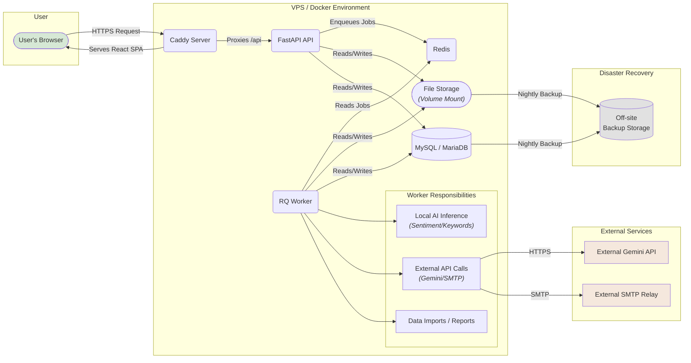
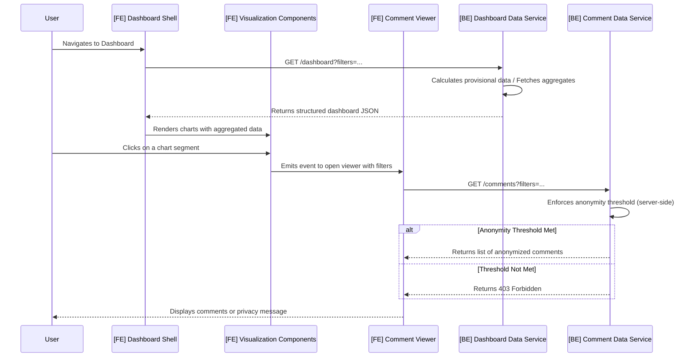

## **High Level Architecture**

### **Technical Summary**

The **Proficiency** platform will be architected as a modern, decoupled web application consisting of a **React/TypeScript single-page application (SPA)** frontend and a **monolithic Python/FastAPI backend**. This backend is supported by an **asynchronous RQ worker** that handles a **hybrid AI workload**: it performs local inference for high-volume sentiment and keyword analysis, and it orchestrates calls to the **external Gemini API** for the AI Assistant feature. All services will be containerized using Docker and deployed to a single VPS, managed by Docker Compose, with Caddy serving as a secure and efficient reverse proxy.

### **Platform and Infrastructure Choice**

* **Platform:** **Single VPS (Ubuntu)**
* **Key Services:** The entire system will be managed via **Docker Compose**, orchestrating containers for:
  * `api`: The core FastAPI application.
  * `web`: The Caddy server, which serves the static frontend build and acts as a reverse proxy.
  * `worker`: The RQ background worker for asynchronous tasks.
  * `redis`: The message broker for the RQ queue.
  * `db`: The MySQL/MariaDB database.
* **Deployment Host and Regions:** A single Virtual Private Server will be used. A hosting region in **Singapore** is recommended for optimal proximity and low latency to the target user base in the Philippines.

### **Repository Structure**

* **Structure:** **Monorepo**
* **Monorepo Tool:** **npm/pnpm workspaces**. This lightweight approach is sufficient for managing the `web` and `api` packages without introducing unnecessary tooling complexity.
* **Package Organization:** The monorepo will contain an `apps/` directory for the main `web` (frontend) and `api` (backend) applications. A `packages/` directory will be included to house any shared code, such as common TypeScript types, in the future.

#### **Dependency Management Strategy**

To ensure stability and prevent dependency conflicts within the monorepo, the following strategies will be enforced:

* **Frontend (`pnpm` Workspaces):** The frontend leverages `pnpm` workspaces. All dependencies are defined in `frontend/package.json`, and the `pnpm-lock.yaml` file serves as the single source of truth for pinned versions. This file must be committed to the repository.
* **Backend (`pip` Constraints):** The backend uses a `requirements.txt` file for direct dependencies. A separate `constraints.txt` file will be used to pin the versions of all transitive dependencies, ensuring fully reproducible builds.

### **High Level Architecture Diagram**

### **Refined Dashboard Data Flow Diagram**

This diagram illustrates the separation of concerns between fetching aggregated dashboard data and fetching raw, privacy-protected comment data.

### **Architectural Patterns**

* **Decoupled SPA & Monolithic API:** The system is structured with a distinct separation between the frontend Single-Page Application (SPA) and the backend monolithic API\[cite: 3]. This allows for independent development, deployment, and scaling of the client and server components.
* **Asynchronous Background Processing:** Long-running, resource-intensive tasks such as data imports, report generation, and AI analysis are offloaded from the main API thread to a background worker process\[cite: 3]. This is managed via a job queue (Redis + RQ) to ensure the API remains responsive and the user experience is not blocked\[cite: 3].
* **Containerization:** All services (API, web server, worker, database, cache) are encapsulated in Docker containers and orchestrated by Docker Compose\[cite: 3]. This provides a consistent, reproducible environment for both local development and production deployment\[cite: 3].
* **Reverse Proxy:** A Caddy server acts as the single entry point for all incoming traffic\[cite: 3]. It serves the static frontend assets directly and securely reverse-proxies all API-bound requests (e.g., `/api/*`) to the FastAPI application, handling automatic HTTPS encryption\[cite: 3].
* **Transactional Outbox Pattern (Simplified):** For critical, multi-step operations like university approval, core database changes will be committed atomically. Subsequent actions like sending emails or dispatching jobs will be triggered only after the transaction is successful, ensuring system consistency.
* **Batch-Oriented Processing**: All high-volume data import jobs must process records in small, transactional batches. This ensures that a failure in one part of the file does not require a full rollback of the entire operation, making the system more resilient and user-friendly for large-scale data onboarding.
* **Pluggable Strategy Pattern**: For core business logic components like the data integrity engine, specific algorithms (e.g., similarity checks) must be implemented as interchangeable 'strategies'. This allows the core engine to remain stable while the methods it uses can be updated or replaced without a major refactor.

***
