## **Core Workflows**

This section provides detailed, step-by-step walkthroughs of the primary user and system processes. Each workflow is illustrated with a sequence diagram to clarify the interactions between frontend components, backend services, the database, and asynchronous workers. These workflows serve as a practical guide for implementation, demonstrating how the defined architectural patterns are applied to meet the requirements of the PRD.

### **Workflow Group 1: University Onboarding & Initial Setup**

This workflow details the critical path for onboarding a new institution onto the platform. It covers the journey from a prospective admin's initial application to the secure, transactional creation of a new university tenant and its first administrator account. This process demonstrates several key architectural principles: **transactional integrity** for critical state changes, **asynchronous communication** for external notifications, **optimistic locking** for concurrent administrative actions, and **secure token management** for user verification.

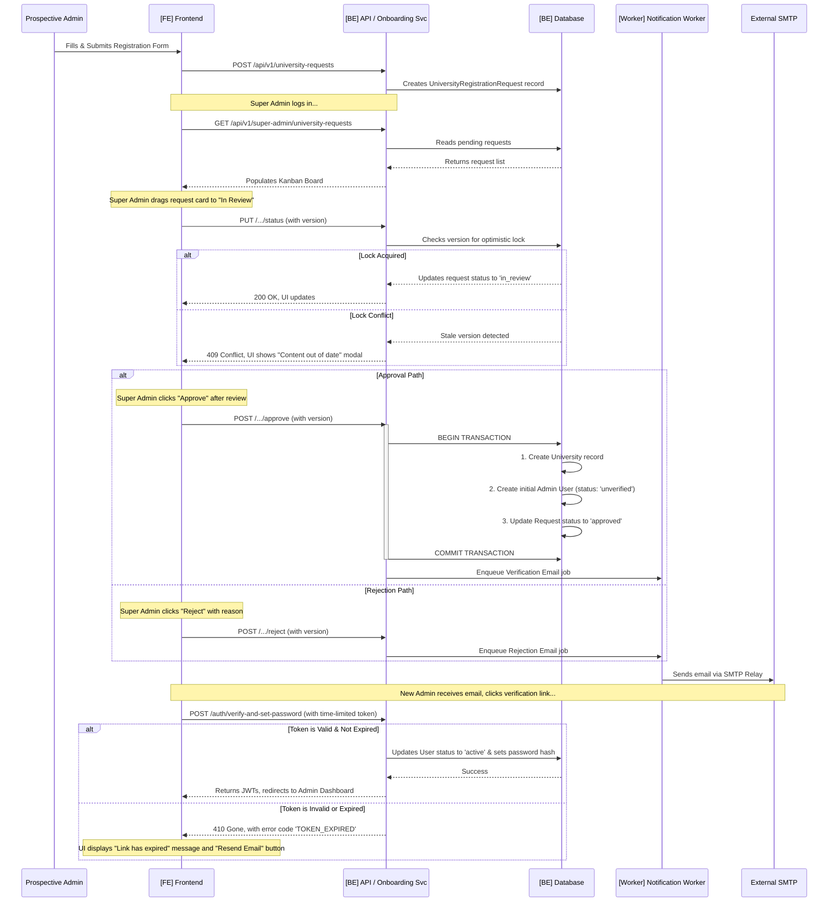

### **Step-by-Step Breakdown**

1. **Request Submission**: A prospective University Admin fills out the public registration form. The frontend submits this data, including any supporting documents, to the `POST /api/v1/university-requests` endpoint. The backend service validates the input and creates a `UniversityRegistrationRequest` record in the database with a status of `submitted`.

2. **Super Admin Review & Locking**: A Super Admin views the pending requests on a Kanban-style board. When they move a request to the "In Review" column, the frontend sends a `PUT` request to update the status. This request includes the record's current `version` number, enabling the backend to use **optimistic locking**. If another Super Admin has already modified the request, the backend detects the version mismatch and returns a `409 Conflict` error, prompting the user to refresh their view. This prevents two admins from acting on the same request simultaneously.

3. **Approval (The Transactional Core)**: This is the most critical step. Upon a Super Admin's final approval, the backend API performs the core tenant creation logic within a **single, atomic database transaction**. This guarantees that the `University` record, the initial `User` (Admin) record, and the status update of the `UniversityRegistrationRequest` all succeed or fail together. This prevents the system from entering an inconsistent state, such as having an admin user without an associated university.

4. **Asynchronous Notification**: **Only after** the database transaction is successfully committed does the API enqueue a job for the background worker to send the verification email. This decouples the user-facing API response from the external email service, making the approval action faster for the Super Admin and more resilient to transient failures with the SMTP provider.

5. **New Admin Verification**: The newly created University Admin receives an email with a unique verification link. This link contains a secure, single-use JWT that includes a **24-hour expiration claim (`exp`)**. If the link is clicked within the valid window, the user is directed to a page to set their password, which activates their account. If the link is expired, the UI will display an informative error and provide the option to request a new verification email, fulfilling the updated security requirement **(FR16)**.

### **Key Architectural Principles in this Workflow**

* **Transactional Integrity**: The creation of a new tenant is an all-or-nothing operation, ensuring the database remains in a consistent state, as required by **NFR10**.
* **Asynchronous Communication**: External operations like sending emails are offloaded to a background worker, improving API responsiveness and system resilience.
* **Optimistic Locking**: Concurrency control is handled gracefully by using a versioning system, preventing data corruption from simultaneous administrative actions, as required by **NFR9**.
* **Secure Token Management**: Critical user actions, such as initial account verification, are protected by short-lived, single-use tokens to mitigate security risks from stale links.

***

### **Workflow Group 2: Bulk Data Onboarding & Job Monitoring (Final Version)**

This workflow details the robust, two-stage process for importing bulk data and the real-time system for monitoring and managing these asynchronous jobs. The design prioritizes **safety**, **resilience**, and **administrative control**. It demonstrates several key architectural principles: a **two-stage commit** for data integrity, **asynchronous processing** for UI responsiveness, **batch-oriented processing** for handling partial failures, **real-time observability** via WebSockets for a superior user experience, and **system self-healing** to recover from unexpected failures.

#### **Part A: Data Ingestion & Processing Flow**

This diagram illustrates the primary path for uploading, validating, and processing a data file.

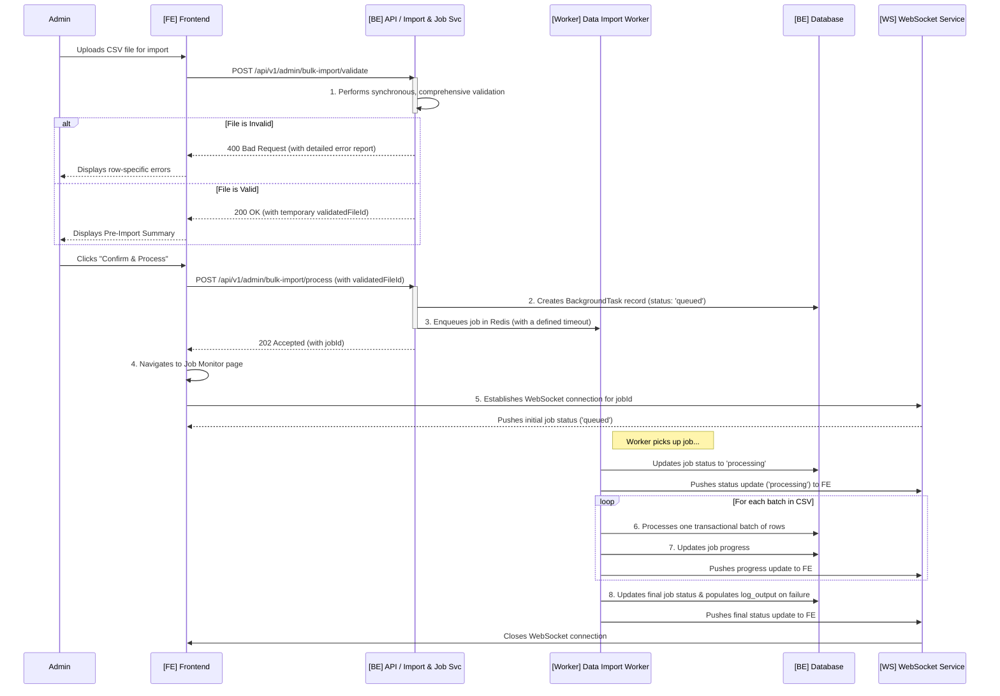

#### **Part B: Job Management & Intervention Flow**

This diagram illustrates how an administrator interacts with an in-progress or stuck job.

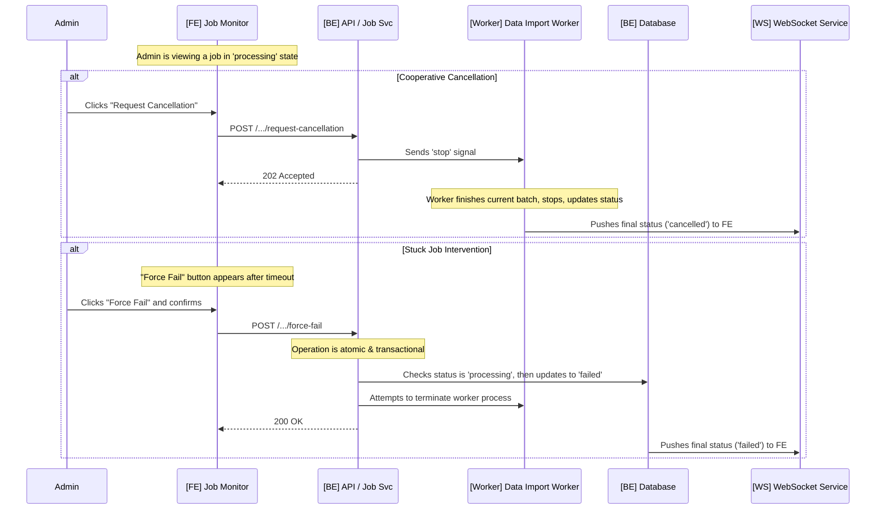

### **Step-by-Step Breakdown**

1. **Stage 1: File Validation**: The administrator uploads a CSV file. The backend performs a **synchronous validation** to provide immediate, actionable feedback. If the file is invalid, a detailed error report is returned; otherwise, a temporary ID for the validated file is provided.

2. **Stage 2: Asynchronous Processing**: Upon the administrator's confirmation, the backend enqueues the job with a **defined timeout** and immediately returns a `202 Accepted` response. This ensures the UI remains responsive regardless of file size.

3. **Real-Time Monitoring & Resilience**: The UI navigates to the Job Monitor and establishes a **WebSocket connection**. The frontend client is responsible for handling interruptions with **automatic reconnection logic** and **re-syncing the job's state** via a REST call upon reconnection to ensure the displayed data is always accurate.

4. **Batch-Oriented Execution**: The worker processes the file in **small, transactional batches**. If one batch fails, its failure is logged, and the worker proceeds to the next. This resilience is key to enabling the `completed_partial_failure` state.

5. **Job Completion & Enhanced Reporting**: Upon completion, the worker sets the final job status. In any failure scenario (partial or full), it populates the **`log_output`** field in the `BackgroundTask` table with a detailed technical traceback and makes a user-friendly error report available for download.

6. **Job Intervention**: An administrator can interact with a running job:

   * **Cooperative Cancellation**: By "Requesting Cancellation," a graceful shutdown signal is sent to the worker, which will stop after its current batch to prevent data corruption.
   * **Forced Failure**: For a genuinely stuck job, the "Force Fail" action provides an escape hatch. This API call is **atomic and transactional**, ensuring it can't conflict with a job that is finishing simultaneously.

7. **System Self-Healing (Zombie Job Cleanup)**: A separate, **scheduled cleanup task** runs periodically. It checks for jobs that have exceeded their timeout in the RQ framework and updates their status in our application database to `failed`. This prevents "zombie jobs" from remaining in a `processing` state indefinitely after a catastrophic worker crash.

### **Key Architectural Principles in this Workflow**

* **Two-Stage Commit (Validate then Process)**: A safety pattern ensuring processing is only performed on valid data.
* **Asynchronous Background Processing**: Guarantees a responsive UI by offloading long-running tasks.
* **Batch-Oriented Processing**: Provides resilience and enables the critical `completed_partial_failure` state.
* **Real-Time Observability (via WebSockets)**: Delivers a superior, transparent user experience for monitoring.
* **Cooperative Cancellation & Intervention**: Grants administrators essential control over system processes.
* **System Self-Healing**: Automates recovery from unexpected worker failures, ensuring system stability.

***

### **Workflow Group 3: Evaluation Lifecycle Management (Final Version)**

This workflow details the administrative heart of the platform, covering the entire lifecycle of an evaluation from the creation of a form to its scheduling and, if necessary, its emergency cancellation. This process demonstrates several key architectural principles: robust **state machine management**, **optimistic locking** for collaborative editing, **comprehensive auditing** for traceability, and a **reversible, asynchronous pattern** for handling sensitive, destructive actions safely.

#### **Part A: Form Template Creation & Activation**

This diagram illustrates an Admin creating, editing, and activating a new evaluation form, including the use of optimistic locking and mandatory audit logging.

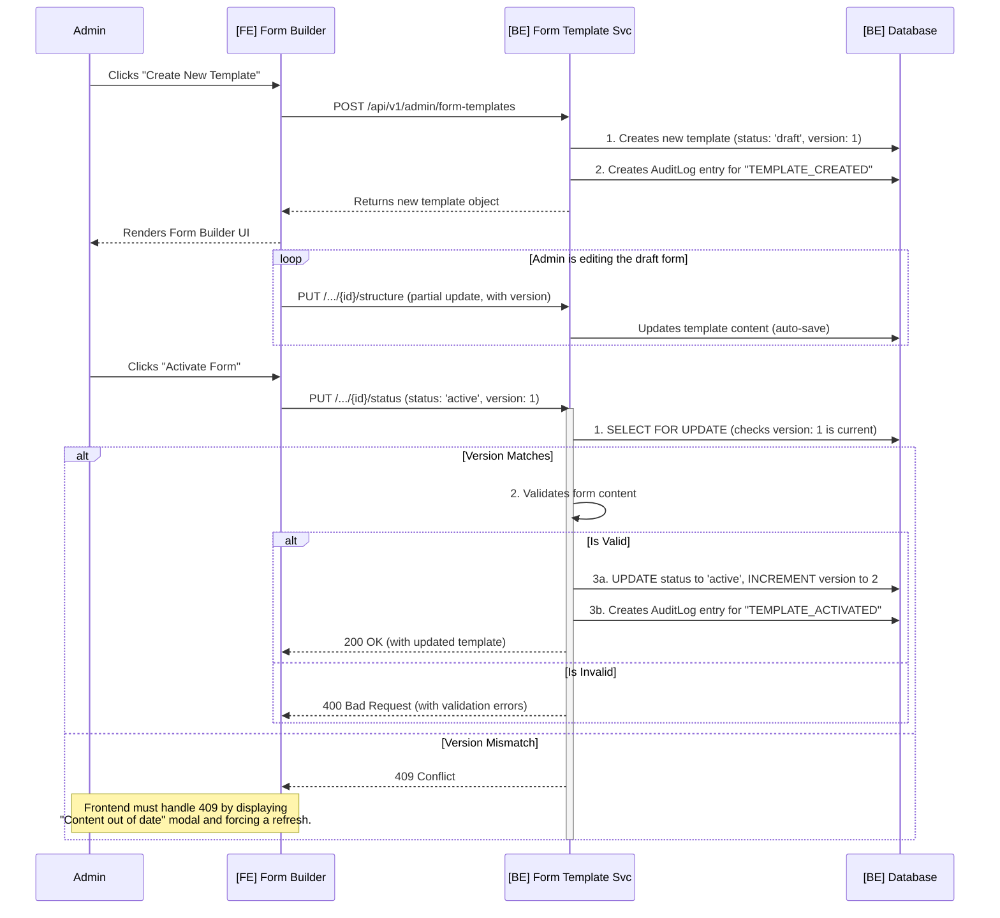

#### **Part B: Period Scheduling & Lifecycle**

This diagram shows how an `active` form is assigned to a period, locking the form, and how the period's status transitions over time. All actions are audited.

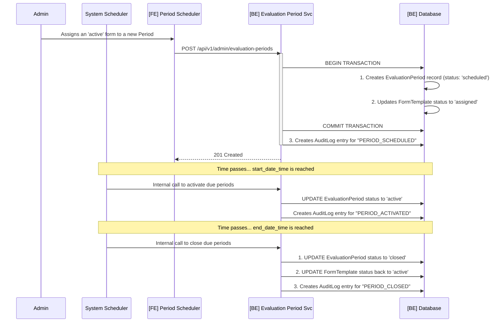

#### **Part C: Emergency Period Cancellation & Restoration**

This flow details the safe, reversible, and fully audited process for cancelling an active period.

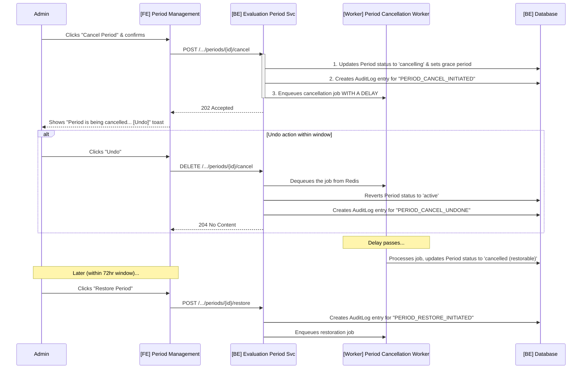

### **Step-by-Step Breakdown**

1. **Form Template Creation & Auditing**: An Admin uses the Form Builder to create a `draft` form. Every state-changing action, from the initial creation to criteria and question updates, is a candidate for auditing. The frontend's auto-save feature makes partial updates to the draft.

2. **Form Activation & Concurrency Control**: To activate a form, the Admin's request must pass backend validation and a **version check for optimistic locking**. A successful activation updates the form's status, increments its version, and **records the "TEMPLATE\_ACTIVATED" event in the `AuditLog`**.

3. **Period Scheduling & State Truthfulness**: The Admin assigns an `active` form to a period. This transactionally creates the period and locks the form by setting its status to `assigned`, with the entire action being audited. Crucially, while a system scheduler manages the `scheduled` → `active` → `closed` status transitions, all critical APIs **must re-validate the period's timestamps against the current server time**, ensuring the timestamps are the ultimate source of truth, not the status field.

4. **Emergency Cancellation (The Reversible & Audited Flow)**: When an Admin initiates a cancellation, the action is **immediately recorded in the `AuditLog`**. The system enters a `cancelling` state and schedules a delayed job, providing a brief "Undo" window. If undone, the reversal is also audited. If the job proceeds, it transitions the period to a `cancelled (restorable)` state.

5. **Period Restoration**: An Admin can restore a period within the 72-hour grace window. This action is also audited and enqueues a job to revert the state of the period and its submissions.

### **Key Architectural Principles in this Workflow**

* **State Machine Management**: The lifecycle of `EvaluationFormTemplate` and `EvaluationPeriod` is explicitly managed by the backend, ensuring predictable and valid state transitions.
* **Optimistic Locking for Collaboration**: The use of a `version` field prevents data corruption from concurrent administrative edits.
* **Reversible, Asynchronous Destructive Actions**: The cancellation flow provides a crucial safety net for a high-impact action, using state changes and delayed jobs to create a reversible process.
* **Comprehensive Auditing**: Every critical, state-changing action performed by an administrator is recorded in the `AuditLog`, providing a definitive, immutable record for security, traceability, and accountability.

***

### **Workflow Group 4: Evaluation Submission & Integrity Review (Final Version)**

This workflow details the core loop of the application where data is generated and its quality is assured. It begins with an evaluator submitting their feedback and follows the submission through a new, extensible **"Pluggable Flagging Engine"** that performs automated integrity checks. It concludes with the administrative review process, where flagged submissions are resolved. This workflow demonstrates a **modular and extensible approach to data validation**, robust **state machine management**, and **optimistic locking** for the critical administrative review process.

#### **Part A: The Submission & Pluggable Flagging Flow**

This refactored diagram illustrates the new, engine-driven approach to data integrity checks, separating the synchronous and asynchronous phases.

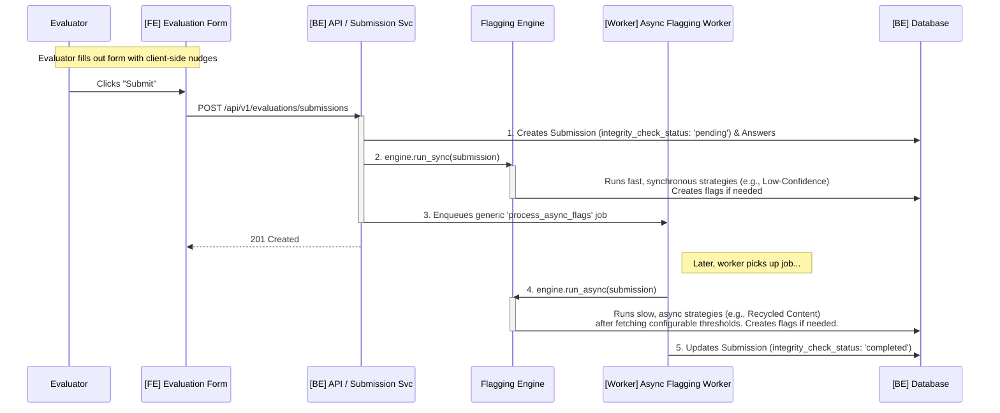

#### **Part B: The Administrative Review & Resolution Flow**

This diagram, detailing the administrator's review process, remains structurally the same as it is independent of how the flags are generated. It is protected by optimistic locking.

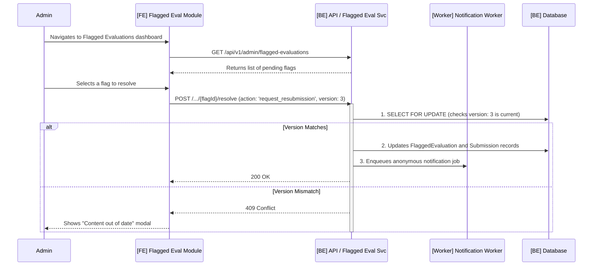

### **Step-by-Step Breakdown**

1. **Submission & Client-Side Nudges**: An evaluator fills out the form, guided by real-time client-side validations and the non-blocking "Pre-Submission Nudge."

2. **The Pluggable Flagging Engine**: Upon receiving a submission, the **`[BE] Evaluation Submission Service`** immediately creates the `EvaluationSubmission` record with an `integrity_check_status` of `pending`. It then invokes the new **"Pluggable Flagging Engine"**:

   * **Synchronous Phase**: The engine first executes all registered *synchronous* strategies (fast checks like "Low-Confidence") directly within the API request-response cycle.
   * **Asynchronous Phase**: The service then enqueues a single, generic `process_async_flags` job. Later, the **`[Worker] Asynchronous Flagging Worker`** consumes this job and directs the engine to execute all *asynchronous* strategies (slow, intensive checks like "Recycled Content"). This worker is responsible for fetching any necessary configurable thresholds (e.g., similarity percentage) from the `UniversitySetting` table before running the check.

3. **State Tracking & Resilience**: Once the asynchronous worker completes all its checks, it updates the submission's `integrity_check_status` to `completed`. If the worker job fails after all retries, it updates the status to `failed`. A separate **scheduled cleanup task** will periodically scan for submissions stuck in the `pending` state for too long, mark their status as `failed`, and alert administrators, ensuring no submission is lost in limbo.

4. **Administrative Review & Concurrency Control**: An Admin reviews pending flags, which are generated by the flagging engine. The resolution process is protected by **optimistic locking**, preventing two admins from acting on the same item and ensuring data consistency.

5. **Resolution & State Transitions**: The Admin's action (`Approve`, `Archive`, or `Request Resubmission`) triggers a state change in the `EvaluationSubmission`, determining whether it proceeds to the analysis pipeline or is removed. The resolution triggers asynchronous, anonymous notifications where required.

6. **The Resubmission Loop**: If a resubmission is requested, the student is granted a 48-hour grace period to submit a new evaluation, guided by a UI that highlights the originally flagged content.

### **Key Architectural Principles in this Workflow**

* **Pluggable Flagging Engine (Strategy Pattern)**: This is the new core of our integrity system. By abstracting each integrity check into a modular, swappable "strategy," the system becomes highly extensible and maintainable, directly fulfilling **NFR11**. Adding a new flag in the future is as simple as creating a new strategy class.
* **State Machine Management**: The `EvaluationSubmission` entity follows a clearly defined lifecycle, with both its primary `status` and its `integrity_check_status` being managed by the system.
* **Optimistic Locking for Review Processes**: Ensures data integrity for the critical administrative task of resolving flags, fulfilling **NFR9**.
* **Decoupled Notification**: User notifications are handled as a side effect of the resolution process by a separate, asynchronous service.

***

### **Workflow Group 5: Asynchronous Data Analysis & Visualization (Final Version)**

This workflow details the engine of the platform, transforming raw submissions into actionable insights. It is composed of two distinct parts: a multi-stage **asynchronous backend pipeline** for processing data, and a highly scalable **micro-batching model** for presenting it. This design demonstrates key principles: a **decoupled pipeline** for processing, **data normalization** for fair comparison, **micro-batching** for read scalability, and **segregation of concerns** for security.

#### **Part A: The Asynchronous Analysis Pipeline (Backend)**

This diagram shows the fan-out/fan-in process where parallel jobs process quantitative and qualitative data before a final job normalizes and aggregates the results.

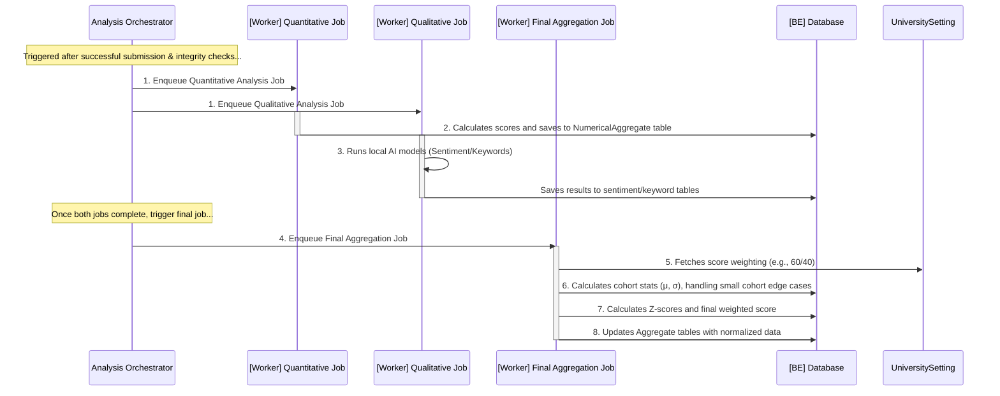

#### **Part B: The Dashboard Data Retrieval (Frontend)**

This refactored diagram illustrates the highly scalable micro-batching model. The API no longer performs expensive on-the-fly calculations; it simply reads from pre-calculated tables.

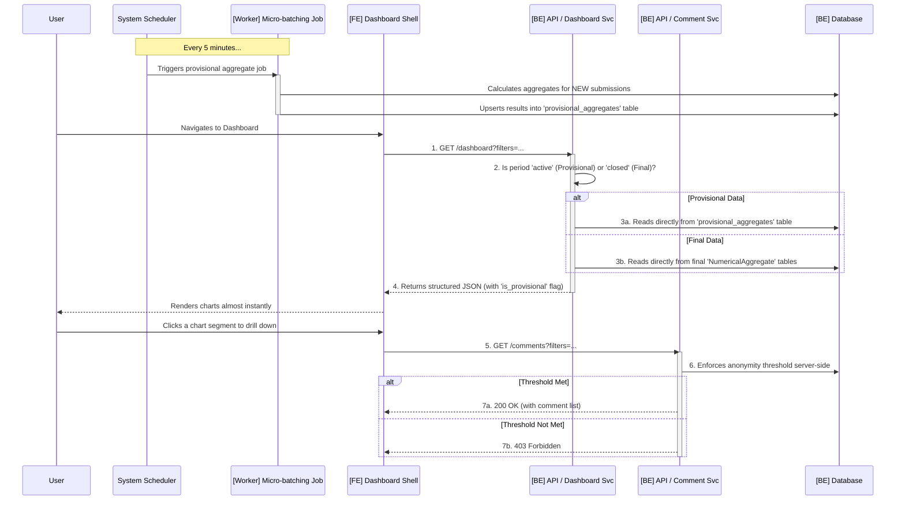

### **Step-by-Step Breakdown**

1. **Pipeline Initiation**: After a submission passes integrity checks, an orchestration process enqueues two jobs to run in parallel, setting the submission's `analysis_status` to `pending`.

2. **Parallel Processing**: The **Quantitative Job** calculates raw scores, while the **Qualitative Job** runs AI models. Upon completion, they update the database, and the submission's `analysis_status` is moved to `quant_qual_complete`.

3. **Final Aggregation & Normalization**: Once the prerequisites are met, the final, idempotent job runs. It fetches the configurable score weighting, calculates cohort statistics (defensively handling small cohorts), computes the standardized Z-scores, and stores the final, comparable scores. It then updates the submission's `analysis_status` to `aggregation_complete`.

4. **Micro-batching for Provisional Data**: This is the new, highly scalable core of the dashboard. A **scheduled worker** runs every few minutes, calculating aggregates for any *new* submissions and updating a dedicated `provisional_aggregates` table. This moves the computational load from user request time to a consistent, low-priority background task.

5. **Efficient Dashboard Retrieval**: The user-facing `Dashboard Data Service` is now extremely fast and simple. It no longer performs on-the-fly calculations. It merely reads from the appropriate pre-calculated table: `provisional_aggregates` for active periods or the final aggregate tables for closed periods.

6. **Secure & Anonymized Comment Viewing**: When a user drills down, a request is sent to the separate `Comment Data Service`, which enforces the anonymity threshold **on the server-side** before returning any data, guaranteeing user privacy.

### **Key Architectural Principles in this Workflow**

* **Multi-Stage Asynchronous Pipeline**: A decoupled, fan-out/fan-in pipeline processes data in distinct, resilient stages.
* **Data Normalization for Comparability**: The use of Z-scores provides a statistically sound method for fair, context-aware performance comparison.
* **Micro-batching for Read Scalability**: This pattern trades a few minutes of data latency for massive gains in performance, scalability, and resilience for read-heavy dashboards. It is architecturally superior to an on-the-fly caching model.
* **Segregation of Concerns for Security**: Using a dedicated `Comment Data Service` with the single responsibility of enforcing anonymity makes the system more secure and auditable.

***

### **Workflow Group 6: AI Assistant & Report Generation (Final Version)**

This workflow details the architecture for the platform's two most resource-intensive features. Both are designed for safety and resilience by channeling user requests through a **protective gateway** that performs validation and rate-limiting before offloading all computational work to **asynchronous background jobs**. This design demonstrates key principles: a **rate-limited gateway pattern**, **resilient execution** with circuit breakers, and **defensive interactions** with external services.

#### **Part A: The AI Assistant Workflow**

This diagram illustrates the secure and resilient process for generating AI suggestions, which is protected from both external service failures and prompt injection attacks.

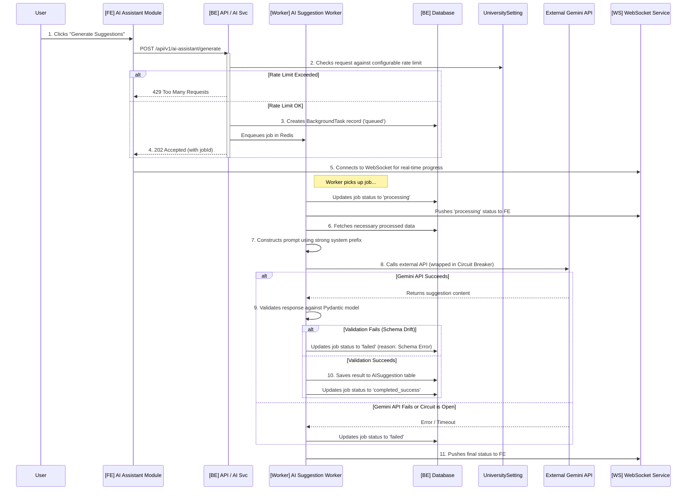

#### **Part B: The Report Center Workflow**

This diagram shows the asynchronous generation of a formal report, which is protected from resource exhaustion by a pre-computation check.

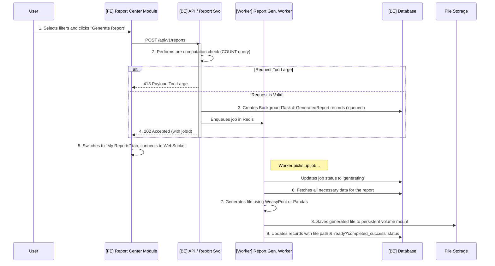

### **Step-by-Step Breakdown**

1. **The Protective Gateway (Rate-Limiting & Validation)**: Both workflows begin with an API call that is immediately checked against a configurable rate limit (**NFR12**). For the Report Center, an additional **pre-computation check** is performed to estimate the report size. If the request is too large, it's rejected with a `413 Payload Too Large` error. This two-pronged gateway protects the system from both abuse and accidental resource exhaustion.

2. **Asynchronous Job Enqueuing**: Once a request is validated, the API's only job is to enqueue a background task and immediately return a `202 Accepted` response.

3. **Real-Time Progress Monitoring**: The frontend uses the `jobId` from the `202` response to connect to the WebSocket and provide the user with live, real-time feedback on the job's status.

4. **Resilient & Secure AI Suggestion Generation**: The `[Worker] AI Suggestion Worker` takes multiple defensive steps:

   * It constructs its request to the Gemini API using a **strong system prompt** to mitigate the risk of prompt injection.
   * The external API call is wrapped in a **Circuit Breaker** to protect our system from an unresponsive third-party service.
   * Upon receiving a response, it **validates the JSON structure** against a Pydantic model to guard against unexpected schema changes from the external API.

5. **Report Generation & Storage**: The `[Worker] Report Generation Worker` fetches the required data, generates the file using the appropriate library (WeasyPrint/Pandas), and saves the final artifact to the `File Storage` volume before updating the database record with the download path.

6. **Completion and User Action**: Once a job is complete, the UI updates to show the final result. The user can then perform simple follow-up actions, such as saving an AI suggestion to their history or downloading a completed report.

### **Key Architectural Principles in this Workflow**

* **Rate-Limited Gateway Pattern**: Protects system resources and controls costs by enforcing usage limits and performing pre-computation checks at the API entry point, before any expensive processing begins.
* **Resilient Asynchronous Execution (Circuit Breaker)**: Isolates the system from external service failures, a critical pattern for any architecture that relies on third-party APIs.
* **Defensive External Interactions**: A comprehensive security and reliability pattern that includes using strong system prompts to constrain AI output and defensively parsing all incoming data from untrusted external sources.
* **Separation of Job Orchestration from Execution**: The user-facing API services are lightweight orchestrators, while the heavy lifting is performed entirely by isolated, asynchronous worker processes.

***
