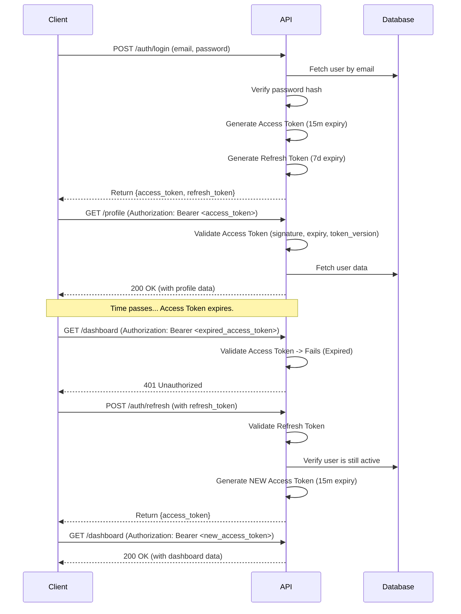

## **Backend Architecture**

This section details the architecture of the Python-based backend application. It establishes the foundational patterns, structures, and strategies to ensure the API server and background worker are scalable, maintainable, secure, and testable. The architecture is designed to directly implement the logic defined in the Core Workflows and support the contracts established in the API Specification.

### **Group 1: Service Architecture & API Organization**

This group establishes the foundational structure of the FastAPI application. The primary goal is to enforce a clean **separation of concerns** by creating distinct layers for API routing, business logic, and data access. This layered approach is critical for maintainability, testability, and ensuring that the codebase remains organized and predictable as it grows.

#### **1.1. Directory Structure (API Service)**

Our monolithic FastAPI backend will be organized within the `apps/api` directory of the monorepo. The internal structure follows best practices for scalable FastAPI applications, clearly separating different layers of the application.

```plaintext
/apps/api/
├── /src/
│   ├── /api/
│   │   └── /v1/
│   │       ├── __init__.py
│   │       ├── deps.py             # Reusable FastAPI dependencies (e.g., get_current_user)
│   │       └── /endpoints/         # API Routers (Controllers)
│   │           ├── __init__.py
│   │           ├── auth.py
│   │           ├── forms.py
│   │           └── ... (other routers for each domain)
│   │
│   ├── /core/
│   │   ├── __init__.py
│   │   ├── config.py             # Application settings (loaded from env vars)
│   │   └── security.py           # Password hashing, JWT creation/validation
│   │
│   ├── /db/
│   │   ├── __init__.py
│   │   ├── base.py               # Declarative base for SQLAlchemy models
│   │   └── session.py            # Database session management
│   │
│   ├── /models/                  # SQLAlchemy ORM Models (implements Data Models section)
│   │   ├── __init__.py
│   │   ├── user.py
│   │   └── form_template.py
│   │
│   ├── /repositories/            # Data Access Layer (detailed in Group 2)
│   │   ├── __init__.py
│   │   ├── base_repository.py
│   │   └── user_repository.py
│   │
│   ├── /schemas/                 # Pydantic Schemas (Data Transfer Objects)
│   │   ├── __init__.py
│   │   ├── token.py
│   │   ├── user.py
│   │   └── msg.py                # Generic message schemas
│   │
│   ├── /services/                # Business Logic Layer
│   │   ├── __init__.py
│   │   ├── auth_service.py
│   │   └── form_service.py
│   │
│   ├── /worker/                  # Background task definitions (detailed in Group 4)
│   │   ├── __init__.py
│   │   ├── tasks.py
│   │   └── connection.py
│   │
│   ├── main.py                   # FastAPI application entry point
│   └── __init__.py
│
├── alembic/                      # Alembic migration scripts
├── alembic.ini                   # Alembic configuration
├── tests/                        # Pytest tests (detailed in Group 6)
└── Dockerfile                    # Container definition for the API service
```

#### **1.2. API Endpoint Template (Controller Pattern)**

To ensure consistency across all API endpoints, we will adhere to a standardized pattern that leverages FastAPI's **Dependency Injection** system. API routers (`/endpoints/`) will be kept lean and their sole responsibility will be to handle HTTP requests/responses, delegate all business logic to the **Service Layer**, and use Pydantic schemas for data validation.

**Standard Endpoint Implementation (`forms.py`):**

This example demonstrates the pattern for creating a new evaluation form template.

```python
# /apps/api/src/api/v1/endpoints/forms.py

from fastapi import APIRouter, Depends, HTTPException
from sqlalchemy.orm import Session
from starlette import status

from .... import schemas, services, models
from .. import deps

# 1. Initialize an APIRouter for this domain
router = APIRouter()

# 2. Define the endpoint with path, tags, and response model
@router.post(
    "/",
    response_model=schemas.FormTemplate,
    status_code=status.HTTP_201_CREATED,
    summary="Create a New Form Template",
)
def create_form_template(
    *,
    # 3. Use Pydantic schema for request body validation
    form_in: schemas.FormTemplateCreate,
    # 4. Use dependency injection to get DB session and current user
    db: Session = Depends(deps.get_db),
    current_user: models.User = Depends(deps.get_current_active_admin),
):
    """
    Creates a new evaluation form template in a 'draft' state.
    """
    # 5. Delegate all business logic to the service layer
    form = services.form_template.create(db=db, obj_in=form_in, user=current_user)

    if not form:
        raise HTTPException(
            status_code=status.HTTP_400_BAD_REQUEST,
            detail="Failed to create form template.",
        )

    # 6. Return the created object, which will be serialized by the response_model
    return form
```

**Pattern Rationale:**

1. **APIRouter**: Organizes endpoints by domain, which are then included in the main FastAPI app.
2. **Decorators**: Clearly define the HTTP method, path, response schema, and documentation.
3. **Request Schema (`form_in`)**: FastAPI automatically validates the incoming JSON against this Pydantic model, ensuring data integrity at the entry point.
4. **Dependency Injection (`Depends`)**: This powerful FastAPI feature provides the database session (`db`) and authenticates/authorizes the user (`current_user`) for the endpoint, keeping this logic out of the endpoint function itself.
5. **Service Layer Delegation**: The endpoint function remains clean and readable. Its only job is to pass validated data to the appropriate service function, which contains the actual business logic.
6. **Response Model**: FastAPI uses this to serialize the return object, guaranteeing the response matches the OpenAPI specification and filtering out any unintended data.

***

### **Group 2: Data Access Layer Architecture**

This group defines our standardized pattern for all database interactions. To adhere to the principle of **separation of concerns**, our business logic (Service Layer) will **not** interact directly with the database or the SQLAlchemy ORM. Instead, it will communicate exclusively through a dedicated abstraction layer known as the **Repository Pattern**.

This approach provides several key benefits:

* **Decoupling**: Our core application logic is shielded from the specifics of the database implementation.
* **Testability**: During testing, we can easily "mock" the repository, allowing us to test services in isolation without needing a live database connection.
* **Centralization**: All database query logic for a specific data model is centralized in one place, making it easier to manage, optimize, and debug.

#### **2.1. The Repository Pattern**

The repository acts as an in-memory collection of our domain objects (our SQLAlchemy models). The Service Layer will ask the repository for objects, and the repository is responsible for retrieving them from the database. This pattern allows us to treat data persistence as a detail, keeping our services focused purely on business logic.

#### **2.2. Base Repository Implementation**

To avoid repetitive code, we will implement a generic `BaseRepository` class that provides standard Create, Read, Update, and Delete (CRUD) methods. All specific repositories will inherit from this base class.

**Implementation (`base_repository.py`):**

```python
# /apps/api/src/repositories/base_repository.py

from typing import Any, Dict, Generic, List, Optional, Type, TypeVar, Union
from fastapi.encoders import jsonable_encoder
from pydantic import BaseModel
from sqlalchemy.orm import Session

from ...db.base import Base

ModelType = TypeVar("ModelType", bound=Base)
CreateSchemaType = TypeVar("CreateSchemaType", bound=BaseModel)
UpdateSchemaType = TypeVar("UpdateSchemaType", bound=BaseModel)

class BaseRepository(Generic[ModelType, CreateSchemaType, UpdateSchemaType]):
    def __init__(self, model: Type[ModelType]):
        """
        Base class that can be extended by other repositories.
        Provides a basic set of CRUD operations.

        :param model: The SQLAlchemy model
        """
        self.model = model

    def get(self, db: Session, id: Any) -> Optional[ModelType]:
        return db.query(self.model).filter(self.model.id == id).first()

    def get_multi(
        self, db: Session, *, skip: int = 0, limit: int = 100
    ) -> List[ModelType]:
        return db.query(self.model).offset(skip).limit(limit).all()

    def create(self, db: Session, *, obj_in: CreateSchemaType) -> ModelType:
        obj_in_data = jsonable_encoder(obj_in)
        db_obj = self.model(**obj_in_data)
        db.add(db_obj)
        db.commit()
        db.refresh(db_obj)
        return db_obj

    def update(
        self,
        db: Session,
        *,
        db_obj: ModelType,
        obj_in: Union[UpdateSchemaType, Dict[str, Any]]
    ) -> ModelType:
        obj_data = jsonable_encoder(db_obj)
        if isinstance(obj_in, dict):
            update_data = obj_in
        else:
            # Use exclude_unset=True to only update provided fields
            update_data = obj_in.dict(exclude_unset=True)
        for field in obj_data:
            if field in update_data:
                setattr(db_obj, field, update_data[field])
        db.add(db_obj)
        db.commit()
        db.refresh(db_obj)
        return db_obj

    def remove(self, db: Session, *, id: int) -> Optional[ModelType]:
        obj = db.query(self.model).get(id)
        if obj:
            db.delete(obj)
            db.commit()
        return obj

```

#### **2.3. Concrete Repository Implementation**

Creating a specific repository for one of our models becomes incredibly simple. We just need to inherit from the `BaseRepository` and specify the model it will manage. Any custom query methods can be added to this specific class.

**Example (`user_repository.py`):**

```python
# /apps/api/src/repositories/user_repository.py

from sqlalchemy.orm import Session
from typing import Optional

from .base_repository import BaseRepository
from ...models.user import User
from ...schemas.user import UserCreate, UserUpdate

class UserRepository(BaseRepository[User, UserCreate, UserUpdate]):
    def get_by_email(self, db: Session, *, email: str) -> Optional[User]:
        return db.query(User).filter(User.email == email).first()

# Create a single instance to be used throughout the application
user_repository = UserRepository(User)
```

#### **2.4. Usage in the Service Layer**

Finally, the service layer uses the repository instance to perform its operations, completely abstracting away the database session and queries. This demonstrates the clean separation of concerns.

**Example (`auth_service.py`):**

```python
# /apps/api/src/services/auth_service.py

from sqlalchemy.orm import Session
from ... import models, schemas, repositories
from ...core.security import get_password_hash

def register_new_user(db: Session, *, user_in: schemas.UserCreate) -> models.User:
    """
    Handles the business logic for creating a new user.
    """
    # Check if user already exists using the repository's custom method
    existing_user = repositories.user_repository.get_by_email(db, email=user_in.email)
    if existing_user:
        # Business logic for handling duplicates
        raise ValueError("User with this email already exists.")

    # Hash the password (business logic)
    hashed_password = get_password_hash(user_in.password)

    # We create a new Pydantic model for creation to avoid passing the plain password
    user_create_data = schemas.UserCreateWithHashedPassword(
        **user_in.dict(exclude={"password"}),
        password_hash=hashed_password
    )

    # Create the user via the repository's base method
    new_user = repositories.user_repository.create(db, obj_in=user_create_data)

    return new_user
```

***

### **Group 3: Authentication & Authorization Architecture**

This group defines the platform's security model. We will implement a stateless, token-based system using **JSON Web Tokens (JWT)** for authentication. Authorization will be managed through a robust, role-based access control (RBAC) mechanism built upon FastAPI's dependency injection system. This architecture ensures that access to the API is secure, scalable, and easily maintainable.

#### **3.1. Authentication Flow (JWT)**

The authentication process is centered around the exchange of user credentials for a pair of tokens:

1. **Access Token**: A short-lived JWT (e.g., 15-minute expiry) containing the user's identity and roles. It is sent with every request to a protected endpoint.
2. **Refresh Token**: A long-lived token (e.g., 7-day expiry) stored securely by the client. Its sole purpose is to request a new access token when the old one expires, providing a seamless user session without requiring frequent logins.

**Auth Flow Diagram:**

This diagram illustrates the complete token lifecycle, from initial login to token refresh and finally, logout, which is achieved by invalidating the refresh token.



#### **3.2. Core Security Components (`security.py`)**

All cryptographic operations will be centralized in `/src/core/security.py`.

* **Password Hashing**: We will use `passlib` with the **bcrypt** algorithm to securely hash and verify user passwords. Plaintext passwords will never be stored or logged.

* **JWT Creation & Invalidation**: We will use `python-jose` to create and decode JWTs. To enable a robust "log out all sessions" feature, we will leverage the `token_version` field from our `users` and `super_admins` models.

  * **Creation**: When a new JWT is created, the user's current `token_version` from the database will be included as a custom claim within the token's payload (e.g., `"tv": 1`).
  * **Validation**: When validating an incoming token, our security dependency will not only check the signature and expiration but will also compare the `tv` claim in the token against the user's current `token_version` in the database. If they do not match, the token is rejected.
  * **Invalidation**: To invalidate all active sessions for a user (e.g., after a password change), we simply increment the `token_version` in their database record. All previously issued tokens will instantly become invalid.

#### **3.3. Authorization (Role-Based Access Control)**

We will enforce RBAC using FastAPI's dependency injection system, creating a set of reusable, declarative security dependencies in `/src/api/v1/deps.py`.

**1. Primary Security Dependency (`get_current_user`)**

This is the foundational dependency for all protected routes. It is responsible for decoding the token and retrieving the authenticated user.

```python
# /apps/api/src/api/v1/deps.py

from fastapi import Depends, HTTPException, status
from fastapi.security import OAuth2PasswordBearer
from sqlalchemy.orm import Session
from jose import jwt
from pydantic import ValidationError

from .... import models, schemas, repositories
from ....core import security
from ....core.config import settings

oauth2_scheme = OAuth2PasswordBearer(tokenUrl=f"{settings.API_V1_STR}/auth/login")

def get_current_user(
    db: Session = Depends(get_db), token: str = Depends(oauth2_scheme)
) -> models.User:
    try:
        payload = jwt.decode(
            token, settings.SECRET_KEY, algorithms=[security.ALGORITHM]
        )
        token_data = schemas.TokenPayload(**payload)
    except (jwt.JWTError, ValidationError):
        raise HTTPException(
            status_code=status.HTTP_401_UNAUTHORIZED,
            detail="Could not validate credentials",
        )

    user = repositories.user_repository.get(db, id=token_data.sub)
    if not user:
        raise HTTPException(status_code=404, detail="User not found")

    # Critical: Check token version for invalidation
    if user.token_version != token_data.tv:
        raise HTTPException(
            status_code=status.HTTP_401_UNAUTHORIZED,
            detail="Token is no longer valid",
        )

    return user
```

**2. Role-Specific Dependencies**

We can then easily create more specific dependencies that build upon `get_current_user` to check for roles. This creates a clean, reusable pattern for authorization.

```python
# /apps/api/src/api/v1/deps.py (continued)

def get_current_active_admin(
    current_user: models.User = Depends(get_current_user),
) -> models.User:
    # This assumes a 'roles' relationship on the User model
    if "Admin" not in [role.name for role in current_user.roles]:
        raise HTTPException(
            status_code=403, detail="The user does not have enough privileges"
        )
    return current_user
```

**3. Usage in API Endpoints**

By simply adding the dependency to an endpoint's signature, we protect it. FastAPI handles the rest. This makes our endpoint code declarative and highly readable.

```python
# /apps/api/src/api/v1/endpoints/forms.py (revisited)

@router.post("/", response_model=schemas.FormTemplate)
def create_form_template(
    *,
    form_in: schemas.FormTemplateCreate,
    db: Session = Depends(deps.get_db),
    # By using this dependency, this endpoint is now protected.
    # It will only execute if the user is authenticated AND has the 'Admin' role.
    current_user: models.User = Depends(deps.get_current_active_admin),
):
    # ... business logic ...
    return form
```

***

### **Group 4: Asynchronous Task & Worker Architecture**

This group defines the architecture for all background processing. To ensure the primary API remains fast and responsive, any long-running or resource-intensive operation—such as data imports, AI analysis, and report generation—is offloaded to a separate, asynchronous worker process. We will use **Redis Queue (RQ)**, a simple and robust Python-native job queueing system, to manage these tasks.

#### **4.1. Worker & Queue Configuration**

The worker will run in its own Docker container, managed by Docker Compose. It will share the same codebase as the API but will be initiated with a different entry point command that starts the RQ worker process.

To manage different task priorities, we will configure multiple queues in RQ:

* **`high`**: For urgent, time-sensitive tasks like emergency period cancellations or user-facing AI suggestion generation.
* **`default`**: For standard processing tasks, such as analyzing a new evaluation submission.
* **`low`**: For large, non-urgent batch jobs like historical data imports.

This multi-queue setup prevents long-running batch jobs from blocking more critical, user-facing tasks.

#### **4.2. Job Function & Task Definition (`tasks.py`)**

All functions designated to run as background jobs will be defined in `/src/worker/tasks.py`. To ensure observability, resilience, and consistency, every job **must** follow a standard template that interacts with our `BackgroundTask` database model.

**Standard Job Template:**

This template demonstrates the mandatory pattern for creating a new background task. It ensures that every job's lifecycle is tracked in the database and that failures are always gracefully handled and logged.

```python
# /apps/api/src/worker/tasks.py

import traceback
from rq.decorators import job
from sqlalchemy.orm import Session

from .. import repositories, services
from ..db.session import SessionLocal
from .connection import conn

# 1. Use the RQ job decorator, specifying the queue and a timeout
@job('default', connection=conn, result_ttl=86400, job_id_prefix="prof-")
def process_evaluation_submission(submission_id: int, university_id: int, job_id: str):
    """
    Standard RQ job to run the full analysis pipeline for a submission.
    The job_id is passed explicitly from the enqueuing service.
    """
    db: Session = SessionLocal()
    # 2. Fetch the tracking record from the BackgroundTask table
    task_record = repositories.background_task.get(db, id=int(job_id.split('-')[-1]))

    try:
        # 3. Update status to 'processing' immediately
        if task_record:
            repositories.background_task.update(db, db_obj=task_record, obj_in={"status": "processing"})

        # 4. --- Main Business Logic ---
        # Delegate to a service function to keep the task definition clean.
        services.analysis.run_full_pipeline(
            db=db,
            submission_id=submission_id,
            university_id=university_id
        )
        # --- End of Business Logic ---

    except Exception as e:
        # 5. On any failure, log the exception and update the task record
        error_message = f"Job {job_id} failed: {str(e)}"
        if task_record:
            repositories.background_task.update(
                db,
                db_obj=task_record,
                obj_in={"status": "failed", "result_message": error_message, "log_output": traceback.format_exc()}
            )
        db.close()
        # Re-raise the exception to ensure RQ also marks the job as failed
        raise e

    # 6. On success, update the final status in the database
    if task_record and task_record.status == "processing": # Ensure we don't overwrite a failed status
        repositories.background_task.update(db, db_obj=task_record, obj_in={"status": "completed_success"})

    db.close()

```

**Pattern Rationale:**

1. **Decorator (`@job`)**: This RQ decorator registers the function as a background task. We explicitly define the queue. A `result_ttl` is set to manage how long job results are kept in Redis.
2. **Tracking Record**: The first step of every job is to fetch its corresponding `BackgroundTask` record using the `job_id`. This allows the job to report its own progress and status.
3. **Immediate Status Update**: The job immediately marks itself as `processing`. This provides real-time feedback for the "Job Monitor" dashboard.
4. **Business Logic**: The core work is delegated to a service function, keeping the task definition focused on orchestration.
5. **Robust Failure Handling**: A global `try...except` block ensures that any unexpected error is caught. The error details and traceback are saved to the `log_output` field , which is critical for fulfilling the "Job Monitor" debugging requirements.
6. **Final Status Update**: The job's final status is recorded in the database, whether it succeeds or fails.

#### **4.3. Enqueuing Jobs from the Service Layer**

Jobs are never called directly. Instead, they are enqueued from the API's Service Layer. The service is responsible for first creating the `BackgroundTask` record and then dispatching the job to Redis.

**Example (`submission_service.py`):**

```python
# /apps/api/src/services/submission_service.py

from sqlalchemy.orm import Session
from .. import models, schemas, repositories
from ..worker import tasks

def handle_new_submission(db: Session, *, submission: models.EvaluationSubmission) -> None:
    """
    Orchestrates the asynchronous processing for a new submission.
    """
    # 1. Create a DB record to track the background task.
    task_record = repositories.background_task.create(
        db,
        obj_in=schemas.BackgroundTaskCreate(
            university_id=submission.university_id,
            job_type="EVALUATION_ANALYSIS", # This should be a typed Enum
            submitted_by_user_id=submission.evaluator_id,
            job_parameters={"submission_id": submission.id}
        )
    )

    # 2. Enqueue the actual job with the ID of the tracking record.
    # The 'queue' argument can be dynamically chosen based on logic.
    tasks.process_evaluation_submission.queue(
        submission_id=submission.id,
        university_id=submission.university_id,
        job_id=f"prof-{task_record.id}" # Pass the DB record ID as the RQ job ID
    )

    return
```

***

### **Group 5: Centralized Error Handling & Logging Strategy**

This group defines a unified strategy for handling all application errors and for creating structured, informative logs. The goal is to ensure that every error, whether expected or unexpected, is handled gracefully and results in a consistent, predictable API response. Furthermore, our logging strategy will produce machine-readable logs that are essential for effective monitoring and rapid debugging in both development and production environments.

#### **5.1. Centralized Exception Handler**

To avoid repetitive `try...except` blocks and ensure all API error responses conform to our OpenAPI specification, we will implement a single, global exception handler. We will leverage FastAPI's middleware and custom exception handler features to intercept all exceptions, log them, and format a standardized JSON response.

**Implementation (`main.py` and a new middleware file):**

1. **Request ID Middleware**: First, we create middleware to attach a unique ID to every incoming request. This ID is essential for tracing a request's entire lifecycle through logs.

   ```python
   # /apps/api/src/core/middleware.py
   import uuid
   from starlette.middleware.base import BaseHTTPMiddleware
   from starlette.requests import Request

   class RequestIDMiddleware(BaseHTTPMiddleware):
       async def dispatch(self, request: Request, call_next):
           request.state.request_id = str(uuid.uuid4())
           response = await call_next(request)
           response.headers["X-Request-ID"] = request.state.request_id
           return response
   ```

2. **Global Exception Handler**: Next, we define the handler itself. It will catch all exceptions, log them with the request ID, and return a response that matches our API specification's `Error` schema.

   ```python
   # /apps/api/src/main.py (or a dedicated error_handling.py)
   import logging
   from fastapi import FastAPI, Request, status
   from fastapi.responses import JSONResponse

   from .core.middleware import RequestIDMiddleware

   app = FastAPI(...)
   app.add_middleware(RequestIDMiddleware)
   logger = logging.getLogger(__name__)

   @app.exception_handler(Exception)
   async def global_exception_handler(request: Request, exc: Exception):
       request_id = getattr(request.state, "request_id", "N/A")

       # Log the full exception traceback for debugging
       logger.error(
           f"Unhandled exception for request {request_id}: {exc}",
           exc_info=True, # This includes the traceback
           extra={"request_id": request_id}
       )

       # Format a consistent error response for the client
       return JSONResponse(
           status_code=status.HTTP_500_INTERNAL_SERVER_ERROR,
           content={
               "error": {
                   "code": "INTERNAL_SERVER_ERROR",
                   "message": "An unexpected internal error occurred.",
                   "requestId": request_id,
               }
           },
       )
   ```

#### **5.2. Structured Logging Configuration**

All application logs will be emitted in a **JSON format**. This makes them machine-readable, which is critical for parsing, filtering, and analysis in monitoring tools like Grafana Loki. We will configure Python's native `logging` module to use a JSON formatter.

**Configuration (`logging_config.py`):**

```python
# /apps/api/src/core/logging_config.py

import logging.config
import sys

def setup_logging():
    LOGGING_CONFIG = {
        "version": 1,
        "disable_existing_loggers": False,
        "formatters": {
            "json": {
                "()": "pythonjsonlogger.jsonlogger.JsonFormatter",
                "format": "%(asctime)s %(name)s %(levelname)s %(message)s %(request_id)s",
            },
        },
        "handlers": {
            "console": {
                "class": "logging.StreamHandler",
                "stream": sys.stdout,
                "formatter": "json",
            },
        },
        "root": {
            "handlers": ["console"],
            "level": "INFO",
        },
    }
    logging.config.dictConfig(LOGGING_CONFIG)

```

This configuration ensures that every log entry will be a JSON object containing a timestamp, logger name, level, message, and—crucially—the `request_id`.

#### **5.3. Logging in Practice**

Developers will use the standard Python logger. The `RequestIDMiddleware` and custom formatters will handle enriching the logs automatically. Contextual information can be added via the `extra` dictionary.

**Example Usage in a Service:**

```python
# /apps/api/src/services/user_service.py
import logging

logger = logging.getLogger(__name__)

def create_user(db: Session, *, user_in: schemas.UserCreate):
    # ... business logic for creating a user ...

    logger.info(
        "New user created successfully.",
        extra={"user_id": new_user.id, "email": new_user.email}
    )

    return new_user
```

**Resulting Log Output (JSON):**

```json
{
    "asctime": "2025-10-08 20:43:54",
    "name": "app.services.user_service",
    "levelname": "INFO",
    "message": "New user created successfully.",
    "request_id": "a1b2c3d4-e5f6-7890-1234-567890abcdef",
    "user_id": 123,
    "email": "new.user@example.com"
}
```

***

### **Group 6: Backend Testing Strategy**

This group defines the comprehensive testing strategy for the backend API and worker processes. Our philosophy is to create a balanced and effective test suite that provides high confidence in the application's correctness while remaining fast and maintainable. We will use **Pytest** as our primary testing framework for its power, flexibility, and rich ecosystem.

#### **6.1. Testing Pyramid & Scope**

Our strategy is guided by the testing pyramid, focusing our efforts where they provide the most value.

* **Unit Tests (Foundation)**: This will be the largest part of our test suite. These tests are fast and focus on a single "unit" (e.g., a service function, a repository method) in isolation. All external dependencies, especially the database, will be **mocked**.
* **Integration Tests (Mid-level)**: These tests verify the interaction between different layers of our application. For example, we will test an API endpoint's full request-response cycle, including its interaction with the service layer, repository layer, and a **real test database**.
* **End-to-End (E2E) Tests (Peak)**: As defined in the Frontend Architecture, these tests are handled by Cypress. They validate full user flows through the UI and are the final layer of verification. This backend strategy focuses on providing a solid foundation for those E2E tests to run against.

#### **6.2. Test Directory Structure**

To ensure tests are easy to locate and maintain, the test directory will mirror the main application's `src` structure. All backend tests will reside in `/apps/api/tests/`.

```plaintext
/apps/api/tests/
├── /api/
│   └── /v1/
│       └── test_forms_api.py     # Integration tests for the forms endpoints
├── /services/
│   └── test_form_service.py      # Unit tests for the form service logic
├── /repositories/
│   └── test_form_repository.py   # Unit tests for custom repository methods
├── /utils/
│   └── factories.py              # Test data factories
└── conftest.py                     # Global Pytest fixtures (e.g., test DB, API client)
```

#### **6.3. Core Testing Patterns & Fixtures (`conftest.py`)**

We will use Pytest **fixtures** to provide reusable, standardized setup for our tests. This avoids boilerplate code and ensures test isolation.

**Fixture Implementation (`conftest.py`):**

```python
# /apps/api/tests/conftest.py
import pytest
from typing import Generator
from fastapi.testclient import TestClient
from sqlalchemy import create_engine
from sqlalchemy.orm import sessionmaker, Session

from ..src.main import app
from ..src.db.base import Base
from ..src.api.v1 import deps

# Use an in-memory SQLite database for fast, isolated tests
SQLALCHEMY_DATABASE_URL = "sqlite:///:memory:"
engine = create_engine(SQLALCHEMY_DATABASE_URL, connect_args={"check_same_thread": False})
TestingSessionLocal = sessionmaker(autocommit=False, autoflush=False, bind=engine)

@pytest.fixture(scope="function")
def db_session() -> Generator[Session, None, None]:
    """
    Pytest fixture to provide an isolated database session for each test.
    'scope="function"' ensures the database is created and destroyed for each test.
    """
    Base.metadata.create_all(bind=engine)  # Create tables
    db = TestingSessionLocal()
    try:
        yield db
    finally:
        db.close()
        Base.metadata.drop_all(bind=engine)  # Drop tables after test

@pytest.fixture(scope="module")
def test_client() -> Generator[TestClient, None, None]:
    """
    Pytest fixture to provide a FastAPI TestClient for the whole test module.
    This overrides the main 'get_db' dependency with our test database session.
    """
    def override_get_db():
        db = TestingSessionLocal()
        try:
            yield db
        finally:
            db.close()

    app.dependency_overrides[deps.get_db] = override_get_db
    with TestClient(app) as client:
        yield client
```

#### **6.4. Unit Test Example (Service Layer)**

This example demonstrates unit testing a service function. Note the use of `mocker` (from `pytest-mock`) to replace the repository with a mock object. This allows us to test the service's business logic in complete isolation from the database.

```python
# /apps/api/tests/services/test_form_service.py
import pytest
from unittest.mock import MagicMock
from sqlalchemy.orm import Session
from ...src import services, schemas

def test_create_form_template_with_existing_name(db_session: Session, mocker):
    """
    Unit Test: Ensure the service prevents creating a form with a duplicate name.
    """
    # Arrange: Create the input data and mock the repository's response
    form_in = schemas.FormTemplateCreate(name="Existing Form", intended_for="Students", likert_scale_template_id=1)
    mock_repo = mocker.patch("...src.repositories.form_template_repository")
    mock_repo.get_by_name.return_value = MagicMock() # Simulate finding an existing form

    # Act & Assert: Expect a ValueError to be raised
    with pytest.raises(ValueError, match="Form template with this name already exists"):
        services.form_template.create(db=db_session, obj_in=form_in, user=MagicMock())

    # Assert: Ensure the 'create' method on the repo was never called
    mock_repo.create.assert_not_called()
```

#### **6.5. Integration Test Example (API Layer)**

This example demonstrates an integration test for an API endpoint. It uses the `test_client` and `db_session` fixtures to send a real HTTP request to the application and verify that the database state is correctly changed.

```python
# /apps/api/tests/api/v1/test_forms_api.py
from fastapi.testclient import TestClient
from sqlalchemy.orm import Session
from ...src import repositories, models

def test_create_form_template_api(test_client: TestClient, db_session: Session):
    """
    Integration Test: Ensure the POST /forms endpoint successfully creates a record.

    Note: 'db_session' is passed as an argument to ensure the fixture runs and
    the database is properly set up and torn down, even if not used directly.
    """
    # Arrange: Prepare the request payload
    # This assumes a mock user with Admin role is injected via a separate fixture
    # For simplicity, we are showing the direct request here.
    form_data = {"name": "My New Integration Test Form", "intendedFor": "Students", "likertScaleTemplateId": 1}

    # Act: Send a POST request to the API endpoint
    response = test_client.post("/api/v1/admin/form-templates/", json=form_data)

    # Assert: Check the HTTP response
    assert response.status_code == 201
    data = response.json()
    assert data["name"] == form_data["name"]
    assert "id" in data

    # Assert: Verify the data was actually written to the database
    db_obj = repositories.form_template_repository.get(db_session, id=data["id"])
    assert db_obj is not None
    assert db_obj.name == form_data["name"]
```

***
