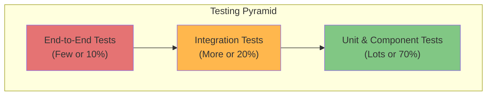

## **Testing Strategy**

This section outlines the comprehensive testing strategy for the "Proficiency" platform. Our approach is designed to ensure the application is reliable, maintainable, and meets all functional and non-functional requirements defined in the PRD. We will adhere to a structured methodology based on the Testing Pyramid to build confidence in our codebase and deliver a high-quality user experience.

### **Group 1: Foundational Strategy, Tooling, and Quality Gates**

This subsection establishes the guiding principles, quality standards, and automation workflows for our testing process.

#### **1. Guiding Philosophy: The Testing Pyramid**

We will adopt the classic Testing Pyramid model to guide the distribution and focus of our tests. This model emphasizes a large base of fast, inexpensive unit tests, a smaller layer of integration tests, and a very selective set of end-to-end tests. This approach maximizes test effectiveness and feedback speed while minimizing maintenance overhead and execution time.



* **Unit & Component Tests (Base):** These form the foundation of our strategy. They will be numerous, fast, and isolated, testing individual functions, methods, and UI components in a controlled environment without external dependencies.
* **Integration Tests (Middle):** This layer will verify the interactions between different parts of the application. For the backend, this means testing API endpoints and their connection to a live test database. For the frontend, this involves testing the composition of multiple components working together.
* **End-to-End (E2E) Tests (Peak):** These are the highest-level tests, simulating real user workflows in a fully deployed environment. They are the most expensive to write and maintain and will be reserved for the most critical user journeys defined in the PRD, such as a student completing an evaluation or an admin creating a new evaluation period.

#### **2. Quality Gates and CI/CD Integration**

To automate and enforce our quality standards, we will integrate testing directly into our CI/CD pipeline (managed by GitHub Actions). The following quality gates **must** be met for a pull request to be merged into the `main` branch:

* **Static Analysis & Linting:** All code **must** pass `ESLint` (frontend) and `Ruff` (backend) checks to enforce code style and catch common errors before any tests are run.
* **Unit Test Execution:** All unit and component tests **must** pass for both the frontend and backend applications.
* **Code Coverage Threshold:** The test suite **must** achieve a minimum of **85% code coverage** for new or modified code within a pull request. This ensures that our test suite grows in lockstep with our codebase. A full project-wide coverage report will also be generated and monitored.
* **Integration Test Execution:** All integration tests **must** pass, ensuring that key application modules interact as expected.

#### **3. Confirmed Tooling by Pyramid Layer**

The following tools have been selected to implement our testing strategy, aligning with our chosen technology stack:

* **Unit & Component Testing:**

  * **Backend:** **Pytest** will be used for its powerful fixture model, clear assertion syntax, and extensive plugin ecosystem.
  * **Frontend:** **Vitest** will be used for its speed, compatibility with our Vite-based environment, and familiar Jest-like API. We will use the **React Testing Library** to query and interact with components in a user-centric way.

* **Integration Testing:**

  * **Backend:** We will continue to use **Pytest**, leveraging its ability to manage external resources like a dedicated test database (**MariaDB / MySQL**) and a test Redis instance.
  * **Frontend:** We will use **Vitest** and **React Testing Library** to test compositions of components that render together to fulfill a specific function.

* **End-to-End (E2E) Testing:**

  * **Framework:** **Cypress** is the chosen framework for its reliability, excellent debugging tools (time-traveling), and ability to simulate user interactions in a real browser.

* **Code Coverage:**

  * **Tool:** We will use `pytest-cov` for the backend and `v8` (built into Vitest) for the frontend to generate coverage reports.
  * **Aggregator:** **Codecov** will be used to aggregate reports from both frontend and backend, providing a unified view of project coverage and tracking changes within pull requests.

***

### **Group 2: Test Organization & Unit/Component Testing**

This section defines the physical organization of our test files and the standardized patterns for writing unit and component tests. The goal is to create a test suite that is easy to navigate, maintain, and contributes to rapid, reliable development feedback.

#### **1. Test File Organization and Naming Convention**

Our test organization strategy is tailored to the conventions of our backend and frontend frameworks, as defined in the `Unified Project Structure`.

* **Backend (`/apps/api`) Structure:**

  * Backend tests will be located in a parallel `tests` directory that mirrors the structure of the `src` directory. This separation of application code and test code is a standard convention in the Python ecosystem and aligns with our agreed-upon monorepo layout.
  * Naming Convention: Files will be named using the `test_` prefix.

  <!-- end list -->

  ```text
  /apps/api/
  ├── src/
  │   └── api/
  │       └── v1/
  │           ├── endpoints/
  │           │   └── evaluations.py
  │           └── services/
  │               └── analysis.py
  └── tests/
      └── api/
          └── v1/
              ├── endpoints/
              │   └── test_evaluations.py  #<-- Tests for evaluations.py
              └── services/
                  └── test_analysis.py     #<-- Tests for analysis.py
  ```

* **Frontend (`/apps/web`) Structure:**

  * We will follow a co-location strategy for our frontend tests. Test files will reside in the same directory as the source code they are validating. This makes tests highly discoverable and tightly couples them with the component they validate, as specified in our project structure.
  * Naming Convention: Files will be named using the `.test.tsx` (for components) or `.test.ts` (for logic) suffix.

  <!-- end list -->

  ```text
  /apps/web/src/
  └── components/
  │   └── ui/
  │       ├── Button/
  │       │   ├── index.tsx
  │       │   └── index.test.tsx  #<-- Tests for Button component
  │       └── DataTable/
  │           ├── index.tsx
  │           └── index.test.tsx  #<-- Tests for DataTable component
  └── lib/
      ├── utils.ts
      └── utils.test.ts           #<-- Tests for utility functions
  ```

#### **2. Backend Unit Test Patterns (Pytest)**

Backend unit tests will focus on validating individual functions, business logic, and services in isolation. External dependencies, such as database connections or external APIs, **must** be mocked to ensure tests are fast and deterministic.

* **Core Principles:**

  * **Isolation:** A test should validate one specific piece of logic.
  * **Mocking:** Use `unittest.mock.patch` or `pytest-mock` to replace external dependencies with predictable test doubles.
  * **Fixtures:** Use `pytest` fixtures to set up reusable test data and states.

* **Code Example (`test_evaluations.py`):**

  ```python
  from unittest.mock import MagicMock
  import pytest
  from src.api.v1.services.evaluations import calculate_completion_rate

  def test_calculate_completion_rate_success():
      """
      GIVEN a list of evaluation objects
      WHEN the completion rate is calculated
      THEN the correct percentage is returned
      """
      # ARRANGE
      mock_evaluations = [
          MagicMock(status='completed'),
          MagicMock(status='completed'),
          MagicMock(status='in_progress'),
          MagicMock(status='pending'),
      ]

      # ACT
      rate = calculate_completion_rate(mock_evaluations)

      # ASSERT
      assert rate == 50.0

  def test_calculate_completion_rate_with_no_evaluations():
      """
      GIVEN an empty list of evaluations
      WHEN the completion rate is calculated
      THEN it should return 0.0 to avoid a ZeroDivisionError
      """
      # ARRANGE
      mock_evaluations = []

      # ACT
      rate = calculate_completion_rate(mock_evaluations)

      # ASSERT
      assert rate == 0.0
  ```

#### **3. Frontend Unit & Component Test Patterns (Vitest)**

Frontend tests at this level are divided into two categories: unit tests for pure logic and component tests for UI rendering and interaction, following the principles of the **React Testing Library**.

* **Core Principles:**

  * **User-Centric:** Tests should interact with components as a user would. Query for elements by their text, label, or role, not by their CSS classes or implementation details. This directly supports the UX Goals in the `front-end-spec.md`.
  * **Accessibility:** Writing tests that query by ARIA roles and labels helps enforce accessible markup from the beginning.
  * **Avoid Implementation Details:** Do not test component state or instance methods directly. Test the rendered output and behavior.

* **Unit Test Example (`utils.test.ts`):**

  ```typescript
  import { describe, it, expect } from "vitest";
  import { formatDate } from "@/lib/utils";

  describe("formatDate", () => {
      it("should format a valid date string into a user-friendly format", () => {
          // ARRANGE
          const dateString = "2025-10-09T10:00:00.000Z";

          // ACT
          const formattedDate = formatDate(dateString);

          // ASSERT
          expect(formattedDate).toBe("October 9, 2025");
      });
  });
  ```

* **Component Test Example (`Button.test.tsx`):**

  ```typescript
  import { describe, it, expect, vi } from "vitest";
  import { render, screen, fireEvent } from "@testing-library/react";
  import { Button } from "@/components/ui/Button";

  describe("Button Component", () => {
      it("should render the button with its children", () => {
          // ARRANGE
          render(<Button>Click Me</Button>);

          // ACT
          const buttonElement = screen.getByRole("button", {
              name: /click me/i,
          });

          // ASSERT
          expect(buttonElement).toBeInTheDocument();
      });

      it("should call the onClick handler when clicked", () => {
          // ARRANGE
          const handleClick = vi.fn(); // Creates a mock function
          render(<Button onClick={handleClick}>Submit</Button>);
          const buttonElement = screen.getByRole("button", {
              name: /submit/i,
          });

          // ACT
          fireEvent.click(buttonElement);

          // ASSERT
          expect(handleClick).toHaveBeenCalledTimes(1);
      });
  });
  ```

***

### **Group 3: Integration Testing**

Integration tests form the crucial middle layer of our testing pyramid. Their purpose is to verify that different parts of the application work together as intended. Unlike unit tests, which operate in complete isolation, integration tests involve real dependencies like a database or compositions of UI components to validate end-to-end logic within a specific application boundary (frontend or backend).

#### **1. Backend Integration Test Patterns (Pytest)**

Backend integration tests will validate the full request/response lifecycle, from the API endpoint through the service layer and down to the database. These tests will run against a **real, isolated test database** to ensure that our application logic and database schema are correctly aligned.

* **Core Principles:**

  * **Live Test Database:** Each test run will connect to a dedicated test database (a separate MariaDB/MySQL instance or schema, managed via Docker Compose). The database will be wiped and re-seeded with fresh, consistent data before each test session to ensure reproducibility.
  * **Test Client:** We will use FastAPI's `TestClient` to make HTTP requests directly to our API endpoints in-memory, without needing a running web server.
  * **Transactional Tests:** Each test case will run within a database transaction that is rolled back at the end of the test. This provides perfect test isolation and prevents data from one test from affecting another.
  * **Focus on Contracts:** These tests validate the "contract" between our application and the database, ensuring that SQL queries are correct and that data is persisted and retrieved as expected.

* **Code Example (`tests/api/v1/endpoints/test_evaluations.py`):**

  ```python
  from fastapi.testclient import TestClient
  from sqlalchemy.orm import Session
  from src.main import app
  from src.repositories.evaluation_repository import EvaluationRepository

  client = TestClient(app)

  def test_submit_evaluation_success(db_session: Session):
      """
      GIVEN valid evaluation submission data
      WHEN a POST request is made to the /evaluations endpoint
      THEN a 201 Created response is returned and the data is saved to the database
      """
      # ARRANGE
      # The db_session fixture provides a clean, transaction-wrapped session
      submission_payload = {
          "studentId": 1,
          "facultyId": 5,
          "formId": 2,
          "answers": [
              {"questionId": 10, "score": 5},
              {"questionId": 11, "qualitative_feedback": "Excellent communicator."}
          ]
      }
      repo = EvaluationRepository(db_session)

      # ACT
      response = client.post("/api/v1/evaluations", json=submission_payload)

      # ASSERT
      assert response.status_code == 201

      # Verify the data was actually committed to the database
      data = response.json()
      saved_evaluation = repo.get_by_id(data["id"])
      assert saved_evaluation is not None
      assert saved_evaluation.student_id == 1
      assert len(saved_evaluation.answers) == 2
  ```

#### **2. Frontend Integration Test Patterns (Vitest)**

Frontend integration tests focus on verifying the interactions between multiple components that are composed together to create a feature. This differs from a component test, which validates a single UI element in isolation. Here, we test user flows within a portion of the application.

* **Core Principles:**

  * **Composition:** Tests should render a "smart" component or a page that contains several "dumb" UI components, simulating a real piece of the interface.
  * **Mocked API:** The API client (`axios` or `fetch`) **must** be mocked at this level. We are testing the frontend's ability to handle API requests and responses correctly, not the backend itself. **MSW (Mock Service Worker)** is the chosen tool for this, allowing us to declare API mocks declaratively.
  * **User-Centric Flows:** Tests should simulate a user completing a task, such as filling out a multi-field form and submitting it, or interacting with a data table that fetches and displays data.

* **Code Example (`apps/web/src/components/features/LoginForm/index.test.tsx`):**

  ```typescript
  import { describe, it, expect } from "vitest";
  import { render, screen, fireEvent, waitFor } from "@testing-library/react";
  import userEvent from "@testing-library/user-event";
  import { rest } from "msw";
  import { setupServer } from "msw/node";
  import { LoginForm } from "@/components/features/LoginForm";

  // 1. Define the mocked API endpoint
  const server = setupServer(
      rest.post("/api/v1/auth/login", (req, res, ctx) => {
          return res(ctx.json({ accessToken: "mock_jwt_token" }));
      })
  );

  // 2. Set up the mock server
  beforeAll(() => server.listen());
  afterEach(() => server.resetHandlers());
  afterAll(() => server.close());

  describe("LoginForm Integration", () => {
      it("should allow a user to fill in the form, submit, and handle a successful login", async () => {
          // ARRANGE
          const user = userEvent.setup();
          render(<LoginForm onSuccess={() => {}} />); // Mock the success callback

          // ACT
          // Simulate user typing into the input components
          await user.type(
              screen.getByLabelText(/email/i),
              "test@example.com"
          );
          await user.type(screen.getByLabelText(/password/i), "password123");

          // Simulate user clicking the button component
          await user.click(screen.getByRole("button", { name: /log in/i }));

          // ASSERT
          // The component should show a loading state while the API call is in flight
          expect(
              screen.getByRole("button", { name: /log in/i })
          ).toBeDisabled();

          // Wait for the success state (e.g., success message, callback called)
          await waitFor(() => {
              // Assert that the component behaved correctly after the mocked API call resolved
              // In a real app, this might be a redirect or a success message.
              // For this test, we just confirm the form is no longer loading.
              expect(
                  screen.getByRole("button", { name: /log in/i })
              ).not.toBeDisabled();
          });
      });
  });
  ```

***

### **Group 4: End-to-End (E2E) & Specialized Testing**

This final layer of the testing pyramid validates the application as a cohesive whole. E2E tests simulate real user workflows in a fully deployed environment, while specialized testing addresses critical non-functional requirements such as performance and security.

#### **1. End-to-End (E2E) Testing Strategy (Cypress)**

E2E tests provide the highest level of confidence that our application meets user requirements. They are, however, the most expensive to write, run, and maintain. Therefore, they will be reserved exclusively for the most critical user journeys defined in the PRD.

* **Core Principles:**

  * **Real Environment:** E2E tests will run against a dedicated, fully deployed `staging` environment that is a production-replica. This includes the live frontend, backend, database, and all other services.
  * **User-Centric Scenarios:** Tests will be written from the perspective of a user persona (Student, Faculty, Admin) attempting to achieve a specific goal.
  * **Programmatic State Management:** To ensure tests are deterministic and independent, we will use programmatic setup and teardown. For example, a test requiring a specific user will create that user via an API call (`cy.request()`) before the test begins and clean it up afterward, rather than relying on existing data in the staging database.
  * **Custom Commands:** Repetitive actions, such as logging in, will be abstracted into custom Cypress commands (e.g., `cy.login('student')`) to keep test files clean and readable.

* **Targeted Critical User Flows:**
  The initial E2E test suite will focus on validating the following core flows from the PRD:

  1. **User Authentication (FR1):** A user can successfully log in and log out.
  2. **Student Evaluation Submission (FR3):** A student can log in, find an open evaluation, complete the form, and successfully submit it.
  3. **Admin Form Creation (FR4):** An administrator can create a new evaluation form with various question types.
  4. **Faculty Dashboard View (FR6):** A faculty member can log in and view their performance dashboard.

* **Code Example (`cypress/e2e/evaluation-submission.cy.ts`):**

  ```typescript
  describe("Student Evaluation Submission Flow", () => {
      beforeEach(() => {
          // Use a custom command to programmatically log in as a student user.
          // This command would internally make an API request to get a session token.
          cy.login("student");
          cy.visit("/dashboard/evaluations"); // Navigate to the evaluations page
      });

      it("should allow a student to find, complete, and submit an evaluation", () => {
          // ARRANGE: Find an open evaluation period for a specific course
          cy.contains("h2", "Open Evaluations").should("be.visible");
          cy.contains("Introduction to Computer Science")
              .parents(".evaluation-card")
              .within(() => {
                  cy.contains("button", "Start Evaluation").click();
              });

          // ACT: Fill out the evaluation form
          cy.url().should("include", "/evaluations/form/");
          cy.contains("h1", "Evaluate: Prof. Ada Lovelace").should(
              "be.visible"
          );

          // Interact with a rating question (assuming 5-star rating component)
          cy.contains("Clarity of Instruction")
              .parent()
              .find('button[aria-label="Rate 5 of 5"]')
              .click();

          // Interact with a qualitative feedback question
          cy.findByLabelText(/qualitative feedback/i).type(
              "The professor was excellent at explaining complex topics."
          );

          // Submit the form
          cy.contains("button", "Submit Evaluation").click();

          // ASSERT: Verify the submission was successful
          cy.contains("h2", "Submission Successful!").should("be.visible");
          cy.contains("p", "Thank you for your feedback.").should(
              "be.visible"
          );

          // Verify that the completed evaluation is now marked as such on the dashboard
          cy.visit("/dashboard/evaluations");
          cy.contains("Introduction to Computer Science")
              .parents(".evaluation-card")
              .within(() => {
                  cy.contains("Evaluation Complete").should("be.visible");
              });
      });
  });
  ```

#### **2. Specialized Testing Strategy**

Beyond functional correctness, we must validate the application's performance, security, and accessibility.

* **Performance Testing:**

  * **Objective:** To ensure the application meets the response time and concurrency requirements defined in the NFRs (NFR4).
  * **Strategy:** After the initial production launch and before major feature releases, we will conduct load tests against the staging environment using a tool like **k6** or **Locust**.
  * **Target Endpoints:** The primary targets for load testing will be high-traffic and resource-intensive API endpoints, specifically:
    * `POST /api/v1/evaluations`: Simulating high-concurrency submissions at the end of an evaluation period.
    * `GET /api/v1/dashboards/faculty/{id}`: Simulating many users accessing dashboard data simultaneously.

* **Security Testing:**

  * **Objective:** To proactively identify and mitigate security vulnerabilities.
  * **Automated Scanning:** We will use **GitHub's Dependabot** to automatically scan our dependencies for known vulnerabilities and create pull requests for updates. Static Application Security Testing (SAST) tools will be integrated into the CI pipeline to scan code for common anti-patterns.
  * **Manual Penetration Testing:** For future major releases or upon securing a specific budget, a manual penetration test conducted by a third-party security firm will be considered to identify more complex vulnerabilities.

* **Accessibility (a11y) Testing:**

  * **Objective:** To ensure the application is usable by people with disabilities, aligning with modern web standards.
  * **Strategy:** We will integrate automated accessibility checks directly into our E2E test suite using the **`cypress-axe`** library. This will run the `axe-core` engine on every page visit within our Cypress tests, automatically failing a test if any critical WCAG (Web Content Accessibility Guidelines) violations are detected. This enforces a baseline of accessibility throughout the development process.

***
