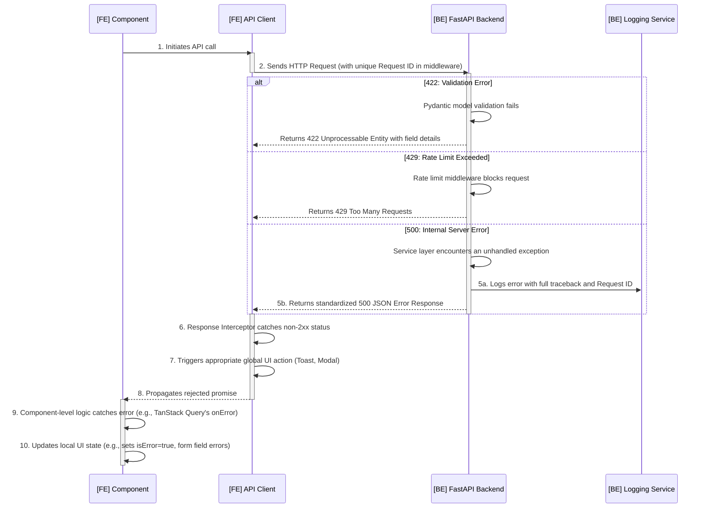

## **Error Handling Strategy**

This section defines the unified, end-to-end error handling strategy for the **Proficiency** platform. The architecture ensures that all errors, whether originating from the client, server, or an external service, are handled gracefully, logged consistently, and result in a clear, predictable experience for the user and a traceable diagnostic path for developers.

### **1. Guiding Principles**

* **Never Leak Internal Details**: Raw exceptions or stack traces must never be exposed to the end-user.
* **Provide User-Centric Feedback**: Users should receive clear, actionable feedback appropriate to the error context (e.g., "This field is required," "This content is out of date").
* **Ensure Traceability**: Every server-side error must be logged with a unique, correlating `requestId` that is also sent to the client, enabling developers to trace a specific user-reported issue directly to its server-side logs.
* **Fail Predictably**: The system's response to any given error class (e.g., validation, authentication, server fault) must be consistent and predictable across the entire application.

### **2. Standardized Error Response Format**

All API error responses **must** conform to the following `ApiError` interface. This is the single source of truth for error communication between the backend and frontend.

```typescript
// packages/shared-types/src/schemas/error.ts
export interface ApiError {
    error: {
        code: string; // e.g., "VALIDATION_ERROR", "UNAUTHENTICATED"
        message: string; // Human-readable summary.
        details?: Record<string, any>; // Field-specific validation messages or other context.
        requestId: string; // Unique ID for log correlation.
    };
}
```

### **3. End-to-End Error Flow**

This diagram illustrates the complete journey of various error types, from backend origination to frontend UI response.



### **4. Backend Error Handling**

The backend employs a layered approach, handling specific errors first and relying on a global handler as a final safety net.

#### **4.1. Structured Logging**

To facilitate efficient debugging and monitoring, all logs are written in a structured JSON format. This includes the `requestId` in every log entry associated with a request.

```python
# apps/api/src/logging_config.py (Conceptual)
# In a real implementation, a library like structlog would be used.
# This ensures logs are machine-readable for services like Datadog or ELK.

logger.error(
    "User creation failed",
    extra={
        "request_id": request_id,
        "user_email": "example@test.com",
        "error_details": str(exc)
    }
)
```

#### **4.2. Specific Exception Handling**

* **HTTP 422: Validation Errors**: FastAPI automatically handles Pydantic validation errors. When incoming request data (body, query params) fails validation, FastAPI intercepts it and returns a detailed `422 Unprocessable Entity` response. **No custom code is needed for this.**

* **HTTP 429: Rate Limiting**: As required by the PRD for AI features, a rate-limiting middleware (e.g., `slowapi`) is applied to sensitive endpoints. When a user exceeds the defined request limit (e.g., 5 requests per 15 minutes), the middleware returns a `429 Too Many Requests` response.

* **Custom Business Logic Exceptions**: For predictable domain errors (e.g., `EvaluationPeriodClosedError`, `UserNotFoundError`), we define custom exception classes. These are caught at the API route level to return specific `4xx` status codes with clear, user-facing error messages.

  ```python
  # apps/api/src/routers/evaluations.py
  from ..services import evaluation_service, exceptions

  @router.post("/")
  def submit_evaluation(evaluation: EvaluationCreate):
      try:
          return evaluation_service.submit(evaluation)
      except exceptions.EvaluationPeriodClosedError as e:
          raise HTTPException(
              status_code=409, # Conflict
              detail={"code": "EVALUATION_PERIOD_CLOSED", "message": str(e)}
          )
  ```

#### **4.3. Global Exception Handler (Safety Net)**

This handler, defined in `apps/api/src/main.py`, catches any unhandled exception. Its sole purpose is to log the catastrophic error and return a generic `500 Internal Server Error` response, preventing any implementation details from leaking.

### **5. Frontend Error Handling**

The frontend uses a combination of a global interceptor for broad categories of errors and component-level logic for specific UI updates.

#### **5.1. Global API Client Interceptor**

The Axios interceptor is the central nervous system for frontend error handling. It is responsible for triggering global, non-contextual UI feedback.

```typescript
// apps/web/src/lib/apiClient.ts (Revised Response Interceptor)
// ... imports

apiClient.interceptors.response.use(
    (response) => response,
    (error: AxiosError<ApiError>) => {
        const response = error.response;
        const errorMessage =
            response?.data?.error?.message || "An unexpected error occurred.";

        if (response) {
            switch (response.status) {
                case 401:
                    toast.error(
                        "Your session has expired. Please log in again."
                    );
                    // Logic to redirect to /login
                    break;
                case 403:
                    toast.error(
                        "You don't have permission to perform this action."
                    );
                    break;
                case 409:
                    // CRITICAL: Aligns with front-end-spec.md for optimistic locking.
                    // This triggers a global modal, not just a toast.
                    // The actual implementation would call a Zustand/Redux store action.
                    showContentOutOfDateModal();
                    break;
                case 429:
                    // CRITICAL: Aligns with PRD rate-limiting requirement.
                    toast.error(
                        "You have made too many requests. Please try again later."
                    );
                    break;
                case 503:
                    toast.error(
                        "A required service is temporarily unavailable. Please try again."
                    );
                    break;
                // 422 Validation errors are NOT handled here. They are passed down
                // to the component level for form-specific feedback.
                default:
                    if (
                        response.status >= 400 &&
                        response.status < 500 &&
                        response.status !== 422
                    ) {
                        toast.error(`Request Error: ${errorMessage}`);
                    } else if (response.status >= 500) {
                        toast.error(`Server Error: ${errorMessage}`);
                    }
                    break;
            }
        } else {
            toast.error("Network error. Please check your connection.");
        }

        return Promise.reject(error);
    }
);
```

#### **5.2. Component-Level Error Handling**

For errors that require specific UI changes within a component (e.g., displaying an error message next to a form field), we use the `onError` callbacks provided by our state management library, **TanStack Query**.

```typescript
// apps/web/src/components/forms/EvaluationForm.tsx

const { mutate, isPending, isError, error } = useMutation({
    mutationFn: (formData: EvaluationData) => api.submitEvaluation(formData),
    onSuccess: () => {
        toast.success("Evaluation submitted successfully!");
    },
    onError: (error: AxiosError<ApiError>) => {
        // This block handles errors specific to this form submission.
        const responseError = error.response?.data?.error;

        // Handle 422 Validation Errors specifically
        if (error.response?.status === 422 && responseError?.details) {
            // 'setError' is a hook from react-hook-form to display
            // error messages next to the corresponding input fields.
            Object.entries(responseError.details).forEach(
                ([field, message]) => {
                    setError(field as keyof EvaluationData, {
                        type: "manual",
                        message: message as string,
                    });
                }
            );
        }
        // Other errors are already displayed by the global interceptor's toast.
    },
});
```

***
