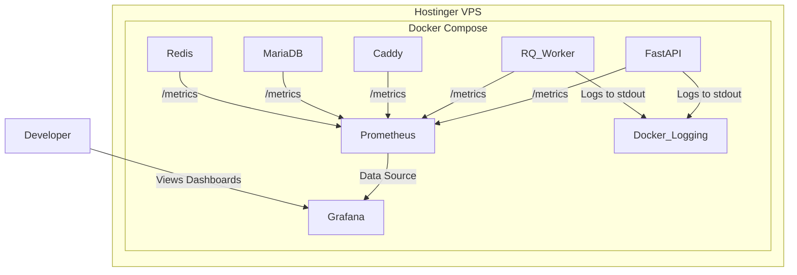

## **Monitoring and Observability**

This section defines the strategy and tooling for monitoring, logging, and observing the **Proficiency** platform, strictly adhering to the project's self-hosted, open-source technology stack. The primary tools are **Prometheus** for metrics collection and **Grafana** for visualization and alerting.

### **1. Strategy & Core Pillars**

Our strategy is to gain comprehensive insight into our Dockerized application running on a single VPS.

* **Metrics (The "How Much"):** We will collect detailed, time-series metrics from every component of our application stack to understand performance, resource utilization, and overall system health.
* **Logs (The "What"):** We will manage and analyze structured logs generated by the application to debug specific errors and understand the sequence of events during a request.
* **Dashboards & Alerting (The "So What"):** We will use a centralized visualization tool to build dashboards for at-a-glance health checks and configure alerts to proactively notify the team of potential issues.

### **2. Tooling & Architecture**

As defined in the `Tech Stack`, our monitoring solution is a self-hosted, containerized stack running alongside the main application.

| Category                  | Technology                | Role & Integration                                                                                                                                                                                                 |
| :------------------------ | :------------------------ | :----------------------------------------------------------------------------------------------------------------------------------------------------------------------------------------------------------------- |
| **Metrics Collection**    | **Prometheus**            | The core of our monitoring system. It will be configured to "scrape" (pull) metrics from various exporters.                                                                                                        |
| **Metrics Visualization** | **Grafana**               | The primary interface for observability. Grafana will connect to Prometheus as a data source to build dashboards and configure alerts.                                                                             |
| **Application Logging**   | **Python Logging Module** | The native library will be configured to output structured (JSON) logs to `stdout` from the FastAPI and RQ worker containers.                                                                                      |
| **Log Management**        | **Docker Logs / `loki`**  | For simplicity, we will initially rely on `docker-compose logs`. For more advanced, centralized log querying, a `loki` service can be added to the Docker Compose stack, which integrates seamlessly with Grafana. |

The monitoring architecture is illustrated below:

### **3. Implementation Details**

#### **3.1. Metrics Collection (Prometheus)**

Prometheus will be configured to scrape metrics from the following endpoints exposed by exporters:

* **FastAPI & RQ Worker:** We will use a client library (e.g., `starlette-prometheus`) to expose an instrumented `/metrics` endpoint. This will provide default metrics like request latency, throughput, and error counts.
* **Caddy:** The Caddy reverse proxy has a built-in `/metrics` endpoint that can be enabled.
* **MariaDB:** A `mysqld-exporter` container will be added to the Docker Compose stack to query MariaDB stats and expose them to Prometheus.
* **Redis:** A `redis-exporter` container will be added to expose Redis metrics.
* **Host System:** A `node-exporter` container will be used to gather host-level metrics like CPU, memory, and disk I/O of the VPS itself.

#### **3.2. Logging**

The native Python `logging` module in the FastAPI application and RQ worker will be configured with a `JSONFormatter`. This ensures that all logs written to standard output are structured, making them easy to parse.

**Critical Log Context:** All log entries **must** include `timestamp`, `level`, `message`, and the `request_id` established in our Error Handling Strategy.

#### **3.3. Dashboards (Grafana)**

We will create a primary **System Health Dashboard** in Grafana. Pre-built community dashboards will be used as a starting point where possible. This dashboard will provide a single-pane-of-glass view of:

* **Host Health:** Overall VPS CPU, Memory, and Disk Usage (from `node-exporter`).
* **Application Performance:** API request rate, error rate (4xx/5xx), and p95/p99 response times (from FastAPI).
* **Database Performance:** MariaDB query throughput, active connections, and slow query count (from `mysqld-exporter`).
* **Cache & Queue Health:** Redis memory usage, hit rate, and RQ queue lengths (from `redis-exporter`).

#### **3.4. Alerting (Grafana)**

Alerts will be configured directly within Grafana using Prometheus as the data source. Alerting rules will be defined to notify a designated team channel (e.g., via a Slack webhook).

| Alert Name                      | Threshold                                                          | Notification | Rationale                                           |
| :------------------------------ | :----------------------------------------------------------------- | :----------- | :-------------------------------------------------- |
| **High API Server Error Rate**  | The rate of 5xx responses exceeds 5% over a 5-minute period.       | PagerDuty    | Indicates a critical backend failure.               |
| **High API Latency**            | The p95 latency for API requests exceeds 2 seconds.                | Slack        | Indicates a performance bottleneck affecting users. |
| **Host Resource Exhaustion**    | VPS CPU utilization is > 80% for 10 minutes OR disk space < 10%. | PagerDuty    | A precursor to system-wide failure.                 |
| **RQ Job Queue Length**         | The primary job queue length grows beyond 100 pending jobs.        | Slack        | Indicates the background worker is falling behind.  |
| **High Rate Limit Occurrences** | The rate of 429 responses exceeds 20 per minute.                   | Slack        | Signals potential abuse or a misconfigured client.  |
