# Proficiency UI/UX Specification

### **Section 1: Introduction**

This document defines the user experience goals, information architecture, user flows, and visual design specifications for the "Proficiency" platform. It serves as the foundation for visual design and frontend development, ensuring a cohesive and user-centered experience.

#### **Overall UX Goals & Principles**

The interface must feel clean, trustworthy, and represent a significant upgrade from typical university systems. **Clarity and intuitive data visualization are the primary goals**.

-   **Target User Personas:** The system is designed for five distinct roles, each with unique needs:
    -   **Students:** The primary evaluators, who need a simple, clear, and efficient way to provide feedback.
    -   **Faculty:** The evaluatees, who need to easily understand their performance data through clear visualizations and access AI-driven suggestions for growth.
    -   **Department Heads:** Serving as both evaluators and managers, they require views of their own performance, individual faculty results, and aggregated department-level data.
    -   **Admins (e.g., CADS, Research Office):** The operational managers who need to create and manage evaluation forms and periods, review flagged submissions, and view results at all levels. Crucially, they are also responsible for the initial and historical data onboarding of the university's academic structure, users, and past evaluation records via bulk import tools.
    -   **Super Admins:** The platform-level administrators responsible for onboarding new universities and managing system-wide user accounts.
-   **Usability Goals**:
    -   **Clarity:** The interface must present complex evaluation data in a simple, digestible manner, avoiding the cluttered, table-heavy feel of traditional portals.
    -   **Efficiency:** Users should be able to complete their core tasks (submitting evaluations, viewing results, managing forms) with minimal friction.
    -   **Trust:** The design must feel professional and secure, encouraging users to trust the data and the insights provided.
-   **Design Principles**:
    1.  **Clarity Over Cleverness:** Prioritize clear communication and intuitive navigation. The user should always know where they are and what they're looking at.
        -   **_Developer Note:_** _This will be achieved by strictly using the components provided and scaffolded by 'shadcn/ui'. A custom, one-off component should only be created if a superior and strict need arises that cannot be met by the existing library. Otherwise, adherence to the 'shadcn/ui' primitives is mandatory to ensure clarity and maintainability._
    2.  **Data-First Dashboards:** Each user's journey begins with a dashboard that immediately surfaces the most relevant information and actions for their role.
        -   **_Developer Note:_** _Dashboards will be powered by 'TanStack Query' for robust data fetching, caching, and background polling. All visualizations, including bar charts, line charts, and performance trends, will be implemented using 'Echarts' and 'echarts-wordcloud' to maintain a single, consistent charting library._
    3.  **Progressive Disclosure:** Show only what's needed for the current task. More advanced options or detailed data can be revealed upon user request.
        -   **_Developer Note:_** _Implement this using 'shadcn/ui' components like 'Accordion', 'Dialog', and 'Sheet' to keep the initial UI clean and reveal complexity only when the user explicitly asks for it._
    4.  **Enforced Consistency:** Programmatically enforce a consistent visual language, component library, and interaction patterns (like sidebar navigation and card-based layouts) throughout the application to ensure a predictable user experience.
        -   **_Developer Note:_** _Consistency will be enforced. All styling will use Tailwind CSS utility classes. All core UI elements (buttons, forms, cards) will be derived from 'shadcn/ui' primitives. The **Monorepo** structure should be leveraged to create a shared UI package for any custom-built, reusable components._

### **Changelog**

| Date       | Version | Description                                                                                                                                                                                                                                         | Author           |
| :--------- | :------ | :-------------------------------------------------------------------------------------------------------------------------------------------------------------------------------------------------------------------------------------------------- | :--------------- |
| 2025-10-09 | 3.8     | Enhanced the 'Testing Strategy' in the Accessibility section to include the integration of `cypress-axe` for automated WCAG validation within the E2E test suite, as per the architect's handoff.                                                   | Sally, UX Expert |
| 2025-10-08 | 3.7     | **Final data model alignment pass.** Refined the `CommentViewerDialog` component specification to source its anonymity threshold from the new `UniversitySetting` data model, ensuring full architectural consistency.                              | Sally, UX Expert |
| 2025-10-08 | 3.6     | **Refined UI/UX spec to align with the final, approved data models.** Updated the Job Monitor flow to include a diagnostic view for failed jobs and expanded the Notification Panel component spec to align with the new `Notification` data model. | Sally, UX Expert |
| 2025-10-08 | 3.5     | Added UI/UX for handling the `413 Payload Too Large` error in the Report Center, guiding users to refine overly broad report requests.                                                                                                              | Sally, UX Expert |
| 2025-10-08 | 3.4     | Added UI/UX pattern for handling `409 Conflict` errors to gracefully manage concurrent administrative edits, ensuring a clear user recovery path.                                                                                                   | Sally, UX Expert |
| 2025-10-07 | 3.3     | Added UI/UX specifications for WebSocket disconnection and reconnection handling in the Job Monitor flow to ensure a resilient user experience.                                                                                                     | Sally, UX Expert |
| 2025-10-07 | 3.2     | Added error handling UI/UX for expired account verification links to the onboarding flow, ensuring a clear recovery path for the user.                                                                                                              | Sally, UX Expert |
| 2025-10-07 | 3.1     | Added error handling for a `503 Service Unavailable` state to the **'Faculty - Generate AI Suggestions'** flow, ensuring a clear user experience when the AI service's circuit breaker is open.                                                     | Sally, UX Expert |
| 2025-10-07 | 3.0     | Aligned `CommentViewerDialog` component dependency with the new dedicated `Comment Data Service` as per architect's request.                                                                                                                        | Sally, UX Expert |
| 2025-10-07 | 2.9     | Added 'Super Admin - Tenant User Management' user flow. Updated Notification Panel component spec to include real-time indicators via WebSocket.                                                                                                    | Sally, UX Expert |
| 2025-10-07 | 2.8     | Updated the **'Faculty - Generate AI Suggestions'** flow to be fully asynchronous, leveraging the Job Monitor WebSocket for real-time progress updates. Simplified the report export to a direct PDF download.                                      | Sally, UX Expert |
| 2025-10-07 | 2.7     | Refined Dashboard and Report Center user flows to specify component-level data refetching for filters and a unified asynchronous process for all report generation, respectively.                                                                   | Sally, UX Expert |
| 2025-10-07 | 2.6     | Enhanced the **'Flagged Evaluation Review'** user flow. The specification now requires the UI to dynamically highlight the exact text that triggered the flag, using API-provided data, to improve Admin clarity.                                   | Sally, UX Expert |
| 2025-10-07 | 2.5     | Refined **Admin - Background Job Monitoring** flow to distinguish between success and partial failure statuses. Added new metadata display for import job details (Total Rows, Rows Processed, Rows Failed).                                        | Sally, UX Expert |
| 2025-10-07 | 2.4     | Added flow for handling deletion of in-use resources. Updated Emergency Cancellation flow with a "Cancelled (Restorable)" state and added a new flow for the restore action.                                                                        | Sally, UX Expert |
| 2025-10-07 | 2.3     | Added concurrency error handling (409 Conflict) to the Super Admin University Onboarding flow as per architect's request.                                                                                                                           | Sally, UX Expert |
| 2025-10-06 | 2.2     | Updated the "Super Admin - University Onboarding" user flow to include a two-step approval process, adding a confirmation modal to display file validation summaries before final action.                                                           | Sally, UX Expert |
| 2025-10-06 | 2.1     | Integrated UI/UX for new admin features (Duplicate Period, Proactive Notifications) from PRD v6.3. Added Notification Center to IA and defined NotificationItem component.                                                                          | Sally, UX Expert |
| 2025-10-02 | 2.0     | Finalized all user flows and completed all design sections (Branding, Accessibility, Responsiveness, Animation). Added alignment notes for PM. Spec is now ready for architectural handoff.                                                         | Sally, UX Expert |
| 2025-10-01 | 1.7     | **Restored missing flow diagrams and technical notes from previous versions to create a single, complete master specification.**                                                                                                                    | Sally, UX Expert |
| 2025-10-01 | 1.6     | Finalized and integrated the "Managerial & Administrative Review" user flow with all elicitation refinements. Added tiered dashboard layouts and the hybrid "drill-down" approach for viewing comments.                                             | Sally, UX Expert |
| 2025-10-01 | 1.5     | Consolidated and restored all missing flow diagrams and technical notes from previous versions to create a complete, unified specification.                                                                                                         | Sally, UX Expert |
| 2025-10-01 | 1.4     | Finalized all user flows and integrated elicitation refinements.                                                                                                                                                                                    | Sally, UX Expert |
| 2025-09-30 | 1.3     | Added refined Admin and Super Admin user flows.                                                                                                                                                                                                     | Sally, UX Expert |
| 2025-09-30 | 1.2     | Refined Sections 1 & 2 to align with new PRD.                                                                                                                                                                                                       | Sally, UX Expert |
| 2025-09-28 | 1.1     | Expanded introduction with developer-focused notes.                                                                                                                                                                                                 | Sally, UX Expert |
| 2025-09-28 | 1.0     | Initial draft of the UI/UX Specification.                                                                                                                                                                                                           | Sally, UX Expert |

---

### **Section 2: Information Architecture (IA)**

This section defines the structural backbone of the "Proficiency" application. It outlines how information is organized and presented to users, ensuring they can navigate the system logically and intuitively.

#### **Site Map / Screen Inventory**

This diagram shows the primary screens and modules for both public visitors and authenticated users, broken down by role.

```mermaid
graph TD
    subgraph Public
        LP(Landing Page) --> A[Login Page];
        LP --> B[University Registration Page];
    end

    subgraph Authenticated
        C(User Role Router);

        subgraph Student
            S_Dash[Dashboard] --> S_Eval[Evaluation Form];
            S_Dash --> S_Hist[Evaluation History];
            S_Dash --> S_Profile[Profile];
        end

        subgraph Faculty
            F_Dash[Dashboard] --> F_Insights[Performance Analysis];
            F_Dash --> F_Trends[Performance Trends];
            F_Dash --> F_AI[AI Assistant];
            F_Dash --> F_Reports[Report Center];
            F_Dash --> F_Profile[Profile];
        end

        subgraph DeptHead
            DH_Page[Dashboard Page]
            DH_Page --> DH_Tabs{Tabs};
            DH_Tabs --> DH_Overview[Overview];
            DH_Tabs --> DH_Explore[Explore Data];
            DH_Page --> DH_AI[AI Assistant];
            DH_Page --> DH_Reports[Report Center];
            DH_Page --> DH_Eval[Conduct Faculty Evaluations];
            DH_Page --> DH_Hist[Evaluation History];
            DH_Page --> DH_Profile[Profile];
        end

        subgraph Admin
            Adm_Page[Dashboard Page]
            Adm_Page --> Adm_Tabs{Tabs};
            Adm_Tabs --> Adm_Overview[Overview];
            Adm_Tabs --> Adm_Explore[Explore Data];
            Adm_Page --> Adm_Notif[Notification Panel];
            Adm_Page --> Adm_Reports[Report Center];
            Adm_Page --> Adm_Forms[Form & Period Management];
            Adm_Page --> Adm_Flags[Flagged Evaluations];
            Adm_Page --> Adm_Acad[Academic Structure Mgmt];
            Adm_Acad --> Adm_ManualCRUD[Manual CRUD];
            Adm_Acad --> Adm_BulkImport[Bulk Import Feature];
            Adm_Page --> Adm_ImportHist[Import Job History];
            Adm_Page --> Adm_Profile[Profile];
        end

        subgraph SuperAdmin
            SA_Dash[Dashboard] --> SA_Uni[University Management];
            SA_Dash --> SA_Users[User Management];
            SA_Dash --> SA_Profile[Profile];
        end
    end

    A --> C;
    B --> A;
    C -- Student --> S_Dash;
    C -- Faculty --> F_Dash;
    C -- "Dept. Head" --> DH_Page;
    C -- Admin --> Adm_Page;
    C -- "Super Admin" --> SA_Dash;
```

#### **Navigation Structure**

-   **Public Entry Point:** A simple Landing Page will serve as the initial entry point, introducing the system and providing clear calls-to-action to either Login or begin the University Registration process.
-   **Primary Navigation:** After authentication, a responsive, collapsible sidebar will be the main navigation method. It will contain top-level links to the main pages available to the logged-in user's role.
-   **Tabbed Dashboards:** For Department Heads and Admins, the main Dashboard page is organized into two primary tabs: "**Dashboard Overview**" and "**Explore Data**". The Overview provides a simple, zero-configuration summary of the most critical information. The Explore Data tab contains the powerful mode-switching and filtering tools for deep-dive analysis.
-   **Student Experience:** The Student Dashboard is streamlined to focus on their primary task: it will display pending evaluations in a card-based layout, clearly showing which faculty and subject needs their feedback.

---

### **Section 3: User Flows**

This section maps out the step-by-step paths users will take to complete critical tasks, ensuring a seamless and intuitive experience.

#### **Flow: Student - Evaluation Submission**

-   **User Goal:** To provide complete and thoughtful feedback for a specific faculty member during an active evaluation period.
-   **Entry Points:** The user is on their Student Dashboard and sees a list of available evaluations.
-   **Success Criteria:** The user's ratings and open-ended answers are successfully saved to the database, and the evaluation is removed from their list of pending tasks.
-   **Variation for Department Heads:** The evaluation submission process for Department Heads is identical to the student flow with two key differences:
    1.  **Entry Point:** The Department Head's dashboard will display a list of all faculty members assigned to their department.
    2.  **Form Assignment:** The system may present a different evaluation form template if one has been specifically designated for Department Head evaluations.

**Flow Diagram:**

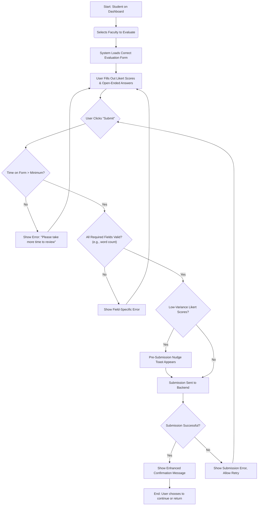

**Expanded Technical & QA Notes:**

-   **Timer Communication & Function:**
    -   **Dev Note:** A small, non-intrusive text label should be present near the submit button explaining its purpose: e.g., "A brief review period is required to encourage thoughtful feedback.". The "Submit" button must be disabled until the timer expires. On hover/focus of the disabled button, a tooltip should clearly communicate the remaining time.
    -   **QA Test Case:** Verify the button is disabled, the tooltip is accurate, and the button becomes enabled precisely when the timer hits zero.
-   **Form Validation:**
    -   **Dev Note:** All client-side validation (e.g., word count) will be managed by `React Hook Form` and `Zod`. Error messages must appear in real-time. The submit button should be disabled as long as the form state is invalid.
-   **Data Preservation on Failure:**
    -   **Dev Note:** The entire form state must be preserved if the submission API call fails. Use `TanStack Query`'s mutation cache for this. The UI must provide a clear error "toast" and revert the submit button to a "Retry Submission" state.
-   **Enhanced Confirmation & Workflow:**
    -   **Dev Note:** The confirmation message after success should be dynamic, indicating progress (e.g., "Success\! You have 4 evaluations left to complete.") and providing two clear actions: `[Start Next Evaluation]` and `[Return to Dashboard]`.

#### **Flow: Faculty - Generate AI Suggestions**

-   **User Goal:** To generate, view, and save actionable suggestions for professional development based on their processed evaluation data.
-   **Entry Points:** The user clicks on the "AI Assistant" link in the main sidebar navigation.
-   **Success Criteria:** An AI-generated report is successfully created and becomes available for download. The user can view the real-time progress of the generation.
-   **Error Handling:** If the AI service is temporarily unavailable, the user is shown a clear, non-technical message and can retry the action later.

**Technical Sequence Diagram:**

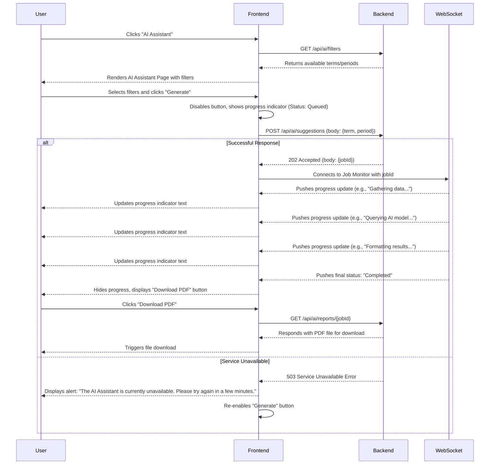

#### **Flow: Admin - Form & Period Management**

-   **User Goal:** To create a new evaluation form template, define its structure, and assign it to a specific academic period to launch an evaluation. This includes the ability to efficiently duplicate existing period configurations.
-   **Entry Points:** The Admin navigates to the "Form & Period Management" page from the sidebar.
-   **Success Criteria:** A new, active evaluation period is created with a valid form template (or templates) assigned to it, and the form becomes available to the designated evaluators at the specified start time.

**Flow Diagram:**

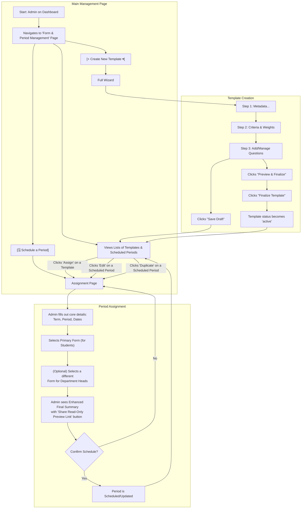

#### **Flow: Admin - Responding to Proactive Notification**

-   **User Goal:** To see a system-generated notification about a recently concluded evaluation period and use it to quickly begin scheduling the next one.
-   **Entry Points:** A new notification appears in the Notification Panel on the Admin Dashboard.
-   **Success Criteria:** The Admin successfully navigates from the notification to the pre-filled "Period Assignment" screen, ready to schedule the next logical period.

**Flow Diagram:**

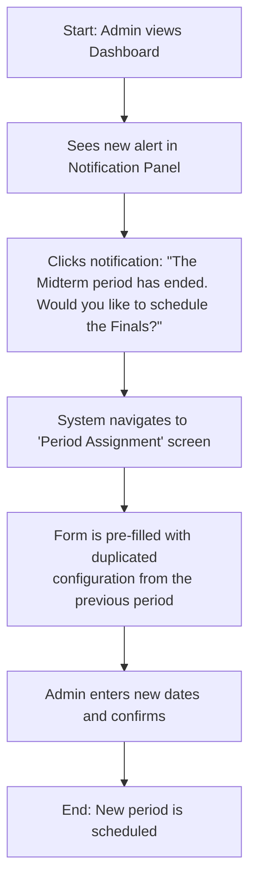

#### **Flow: Historical Data Onboarding**

-   **User Goal:** To confidently and efficiently bulk import historical data, with clear guidance, robust safety checks, and a transparent monitoring process.
-   **Entry Points:** The Admin clicks the "Data Import" link in the main sidebar.
-   **Success Criteria:** A validated data file is successfully processed, the database is updated correctly, and the Admin has a clear audit trail of the entire operation.

**Flow Diagram:**

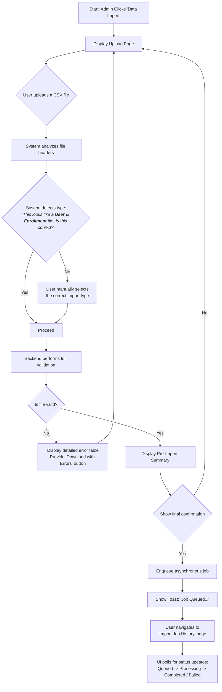

#### **Flow: Flagged Evaluation Review (Restored)**

-   **User Goal:** To efficiently review, process, and resolve evaluations flagged by the system for data quality issues, ensuring the integrity of the final aggregated results.
-   **Entry Points:** The Admin clicks on "Flagged Evaluations" in the main sidebar navigation or clicks a dashboard notification about newly flagged items.
-   **Success Criteria:** A flagged evaluation is successfully resolved with a status of 'Approved', 'Archived', or 'Resubmission Requested'. The item is moved from the 'Pending' queue to the 'Resolved' history, and any necessary notifications are triggered.

**Flow Diagram:**

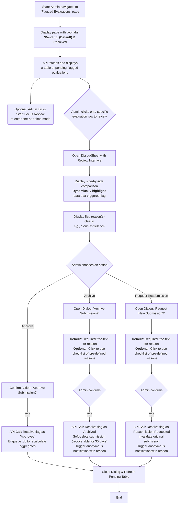

**Technical & Developer Notes:**

-   **UI Components & Highlighting:** The page will use `shadcn/ui` `<Tabs>`, `<Table>`, and `<Dialog>`. The review interface **must dynamically highlight** the specific text that triggered the flag. The API will provide a `highlights` array in the `flag_details` object containing the specific character indexes needed for the UI to apply a visual highlight (e.g., a yellow background) to the problematic text.
-   **Optional Focus Mode:** The "Start Focus Review" button will switch the UI to a simplified, one-at-a-time review process to help Admins who prefer a sequential workflow.
-   **Soft Deletion:** The "Archive" action functions as a soft delete, mitigating the risk of accidental permanent data loss.
-   **Structured Feedback:** The dialog for "Archive" and "Request Resubmission" will default to a free-text field for the reason but provide an optional checklist of constructive, pre-defined reasons to ensure consistency and helpfulness in the anonymous notification sent to the student.

#### **Flow: Super Admin - University Onboarding (Restored)**

-   **User Goal:** To securely and efficiently review, approve or reject, and finalize the onboarding of a new university tenant onto the platform.
-   **Entry Points:** The Super Admin logs in and navigates to the "University Management" page from their dashboard.
-   **Success Criteria:** A pending request is either approved (creating a new university record, an initial Admin account, and auto-importing structural data) or rejected. The queue is updated.

**Flow Diagram:**

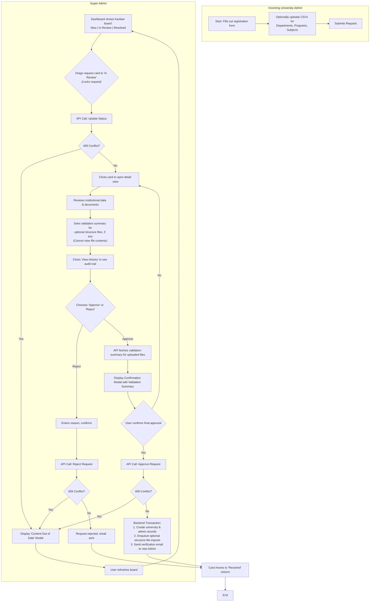

**Technical & Developer Notes:**

-   **Security & Privacy:** The flow is designed to prevent Super Admins from accessing sensitive university PII. They only see a validation summary for the optional academic structure files, not the contents.
-   **UI/UX:** A Kanban board provides an intuitive visual for managing the queue. A locking mechanism prevents concurrent reviews. An accessible audit trail ensures accountability.
-   **Confirmation Modal UI Specification:** When a Super Admin approves a request with uploaded files, a final confirmation modal (`shadcn/ui` `<AlertDialog>`) must appear. It must have the title "Confirm University Approval," display a summary of the file validation status (e.g., `"departments.csv: Valid"`, `"subjects.csv: 2 Errors Found"`), and contain a final confirmation button labeled "Approve and Ingest Data."
-   **Concurrency Error Handling:** Any action that modifies the request state (moving to "In Review," approving, or rejecting) **must** handle a `409 Conflict` response from the API. Upon receiving a `409`, the UI must display the global "Content Out of Date" modal, forcing the user to refresh their view to ensure they are acting on the latest information.
-   **Automation:** Upon approval, the backend automatically enqueues the pre-validated structural data for import, streamlining setup for the new University Admin and creating a positive first impression.
-   **Recovery:** The Super Admin UI will have a mechanism to resend the verification email to a new Admin in case of initial email delivery failure.

#### **Flow: New User - Account Verification**

-   **User Goal:** To verify their new account via an email link and log into the platform for the first time.
-   **Entry Points:** The user clicks the verification link in the email sent after the Super Admin approved their university's onboarding.
-   **Success Criteria:** The user's account is marked as verified, they are logged in, and they are redirected to their role-specific Dashboard.

**Flow Diagram:**

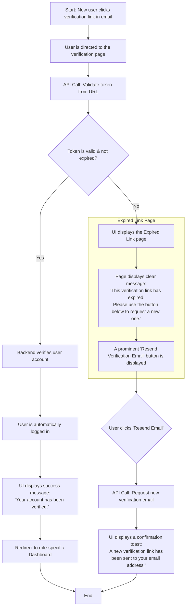

**Technical & Developer Notes:**

-   **Clear User Experience:** The page for an expired or invalid token **must not** be a generic error page. It is a key part of the onboarding user flow and should be styled consistently with the rest of the application, adhering to the "Clarity Over Cleverness" design principle.
-   **UI Components:** The page should use a `shadcn/ui` `<Card>` to present the message and the `<Button>` for the resend action.
-   **API Endpoint:** This flow relies on an API endpoint (e.g., `POST /api/auth/resend-verification`) that allows an unauthenticated user to request a new verification email, likely identified by the expired token or an email address input field.

#### **Flow: Generating and Downloading a Formal Report (Restored)**

-   **User Goal:** To generate and download a standardized, official report of evaluation results for a specific period, suitable for archiving or formal meetings.
-   **Entry Points:** The user (Admin, Department Head, or Faculty) clicks the "Report Center" link in the main sidebar navigation.
-   **Success Criteria:** The user successfully downloads a professionally formatted PDF or a structured CSV/Excel file based on their selected parameters via a "Report Center" system.
-   **Error Handling:** If the report request is too large, the user is clearly informed and guided to refine their request.

**Flow Diagram:**

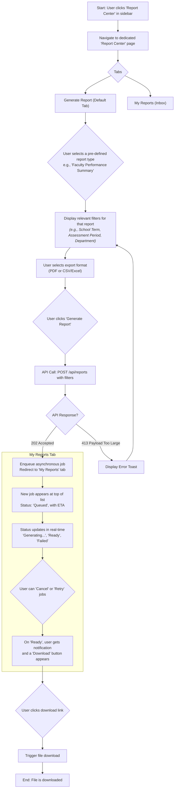

**Technical & Developer Notes:**

-   **Distinction is Key:** The "Generate Report" tab is for creating **standardized reports**. It is functionally separate from the "Export this View" feature on the **Explore Data** tab, which is for ad-hoc data snapshots.
-   **Asynchronous Process:** To provide a consistent and non-blocking user experience, all report generation is managed through the asynchronous "My Reports" inbox system. This allows users to continue working while large reports are generated in the background, providing them with clear status updates, ETAs, and control.
-   **Request Size Error Handling:** When the frontend receives a `413 Payload Too Large` error, it **must** display a clear and helpful error message (e.g., using `shadcn/ui` `<Toast>`). The message should inform the user that their request is too large and instruct them to apply more specific filters (e.g., "**This report is too large to generate. Please select a smaller date range or a specific department.**"). After the error is displayed, the UI state should return to allow the user to modify their filters, and the "Generate Report" button must be re-enabled.
-   **Backend Libraries:** The backend will use **WeasyPrint** for PDF generation and **pandas** for CSV/Excel file creation.

#### **Flow: Managerial & Administrative Review**

-   **User Goal:** To efficiently move from a high-level overview of institutional or departmental performance to specific, actionable insights about an individual faculty member.
-   **Entry Points:** The user (Department Head or Admin) logs in and lands on their main dashboard's "Dashboard Overview" tab.
-   **Success Criteria:** The user can successfully navigate between different data "modes," apply filters, and drill down into the data to gain the specific insights they need.

**Flow Diagram:**

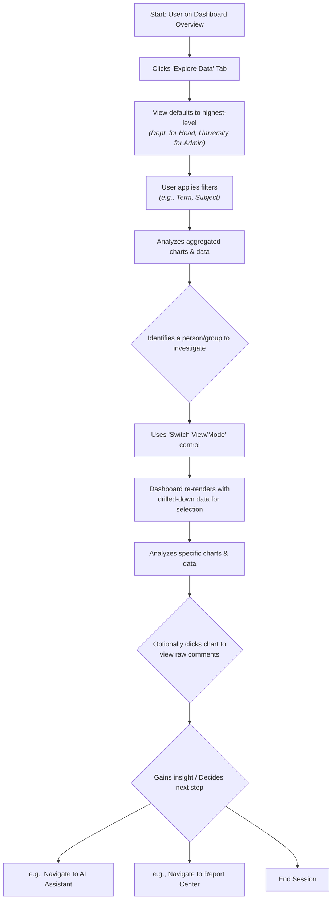

**Technical & Developer Notes:**

-   **Efficient Data Fetching**: To ensure a fast and responsive user experience on the "Explore Data" tab, filter changes should not trigger a full dashboard reload. Instead, filter adjustments will trigger targeted `TanStack Query` refetches only for the components affected by that specific filter. For example, changing the "Subject" filter should only refetch data for the word cloud and sentiment charts, leaving other components with their existing cached data.

#### **Final & Approved Specification: Student Resubmitting a Flagged Evaluation**

-   **User Goal:** A student who has had an evaluation flagged needs to clearly understand the specific reason, correct their original submission within a defined grace period, and successfully resubmit a higher-quality evaluation.
-   **Entry Points:** An in-app notification and a "Resubmission Required" task on the Student Dashboard.
-   **Success Criteria:** The student successfully submits a new evaluation within their grace period. The original flagged submission is archived, the new submission enters the processing queue, and the task is cleared from the student's pending list.

**Final Flow Diagram:**

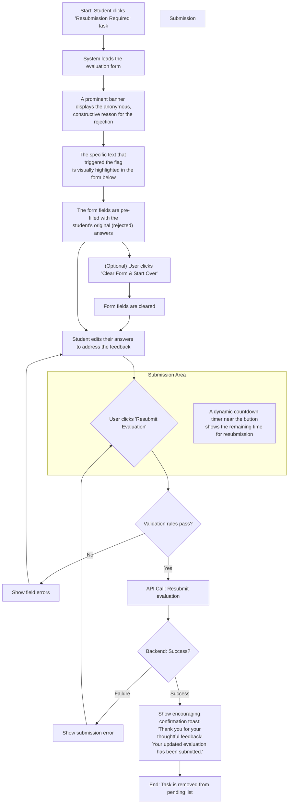

**Final Technical & Developer Notes:**

-   **"One Resubmission" Rule:** The backend must enforce a rule that an evaluation can only be sent back for resubmission once.
-   **Highlighting Flagged Content:** The API must provide `highlights` metadata (question-level identifiers plus character ranges and sanitized snippets). The student resubmission form and admin review dialog should map each entry to the corresponding rich-text component using `question_id` and render multiple spans per answer when present.
-   **Resubmission Grace Period & Deadline Display:** The backend must create a grace period for the resubmission. The frontend **must** display this deadline as a separate, persistent, and dynamic countdown timer near the submit button to maintain constant visibility. The main banner is for the rejection reason only.
-   **"Clear Form" Option:** A secondary button, "Clear Form and Start Over," should be provided. On click, it should reset the form state using the form management library (`React Hook Form`).
-   **Confirmation Tone:** The success confirmation message after resubmission should use the specified encouraging copy to acknowledge the user's extra effort.

#### **Final Specification: Self-Registration via Role-Specific University Code**

-   **User Goal:** A prospective user with a valid, role-specific registration link/code needs to create an account, provided the code is valid for their intended role and has not exceeded its usage limit.
-   **Entry Points:** The user navigates to the registration page, likely via a universal link distributed through various university channels.
-   **Success Criteria:** The user successfully creates an account with the correct role, linked to the correct university. The usage count for the specific registration code is incremented. The user is logged in and redirected to their dashboard.

**Final Flow Diagram:**

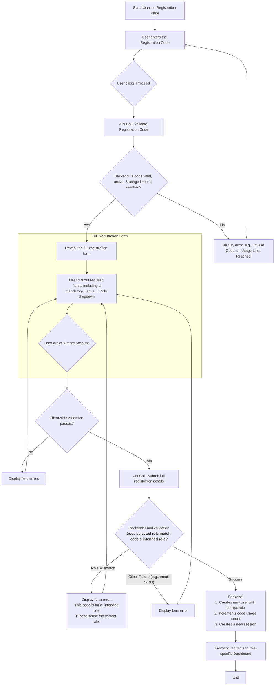

**Corresponding Admin Feature (Refined):**
The Admin's "User Management" page must now include a section for **Registration Code Management**. This interface must allow an Admin to:

1.  **View** a list of all active registration codes for their university.
2.  See the **intended role** (e.g., 'Student', 'Faculty') for each code.
3.  See the usage (`Current Uses` / `Max Uses`) for each code.
4.  **Create** new codes for a specific role with a specific `Max Uses`.
5.  **Regenerate** a new code, which would invalidate the old one.

**Note on Leaked Code Risk:** As per your feedback, we will defer the email domain restriction. For V1, the primary mitigations against a leaked code will be the **`Max Uses` limit** and the Admin's ability to **regenerate the code at any time**.

#### **Final Refined Flow: Admin - Emergency Period Cancellation**

-   **User Goal:** To safely and asynchronously cancel an active evaluation period to correct a critical error, with clear communication and protections against unintended consequences.
-   **Entry Points:** The Admin is on the "Form & Period Management" page, viewing the list of active evaluation periods.
-   **Success Criteria:**
    -   The system asynchronously marks the period and its submissions as 'cancelled' and 'invalid'.
    -   A delayed, automated notification with a clear, pre-defined reason is sent to all affected evaluators.
    -   The action is logged with detailed context in the system audit trail.
    -   The Admin has a brief, final window to undo the action before it becomes permanent.

**Final Flow Diagram:**

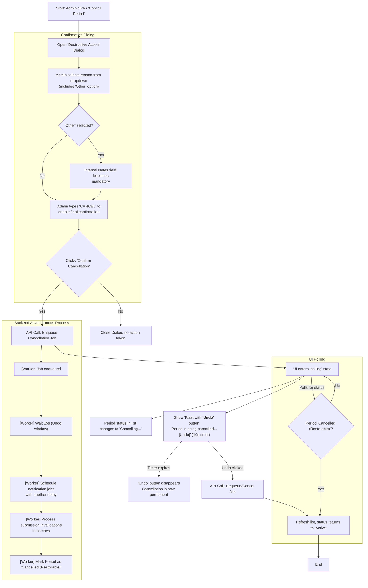

**Final Technical & Developer Notes:**

-   **Asynchronous Process:** The entire cancellation is an asynchronous background job. The Admin's initial click on "Confirm Cancellation" should only make a quick API call that enqueues the job and returns an immediate response. The UI then polls a status endpoint to know when the job is complete, updating the period's status from `Cancelling...` to `Cancelled (Restorable)`.
-   **Notification Delay & Undo:** To prevent the notification race condition, the background job must first wait \~15 seconds before scheduling the notification tasks. If the Admin clicks "Undo" within the 10-second UI window, the API call must find and **cancel the job from the queue before it begins processing**.
-   **Transitional State & Locking:** During the entire process (from the moment the job is enqueued until it is complete), the period must be in a transitional `Cancelling...` state. During this time, the backend **must prevent** the creation of a new, overlapping evaluation period to avoid the data conflict risk.
-   **'Other' Reason Logic:** The dropdown for reasons will include an "Other (requires internal note)" option. If selected, the UI will make the "Internal Admin Notes" text area mandatory. The public notification sent to students will be a safe, generic message, while the specific notes are saved only to the audit log.
-   **Performance:** The background job must be designed to process the invalidation of submissions and the enqueuing of notifications in manageable batches to avoid overwhelming the database or the notification queue, especially for large universities.

#### **Flow: Admin - Background Job Monitoring**

-   **User Goal:** To monitor the status of all critical background jobs (imports, cancellations, report generation), diagnose failures, and have the ability to gracefully cancel a running job or manually intervene if a job becomes stuck.
-   **Entry Points:** The Admin clicks on a newly named "Job Monitor" link in the main sidebar navigation.
-   **Success Criteria:** An Admin can view the real-time status and progress of a background job. If a job fails, the Admin can immediately view diagnostic logs and download a detailed error report. If a job is taking too long, the Admin can request cancellation and see the system respond to the request.

**Flow Diagram:**

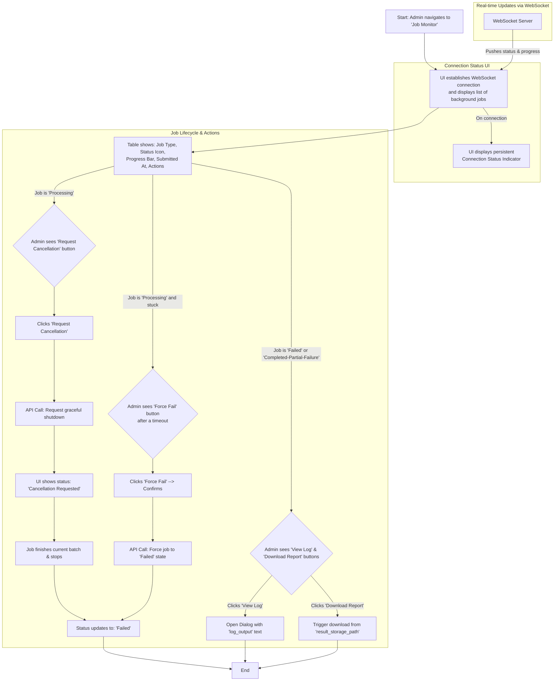

**Technical & Developer Notes:**

-   **Real-time Progress:** The UI **must** use a WebSocket connection to receive real-time progress updates (e.g., `progress`, `rows_processed`) and status changes for all active jobs. This replaces the previous polling mechanism. A progress bar in the table should reflect this data.
-   **Connection Resiliency & UX**:
    -   **Visual Status Indicator**: The Job Monitor UI **must** always display a subtle, persistent indicator of the WebSocket connection status (e.g., a small dot in the page header: green for 'connected', yellow for 'reconnecting', red for 'disconnected').
    -   **Disconnection UX**: When the connection is lost, the UI **must** display a clear, non-intrusive message (e.g., a `shadcn/ui` `<Alert>` stating "Connection lost, attempting to reconnect..."). The progress bar and status for active jobs should remain in their last known state but can be overlaid with a subtle pattern (e.g., a semi-transparent diagonal stripe) to indicate the data is potentially stale. The "Force Fail" and "Request Cancellation" buttons **must** be disabled during the disconnected state.
    -   **Reconnection UX**: Upon successful reconnection, the alert message **must** be removed, the connection indicator should turn green, and the UI **must** trigger a full data refresh (`TanStack Query` invalidation) to show the current, accurate status of all jobs.
-   **Cooperative Cancellation:** For jobs in a `processing` state, a "Request Cancellation" button will be available. This action sends a signal for the job to stop gracefully after its current task. The UI **must** display a transitional `cancellation_requested` status while waiting for the job to confirm stoppage.
-   **Enhanced Error Reporting:** For any job with a status of `failed` or `completed_partial_failure`, the UI will provide two distinct actions:
    -   **`View Log`**: This button will open a modal (`shadcn/ui` `<Dialog>`) that displays the raw, pre-formatted text from the `BackgroundTask.log_output` field. This provides immediate, on-screen diagnostics for quick debugging.
    -   **`Download Error Report`**: This button will initiate a file download using the path stored in the `BackgroundTask.result_storage_path` field, providing a more comprehensive report (e.g., a CSV of failed rows).
-   **Centralized Monitor:** This page replaces the "Import Job History" page and must be the single source of truth for monitoring all `RQ` jobs.
-   **Visual Status Indicators:** The "Status" column in the main table must use clear visual icons to differentiate states:
    -   `Completed-Success`: A green checkmark icon.
    -   `Completed-Partial-Failure`: A yellow warning/caution icon.
    -   `Failed`: A red error/cross icon.
-   **Backend Requirements:** The backend must support WebSocket connections for job updates. It must also expose endpoints for "Request Cancellation" and "Force Fail" actions. All critical background jobs must listen for a cancellation signal to allow for a graceful shutdown.

#### **Flow: Admin - Handling In-Use Resources**

-   **User Goal:** To prevent an Admin from accidentally deleting a resource (like a form template) that is actively being used by a scheduled or ongoing evaluation period.
-   **Entry Points:** The Admin is on the "Form & Period Management" page and clicks the "Delete" action for a form template.
-   **Success Criteria:** The deletion action is blocked by the system, and the Admin is presented with a clear, informative error message explaining why the action cannot be completed.

**Flow Diagram:**

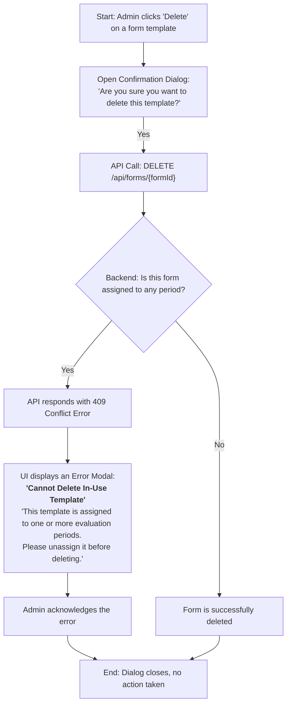

**Technical & Developer Notes:**

-   **UI Component:** The error notification must be a modal dialog (`shadcn/ui` `<AlertDialog>`) to ensure the user actively acknowledges the block. A simple toast notification is not sufficient for this type of destructive action prevention.
-   **Backend Logic:** The backend must perform a referential integrity check before processing the deletion. If the resource is in use, it must return a `409 Conflict` status code with a clear error message in the response body.

#### **Flow: Admin - Restore Cancelled Period**

-   **User Goal:** To safely restore an evaluation period that was recently cancelled, allowing it to resume without data loss.
-   **Entry Points:** The Admin is on the "Form & Period Management" page and sees a period with the status "Cancelled (Restorable)".
-   **Success Criteria:** The period and its associated submissions are restored to their previous "Active" state. The system is ready to accept new submissions for the remainder of the original period duration.

**Flow Diagram:**

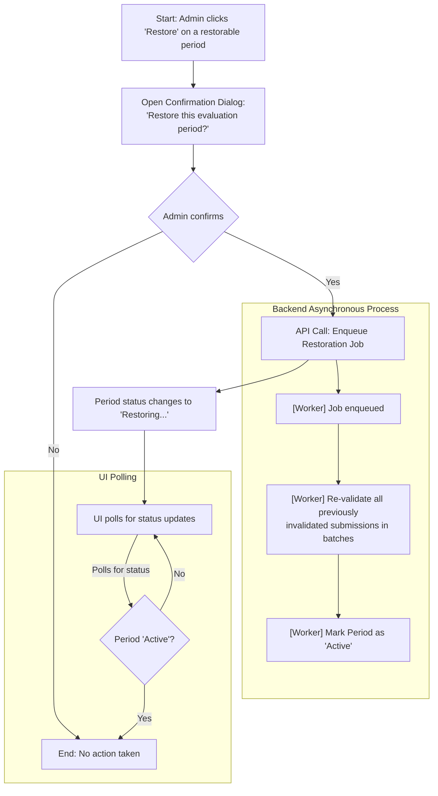

**Technical & Developer Notes:**

-   **Restoration Window:** The backend should enforce a limited time window (e.g., 30 days) during which a period can be restored. The "Restore" button should not be visible in the UI for periods cancelled longer ago than this window.
-   **Asynchronous Restoration:** Similar to cancellation, restoration is a background job to handle re-validating potentially large numbers of submissions without blocking the UI.
-   **State Management:** The backend must correctly transition the period's status from `Cancelled (Restorable)` to `Restoring...` and finally back to `Active`. No new submissions should be allowed during the `Restoring...` state.

#### **Flow: Super Admin - Tenant User Management**

-   **User Goal:** To manage users for a specific university tenant, including deactivating accounts and triggering password resets.
-   **Entry Points:** The Super Admin navigates from their main dashboard to the "University Management" page.
-   **Success Criteria:** The selected user's status is updated in the system (e.g., deactivated), or a password reset email is successfully dispatched to the user. The user list in the UI reflects the change immediately.

**Flow Diagram:**

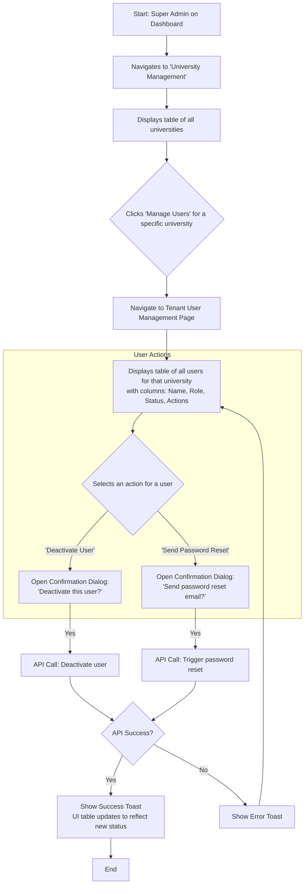

**Technical & Developer Notes:**

-   **UI Components:** This feature will reuse the standard `shadcn/ui` components for `<Table>`, `<Button>`, and `<AlertDialog>` to maintain consistency.
-   **State Management:** After a successful action, the `TanStack Query` cache for the university's user list must be invalidated to ensure the UI immediately reflects the change.
-   **Security:** All API endpoints for these actions must be protected and verify that the calling user has Super Admin privileges.

---

### **Section 4: Wireframes & Mockups**

While detailed mockups will be in a design tool, this section defines the structural blueprint for key screens.

-   **Primary Design Files:** (Link to Figma project will be placed here)
-   **Key Screen Layouts:**
    -   **Dashboard Overview Page (Tiered Layout):**
        -   **Purpose:** To provide an at-a-glance, role-specific overview and gateway to analysis.
        -   **Key Elements:** A consistent tiered layout will be applied to the Faculty, Department Head, and Admin dashboards, prioritizing information from top to bottom.
            1.  **Tier 1: At-a-Glance KPIs:** A top row of small cards showing the most critical numbers for that role.
            2.  **Tier 2: Actionable Insights:** A section of curated cards that highlight the most urgent or important items requiring attention (e.g., "Faculty with Lowest Scores," "Pending Flagged Evaluations"). These cards are interactive, serving as shortcuts to the "Explore Data" tab.
            3.  **Tier 3: General Exploratory Visualizations:** The lower section of the dashboard containing the default, high-level charts like the Sentiment Breakdown and Keyword Word Cloud.
    -   **Evaluation Form (Student):**
        -   **Purpose:** To provide a clear, focused, and frictionless evaluation experience.
        -   **Key Elements:** Header with faculty info, Timer Bar, Accordion-style layout for criteria, and a sticky footer with a "Submit" button that is disabled until all validation rules are met.

---

### **Section 5: Component Library / Design System**

The project will adhere to a consistent design system built upon **`shadcn/ui`** and styled with **Tailwind CSS**.

-   **Design System Approach:** A shared UI package will be created within the monorepo to house any custom composite components built using `shadcn/ui` primitives.
-   **Core Custom Components:**
    -   **`DashboardCard`**: A standardized wrapper for all dashboard widgets.
    -   **`SentimentChart`**: A client component wrapping `Echarts` for sentiment bar charts.
    -   **`WordCloudChart`**: A client component wrapping `echarts-wordcloud`.
    -   **`FilterBar`**: A component that groups all standard filter dropdowns.
    -   **`ModeSwitcher`**: The control used by Admins and Department Heads to switch their data view context.
    -   **`CommentViewerDialog`**: A dialog component triggered by clicking on a chart segment. It displays anonymized comments.
        -   **Anonymity Enforcement:** The component **must** enforce the university-wide anonymity threshold. If the number of comments for the selected group is below this threshold, it will display a privacy message (e.g., "More responses are needed before individual comments can be shown") instead of the comments themselves.
        -   **_Developer Note:_** _This component **must** fetch its data exclusively from the dedicated **`Comment Data Service`**. This service is responsible for enforcing the anonymity threshold by checking the value from the `UniversitySetting` table (e.g., a setting named `anonymity_threshold`) on the server-side before returning any comment data._
    -   **`NotificationPanel`**: A component, likely a `shadcn/ui` `<Sheet>` or `<Popover>`, that contains a list of `NotificationItem` components. Its trigger (e.g., a bell icon in the main header) **must display a real-time indicator** (e.g., a red dot) instantly when a new notification is received via the WebSocket connection, without requiring a page refresh. The panel will display notifications fetched from the `/api/notifications` endpoint, which returns records from the `Notification` data model. It should include tabs or filters for "All" and "Unread" notifications.
    -   **`NotificationItem`**: A reusable component designed to render a single record from the `Notification` data model.
        -   **Purpose:** To display a notification's content, timestamp, and status in a clear, consistent format.
        -   **Data Contract:** The component will accept a prop of type `Notification`.
        -   **Key Elements:**
            -   An icon determined by the `action_type` (e.g., a checkmark for `IMPORT_COMPLETE`, a flag for `FLAG_RESOLUTION`).
            -   The main notification `content` text.
            -   A relative timestamp derived from the `created_at` field (e.g., "5 minutes ago").
            -   An "unread" status indicator (e.g., a blue dot) if `status` is `'unread'`.
        -   **Interactions:**
            -   Clicking the item marks it as read (API call to `PATCH /api/notifications/{id}`) and can navigate the user to a relevant page if the `action_type` implies a destination (e.g., a `FLAG_RESOLUTION` notification navigates to the resolved flag's detail view).
            -   An "archive" action will be available to change the notification's `status` to `'archived'`.

---

### **Section 6: Branding & Style Guide**

#### **Visual Identity**

The visual identity is anchored by the Proficiency logo and a professional, blue-dominant color scheme. The overall aesthetic is minimalist and data-focused, prioritizing clarity and user confidence.

#### **Color Palette**

The palette is derived from the provided brand colors and supplemented with standard UX functional colors for clarity.

| Color Type | Hex Code (Sampled)       | Usage                                                               |
| :--------- | :----------------------- | :------------------------------------------------------------------ |
| Primary    | `#1e3a8a` (Dark Blue)    | Primary buttons, active navigation, key interactive elements.       |
| Secondary  | `#3b82f6` (Bright Blue)  | Hover states, secondary buttons, links, highlighted info.           |
| Accent     | `#60a5fa` (Lighter Blue) | Badges, special notifications, or tertiary actions.                 |
| Success    | `#16a34a` (Green)        | Positive feedback, confirmations, successful operations.            |
| Warning    | `#facc15` (Yellow)       | Cautions, important notices, non-critical alerts.                   |
| Error      | `#dc2626` (Red)          | Errors, destructive action confirmation buttons, validation issues. |
| Neutral    | (See scale below)        | Text, borders, backgrounds, and disabled states.                    |

**Neutral Scale:**

-   `#0f172a` (Near Black for headings)
-   `#334155` (Dark Gray for body text)
-   `#94a3b8` (Medium Gray for labels/placeholders)
-   `#e2e8f0` (Light Gray for borders)
-   `#f8fafc` (Off-white for page backgrounds)
-   `#ffffff` (White for card backgrounds)

#### **Typography**

**Font Families:**

-   **Primary (Headings):** Inter
-   **Secondary (Body/UI):** Inter
-   **Monospace (Code):** Fira Code

**Type Scale:**

| Element | Size (rem/px)     | Weight          | Line Height |
| :------ | :---------------- | :-------------- | :---------- |
| H1      | `2.25rem` (36px)  | Bold (700)      | 1.2         |
| H2      | `1.875rem` (30px) | Bold (700)      | 1.3         |
| H3      | `1.5rem` (24px)   | Semi-Bold (600) | 1.4         |
| Body    | `1rem` (16px)     | Normal (400)    | 1.6         |
| Small   | `0.875rem` (14px) | Normal (400)    | 1.5         |

#### **Iconography**

We will formally adopt **Lucide Icons (`lucide-react`)** as our exclusive icon library.

**Usage Guidelines:**

-   **Consistency:** We will use icons from the Lucide library exclusively to maintain a single, cohesive visual style.
-   **Purposeful Use:** Icons should be used to enhance clarity and reinforce meaning, not simply as decoration.
-   **Standard Sizing:** Most icons will adhere to a standard size (e.g., `1rem` or `16px`) to align with our body text.
-   **Accessibility:** All interactive icons must have an appropriate `aria-label` to describe their function for screen reader users.

#### **Spacing & Layout**

**Grid System:**
We will use modern CSS Flexbox and Grid utilities, provided by Tailwind CSS, to create responsive and flexible page layouts.

**Spacing Scale:**
We will adopt Tailwind's default spacing scale, which is based on a **4-pixel unit**. All margins, padding, and gaps must use a value from this scale.

| Unit | `rem` (CSS) | Pixels (px) | Common Use Case             |
| :--- | :---------- | :---------- | :-------------------------- |
| 2    | `0.5rem`    | 8px         | Small gaps, icon padding    |
| 4    | `1rem`      | 16px        | Standard padding in cards   |
| 6    | `1.5rem`    | 24px        | Gaps between major sections |
| 8    | `2rem`      | 32px        | Large content separators    |

---

### **Section 7: Accessibility Requirements**

#### **Compliance Target**

Our official accessibility target for the Proficiency platform is **WCAG 2.1 Level AA**.

#### **Key Requirements**

**Visual:**

-   **Color Contrast:** Color combinations must meet the minimum contrast ratio of **4.5:1** for normal text and **3:1** for large text.
-   **Visible Focus States:** All interactive elements **must** have a clear and consistent visual indicator when selected via keyboard navigation.
-   **Don't Use Color Alone:** Information must never be conveyed using only color.

**Interaction:**

-   **Full Keyboard Navigation:** All functionality must be operable using only a keyboard.
-   **Screen Reader Support:** Developers must use semantic HTML and provide `aria-label` attributes for icon-only buttons.
-   **Adequate Touch Targets:** All interactive elements must have a minimum touch target size of 44x44 pixels.

**Content:**

-   **Alternative Text for Images:** All meaningful images **must** have descriptive `alt` text.
-   **Logical Heading Structure:** Each page must have a logical and sequential heading structure.
-   **Form Labels:** Every single form input **must** have a clearly associated `<label>`.

#### **Testing Strategy**

Our testing strategy is layered to catch accessibility issues at multiple stages of the development process.

1.  **Automated Scans During Development:** We will integrate an automated accessibility testing library (like `@axe-core/react`) into our local development process to provide immediate feedback to developers as they build components.
2.  **Automated E2E Validation:** We will integrate `cypress-axe` into our end-to-end test suite. This will automatically validate all critical user flows against WCAG 2.1 Level AA standards as part of our CI/CD pipeline, enforcing compliance before new code can be merged and deployed.
3.  **Manual Keyboard Navigation Testing:** Before any new feature is considered complete, it must be tested for usability with only a keyboard.
4.  **Basic Screen Reader Spot-Checks:** For critical user flows, we will perform a brief spot-check using a built-in screen reader (like VoiceOver or NVDA).

---

### **Section 8: Responsiveness Strategy**

#### **Breakpoints**

We will adopt the standard, industry-proven breakpoints provided by Tailwind CSS.

| Breakpoint       | Min Width | Target Devices                         |
| :--------------- | :-------- | :------------------------------------- |
| Mobile (default) | 0px       | Small to large mobile phones           |
| `sm`             | 640px     | Large phones, small tablets (portrait) |
| `md`             | 768px     | Tablets (portrait), small laptops      |
| `lg`             | 1024px    | Laptops, tablets (landscape)           |
| `xl`             | 1280px    | Standard desktop monitors              |
| `2xl`            | 1536px    | Large desktop monitors                 |

#### **Adaptation Patterns**

**Layout Changes:**

-   **Mobile (Default):** All layouts will be a **single column**, with content stacking vertically.
-   **Tablet (`md` and up):** We will introduce **two and three-column grid layouts** for dashboards.
-   **Desktop (`lg` and up):** We will use multi-column layouts, with the main sidebar persistently visible.

**Navigation Changes:**

-   **Mobile (Default):** The main sidebar navigation will be **hidden off-screen** and accessible via a "hamburger" menu icon.
-   **Desktop (`lg` and up):** The sidebar will be **fully expanded and visible by default**.

**Content Priority:**

-   **Mobile (Default):** The most critical, actionable content will appear first.
-   **Desktop (`lg` and up):** Secondary content can be displayed in adjacent columns alongside primary content.

**Interaction Changes:**

-   **Hover vs. Tap:** All interactions will be designed for tapping. Information revealed on hover **must** also be accessible via a tap on a touch device.
-   **Dialogs and Modals:** On mobile, modals may be presented as a **"sheet"** that slides up from the bottom of the screen.

---

### **Section 9: Animation & Micro-interactions**

#### **Motion Principles**

1.  **Purposeful & Functional:** Animation must have a clear purpose, such as guiding attention or providing feedback.
2.  **Subtle & Swift:** Transitions will be quick (150ms-300ms) and use gentle easing curves to feel smooth and professional.
3.  **Performance-First:** We will prioritize performant animations (using CSS `transform` and `opacity`).

#### **Key Animations & Micro-interactions**

-   **State Changes:** Interactive elements will have subtle transitions for hover, focus, and active states.
-   **Page Transitions:** A quick, gentle fade transition will be used between page loads.
-   **Modal & Sheet Transitions:** Dialogs and sheets will slide or fade into view, a behavior provided by our `shadcn/ui` components.
-   **Data Loading:** While data is being fetched, we will use subtle "skeleton loader" or shimmer effects to prevent jarring layout shifts.

---

### **Section 10: Global UX Patterns**

#### **Pattern: Handling Concurrency Errors (Optimistic Locking)**

-   **Context:** This pattern is triggered when a user attempts to modify a resource, but the backend detects (via optimistic locking) that it has been changed by another user. The backend will respond with a `409 Conflict` status code.
-   **User Goal:** The user must be clearly informed that their action failed to prevent overwriting someone else's work and be given a clear path to resolve the situation.

**Interaction Flow Diagram:**

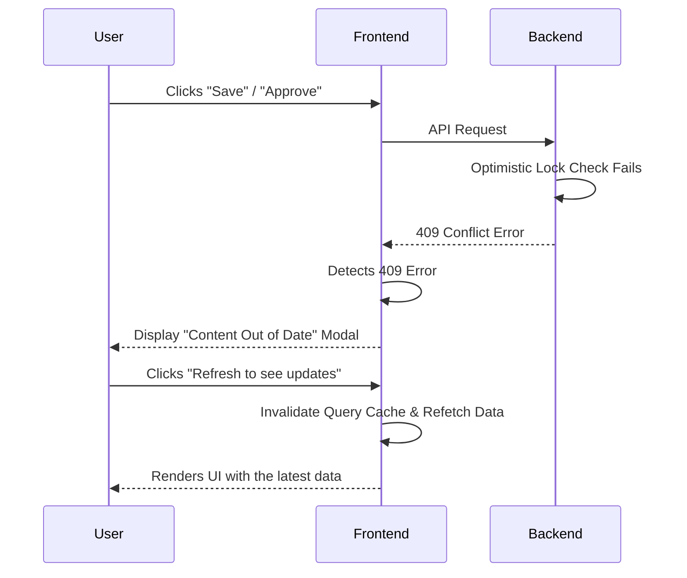

**UI Specification:**
When the frontend receives a `409 Conflict` response, it **must** display a modal dialog (`shadcn/ui` `<AlertDialog>`) with the title "**Content Out of Date**," a description such as, "**This item has been modified by another user since you loaded it**," and a single action button labeled **"Refresh to see updates."**

**Applicable User Flows:**
This global pattern **must** be implemented for all user flows involving the modification of shared resources, including but not limited to:

-   Admin - Form & Period Management
-   Admin - Flagged Evaluation Review
-   Super Admin - University Onboarding
