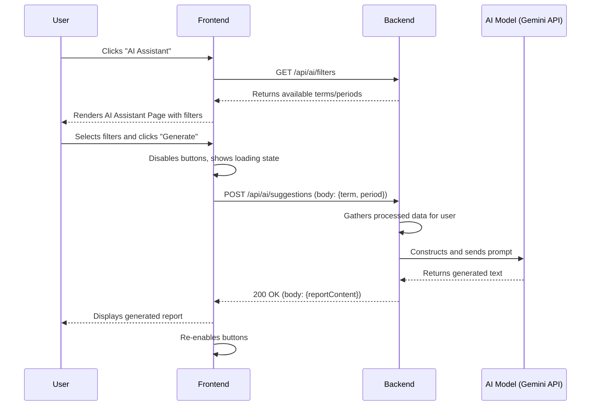
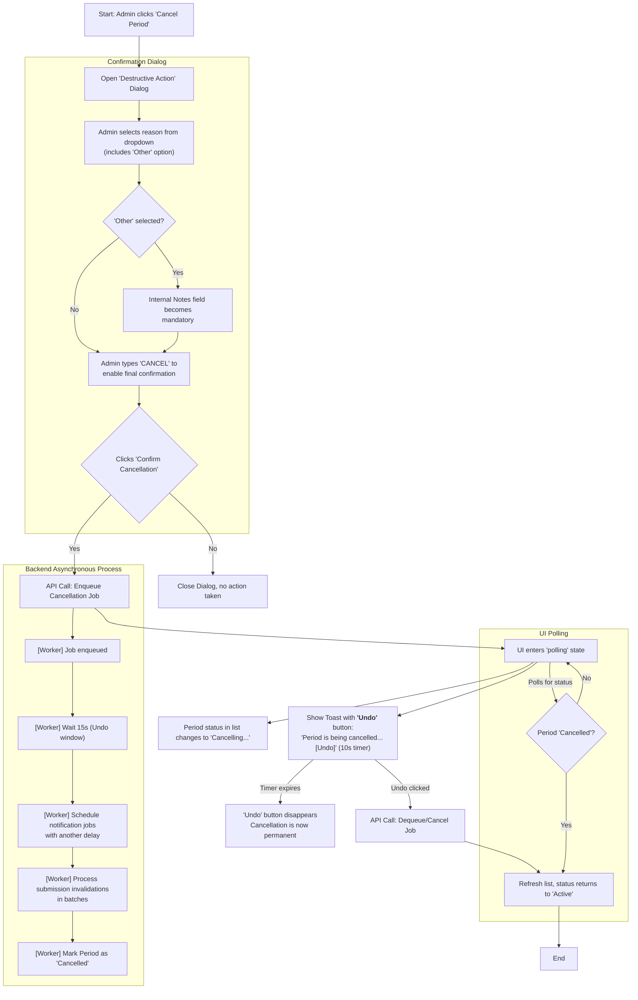

Of course. Here is the complete and fully updated `front-end-spec.md` document, incorporating all of our collaborative refinements and approved sections.

````markdown
# Proficiency UI/UX Specification

### **Section 1: Introduction**

This document defines the user experience goals, information architecture, user flows, and visual design specifications for the "Proficiency" platform. It serves as the foundation for visual design and frontend development, ensuring a cohesive and user-centered experience.

#### **Overall UX Goals & Principles**

The interface must feel clean, trustworthy, and represent a significant upgrade from typical university systems. **Clarity and intuitive data visualization are the primary goals**.

-   **Target User Personas:** The system is designed for five distinct roles, each with unique needs:
    -   **Students:** The primary evaluators, who need a simple, clear, and efficient way to provide feedback.
    -   **Faculty:** The evaluatees, who need to easily understand their performance data through clear visualizations and access AI-driven suggestions for growth.
    -   **Department Heads:** Serving as both evaluators and managers, they require views of their own performance, individual faculty results, and aggregated department-level data.
    -   **Admins (e.g., CADS, Research Office):** The operational managers who need to create and manage evaluation forms and periods, review flagged submissions, and view results at all levels. Crucially, they are also responsible for the initial and historical data onboarding of the university's academic structure, users, and past evaluation records via bulk import tools.
    -   **Super Admins:** The platform-level administrators responsible for onboarding new universities and managing system-wide user accounts.
-   **Usability Goals**:
    -   **Clarity:** The interface must present complex evaluation data in a simple, digestible manner, avoiding the cluttered, table-heavy feel of traditional portals.
    -   **Efficiency:** Users should be able to complete their core tasks (submitting evaluations, viewing results, managing forms) with minimal friction.
    -   **Trust:** The design must feel professional and secure, encouraging users to trust the data and the insights provided.
-   **Design Principles**:
    1.  **Clarity Over Cleverness:** Prioritize clear communication and intuitive navigation. The user should always know where they are and what they're looking at.
        -   **_Developer Note:_** _This will be achieved by strictly using the components provided and scaffolded by 'shadcn/ui'. A custom, one-off component should only be created if a superior and strict need arises that cannot be met by the existing library. Otherwise, adherence to the 'shadcn/ui' primitives is mandatory to ensure clarity and maintainability._
    2.  **Data-First Dashboards:** Each user's journey begins with a dashboard that immediately surfaces the most relevant information and actions for their role.
        -   **_Developer Note:_** _Dashboards will be powered by 'TanStack Query' for robust data fetching, caching, and background polling. All visualizations, including bar charts, line charts, and performance trends, will be implemented using 'Echarts' and 'echarts-wordcloud' to maintain a single, consistent charting library._
    3.  **Progressive Disclosure:** Show only what's needed for the current task. More advanced options or detailed data can be revealed upon user request.
        -   **_Developer Note:_** _Implement this using 'shadcn/ui' components like 'Accordion', 'Dialog', and 'Sheet' to keep the initial UI clean and reveal complexity only when the user explicitly asks for it._
    4.  **Enforced Consistency:** Programmatically enforce a consistent visual language, component library, and interaction patterns (like sidebar navigation and card-based layouts) throughout the application to ensure a predictable user experience.
        -   **_Developer Note:_** _Consistency will be enforced. All styling will use Tailwind CSS utility classes. All core UI elements (buttons, forms, cards) will be derived from 'shadcn/ui' primitives. The **Monorepo** structure should be leveraged to create a shared UI package for any custom-built, reusable components._

#### **Change Log**

| Date       | Version | Description                                                                                                                                                                                             | Author           |
| :--------- | :------ | :------------------------------------------------------------------------------------------------------------------------------------------------------------------------------------------------------ | :--------------- |
| 2025-10-02 | 2.0     | Finalized all user flows and completed all design sections (Branding, Accessibility, Responsiveness, Animation). Added alignment notes for PM. Spec is now ready for architectural handoff.             | Sally, UX Expert |
| 2025-10-01 | 1.7     | **Restored missing flow diagrams and technical notes from previous versions to create a single, complete master specification.**                                                                        | Sally, UX Expert |
| 2025-10-01 | 1.6     | Finalized and integrated the "Managerial & Administrative Review" user flow with all elicitation refinements. Added tiered dashboard layouts and the hybrid "drill-down" approach for viewing comments. | Sally, UX Expert |
| 2025-10-01 | 1.5     | Consolidated and restored all missing flow diagrams and technical notes from previous versions to create a complete, unified specification.                                                             | Sally, UX Expert |
| 2025-10-01 | 1.4     | Finalized all user flows and integrated elicitation refinements.                                                                                                                                        | Sally, UX Expert |
| 2025-09-30 | 1.3     | Added refined Admin and Super Admin user flows.                                                                                                                                                         | Sally, UX Expert |
| 2025-09-30 | 1.2     | Refined Sections 1 & 2 to align with new PRD.                                                                                                                                                           | Sally, UX Expert |
| 2025-09-28 | 1.1     | Expanded introduction with developer-focused notes.                                                                                                                                                     | Sally, UX Expert |
| 2025-09-28 | 1.0     | Initial draft of the UI/UX Specification.                                                                                                                                                               | Sally, UX Expert |

---

### **Section 2: Information Architecture (IA)**

This section defines the structural backbone of the "Proficiency" application. It outlines how information is organized and presented to users, ensuring they can navigate the system logically and intuitively.

#### **Site Map / Screen Inventory**

This diagram shows the primary screens and modules for both public visitors and authenticated users, broken down by role.

```mermaid
graph TD
    subgraph Public
        LP(Landing Page) --> A[Login Page];
        LP --> B[University Registration Page];
    end

    subgraph Authenticated
        C(User Role Router);

        subgraph Student
            S_Dash[Dashboard] --> S_Eval[Evaluation Form];
            S_Dash --> S_Hist[Evaluation History];
            S_Dash --> S_Profile[Profile];
        end

        subgraph Faculty
            F_Dash[Dashboard] --> F_Insights[Performance Analysis];
            F_Dash --> F_Trends[Performance Trends];
            F_Dash --> F_AI[AI Assistant];
            F_Dash --> F_Reports[Report Center];
            F_Dash --> F_Profile[Profile];
        end

        subgraph DeptHead
            DH_Page[Dashboard Page]
            DH_Page --> DH_Tabs{Tabs};
            DH_Tabs --> DH_Overview[Overview];
            DH_Tabs --> DH_Explore[Explore Data];
            DH_Page --> DH_AI[AI Assistant];
            DH_Page --> DH_Reports[Report Center];
            DH_Page --> DH_Eval[Conduct Faculty Evaluations];
            DH_Page --> DH_Hist[Evaluation History];
            DH_Page --> DH_Profile[Profile];
        end

        subgraph Admin
            Adm_Page[Dashboard Page]
            Adm_Page --> Adm_Tabs{Tabs};
            Adm_Tabs --> Adm_Overview[Overview];
            Adm_Tabs --> Adm_Explore[Explore Data];
            Adm_Page --> Adm_Reports[Report Center];
            Adm_Page --> Adm_Forms[Form & Period Management];
            Adm_Page --> Adm_Flags[Flagged Evaluations];
            Adm_Page --> Adm_Acad[Academic Structure Mgmt];
            Adm_Acad --> Adm_ManualCRUD[Manual CRUD];
            Adm_Acad --> Adm_BulkImport[Bulk Import Feature];
            Adm_Page --> Adm_ImportHist[Import Job History];
            Adm_Page --> Adm_Profile[Profile];
        end

        subgraph SuperAdmin
            SA_Dash[Dashboard] --> SA_Uni[University Management];
            SA_Dash --> SA_Users[User Management];
            SA_Dash --> SA_Profile[Profile];
        end
    end

    A --> C;
    B --> A;
    C -- Student --> S_Dash;
    C -- Faculty --> F_Dash;
    C -- "Dept. Head" --> DH_Page;
    C -- Admin --> Adm_Page;
    C -- "Super Admin" --> SA_Dash;
```


````

#### **Navigation Structure**

-   **Public Entry Point:** A simple Landing Page will serve as the initial entry point, introducing the system and providing clear calls-to-action to either Login or begin the University Registration process.
-   **Primary Navigation:** After authentication, a responsive, collapsible sidebar will be the main navigation method. It will contain top-level links to the main pages available to the logged-in user's role.
-   **Tabbed Dashboards:** For Department Heads and Admins, the main Dashboard page is organized into two primary tabs: "**Dashboard Overview**" and "**Explore Data**". The Overview provides a simple, zero-configuration summary of the most critical information. The Explore Data tab contains the powerful mode-switching and filtering tools for deep-dive analysis.
-   **Student Experience:** The Student Dashboard is streamlined to focus on their primary task: it will display pending evaluations in a card-based layout, clearly showing which faculty and subject needs their feedback.

---

### **Section 3: User Flows**

This section maps out the step-by-step paths users will take to complete critical tasks, ensuring a seamless and intuitive experience.

#### **Flow: Student - Evaluation Submission**

-   **User Goal:** To provide complete and thoughtful feedback for a specific faculty member during an active evaluation period.
-   **Entry Points:** The user is on their Student Dashboard and sees a list of available evaluations.
-   **Success Criteria:** The user's ratings and open-ended answers are successfully saved to the database, and the evaluation is removed from their list of pending tasks.
-   **Variation for Department Heads:** The evaluation submission process for Department Heads is identical to the student flow with two key differences:
    1.  **Entry Point:** The Department Head's dashboard will display a list of all faculty members assigned to their department.
    2.  **Form Assignment:** The system may present a different evaluation form template if one has been specifically designated for Department Head evaluations.

**Flow Diagram:**

```mermaid
graph TD
    A[Start: Student on Dashboard] --> B(Selects Faculty to Evaluate);
    B --> C[System Loads Correct Evaluation Form];
    C --> D[User Fills Out Likert Scores & Open-Ended Answers];
    D --> E{User Clicks "Submit"};
    E --> F{Time on Form > Minimum?};
    F -- No --> G[Show Error: "Please take more time to review"];
    G --> D;
    F -- Yes --> H{All Required Fields Valid? (e.g., word count)};
    H -- No --> I[Show Field-Specific Error];
    I --> D;
    H -- Yes --> J{Low-Variance Likert Scores?};
    J -- Yes --> K["Pre-Submission Nudge" Toast Appears];
    K --> L[Submission Sent to Backend];
    J -- No --> L;
    L --> M{Submission Successful?};
    M -- Yes --> N[Show Enhanced Confirmation Message];
    M -- No --> O[Show Submission Error, Allow Retry];
    O --> E;
    N --> P[End: User chooses to continue or return];
```

**Expanded Technical & QA Notes:**

-   **Timer Communication & Function:**
    -   **Dev Note:** A small, non-intrusive text label should be present near the submit button explaining its purpose: e.g., "A brief review period is required to encourage thoughtful feedback.". The "Submit" button must be disabled until the timer expires. On hover/focus of the disabled button, a tooltip should clearly communicate the remaining time.
    -   **QA Test Case:** Verify the button is disabled, the tooltip is accurate, and the button becomes enabled precisely when the timer hits zero.
-   **Form Validation:**
    -   **Dev Note:** All client-side validation (e.g., word count) will be managed by `React Hook Form` and `Zod`. Error messages must appear in real-time. The submit button should be disabled as long as the form state is invalid.
-   **Data Preservation on Failure:**
    -   **Dev Note:** The entire form state must be preserved if the submission API call fails. Use `TanStack Query`'s mutation cache for this. The UI must provide a clear error "toast" and revert the submit button to a "Retry Submission" state.
-   **Enhanced Confirmation & Workflow:**
    -   **Dev Note:** The confirmation message after success should be dynamic, indicating progress (e.g., "Success\! You have 4 evaluations left to complete.") and providing two clear actions: `[Start Next Evaluation]` and `[Return to Dashboard]`.

#### **Flow: Faculty - Generate AI Suggestions**

-   **User Goal:** To generate, view, and save actionable suggestions for professional development based on their processed evaluation data.
-   **Entry Points:** The user clicks on the "AI Assistant" link in the main sidebar navigation.
-   **Success Criteria:** A relevant, AI-generated report is displayed, and the user can successfully save it to their history or download it as a PDF.

**Technical Sequence Diagram:**



#### **Flow: Admin - Form & Period Management (Corrected for Alignment)**

-   **User Goal:** To create a new evaluation form template through a guided process, define its structure, and assign it to a specific academic period to launch an evaluation, with smart guardrails to ensure correct assignment.
-   **Entry Points:** The Admin navigates to the "Form & Period Management" page from the sidebar.
-   **Success Criteria:** A new, active evaluation period is created with a valid form template (or templates) assigned to it, and the form becomes available to the designated evaluators at the specified start time.

**Corrected Flow Diagram:**

```mermaid
graph TD
    subgraph "Main Management Page"
        A[Start: Admin on Dashboard] --> B[Navigates to 'Form & Period Management' Page];
        B --> BA["[+ Create New Template ▾]"];
        B --> BB["[🗓️ Schedule a Period]"];
        BA --> D1["Full Wizard"];
        BB --> S;
        B --> C[Views Lists of Templates & Scheduled Periods];
        C -- "Clicks 'Assign' on a Template" --> S;
        C -- "Clicks 'Edit' on a Scheduled Period" --> S;
    end

    subgraph "Template Creation"
        D1 --> E[Step 1: Metadata...];
        E --> F[Step 2: Criteria & Weights];
        F --> G[Step 3: Add/Manage Questions];
        G --> H[Clicks "Save Draft"];
        H --> C;
        G --> I[Clicks "Preview & Finalize"];
        I --> L[Clicks "Finalize Template"];
        L --> P[Template status becomes 'active'];
        P --> C;
    end

    subgraph "Period Assignment"
        S[Assignment Page];
        S --> T["Admin fills out core details:<br/>Term, Period, Dates"];
        T --> T1["Selects Primary Form (for Students)"];
        T1 --> T2["(Optional) Selects a different<br/>Form for Department Heads"];
        T2 --> Y[Admin sees Enhanced Final Summary<br/>with 'Share Read-Only Preview Link' button];
        Y --> Z{Confirm Schedule?};
        Z -- Yes --> AA[Period is Scheduled/Updated];
        AA --> C;
        Z -- No --> S;
    end
```

#### **Flow: Historical Data Onboarding**

-   **User Goal:** To confidently and efficiently bulk import historical data, with clear guidance, robust safety checks, and a transparent monitoring process.
-   **Entry Points:** The Admin clicks the "Data Import" link in the main sidebar.
-   **Success Criteria:** A validated data file is successfully processed, the database is updated correctly, and the Admin has a clear audit trail of the entire operation.

**Flow Diagram:**


#### **Flow: Flagged Evaluation Review (Restored)**

-   **User Goal:** To efficiently review, process, and resolve evaluations flagged by the system for data quality issues, ensuring the integrity of the final aggregated results.
-   **Entry Points:** The Admin clicks on "Flagged Evaluations" in the main sidebar navigation or clicks a dashboard notification about newly flagged items.
-   **Success Criteria:** A flagged evaluation is successfully resolved with a status of 'Approved', 'Archived', or 'Resubmission Requested'. The item is moved from the 'Pending' queue to the 'Resolved' history, and any necessary notifications are triggered.

**Flow Diagram:**

```mermaid
flowchart TD
    A[Start: Admin navigates to<br/>'Flagged Evaluations' page] --> B[Display page with two tabs:<br/><b>'Pending' (Default)</b> & 'Resolved'];
    B --> C[API fetches and displays<br/>a table of pending flagged evaluations];
    C --> C1(Optional: Admin clicks 'Start Focus Review'<br>to enter one-at-a-time mode);
    C --> D{Admin clicks on a specific<br/>evaluation row to review};

    D --> E[Open Dialog/Sheet with Review Interface];
    E --> F[Display side-by-side comparison<br><b>Dynamically highlight</b> data that triggered flag];
    F --> G[Display flag reason(s) clearly:<br/><i>e.g., 'Low-Confidence'</i>];

    G --> H{Admin chooses an action};
    H -- "Approve" --> I[Confirm Action: 'Approve Submission?'];
    H -- "Archive" --> J[Open Dialog: 'Archive Submission?'];
    H -- "Request Resubmission" --> K[Open Dialog: 'Request New Submission?'];

    I -- Yes --> L[API Call: Resolve flag as 'Approved'<br>Enqueue job to recalculate aggregates];

    J --> J1[<b>Default:</b> Required free-text for reason<br><b>Optional:</b> Click to use checklist of pre-defined reasons];
    J1 --> J2{Admin confirms};
    J2 -- Yes --> M[API Call: Resolve flag as 'Archived'<br>Soft-delete submission (recoverable for 30 days)<br>Trigger anonymous notification with reason];

    K --> K1[<b>Default:</b> Required free-text for reason<br><b>Optional:</b> Click to use checklist of pre-defined reasons];
    K1 --> K2{Admin confirms};
    K2 -- Yes --> N[API Call: Resolve flag as 'Resubmission Requested'<br>Invalidate original submission<br>Trigger anonymous notification with reason];

    L --> O[Close Dialog & Refresh Pending Table];
    M --> O;
    N --> O;
    O --> P[End];
```

**Technical & Developer Notes:**

-   **UI Components:** The page will use `shadcn/ui` `<Tabs>`, `<Table>`, and `<Dialog>`. The review interface will dynamically highlight problematic data to reduce Admin cognitive load.
-   **Optional Focus Mode:** The "Start Focus Review" button will switch the UI to a simplified, one-at-a-time review process to help Admins who prefer a sequential workflow.
-   **Soft Deletion:** The "Archive" action functions as a soft delete, mitigating the risk of accidental permanent data loss.
-   **Structured Feedback:** The dialog for "Archive" and "Request Resubmission" will default to a free-text field for the reason but provide an optional checklist of constructive, pre-defined reasons to ensure consistency and helpfulness in the anonymous notification sent to the student.

#### **Flow: Super Admin - University Onboarding (Restored)**

-   **User Goal:** To securely and efficiently review, approve or reject, and finalize the onboarding of a new university tenant onto the platform.
-   **Entry Points:** The Super Admin logs in and navigates to the "University Management" page from their dashboard.
-   **Success Criteria:** A pending request is either approved (creating a new university record, an initial Admin account, and auto-importing structural data) or rejected. The queue is updated.

**Flow Diagram:**

```mermaid
flowchart TD
    subgraph IncomingAdmin [Incoming University Admin]
        A[Start: Fills out registration form] --> A1[Optionally uploads CSVs for<br>Departments, Programs, Subjects];
        A1 --> A2[Submits Request];
    end

    subgraph SuperAdmin [Super Admin]
        B[Dashboard shows Kanban board:<br>New | In Review | Resolved] --> C{Drags request card to 'In Review'<br><i>(Locks request)</i>};
        C --> D[Clicks card to open detail view];
        D --> E[Reviews institutional data & documents];
        E --> F[Sees validation summary for<br>optional structure files, if any<br><i>(Cannot view file contents)</i>];
        F --> G[Clicks 'View History' to see audit trail];
        G --> H{Chooses 'Approve' or 'Reject'};

        H -- Reject --> I[Enters reason, confirms];
        I --> J[API rejects request, sends email];

        H -- Approve --> K[Confirms approval];
        K --> L[Backend Transaction:<br>1. Create university & admin records<br>2. Enqueue optional structure file imports<br>3. Send verification email to new Admin];
    end

    L --> M[Card moves to 'Resolved' column];
    J --> M;
    M --> N[End];
```

**Technical & Developer Notes:**

-   **Security & Privacy:** The flow is designed to prevent Super Admins from accessing sensitive university PII. They only see a validation summary for the optional academic structure files, not the contents.
-   **UI/UX:** A Kanban board provides an intuitive visual for managing the queue. A locking mechanism prevents concurrent reviews. An accessible audit trail ensures accountability.
-   **Automation:** Upon approval, the backend automatically enqueues the pre-validated structural data for import, streamlining setup for the new University Admin and creating a positive first impression.
-   **Recovery:** The Super Admin UI will have a mechanism to resend the verification email to a new Admin in case of initial email delivery failure.

#### **Flow: Generating and Downloading a Formal Report (Restored)**

-   **User Goal:** To generate and download a standardized, official report of evaluation results for a specific period, suitable for archiving or formal meetings.
-   **Entry Points:** The user (Admin, Department Head, or Faculty) clicks the "Report Center" link in the main sidebar navigation.
-   **Success Criteria:** The user successfully downloads a professionally formatted PDF or a structured CSV/Excel file based on their selected parameters via a "Report Center" system.

**Flow Diagram:**

```mermaid
flowchart TD
    A[Start: User clicks 'Report Center' in sidebar] --> B[Navigate to dedicated 'Report Center' page];
    B --> B_Tabs{Tabs};
    B_Tabs --> C["Generate Report (Default Tab)"];
    B_Tabs --> C2["My Reports (Inbox)"];

    C --> D{User selects a pre-defined report type<br>e.g., 'Faculty Performance Summary'};
    D --> E[Display relevant filters for that report<br><i>(e.g., School Term, Assessment Period, Department)</i>];
    E --> G[User selects export format<br>(PDF or CSV/Excel)];
    G --> H{User clicks 'Generate Report'};

    subgraph HybridLogic [Smart Hybrid Logic]
        H --> H1{Estimate report complexity};
        H1 -- "Small Report" --> H_Sync[Generate synchronously<br>Show loading spinner];
        H1 -- "Large Report" --> H_Async[Enqueue asynchronous job<br>Redirect to 'My Reports' tab];
    end

    H_Sync --> N_DL[Trigger immediate file download];

    subgraph MyReportsTab [My Reports Tab]
        H_Async --> M[New job appears at top of list<br>Status: 'Queued', with ETA];
        M --> M1[Status updates in real-time<br>'Generating...', 'Ready', 'Failed'];
        M1 --> M2{User can 'Cancel' or 'Retry' jobs};
        M2 --> M3[On 'Ready', user gets notification<br>and a 'Download' button appears];
    end

    M3 --> N{User clicks download link};
    N --> N_DL;
    N_DL --> P[End: File is downloaded];
```

**Technical & Developer Notes:**

-   **Distinction is Key:** The "Generate Report" tab is for creating **standardized reports**. It is functionally separate from the "Export this View" feature on the **Explore Data** tab, which is for ad-hoc data snapshots.
-   **Asynchronous Process:** The entire report generation lifecycle is managed through a "Report Center" that supports both immediate downloads for small jobs and a robust inbox system for large, asynchronous jobs, providing users with clear status updates, ETAs, and control.
-   **Backend Libraries:** The backend will use **WeasyPrint** for PDF generation and **pandas** for CSV/Excel file creation.

#### **Flow: Managerial & Administrative Review**

-   **User Goal:** To efficiently move from a high-level overview of institutional or departmental performance to specific, actionable insights about an individual faculty member.
-   **Entry Points:** The user (Department Head or Admin) logs in and lands on their main dashboard's "Dashboard Overview" tab.
-   **Success Criteria:** The user can successfully navigate between different data "modes," apply filters, and drill down into the data to gain the specific insights they need.

**Flow Diagram:**

```mermaid
graph TD
    A[Start: User on Dashboard Overview] --> B[Clicks 'Explore Data' Tab];
    B --> C[View defaults to highest-level<br/><i>(Dept. for Head, University for Admin)</i>];
    C --> D[User applies filters<br/><i>(e.g., Term, Subject)</i>];
    D --> E[Analyzes aggregated charts & data];
    E --> F{Identifies a person/group to investigate};
    F --> G[Uses 'Switch View/Mode' control];
    G --> H[Dashboard re-renders with<br/>drilled-down data for selection];
    H --> I[Analyzes specific charts & data];
    I --> I2{Optionally clicks chart to<br/>view raw comments};
    I2 --> J{Gains insight / Decides next step};
    J --> K[e.g., Navigate to AI Assistant];
    J --> L[e.g., Navigate to Report Center];
    J --> M[End Session];
```

#### **Final & Approved Specification: Student Resubmitting a Flagged Evaluation**

-   **User Goal:** A student who has had an evaluation flagged needs to clearly understand the specific reason, correct their original submission within a defined grace period, and successfully resubmit a higher-quality evaluation.
-   **Entry Points:** An in-app notification and a "Resubmission Required" task on the Student Dashboard.
-   **Success Criteria:** The student successfully submits a new evaluation within their grace period. The original flagged submission is archived, the new submission enters the processing queue, and the task is cleared from the student's pending list.

**Final Flow Diagram:**

```mermaid
flowchart TD
    A[Start: Student clicks 'Resubmission Required' task] --> B[System loads the evaluation form];
    B --> C["A prominent banner displays the anonymous,<br/>constructive reason for the rejection"];
    C --> D["The specific text that triggered the flag<br/>is visually highlighted in the form below"];

    D --> E[The form fields are pre-filled with the<br/>student's original (rejected) answers];
    E --> E_opt["(Optional) User clicks 'Clear Form & Start Over'"];
    E_opt --> E_clear[Form fields are cleared];
    E_clear --> F;

    E --> F[Student edits their answers to address the feedback];
    F --> G{User clicks 'Resubmit Evaluation'};

    subgraph "Submission Area"
        style Submission Area fill:#f9f9f9,stroke:#ddd
        Deadline["A dynamic countdown timer near the button<br/>shows the remaining time for resubmission"];
        G;
    end

    G --> H{Validation rules pass?};
    H -- No --> I[Show field errors];
    I --> F;

    H -- Yes --> J[API Call: Resubmit evaluation];
    J --> K{Backend: Success?};
    K -- "Failure" --> L[Show submission error];
    L --> G;

    K -- "Success" --> M["Show encouraging confirmation toast:<br/>'Thank you for your thoughtful feedback!<br/>Your updated evaluation has been submitted.'"];
    M --> N[End: Task is removed from pending list];
```

**Final Technical & Developer Notes:**

-   **"One Resubmission" Rule:** The backend must enforce a rule that an evaluation can only be sent back for resubmission once.
-   **Highlighting Flagged Content:** The API must provide `highlights` metadata (question-level identifiers plus character ranges and sanitized snippets). The student resubmission form and admin review dialog should map each entry to the corresponding rich-text component using `question_id` and render multiple spans per answer when present.
-   **Resubmission Grace Period & Deadline Display:** The backend must create a grace period for the resubmission. The frontend **must** display this deadline as a separate, persistent, and dynamic countdown timer near the submit button to maintain constant visibility. The main banner is for the rejection reason only.
-   **"Clear Form" Option:** A secondary button, "Clear Form and Start Over," should be provided. On click, it should reset the form state using the form management library (`React Hook Form`).
-   **Confirmation Tone:** The success confirmation message after resubmission should use the specified encouraging copy to acknowledge the user's extra effort.

#### **Final Specification: Self-Registration via Role-Specific University Code**

-   **User Goal:** A prospective user with a valid, role-specific registration link/code needs to create an account, provided the code is valid for their intended role and has not exceeded its usage limit.
-   **Entry Points:** The user navigates to the registration page, likely via a universal link distributed through various university channels.
-   **Success Criteria:** The user successfully creates an account with the correct role, linked to the correct university. The usage count for the specific registration code is incremented. The user is logged in and redirected to their dashboard.

**Final Flow Diagram:**

```mermaid
flowchart TD
    A[Start: User on Registration Page] --> B[User enters the Registration Code];
    B --> C{User clicks 'Proceed'};

    C --> D[API Call: Validate Registration Code];
    D --> E{Backend: Is code valid, active, & usage limit not reached?};

    E -- No --> F[Display error, e.g., 'Invalid Code' or 'Usage Limit Reached'];
    F --> B;

    E -- Yes --> G[Reveal the full registration form];
    subgraph "Full Registration Form"
        G --> H["User fills out required fields, including a<br/>mandatory 'I am a...' Role dropdown"];
        H --> I{User clicks 'Create Account'};
    end

    I --> J{Client-side validation passes?};
    J -- No --> K[Display field errors];
    K --> H;

    J -- Yes --> L[API Call: Submit full registration details];
    L --> M{Backend: Final validation<br/><b>Does selected role match code's intended role?</b>};

    M -- "Role Mismatch" --> N_Role[Display form error:<br/>'This code is for a [intended role].<br/>Please select the correct role.'];
    M -- "Other Failure (e.g., email exists)" --> N[Display form error];
    N_Role --> H;
    N --> H;

    M -- "Success" --> O["Backend:<br/>1. Creates new user with correct role<br/>2. Increments code usage count<br/>3. Creates a new session"];
    O --> P[Frontend redirects to role-specific Dashboard];
    P --> Q[End];
```

**Corresponding Admin Feature (Refined):**
The Admin's "User Management" page must now include a section for **Registration Code Management**. This interface must allow an Admin to:

1.  **View** a list of all active registration codes for their university.
2.  See the **intended role** (e.g., 'Student', 'Faculty') for each code.
3.  See the usage (`Current Uses` / `Max Uses`) for each code.
4.  **Create** new codes for a specific role with a specific `Max Uses`.
5.  **Regenerate** a new code, which would invalidate the old one.

**Note on Leaked Code Risk:** As per your feedback, we will defer the email domain restriction. For V1, the primary mitigations against a leaked code will be the **`Max Uses` limit** and the Admin's ability to **regenerate the code at any time**.

#### **Final Refined Flow: Admin - Emergency Period Cancellation**

-   **User Goal:** To safely and asynchronously cancel an active evaluation period to correct a critical error, with clear communication and protections against unintended consequences.
-   **Entry Points:** The Admin is on the "Form & Period Management" page, viewing the list of active evaluation periods.
-   **Success Criteria:**
    -   The system asynchronously marks the period and its submissions as 'cancelled' and 'invalid'.
    -   A delayed, automated notification with a clear, pre-defined reason is sent to all affected evaluators.
    -   The action is logged with detailed context in the system audit trail.
    -   The Admin has a brief, final window to undo the action before it becomes permanent.

**Final Flow Diagram:**



**Final Technical & Developer Notes:**

-   **Asynchronous Process:** The entire cancellation is an asynchronous background job. The Admin's initial click on "Confirm Cancellation" should only make a quick API call that enqueues the job and returns an immediate response. The UI then polls a status endpoint to know when the job is complete, updating the period's status from `Cancelling...` to `Cancelled`.
-   **Notification Delay & Undo:** To prevent the notification race condition, the background job must first wait \~15 seconds before scheduling the notification tasks. If the Admin clicks "Undo" within the 10-second UI window, the API call must find and **cancel the job from the queue before it begins processing**.
-   **Transitional State & Locking:** During the entire process (from the moment the job is enqueued until it is complete), the period must be in a transitional `Cancelling...` state. During this time, the backend **must prevent** the creation of a new, overlapping evaluation period to avoid the data conflict risk.
-   **'Other' Reason Logic:** The dropdown for reasons will include an "Other (requires internal note)" option. If selected, the UI will make the "Internal Admin Notes" text area mandatory. The public notification sent to students will be a safe, generic message, while the specific notes are saved only to the audit log.
-   **Performance:** The background job must be designed to process the invalidation of submissions and the enqueuing of notifications in manageable batches to avoid overwhelming the database or the notification queue, especially for large universities.

#### **Flow: Admin - Background Job Monitoring**

-   **User Goal:** To monitor the status of all critical background jobs (imports, cancellations, report generation), diagnose failures, and have the ability to manually intervene if a job becomes stuck.
-   **Entry Points:** The Admin clicks on a newly named "Job Monitor" link in the main sidebar navigation.
-   **Success Criteria:** An Admin can view the real-time status of a background job. If a job fails or gets stuck, the Admin can access an error report and use a "Force Fail" action to resolve the deadlock, allowing them to proceed with corrective actions.

**Flow Diagram:**

```mermaid
flowchart TD
    A[Start: Admin navigates to 'Job Monitor'] --> B[Display page with list of all background jobs];
    B --> C["Table shows: Job Type, Status,<br/>Submitted At, Details link"];

    subgraph Job Lifecycle
        D["Status: Queued"] --> E["Status: Processing"];
        E --> F{"Job completes?"};
        F -- Yes --> G["Status: Completed"];
        F -- No --> H["Status: Failed (after max retries)"];
    end

    C --> I{Admin clicks 'Details' on a 'Failed' job};
    I --> J[Open Dialog: Show detailed error log<br/>and 'Download Error Report' button];

    C --> K{Admin identifies a job stuck in 'Processing'<br/>or a retry loop};
    K --> L[Clicks 'Force Fail' action button for that job];
    L --> M[Open Confirmation Dialog:<br/>'This will stop the job and may require<br/>manual cleanup. Are you sure?'];
    M -- Yes --> N[API Call: Force job to 'Failed' state];
    N --> O[Job status updates in UI, unlocks any<br/>related system resources (e.g., the period)];
    O --> P[End];
```

**Technical & Developer Notes:**

-   **Centralized Monitor:** This page replaces the "Import Job History" page and must be the single source of truth for monitoring all `RQ` jobs.
-   **Backend Requirements:** The backend must expose job statuses and provide an endpoint for the "Force Fail" action. All critical background jobs must have a `max_retries` limit and a timeout to prevent infinite loops.

---

### **Section 4: Wireframes & Mockups**

While detailed mockups will be in a design tool, this section defines the structural blueprint for key screens.

-   **Primary Design Files:** (Link to Figma project will be placed here)
-   **Key Screen Layouts:**
    -   **Dashboard Overview Page (Tiered Layout):**
        -   **Purpose:** To provide an at-a-glance, role-specific overview and gateway to analysis.
        -   **Key Elements:** A consistent tiered layout will be applied to the Faculty, Department Head, and Admin dashboards, prioritizing information from top to bottom.
            1.  **Tier 1: At-a-Glance KPIs:** A top row of small cards showing the most critical numbers for that role.
            2.  **Tier 2: Actionable Insights:** A section of curated cards that highlight the most urgent or important items requiring attention (e.g., "Faculty with Lowest Scores," "Pending Flagged Evaluations"). These cards are interactive, serving as shortcuts to the "Explore Data" tab.
            3.  **Tier 3: General Exploratory Visualizations:** The lower section of the dashboard containing the default, high-level charts like the Sentiment Breakdown and Keyword Word Cloud.
    -   **Evaluation Form (Student):**
        -   **Purpose:** To provide a clear, focused, and frictionless evaluation experience.
        -   **Key Elements:** Header with faculty info, Timer Bar, Accordion-style layout for criteria, and a sticky footer with a "Submit" button that is disabled until all validation rules are met.

---

### **Section 5: Component Library / Design System**

The project will adhere to a consistent design system built upon **`shadcn/ui`** and styled with **Tailwind CSS**.

-   **Design System Approach:** A shared UI package will be created within the monorepo to house any custom composite components built using `shadcn/ui` primitives.
-   **Core Custom Components:**
    -   **`DashboardCard`:** A standardized wrapper for all dashboard widgets.
    -   **`SentimentChart`:** A client component wrapping `Echarts` for sentiment bar charts.
    -   **`WordCloudChart`:** A client component wrapping `echarts-wordcloud`.
    -   **`FilterBar`:** A component that groups all standard filter dropdowns.
    -   **`ModeSwitcher`:** The control used by Admins and Department Heads to switch their data view context.
    -   **`CommentViewerDialog`**: A dialog component triggered by clicking on a chart segment. It displays anonymized comments and enforces the anonymity threshold by showing a privacy message if the response count is too low.

---

### **Section 6: Branding & Style Guide**

#### **Visual Identity**

The visual identity is anchored by the Proficiency logo and a professional, blue-dominant color scheme. The overall aesthetic is minimalist and data-focused, prioritizing clarity and user confidence.

#### **Color Palette**

The palette is derived from the provided brand colors and supplemented with standard UX functional colors for clarity.

| Color Type | Hex Code (Sampled)       | Usage                                                               |
| :--------- | :----------------------- | :------------------------------------------------------------------ |
| Primary    | `#1e3a8a` (Dark Blue)    | Primary buttons, active navigation, key interactive elements.       |
| Secondary  | `#3b82f6` (Bright Blue)  | Hover states, secondary buttons, links, highlighted info.           |
| Accent     | `#60a5fa` (Lighter Blue) | Badges, special notifications, or tertiary actions.                 |
| Success    | `#16a34a` (Green)        | Positive feedback, confirmations, successful operations.            |
| Warning    | `#facc15` (Yellow)       | Cautions, important notices, non-critical alerts.                   |
| Error      | `#dc2626` (Red)          | Errors, destructive action confirmation buttons, validation issues. |
| Neutral    | (See scale below)        | Text, borders, backgrounds, and disabled states.                    |

**Neutral Scale:**

-   `#0f172a` (Near Black for headings)
-   `#334155` (Dark Gray for body text)
-   `#94a3b8` (Medium Gray for labels/placeholders)
-   `#e2e8f0` (Light Gray for borders)
-   `#f8fafc` (Off-white for page backgrounds)
-   `#ffffff` (White for card backgrounds)

#### **Typography**

**Font Families:**

-   **Primary (Headings):** Inter
-   **Secondary (Body/UI):** Inter
-   **Monospace (Code):** Fira Code

**Type Scale:**

| Element | Size (rem/px)     | Weight          | Line Height |
| :------ | :---------------- | :-------------- | :---------- |
| H1      | `2.25rem` (36px)  | Bold (700)      | 1.2         |
| H2      | `1.875rem` (30px) | Bold (700)      | 1.3         |
| H3      | `1.5rem` (24px)   | Semi-Bold (600) | 1.4         |
| Body    | `1rem` (16px)     | Normal (400)    | 1.6         |
| Small   | `0.875rem` (14px) | Normal (400)    | 1.5         |

#### **Iconography**

We will formally adopt **Lucide Icons (`lucide-react`)** as our exclusive icon library.

**Usage Guidelines:**

-   **Consistency:** We will use icons from the Lucide library exclusively to maintain a single, cohesive visual style.
-   **Purposeful Use:** Icons should be used to enhance clarity and reinforce meaning, not simply as decoration.
-   **Standard Sizing:** Most icons will adhere to a standard size (e.g., `1rem` or `16px`) to align with our body text.
-   **Accessibility:** All interactive icons must have an appropriate `aria-label` to describe their function for screen reader users.

#### **Spacing & Layout**

**Grid System:**
We will use modern CSS Flexbox and Grid utilities, provided by Tailwind CSS, to create responsive and flexible page layouts.

**Spacing Scale:**
We will adopt Tailwind's default spacing scale, which is based on a **4-pixel unit**. All margins, padding, and gaps must use a value from this scale.

| Unit | `rem` (CSS) | Pixels (px) | Common Use Case             |
| :--- | :---------- | :---------- | :-------------------------- |
| 2    | `0.5rem`    | 8px         | Small gaps, icon padding    |
| 4    | `1rem`      | 16px        | Standard padding in cards   |
| 6    | `1.5rem`    | 24px        | Gaps between major sections |
| 8    | `2rem`      | 32px        | Large content separators    |

---

### **Section 7: Accessibility Requirements**

#### **Compliance Target**

Our official accessibility target for the Proficiency platform is **WCAG 2.1 Level AA**.

#### **Key Requirements**

**Visual:**

-   **Color Contrast:** Color combinations must meet the minimum contrast ratio of **4.5:1** for normal text and **3:1** for large text.
-   **Visible Focus States:** All interactive elements **must** have a clear and consistent visual indicator when selected via keyboard navigation.
-   **Don't Use Color Alone:** Information must never be conveyed using only color.

**Interaction:**

-   **Full Keyboard Navigation:** All functionality must be operable using only a keyboard.
-   **Screen Reader Support:** Developers must use semantic HTML and provide `aria-label` attributes for icon-only buttons.
-   **Adequate Touch Targets:** All interactive elements must have a minimum touch target size of 44x44 pixels.

**Content:**

-   **Alternative Text for Images:** All meaningful images **must** have descriptive `alt` text.
-   **Logical Heading Structure:** Each page must have a logical and sequential heading structure.
-   **Form Labels:** Every single form input **must** have a clearly associated `<label>`.

#### **Testing Strategy**

1.  **Automated Scans During Development:** We will integrate an automated accessibility testing library (like `@axe-core/react`) into our development process.
2.  **Manual Keyboard Navigation Testing:** Before any new feature is considered complete, it must be tested for usability with only a keyboard.
3.  **Basic Screen Reader Spot-Checks:** For critical user flows, we will perform a brief spot-check using a built-in screen reader (like VoiceOver or NVDA).

---

### **Section 8: Responsiveness Strategy**

#### **Breakpoints**

We will adopt the standard, industry-proven breakpoints provided by Tailwind CSS.

| Breakpoint       | Min Width | Target Devices                         |
| :--------------- | :-------- | :------------------------------------- |
| Mobile (default) | 0px       | Small to large mobile phones           |
| `sm`             | 640px     | Large phones, small tablets (portrait) |
| `md`             | 768px     | Tablets (portrait), small laptops      |
| `lg`             | 1024px    | Laptops, tablets (landscape)           |
| `xl`             | 1280px    | Standard desktop monitors              |
| `2xl`            | 1536px    | Large desktop monitors                 |

#### **Adaptation Patterns**

**Layout Changes:**

-   **Mobile (Default):** All layouts will be a **single column**, with content stacking vertically.
-   **Tablet (`md` and up):** We will introduce **two and three-column grid layouts** for dashboards.
-   **Desktop (`lg` and up):** We will use multi-column layouts, with the main sidebar persistently visible.

**Navigation Changes:**

-   **Mobile (Default):** The main sidebar navigation will be **hidden off-screen** and accessible via a "hamburger" menu icon.
-   **Desktop (`lg` and up):** The sidebar will be **fully expanded and visible by default**.

**Content Priority:**

-   **Mobile (Default):** The most critical, actionable content will appear first.
-   **Desktop (`lg` and up):** Secondary content can be displayed in adjacent columns alongside primary content.

**Interaction Changes:**

-   **Hover vs. Tap:** All interactions will be designed for tapping. Information revealed on hover **must** also be accessible via a tap on a touch device.
-   **Dialogs and Modals:** On mobile, modals may be presented as a **"sheet"** that slides up from the bottom of the screen.

---

### **Section 9: Animation & Micro-interactions**

#### **Motion Principles**

1.  **Purposeful & Functional:** Animation must have a clear purpose, such as guiding attention or providing feedback.
2.  **Subtle & Swift:** Transitions will be quick (150ms-300ms) and use gentle easing curves to feel smooth and professional.
3.  **Performance-First:** We will prioritize performant animations (using CSS `transform` and `opacity`).

#### **Key Animations & Micro-interactions**

-   **State Changes:** Interactive elements will have subtle transitions for hover, focus, and active states.
-   **Page Transitions:** A quick, gentle fade transition will be used between page loads.
-   **Modal & Sheet Transitions:** Dialogs and sheets will slide or fade into view, a behavior provided by our `shadcn/ui` components.
-   **Data Loading:** While data is being fetched, we will use subtle "skeleton loader" or shimmer effects to prevent jarring layout shifts.

---

### **Section 10: Global UX Patterns**

#### **Pattern: Handling Concurrency Errors (Optimistic Locking)**

-   **Context:** This pattern is triggered when a user attempts to modify a resource, but the backend detects (via optimistic locking) that it has been changed by another user. The backend will respond with a `409 Conflict` status code.
-   **User Goal:** The user must be clearly informed that their action failed to prevent overwriting someone else's work and be given a clear path to resolve the situation.

**Interaction Flow Diagram:**


**UI Specification:**
When the frontend receives a `409 Conflict` response, it **must** display a modal dialog (`shadcn/ui` `<AlertDialog>`) with the title "Content Out of Date," a description explaining the situation, and a single action button labeled **"Refresh to see updates."**

**Applicable User Flows:**
This global pattern **must** be implemented for all user flows involving the modification of shared resources (Form Management, Flagged Evaluation Review, etc.).

```

```
