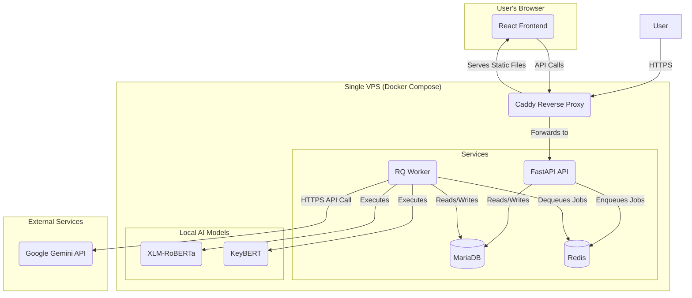

````markdown
# Proficiency Fullstack Architecture Document

---

### **Section 1: Introduction**

This document outlines the complete fullstack architecture for **Proficiency**, including backend systems, frontend implementation, and their integration. It serves as the single source of truth for AI-driven development, ensuring consistency across the entire technology stack.

#### **Starter Template or Existing Project**

This is a **Greenfield project** to be built from scratch. While not based on a pre-existing public template, the technical assumptions in the PRD and the tech stack document provide a very specific and prescriptive blueprint for the initial project structure and technology choices.

#### **Change Log**

| Date       | Version | Description                                                                                                                                                                   | Author             |
| :--------- | :------ | :---------------------------------------------------------------------------------------------------------------------------------------------------------------------------- | :----------------- |
| 2025-10-05 | 1.1     | Completed the entire API Specification (Section 5) by integrating the final, refined specifications for all 11 domains. The document is now ready for database schema design. | Winston, Architect |
| 2025-10-04 | 1.0     | Initial architectural draft based on PRD v6.2 and UI/UX Spec v2.0.                                                                                                            | Winston, Architect |

---

### **Section 2: High-Level Architecture**

#### **Technical Summary**

The architecture for "Proficiency" is a multi-tenant monolithic SaaS platform designed for a single VPS deployment using Docker Compose. It features a FastAPI backend and a React/TypeScript frontend, organized within a monorepo. A crucial component is the asynchronous background worker (RQ) that handles heavy processing like local AI/ML for sentiment/keywords and data imports. For advanced suggestion generation, the worker will call the external Google Gemini API, reducing local server load. This design consciously accepts the trade-offs of limited scalability and availability inherent to a single-server setup in favor of operational simplicity for V1.

#### **Platform and Infrastructure Choice**

-   **Platform:** Self-hosted on a **single VPS (Ubuntu)**.
-   **Key Services:** The entire system will be managed via **Docker Compose**, orchestrating five core services: `caddy`, `api`, `worker`, `db`, and `redis`.
-   **Deployment Host and Regions:** The initial deployment will be to a single server.

**Availability and Recovery**

-   To mitigate the risk of a Single Point of Failure, the project will adhere to the PRD's requirement for a disaster recovery plan. An automated script will perform nightly backups to a secure, off-server location.
-   A `RECOVERY.md` document is a mandatory deliverable. It must define a target **Recovery Time Objective (RTO) of less than 4 hours**. This RTO is an aggressive target for a manual process and assumes the `RECOVERY.md` is highly detailed and has been practiced. The recovery procedure must be **tested and validated pre-launch**.

**Resource Management**

-   To mitigate high resource consumption from local AI models (sentiment/keyword), the Docker configuration **must implement strict resource limits** (CPU and RAM) on the `worker` container. Initial limits must be determined via pre-launch load testing. CPU and RAM usage for all containers must be monitored from day one for ongoing tuning. This can be achieved using tools like `docker stats` or a lightweight agent like Netdata.

#### **High Level Architecture Diagram**


````

#### **Architectural Patterns**

-   **Monolithic Architecture:** A single backend API and single background worker process.
-   **Asynchronous Task Processing (Job Queue):** Computationally expensive tasks are offloaded to an RQ worker.
    -   **Note:** The worker will use **prioritized queues** (e.g., `high_priority` for notifications, `default` for local AI jobs and external API calls).
-   **Polling for Real-time Updates:** The frontend will use polling to fetch updates.
    -   **Note:** The polling interval **must be a configurable environment variable** on the frontend to allow for performance tuning.
-   **Multi-Tenancy via Scoped Queries:** All database queries will be scoped with a `university_id` to ensure data isolation.

---

### **Section 3: Tech Stack**

| Category                | Technology                                 | Version          | Purpose                                                   | Rationale                                                                                         |
| :---------------------- | :----------------------------------------- | :--------------- | :-------------------------------------------------------- | :------------------------------------------------------------------------------------------------ |
| **Monorepo**            |                                            |                  |                                                           |                                                                                                   |
| Tooling                 | pnpm Workspaces                            | `~9.x`           | Monorepo management.                                      | Efficient, fast, and creates a single lockfile for the entire frontend workspace.                 |
| **Dev Workflow**        | `openapi-typescript-codegen`               | `latest`         | Cross-Stack Type Generation                               | Automates TS type generation from the backend's OpenAPI schema, ensuring type safety.             |
| **Frontend**            |                                            |                  |                                                           |                                                                                                   |
| Language                | TypeScript                                 | `~5.x`           | Type safety for UI development.                           | Industry standard for robust React applications.                                                  |
| Framework               | React                                      | `~18.x`          | Core UI library.                                          | Specified in the tech stack document.                                                             |
| Build Tool              | Vite                                       | `~5.x`           | Fast development server and bundler.                      | Specified in the tech stack document.                                                             |
| Styling                 | Tailwind CSS                               | `~3.x`           | Utility-first CSS framework.                              | Ensures consistent and rapid styling.                                                             |
| Components              | shadcn/ui                                  | `latest`         | Accessible component primitives.                          | Mandated for consistency and clarity.                                                             |
| Routing                 | React Router                               | `~6.x`           | Client-side routing.                                      | Specified in the tech stack document.                                                             |
| Data Fetching           | TanStack Query                             | `~5.x`           | Server state management and polling.                      | Required for data fetching and real-time updates.                                                 |
| Forms                   | React Hook Form + Zod                      | `~7.x` / `~3.x`  | Form state management and validation.                     | Specified for robust form handling.                                                               |
| Charting                | Echarts / echarts-wordcloud                | `latest`         | Data visualization.                                       | Mandated for all dashboards and charts.                                                           |
| **Backend**             |                                            |                  |                                                           |                                                                                                   |
| Language                | Python                                     | `~3.11`          | Primary backend language.                                 | Specified in the tech stack document.                                                             |
| Framework               | FastAPI                                    | `latest`         | High-performance REST API framework.                      | Specified in the tech stack document.                                                             |
| ORM                     | SQLAlchemy (Sync)                          | `~2.x`           | Database object-relational mapper.                        | Specified for data layer; sync-first approach for simplicity.                                     |
| Migrations              | Alembic                                    | `latest`         | Database schema migrations.                               | Standard for SQLAlchemy projects.                                                                 |
| Authentication          | JWT + Passlib[bcrypt] + PyOTP              | `latest`         | Secure user authentication and MFA.                       | Specified for JWT, password hashing, and TOTP.                                                    |
| **Data & Jobs**         |                                            |                  |                                                           |                                                                                                   |
| Database                | MariaDB / MySQL                            | `10.6+` / `8.0+` | Primary relational database.                              | Specified in the tech stack document.                                                             |
| Cache / Queue           | Redis                                      | `~7.x`           | Message broker for background jobs.                       | Required for the RQ worker.                                                                       |
| Job Queue               | RQ (Redis Queue)                           | `latest`         | Asynchronous task processing.                             | Specified for all background jobs.                                                                |
| File Storage            | Local Filesystem (on VPS)                  | `N/A`            | Storage for user-uploaded documents.                      | Simplest approach, consistent with single-VPS architecture.                                       |
| **AI/ML**               |                                            |                  |                                                           |                                                                                                   |
| AI (Local)              | Transformers, Torch, KeyBERT               | `latest`         | Sentiment analysis & keyword extraction.                  | Specified for local inference.                                                                    |
| AI (Local) Dependencies | scikit-learn, sentencepiece, numpy, Pillow | `latest`         | Core data science & ML libraries.                         | Foundational dependencies for the primary AI models.                                              |
| AI (External)           | Google Gemini API                          | `v1`             | AI-powered suggestion generation.                         | Replaces Flan-T5 to reduce local server load.                                                     |
| **Testing**             |                                            |                  |                                                           |                                                                                                   |
| FE Testing              | Vitest + React Testing Library             | `latest`         | Frontend unit and integration testing.                    | Modern test runner that integrates perfectly with Vite.                                           |
| FE Dev Testing          | `@testing-library/jest-dom`, `jsdom`       | `latest`         | Provides browser-like environment and matchers for tests. | Standard and required companions for a robust Vitest setup.                                       |
| BE Testing              | Pytest, pytest-cov                         | `latest`         | Backend unit/integration testing & coverage.              | Specified in the requirements file.                                                               |
| BE Dev Testing          | fakeredis, pypdf                           | `latest`         | Utilities for mocking Redis and validating PDFs.          | Enables robust, isolated backend testing.                                                         |
| E2E Testing             | Playwright                                 | `latest`         | End-to-end browser automation.                            | Modern, faster, and more reliable E2E testing with better debugging than Selenium.                |
| **Deployment & Ops**    |                                            |                  |                                                           |                                                                                                   |
| IaC                     | Docker Compose                             | `latest`         | Container orchestration for a single host.                | Mandated for local and production environments.                                                   |
| Web Server              | Caddy                                      | `latest`         | Reverse proxy with automatic HTTPS.                       | Specified for simplicity and auto-HTTPS.                                                          |
| CI/CD                   | GitHub Actions                             | `N/A`            | Automated build, test, and deployment.                    | A sensible default for a GitHub-hosted project.                                                   |
| Monitoring              | OpenTelemetry + Jaeger                     | `latest`         | Application tracing and performance monitoring.           | Provides deep application-level tracing for debugging performance, in addition to system metrics. |

#### **Section 3.1: Dependency Management Strategy**

-   **Backend (Python):** **Poetry** will be used. A `pyproject.toml` file will define dependencies, and the `poetry.lock` file must be committed to source control to guarantee reproducible builds.
-   **Frontend (Monorepo):** **pnpm** will be used. The root `pnpm-lock.yaml` file must be committed to source control to manage dependencies for the entire frontend workspace.

---

### **Section 4: Data Models**

This section defines the core data models for the Proficiency system. The definitions, TypeScript interfaces, and relationships are derived directly from the authoritative `database-of-proficiency.md` document and have been critically reviewed and simplified to meet V1 requirements.

#### **Domain 1: University Onboarding & Tenancy**

_This domain covers the complete lifecycle of a new university joining the platform._

**1. `universities`**

-   **Purpose:** The authoritative tenant records for all onboarded institutions.
-   **TypeScript Interface:**
    ```ts
    export interface University {
        university_id: number;
        university_registration_request_id?: number | null;
        university_name: string;
        acronym?: string | null;
        street?: string | null;
        barangay?: string | null;
        city: string;
        province?: string | null;
        postal_code: string;
        region?: string | null;
        contact_university_email: string;
        status: "active" | "inactive" | "closed" | "suspended";
        logo_path?: string | null;
        accreditation_type?: string | null;
        created_at: string; // ISO timestamp
        updated_at: string; // ISO timestamp
    }
    ```

**2. `university_registration_requests`**

-   **Purpose:** Holds every inbound university onboarding attempt.
-   **TypeScript Interface:**
    ```ts
    export interface UniversityRegistrationRequest {
        university_registration_request_id: number;
        university_name: string;
        acronym: string;
        street: string;
        barangay?: string | null;
        city: string;
        province?: string | null;
        postal_code: string;
        region?: string | null;
        contact_university_email: string;
        contact_person_last_name: string;
        contact_person_first_name: string;
        contact_person_middle_name?: string | null;
        contact_person_school_id: string;
        contact_person_position: string;
        contact_person_email: string;
        contact_person_mobile_number: string;
        status:
            | "submitted"
            | "in review"
            | "approved"
            | "rejected"
            | "canceled";
        submitted_at: string; // ISO timestamp
        final_decision_by?: number | null;
        final_decision_at?: string | null; // ISO timestamp
        updated_at: string; // ISO timestamp
    }
    ```

**3. `university_registration_actions`**

-   **Purpose:** An append-only audit log of reviewer actions on a registration request.
-   **TypeScript Interface:**
    ```ts
    export interface UniversityRegistrationAction {
        university_registration_action_id: number;
        university_registration_request_id: number;
        super_admin_id?: number | null;
        action_type:
            | "assigned"
            | "released"
            | "comment"
            | "approved"
            | "rejected"
            | "auto_released";
        action_note?: string | null;
        started_at?: string | null; // ISO timestamp
        last_activity_at: string; // ISO timestamp
        ended_at?: string | null; // ISO timestamp
        is_active: boolean;
    }
    ```

**4. `university_registration_documents`**

-   **Purpose:** An immutable record of all files uploaded during the onboarding process.
-   **TypeScript Interface:**
    ```ts
    export interface UniversityRegistrationDocument {
        university_registration_document_id: number;
        university_registration_request_id: number;
        document_type:
            | "accreditation_proof"
            | "school_license"
            | "supporting_letter"
            | "other";
        file_path: string;
        original_file_name?: string | null;
        content_type?: string | null;
        file_size_bytes?: number | null;
        uploaded_at: string; // ISO timestamp
    }
    ```

---

#### **Domain 2: Identity, Roles & Departments**

_This domain establishes the core identity and access management structure._

**1. `users`**

-   **Purpose:** The central, tenant-scoped identity table for all university users.
-   **TypeScript Interface:**
    ```ts
    export interface User {
        user_id: number;
        university_id: number;
        school_id: string;
        username: string;
        email: string;
        password_hash: string;
        admin_pin_code_hash?: string | null;
        last_name: string;
        first_name: string;
        middle_name?: string | null;
        profile_photo_path?: string | null;
        status: "active" | "archived" | "suspended";
        email_verified: boolean;
        last_login_at?: string | null; // ISO timestamp
        registration_code_id?: number | null; // FK to user_registration_codes
        created_at: string; // ISO timestamp
        updated_at: string; // ISO timestamp
    }
    ```

**2. `user_roles`**

-   **Purpose:** A junction table that grants users one or more roles with a lifecycle.
-   **TypeScript Interface:**
    ```ts
    export interface UserRole {
        user_role_id: number;
        user_id: number;
        role: "student" | "faculty" | "admin" | "department_head";
        assigned_at: string; // ISO timestamp
        revoked_at?: string | null;
        is_active: boolean;
    }
    ```

**3. `departments`**

-   **Purpose:** The authoritative catalog of academic departments for each university.
-   **TypeScript Interface:**
    ```ts
    export interface Department {
        department_id: number;
        university_id: number;
        parent_department_id?: number | null;
        department_head_id?: number | null;
        department_name: string;
        acronym?: string | null;
        description?: string | null;
        created_at: string; // ISO timestamp
        updated_at: string; // ISO timestamp
        is_active: boolean;
    }
    ```

**4. `user_department_assignments`**

-   **Purpose:** Maps a user’s affiliation to a department over time, critical for defining evaluator scopes.
-   **TypeScript Interface:**
    ```ts
    export interface UserDepartmentAssignment {
        user_department_id: number;
        user_id: number;
        department_id: number;
        program_id?: number | null;
        user_role_id: number; // Links assignment to the specific role
        assigned_at: string; // ISO timestamp
        revoked_at?: string | null;
        is_active: boolean;
    }
    ```

**5. `super_admins`**

-   **Purpose:** A separate table for platform-level administrators who exist outside of any university tenant.
-   **TypeScript Interface:**
    ```ts
    export interface SuperAdmin {
        super_admin_id: number;
        username: string;
        email: string;
        password_hash: string;
        super_admin_pin_code_hash: string;
        last_name: string;
        first_name: string;
        middle_name?: string | null;
        profile_photo_path?: string | null;
        status: "active" | "inactive" | "locked";
        last_login?: string | null; // ISO timestamp
        created_at: string; // ISO timestamp
        updated_at: string; // ISO timestamp
    }
    ```

**6. `user_registration_codes`**

-   **Purpose:** Manages the role-scoped codes used for self-service user onboarding.
-   **TypeScript Interface:**
    ```ts
    export interface UserRegistrationCode {
        registration_code_id: number;
        university_id: number;
        token_hash: string; // SHA-256 of the raw code
        intended_role: "student" | "faculty" | "department_head" | "admin";
        department_id?: number | null;
        program_id?: number | null;
        max_uses: number;
        used_count: number;
        status: "active" | "inactive";
        expires_at?: string | null; // ISO timestamp
        created_by_user_id: number;
        label?: string | null;
        created_at: string; // ISO timestamp
        revoked_at?: string | null;
    }
    ```

---

#### **Domain 3: Academic Structure & Offerings**

_This domain models the core academic structure, defining programs, subjects, and class offerings._

**1. `programs`**

-   **Purpose:** The catalog of all academic programs, tracks, or grade levels offered by a university.
-   **TypeScript Interface:**
    ```ts
    export interface Program {
        program_id: number;
        university_id: number;
        department_id: number;
        program_code: string; // unique
        program_name: string;
        program_level?:
            | "basic education"
            | "senior_high"
            | "college"
            | "graduate"
            | null;
        description?: string | null;
        created_at: string; // ISO timestamp
        updated_at: string; // ISO timestamp
        is_active: boolean;
    }
    ```

**2. `subjects`**

-   **Purpose:** The authoritative definition for all subjects or courses within a university.
-   **TypeScript Interface:**
    ```ts
    export interface Subject {
        subject_id: number;
        university_id: number;
        subject_code: string; // per-tenant unique
        name: string;
        description?: string | null;
        units?: number | null;
        is_active: boolean;
        created_at: string; // ISO timestamp
        updated_at: string; // ISO timestamp
    }
    ```

**3. `program_subjects`**

-   **Purpose:** A many-to-many junction table that defines the curriculum by mapping which subjects belong to which academic programs.
-   **TypeScript Interface:**
    ```ts
    export interface ProgramSubject {
        program_subject_id: number;
        program_id: number;
        subject_id: number;
    }
    ```

**4. `subject_departments`**

-   **Purpose:** A many-to-many junction table that maps subjects to the departments responsible for them.
-   **TypeScript Interface:**
    ```ts
    export interface SubjectDepartment {
        subject_department_id: number;
        subject_id: number;
        department_id: number;
    }
    ```

**5. `school_terms`**

-   **Purpose:** Defines the official academic periods for a university.
-   **TypeScript Interface:**
    ```ts
    export interface SchoolTerm {
        school_term_id: number;
        university_id: number;
        start_school_year: number;
        end_school_year: number;
        semester: "1st semester" | "2nd semester" | "Summer";
        teaching_modality: "online" | "modular" | "hybrid" | "face-to-face";
        start_date?: string | null; // YYYY-MM-DD
        end_date?: string | null; // YYYY-MM-DD
        created_at: string; // ISO timestamp
        updated_at: string; // ISO timestamp
        is_active: boolean;
    }
    ```

**6. `subject_offerings`**

-   **Purpose:** Represents a concrete class or section of a subject taught during a specific school term.
-   **TypeScript Interface:**
    ```ts
    export interface SubjectOffering {
        subject_offering_id: number;
        subject_offering_code: string; // unique per university
        university_id: number;
        subject_id: number;
        school_term_id: number;
        faculty_user_id?: number | null; // current instructor
        department_id: number;
        program_id?: number | null; // optional, for GE/cross-listed subjects
        start_time: string; // HH:MM:SS
        end_time: string; // HH:MM:SS
        days: string; // e.g., 'MWF', 'TTH'
        room?: string | null;
        is_active: boolean;
        created_at: string; // ISO timestamp
        updated_at: string; // ISO timestamp
    }
    ```

**7. `student_enrollments`**

-   **Purpose:** A junction table that links a student user to a specific subject offering.
-   **TypeScript Interface:**
    ```ts
    export interface StudentEnrollment {
        enrollment_id: number;
        student_user_id: number; // user with role 'student'
        subject_offering_id: number;
        enrolled_at: string; // ISO timestamp
        is_active: boolean;
        drop_reason?:
            | "moved_section"
            | "withdrawn"
            | "non_payment"
            | "disciplinary"
            | "other"
            | null;
        drop_reason_notes?: string | null;
        dropped_at?: string | null; // ISO timestamp
    }
    ```

**8. `subject_offering_faculty_history`**

-   **Purpose:** An immutable audit log that tracks the history of faculty assignments to a specific subject offering.
-   **TypeScript Interface:**
    ```ts
    export interface SubjectOfferingFacultyHistory {
        subject_offering_faculty_history_id: number;
        subject_offering_id: number;
        faculty_user_id: number;
        assignment_start_date: string; // ISO timestamp
        assignment_end_date?: string | null;
        changed_by_user_id?: number | null;
        changed_reason?: string | null;
        created_at: string; // ISO timestamp
    }
    ```

---

#### **Domain 4: Evaluation Authoring (Forms)**

_This domain specifies the models for constructing dynamic and reusable evaluation forms._

**1. `likert_scale_templates`**

-   **Purpose:** Stores reusable, named Likert scales.
-   **TypeScript Interface:**
    ```ts
    export interface LikertScaleTemplate {
        likert_scale_template_id: number;
        likert_name: string; // unique
        min_value: number; // integer
        max_value: number; // integer
    }
    ```

**2. `evaluation_form_templates`**

-   **Purpose:** Defines the core, versioned form templates for each university.
-   **TypeScript Interface:**
    ```ts
    export interface EvaluationFormTemplate {
        form_template_id: number;
        university_id: number;
        name: string;
        description?: string | null;
        likert_scale_template_id: number; // default 1
        instructions?: string | null;
        status: "draft" | "active" | "assigned" | "archived";
        created_by_user_id: number;
        created_at: string; // ISO timestamp
        updated_by?: number | null;
        updated_at: string; // ISO timestamp
        intended_for_label?: "students" | "department_heads" | "both" | null;
    }
    ```

**3. `evaluation_criteria`**

-   **Purpose:** Represents the weighted sections within a form template.
-   **TypeScript Interface:**
    ```ts
    export interface EvaluationCriterion {
        evaluation_criteria_id: number;
        form_template_id: number;
        criterion_name: string;
        criterion_description?: string | null;
        weight: number; // decimal(5,2)
        order: number;
    }
    ```

**4. `evaluation_questions`**

-   **Purpose:** Holds the individual Likert-scale and open-ended (text) questions for a form.
-   **TypeScript Interface:**
    ```ts
    export interface EvaluationQuestion {
        question_id: number;
        form_template_id?: number | null; // required for 'open_ended' type
        criterion_id?: number | null; // required for 'likert' type
        question_text: string;
        question_type: "likert" | "open_ended";
        order: number;
        is_required: boolean;
        is_active: boolean;
    }
    ```

---

#### **Domain 5: Evaluation Scheduling & Periods**

_This domain introduces the models that make evaluations "live" by assigning forms to time windows._

**1. `evaluation_periods`**

-   **Purpose:** The top-level container for an evaluation window.
-   **TypeScript Interface:**
    ```ts
    export interface EvaluationPeriod {
        evaluation_period_id: number;
        university_id: number;
        school_term_id?: number | null;
        assessment_period: "midterm" | "finals";
        name: string;
        description?: string | null;
        status:
            | "scheduled"
            | "active"
            | "cancelling"
            | "cancelled"
            | "archived";
        starts_at: string; // ISO timestamp
        ends_at: string; // ISO timestamp
        cancelling_started_at?: string | null; // ISO timestamp
        cancelled_at?: string | null; // ISO timestamp
        cancellation_reason?: string | null;
        cancellation_notes?: string | null;
        cancelled_by_user_id?: number | null;
        archived_at?: string | null; // ISO timestamp
        created_by_user_id: number;
        created_at: string; // ISO timestamp
        updated_at: string; // ISO timestamp
    }
    ```

**2. `evaluation_period_forms`**

-   **Purpose:** This child table links a specific form template to a period for a designated audience (`student` or `department_head`).
-   **TypeScript Interface:**
    ```ts
    export interface EvaluationPeriodForm {
        period_form_id: number;
        evaluation_period_id: number;
        form_template_id: number;
        evaluator_role: "student" | "department_head";
        status: "active" | "archived" | "cancelling" | "cancelled";
        min_time_seconds: number; // default 45
        text_min_words: number; // default 5
        text_max_words: number; // default 300
        allow_save_draft: boolean; // default true
        created_at: string; // ISO timestamp
        updated_at: string; // ISO timestamp
    }
    ```

---

#### **Domain 6: Submissions & Answers**

_This domain details how individual evaluation responses are captured and stored._

**1. `evaluation_submissions`**

-   **Purpose:** Represents a single, complete evaluation session by an evaluator, supporting distinct paths for students and department heads.
-   **TypeScript Interface:**
    ```ts
    export interface EvaluationSubmission {
        submission_id: number;
        evaluation_period_id: number;
        period_form_id: number;
        university_id: number;
        evaluator_user_id: number;
        evaluator_role: "student" | "department_head";
        subject_offering_id?: number | null;
        department_id?: number | null;
        evaluated_faculty_user_id?: number | null;
        evaluation_start_time: string; // ISO timestamp
        evaluation_end_time?: string | null; // ISO timestamp
        status: "pending" | "submitted";
        created_at: string; // ISO timestamp
        updated_at: string; // ISO timestamp
    }
    ```

**2. `evaluation_likert_answers`**

-   **Purpose:** Stores the numerical answers to the Likert-scale questions for a given submission.
-   **TypeScript Interface:**
    ```ts
    export interface EvaluationLikertAnswer {
        likert_answer_id: number;
        submission_id: number;
        question_id: number;
        answer_value: number;
        created_at: string; // ISO timestamp
        updated_at: string; // ISO timestamp
    }
    ```

**3. `evaluation_text_answers`**

-   **Purpose:** Stores the raw, unprocessed free-text responses to open-ended questions.
-   **TypeScript Interface:**
    ```ts
    export interface EvaluationTextAnswer {
        text_answer_id: number;
        submission_id: number;
        question_id: number;
        text_response: string;
        created_at: string; // ISO timestamp
        updated_at: string; // ISO timestamp
    }
    ```

---

#### **Domain 7: Qualitative (NLP) & Publication**

_This domain covers how raw text feedback is processed and prepared for safe, anonymous viewing._

**1. `text_answer_sentiments`**

-   **Purpose:** Stores the model-generated sentiment analysis for each individual text answer.
-   **TypeScript Interface:**
    ```ts
    export interface TextAnswerSentiment {
        text_answer_sentiment_id: number;
        text_answer_id: number;
        model_provider: string;
        model_name: string;
        model_version?: string | null;
        language?: string | null;
        sentiment_label: "negative" | "neutral" | "positive";
        sentiment_score: number; // 0..1
        toxicity_score?: number | null; // 0..1
        analyzed_at: string; // ISO timestamp
        created_at: string; // ISO timestamp
        updated_at: string; // ISO timestamp
    }
    ```

**2. `text_answer_keywords`**

-   **Purpose:** Stores the keywords and keyphrases extracted from a single text answer.
-   **TypeScript Interface:**
    ```ts
    export interface TextAnswerKeyword {
        text_answer_keyword_id: number;
        text_answer_id: number;
        keyword: string; // normalized
        score: number; // 0..1
        model_provider: string;
        model_name: string;
        model_version?: string | null;
        extracted_at: string; // ISO timestamp
        created_at: string; // ISO timestamp
        updated_at: string; // ISO timestamp
    }
    ```

**3. `evaluation_text_answers_published`**

-   **Purpose:** A critical, UI-facing table that holds redacted copies of text answers, populated by a job only when the anonymity threshold (N ≥ 3) is met.
-   **TypeScript Interface:**
    ```ts
    export interface EvaluationTextAnswerPublished {
        published_text_answer_id: number;
        text_answer_id: number; // Internal link to the raw answer
        evaluation_period_id: number;
        question_id: number;
        redacted_text: string;
        cohort_response_count: number;
        anonymity_threshold: number; // default 3
        published_at: string; // ISO timestamp
        redaction_version: number; // default 1
        created_at: string; // ISO timestamp
        updated_at: string; // ISO timestamp
    }
    ```

---

#### **Domain 8 (Simplified): Flags & Resubmission**

_This domain models the data integrity workflow for flagging and resolving low-quality submissions._

**1. `flagged_evaluations`**

-   **Purpose:** Tracks a submission that has been flagged for review, managing the review state machine and the resubmission deadline.
-   **TypeScript Interface:**
    ```ts
    export interface FlaggedEvaluation {
        flagged_evaluation_id: number;
        submission_id: number;
        flagged_by_user_id: number;
        flag_reason_code:
            | "LOW_CONFIDENCE"
            | "RECYCLED_CONTENT"
            | "SENTIMENT_MISMATCH"
            | "OTHER";
        flag_reason_details?: string | null;
        status: "pending" | "approved" | "archived" | "resubmission_requested";
        reviewed_by_user_id?: number | null;
        reviewed_at?: string | null; // ISO timestamp
        resubmission_deadline?: string | null; // ISO timestamp
        created_at: string; // ISO timestamp
        updated_at: string; // ISO timestamp
    }
    ```

---

#### **Domain 9: Aggregates, Snapshots & Jobs**

_This domain defines the data warehousing and processing layer where raw data is transformed into insights._

**1. `numerical_aggregates`**

-   **Purpose:** Stores the versioned quantitative (Likert-scale) results for an evaluation cohort and calculation run.
-   **TypeScript Interface:**
    ```ts
    export interface NumericalAggregate {
        university_id: number;
        school_term_id: number;
        assessment_period: "midterms" | "finals";
        subject_offering_id: number;
        subject_id: number;
        department_id: number;
        faculty_user_id: number;
        form_template_id: number;
        n_submissions: number;
        n_valid_numeric: number;
        n_missing_numeric: number;
        quant_score_raw: number;
        mu_quant: number;
        sigma_quant: number;
        cohort_type: "dept" | "subject" | "global";
        cohort_key_id?: number | null;
        cohort_n: number;
        z_quant: number;
        z_qual: number;
        final_score_60_40: number;
        question_medians_json?: string | null;
        criterion_scores_json?: string | null;
        criterion_weights_json?: string | null;
        calc_run_id: number;
        calc_version: string;
        source_snapshot_id: number;
        computed_at: string; // ISO timestamp (UTC)
        is_final_snapshot: boolean;
    }
    ```

**2. `sentiment_aggregates`**

-   **Purpose:** Stores the versioned qualitative (text analysis) results for an evaluation cohort.
-   **TypeScript Interface:**
    ```ts
    export interface SentimentAggregate {
        university_id: number;
        school_term_id: number;
        assessment_period: "midterms" | "finals";
        subject_offering_id: number;
        subject_id: number;
        department_id: number;
        faculty_user_id: number;
        form_template_id: number;
        n_comments_received: number;
        n_valid_comments: number;
        avg_prob_positive: number;
        avg_prob_neutral: number;
        avg_prob_negative: number;
        qual_score_raw: number;
        mu_qual: number;
        sigma_qual: number;
        z_qual: number;
        prevailing_label: "positive" | "neutral" | "negative";
        top_keywords_json?: string | null;
        model_name: string;
        model_version: string;
        calc_run_id: number;
        calc_version: string;
        source_snapshot_id: number;
        computed_at: string; // ISO UTC
        is_final_snapshot: boolean;
    }
    ```

**3. `background_jobs`**

-   **Purpose:** A single, authoritative ledger for all asynchronous jobs processed by the RQ worker.

-   **TypeScript Interface:**

    ```ts
    export type JobType =
        | "academic_structure_import"
        | "user_enrollment_import"
        | "evaluation_import"
        | "period_cancellation"
        | "report_generation";

    export type JobStatus =
        | "queued"
        | "processing"
        | "completed"
        | "failed"
        | "cancelled";

    export interface BackgroundJob {
        job_id: number;
        job_uuid: string;
        university_id: number;
        initiated_by_user_id: number;
        job_type: JobType;
        status: JobStatus;
        source_filename?: string | null;
        submitted_at: string; // ISO timestamp
        started_at?: string | null;
        completed_at?: string | null;
        error_details_path?: string | null;
        result_file_path?: string | null;
    }
    ```

---

#### **Domain 10: Notifications**

_This domain defines the structure for the in-app user notification system._

**1. `notifications`**

-   **Purpose:** Stores system-generated, user-specific notifications for the in-app inbox.
-   **TypeScript Interface:**
    ```ts
    export interface Notification {
        notification_id: number;
        user_id: number; // recipient
        notification_type: string; // e.g., 'period_cancelled'
        content: string; // UI body
        created_at: string; // ISO timestamp
        read_at?: string | null; // ISO timestamp (null = unread)
    }
    ```

---

#### **Domain 11: AI Suggestions**

_This domain models the "AI Assistant" feature, logging generation events and saved user artifacts._

**1. `ai_suggestion_runs`**

-   **Purpose:** An immutable log of every AI suggestion generation event.
-   **TypeScript Interface:**
    ```ts
    export interface AISuggestionRun {
        ai_suggestion_run_id: number;
        university_id: number;
        requested_by_user_id: number;
        school_term_id?: number | null;
        assessment_period?: "midterm" | "finals" | null;
        department_id?: number | null;
        faculty_user_id?: number | null;
        subject_offering_id?: number | null;
        source_run_ids_json?: string | null; // JSON array
        model_provider: string;
        model_name: string;
        model_version?: string | null;
        prompt_template?: string | null;
        generated_text: string;
        requested_at: string; // ISO timestamp
    }
    ```

**2. `ai_suggestions`**

-   **Purpose:** Represents an AI-generated suggestion that a user has explicitly chosen to "Save to History".
-   **TypeScript Interface:**
    ```ts
    export interface AISuggestion {
        ai_suggestion_id: number;
        ai_suggestion_run_id: number;
        owner_user_id: number;
        university_id: number;
        title: string;
        summary?: string | null;
        content_markdown: string;
        tags_json?: string | null; // JSON array
        visible_to_faculty: boolean;
        visible_to_department_head: boolean;
        visible_to_admin: boolean;
        visible_to_student: boolean;
        last_export_job_id?: number | null;
        created_at: string; // ISO timestamp
        updated_at: string; // ISO timestamp
    }
    ```

---

#### **Domain 12 (Simplified): Imports & Data Ingest**

_This domain supports the auditable system for bulk data imports._

**1. `import_batches`**

-   **Purpose:** Represents a single, logical import operation.

-   **TypeScript Interface:**

    ```ts
    export type ImportType =
        | "academic_structure"
        | "users"
        | "enrollments"
        | "evaluations";

    export type ImportStatus =
        | "queued"
        | "processing"
        | "completed"
        | "failed"
        | "cancelled";

    export interface ImportBatch {
        import_batch_id: number;
        university_id: number;
        initiated_by_user_id: number;
        job_id: number;
        import_type: ImportType;
        source_filename: string;
        file_sha256: string;
        dedupe_key?: string | null;
        status: ImportStatus;
        rows_total: number;
        rows_success: number;

        rows_error: number;
        error_report_path?: string | null;
        result_file_path?: string | null;
        submitted_at: string; // ISO timestamp
        started_at?: string | null;
        completed_at?: string | null;
    }
    ```

**2. `import_rows`**

-   **Purpose:** Records the outcome for every single row parsed from an input file.

-   **TypeScript Interface:**

    ```ts
    export type ImportRowStatus = "accepted" | "rejected" | "skipped";

    export interface ImportRow {
        import_row_id: number;
        import_batch_id: number;
        file_index: number;
        row_number: number;
        raw_payload_json: string;
        normalized_payload_json?: string | null;
        status: ImportRowStatus;
        diagnostic_message?: string | null;
        created_entity_table?: string | null;
        created_entity_id?: number | null;
        updated_entity_table?: string | null;
        updated_entity_id?: number | null;
        processed_at?: string | null; // ISO timestamp
    }
    ```

**3. `import_row_issues`**

-   **Purpose:** Stores zero-to-many detailed validation issues for each `import_row`.

-   **TypeScript Interface:**

    ```ts
    export type IssueSeverity = "error" | "warning" | "info";

    export interface ImportRowIssue {
        import_row_issue_id: number;
        import_row_id: number;
        issue_code: string;
        issue_field?: string | null;
        issue_detail?: string | null;
        severity: IssueSeverity;
    }
    ```

---

#### **Domain 13 (Simplified): Data Governance & Audit**

_This domain provides the essential, focused logging for compliance and security._

**1. `pii_access_logs`**

-   **Purpose:** A non-negotiable log that tracks every privileged read of PII-bearing resources.
-   **TypeScript Interface:**
    ```ts
    export interface PIIAccessLog {
        pii_access_log_id: number;
        accessed_at: string; // ISO timestamp
        actor_user_id: number;
        resource:
            | "evaluation_text_answers"
            | "users_sensitive"
            | "imports_payloads"
            | "other";
        resource_id?: number | null;
        reason_code: string;
        reason_detail?: string | null;
        request_id?: string | null;
        ip_address?: string | null;
        user_agent?: string | null;
    }
    ```

**2. `admin_action_logs` (New)**

-   **Purpose:** A focused, simplified replacement for the generic `audit_events` table, logging only critical, sensitive actions.

-   **TypeScript Interface:**

    ```ts
    export type AdminActionType =
        | "UNIVERSITY_REQUEST_RESOLVED"
        | "ACADEMIC_STRUCTURE_MODIFIED"
        | "EVALUATION_PERIOD_CANCELLED"
        | "FLAGGED_EVALUATION_RESOLVED"
        | "RESUBMISSION_GRANTED";

    export interface AdminActionLog {
        log_id: number;
        actor_user_id: number;
        university_id: number;
        action_type: AdminActionType;
        target_entity_type: string;
        target_entity_id: number;
        details_json?: string | null;
        created_at: string; // ISO timestamp
    }
    ```

---

### **Section 5: API Specification**

---

### **Section 7: External APIs**

#### **Google Gemini API**

-   **Purpose:** To generate high-quality, actionable suggestions for faculty development based on processed evaluation data.
-   **Documentation:** `https://ai.google.dev/docs`
-   **Authentication:** Requires a `GEMINI_API_KEY` which will be managed as a secure secret.
-   **Integration Notes:** The `RQ Worker` will be responsible for all calls to this API.
    -   **The worker client must implement a retry mechanism with exponential backoff for resilience.**
    -   **To control costs, successful suggestions should be cached in Redis with a reasonable TTL (Time To Live) to avoid redundant API calls for the same context.**
    -   Anonymized data sent to this API must comply with NFR7 (Data Privacy Act).

---

### **Section 10: Frontend Architecture**

#### **Component Management Strategy**

-   **`shadcn/ui` Update Process:** Components from `shadcn/ui` are added directly to the codebase and are not managed like a typical versioned `npm` package. If security patches or updates are required for an underlying primitive (e.g., Radix UI), they must be applied manually.
-   **Mitigation via Monorepo:** To centralize this effort, **all `shadcn/ui` components will be located in a shared `ui` package within the monorepo**. This ensures that any required manual update only needs to be performed once.

---

### **Section 14: Deployment Architecture**

#### **Deployment Strategy**

-   **Environments:** The single server will host **"Staging-Like"** and **"Production"** environments, managed via separate Docker Compose files.
-   **CI/CD Pipeline:** The pipeline will enforce a quality gate. It will first deploy to the "Staging-Like" environment and run automated end-to-end tests. Only upon success will it proceed to update the production containers.
    1.  Code is merged to the main branch.
    2.  The CI/CD pipeline runs all unit and integration tests.
    3.  Upon success, the pipeline builds new Docker images.
    4.  **The pipeline runs a script to generate TypeScript interfaces from the backend's updated OpenAPI schema.**
    5.  The new images are deployed to the "Staging-Like" environment.
    6.  A full suite of automated end-to-end tests runs against this staging environment.
    7.  **Only upon successful E2E tests** does the pipeline proceed to replace the production containers.
-   **CRITICAL WARNING:** As the "Staging-Like" environment shares resources with Production, performance and load testing **must not** be conducted during peak production hours.

#### **Docker Image Strategy**

-   **Multi-stage Builds:** To manage large image sizes and improve build times, a **multi-stage Dockerfile will be used for the `worker` service**. A base stage will install the large, infrequently changed AI libraries (`torch`, `transformers`, etc.). A final, smaller stage will copy the application code on top of this base, allowing for faster rebuilds during development.

---

### **Section 15: Performance Optimization**

#### **Backend Performance Note: Sync vs. Async**

-   **Trade-off:** The tech stack specifies a synchronous approach for the SQLAlchemy ORM to maintain simplicity. It is important to acknowledge that this will block FastAPI's event loop during I/O operations and may become a performance bottleneck as user concurrency grows.
-   **Future-Proofing:** The data access layer should be written in a modular way that isolates the database logic. This will allow for a more straightforward refactoring to use `async def` endpoints in a future version if performance requirements dictate it.

---

### **Section 16: Test Strategy**

#### **Testing Philosophy**

-   **Chaos Testing Requirement:** The test plan **must include chaos testing scenarios** to validate system resilience. These tests will simulate failures, such as forcefully stopping the database container (`docker kill db`), introducing network latency, or mocking a failure from the external Gemini API.

---

### **Section 17: Coding Standards**

#### **Architectural Principles**

-   **Modular Monolith Design:** The FastAPI backend **must be developed as a Modular Monolith**. Code shall be organized into discrete modules based on domain (e.g., `evaluations`, `users`, `admin`). This will be **programmatically enforced** using linting rules to prevent unauthorized cross-module imports, making architectural violations visible during the CI process.

#### **Critical Rules**

-   **Data Privacy:** **No Personally Identifiable Information (PII) may be sent to the external Gemini API. All data must be anonymized before being included in a prompt.**

```

```
